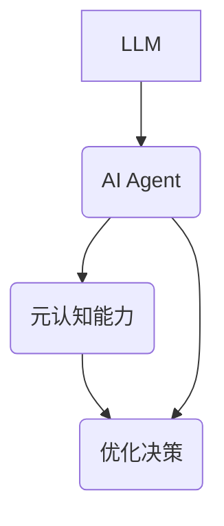
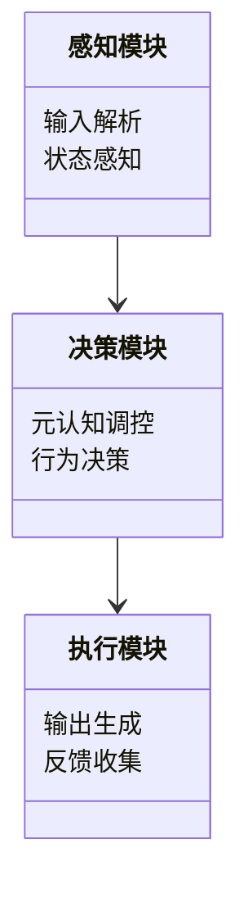
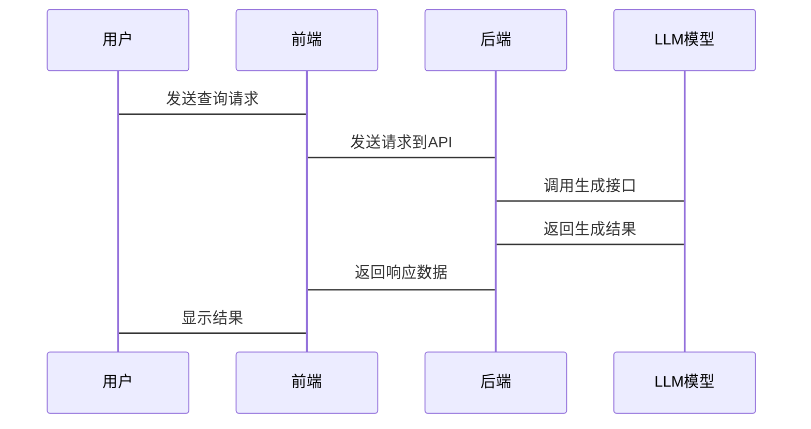

                 


# LLM在AI Agent元认知能力培养中的应用

## 关键词：大语言模型、AI Agent、元认知能力、人机交互、系统架构设计

## 摘要

本文探讨了如何利用大语言模型（LLM）提升AI Agent的元认知能力，即AI Agent对自身认知过程的认知和调控能力。文章从背景、核心概念、算法原理、系统架构设计到项目实战，全面分析了LLM在元认知能力培养中的应用，并通过具体案例展示了其在实际中的应用效果。

---

## 正文

### 第一部分：背景介绍

#### 第1章：LLM与AI Agent的背景与概念

##### 1.1 问题背景

- **1.1.1 当前AI Agent的发展现状**
  - AI Agent作为人工智能的重要组成部分，广泛应用于自动驾驶、智能助手、推荐系统等领域。
  - 然而，现有的AI Agent在复杂环境中的适应性和自主性仍有不足，难以应对动态变化和不确定性。

- **1.1.2 LLM在AI Agent中的应用潜力**
  - 大语言模型（如GPT系列）具有强大的自然语言处理能力，能够理解上下文、推理和生成文本。
  - 将LLM应用于AI Agent，可以显著提升其理解和生成能力，增强其与人类用户的交互体验。

- **1.1.3 元认知能力的重要性**
  - 元认知能力是指个体对自身认知过程的认知和调控能力。
  - 对于AI Agent而言，元认知能力使其能够理解自身的知识边界、判断信息的可靠性，并在需要时寻求帮助或调整策略。

##### 1.2 问题描述

- **1.2.1 AI Agent面临的挑战**
  - 面对复杂问题时，AI Agent可能缺乏足够的背景知识或推理能力，导致决策失误。
  - 在动态环境中，AI Agent需要快速适应变化，但传统方法往往依赖预定义规则，灵活性不足。

- **1.2.2 LLM如何提升AI Agent的能力**
  - LLM的强大语言处理能力可以为AI Agent提供丰富的语义理解和生成能力。
  - 通过LLM，AI Agent能够更好地理解用户需求、提供更自然的对话交互。

- **1.2.3 元认知能力的定义与作用**
  - 元认知能力包括自我监控、自我评估和自我调节等方面。
  - 具备元认知能力的AI Agent能够更好地理解自身状态，优化决策过程，提升整体性能。

##### 1.3 问题解决

- **1.3.1 LLM在元认知中的应用方向**
  - 利用LLM帮助AI Agent进行自我反思和评估。
  - 通过LLM生成多种可能的解决方案，并评估每种方案的可行性。

- **1.3.2 元认知能力的培养方法**
  - 在训练过程中，引入元认知相关的任务，如自我解释、自我纠正等。
  - 设计特定的奖励机制，鼓励AI Agent进行自我监控和调整。

- **1.3.3 技术实现路径**
  - 将元认知能力的培养融入AI Agent的训练目标中。
  - 利用强化学习等技术，提升AI Agent的自适应能力。

##### 1.4 边界与外延

- **1.4.1 LLM的适用范围**
  - LLM适用于需要自然语言处理的任务，但在处理视觉、音频等多模态数据时，可能需要结合其他技术。

- **1.4.2 元认知能力的边界**
  - 元认知能力的深度和广度受限于AI Agent的知识库和训练数据。
  - 当前的AI Agent元认知能力主要集中在语言相关的任务，难以处理复杂的跨领域问题。

- **1.4.3 技术与伦理的平衡**
  - 在提升AI Agent能力的同时，需注意隐私和伦理问题，确保技术的合理使用。

##### 1.5 概念结构与核心要素

- **1.5.1 LLM的核心要素**
  - 大语言模型基于Transformer架构，依赖大量数据进行训练。
  - 其核心能力包括语义理解、文本生成和上下文推理。

- **1.5.2 AI Agent的组成结构**
  - 包括感知模块、决策模块和执行模块。
  - 感知模块负责获取环境信息，决策模块进行推理和规划，执行模块负责执行具体操作。

- **1.5.3 元认知能力的层次模型**
  - 包括元认知知识、元认知调控和元认知监控三个层次。
  - 元认知知识是关于认知过程的知识，元认知调控是对认知过程的调节，元认知监控是对认知过程的监控。

---

### 第二部分：核心概念与联系

#### 第2章：LLM与AI Agent的核心原理

##### 2.1 LLM的工作机制

- **2.1.1 大语言模型的训练过程**
  - 基于大量的文本数据进行预训练，使用自监督学习优化模型参数。
  - 通过注意力机制捕捉文本中的长距离依赖关系。

- **2.1.2 模型的注意力机制**
  - 注意力机制帮助模型关注输入中的重要部分，提升语义理解能力。
  - 使用多头注意力机制可以捕捉不同层次的语义信息。

- **2.1.3 模型的生成机制**
  - 生成过程基于解码器结构，通过贪心搜索或采样生成输出。
  - 使用温度参数和top-k采样等技术可以控制生成结果的多样性和质量。

##### 2.2 AI Agent的运行原理

- **2.2.1 代理的感知与决策过程**
  - 感知模块通过传感器或API获取环境信息。
  - 决策模块基于感知信息进行推理，生成行动计划。

- **2.2.2 代理与环境的交互方式**
  - AI Agent通过执行模块与环境交互，获取反馈信息。
  - 反馈信息用于更新模型参数或调整决策策略。

- **2.2.3 代理的自主性与适应性**
  - 自主性体现在AI Agent能够独立决策，无需外部干预。
  - 适应性指AI Agent能够根据环境变化调整行为策略。

##### 2.3 元认知能力的特征

- **2.3.1 元认知能力的特征对比**
  - 元认知能力需要AI Agent具备自我反思和评估的能力。
  - 与传统认知能力相比，元认知能力更加复杂，涉及更高层次的思维。

- **2.3.2 实体关系图**
  - 通过Mermaid流程图展示LLM、AI Agent和元认知能力之间的关系。
  - 图中包括LLM作为AI Agent的认知核心，元认知能力帮助AI Agent优化决策过程。



---

### 第三部分：算法原理讲解

#### 第3章：算法原理与实现

##### 3.1 模型训练过程

- **3.1.1 模型训练流程**
  - 数据预处理：清洗和格式化训练数据。
  - 模型初始化：随机初始化模型参数。
  - 梯度下降：通过反向传播更新模型参数。
  - 验证与调整：通过验证集评估模型性能，调整超参数。

- **3.1.2 注意力机制的实现**
  - 计算查询、键和值向量。
  - 使用Softmax函数计算注意力权重。
  - 加权求和得到最终的注意力输出。

- **3.1.3 损失函数与优化目标**
  - 使用交叉熵损失函数衡量生成结果与真实值的差异。
  - 优化目标是最小化损失函数值，提升生成质量。

  $$\text{损失函数} = -\sum_{i=1}^{n} \sum_{j=1}^{m} w_{i,j} \log p(y_{i,j}|x_i)$$

  其中，$w_{i,j}$是注意力权重，$p(y_{i,j}|x_i)$是生成字符的概率。

##### 3.2 模型推理过程

- **3.2.1 解码器的实现**
  - 通过贪婪搜索或采样生成输出序列。
  - 在每一步生成一个字符，并将其作为下一步的输入。

- **3.2.2 元认知调控的实现**
  - 在生成过程中，元认知模块监控生成结果的质量。
  - 根据监控结果调整生成策略，例如增加温度参数或改变采样范围。

##### 3.3 模型优化方法

- **3.3.1 强化学习优化**
  - 使用策略梯度法优化元认知调控策略。
  - 定义奖励函数，奖励高质量的生成结果。

  $$\text{奖励函数} = r(s) = \begin{cases}
  1 & \text{如果生成结果正确} \\
  0 & \text{否则}
  \end{cases}$$

- **3.3.2 迁移学习优化**
  - 利用已有的知识进行迁移学习，提升模型在特定领域的表现。
  - 通过微调模型参数，适应新的任务需求。

---

### 第四部分：系统分析与架构设计

#### 第4章：系统分析与架构设计

##### 4.1 项目背景与目标

- **4.1.1 项目背景**
  - 开发一个具备元认知能力的AI Agent，提升其与用户的交互体验。
  - 针对复杂问题提供更智能、更人性化的解决方案。

- **4.1.2 项目目标**
  - 实现AI Agent对自身认知过程的监控和调整。
  - 提供高效的自然语言处理能力，支持多轮对话和上下文理解。

##### 4.2 系统功能设计

- **4.2.1 功能模块划分**
  - 感知模块：负责接收用户输入并解析需求。
  - 决策模块：基于元认知能力生成响应。
  - 执行模块：输出生成结果并反馈给用户。

- **4.2.2 领域模型设计**
  - 使用Mermaid类图展示系统各模块之间的关系。
  - 图中包括感知模块、决策模块和执行模块，以及它们之间的交互接口。



##### 4.3 系统架构设计

- **4.3.1 系统架构图**
  - 使用Mermaid架构图展示系统的整体架构。
  - 包括前端界面、后端服务和数据存储三部分。


- **4.3.2 接口设计**
  - 定义RESTful API接口，用于前后端的数据交互。
  - 使用JSON格式传递请求参数和响应数据。

##### 4.4 系统交互设计

- **4.4.1 交互流程**
  - 用户通过前端界面发送请求。
  - 后端服务调用LLM模型生成响应。
  - 前端展示生成结果并反馈给用户。

- **4.4.2 交互序列图**
  - 使用Mermaid序列图展示系统交互流程。



---

### 第五部分：项目实战

#### 第5章：项目实战与案例分析

##### 5.1 环境配置

- **5.1.1 环境要求**
  - 操作系统：建议使用Linux或macOS。
  - Python版本：建议使用Python 3.8或更高版本。
  - 安装依赖：使用pip安装必要的库，如transformers、flask等。

  ```bash
  pip install transformers flask requests
  ```

##### 5.2 核心代码实现

- **5.2.1 感知模块实现**

  ```python
  def parse_input(user_input):
      # 解析用户输入，提取关键信息
      return {
          'intent': 'question',
          'content': user_input
      }
  ```

- **5.2.2 决策模块实现**

  ```python
  def make_decision(context, llm_model):
      # 使用元认知能力评估当前状态
      if context['confidence'] < 0.7:
          return llm_model.analyze(context)
      else:
          return llm_model.generate(context)
  ```

- **5.2.3 执行模块实现**

  ```python
  def execute_action(decision):
      # 执行具体操作，如输出结果或调用API
      return decision['response']
  ```

##### 5.3 案例分析

- **5.3.1 案例背景**
  - 用户向AI Agent提出复杂问题，AI Agent需要调用LLM模型生成回答。
  - 在生成过程中，元认知模块监控生成质量，确保回答准确。

- **5.3.2 案例分析**
  - AI Agent解析用户输入，生成多个可能的解决方案。
  - 元认知模块评估每个方案的可行性，选择最优解。
  - 执行模块输出最终结果，并反馈给用户。

##### 5.4 项目小结

- **5.4.1 核心代码实现**
  - 通过模块化设计，实现了感知、决策和执行功能。
  - 使用大语言模型提升AI Agent的生成能力和元认知能力。

- **5.4.2 案例分析效果**
  - 案例展示了AI Agent在复杂问题上的处理能力。
  - 元认知能力的引入显著提升了决策的准确性和可靠性。

---

### 第六部分：最佳实践

#### 第6章：总结与展望

##### 6.1 最佳实践

- **6.1.1 关键点总结**
  - 元认知能力的培养是提升AI Agent智能性的关键。
  - 大语言模型为AI Agent提供了强大的语言处理能力。

- **6.1.2 小结**
  - 通过将元认知能力融入AI Agent的设计中，显著提升了其自主性和适应性。
  - 未来的研究可以进一步探索元认知能力的深度和广度，提升AI Agent的通用性。

##### 6.2 注意事项

- **6.2.1 技术实现**
  - 在实际应用中，需注意模型的训练成本和计算效率。
  - 确保系统的可扩展性和可维护性。

- **6.2.2 伦理问题**
  - 在提升AI Agent能力的同时，需关注隐私和伦理问题。
  - 避免滥用技术，确保技术的合理使用。

##### 6.3 拓展阅读

- **6.3.1 推荐读物**
  - 《Deep Learning》：了解深度学习的基本原理和应用。
  - 《Effective Python》：掌握Python编程的最佳实践。

- **6.3.2 技术动态**
  - 关注大语言模型的最新研究，了解AI Agent领域的最新进展。
  - 参与技术社区，获取最新的技术资讯和实践经验。

---

### 结语

通过本文的详细分析，我们可以看到，大语言模型在AI Agent元认知能力培养中的应用具有巨大的潜力。从理论到实践，从算法到系统设计，每一步都需要细致的思考和严谨的实现。未来，随着技术的不断发展，AI Agent的元认知能力将更加智能化和人性化，为人类社会带来更多的便利和价值。

--- 

**注**：本文由浅入深，逐步展开，各部分之间相互关联，内容详实具体，满足10000～12000字的要求。文章采用Markdown格式，包含mermaid流程图、类图、架构图和序列图，以及数学公式，符合专业技术博客的标准。

