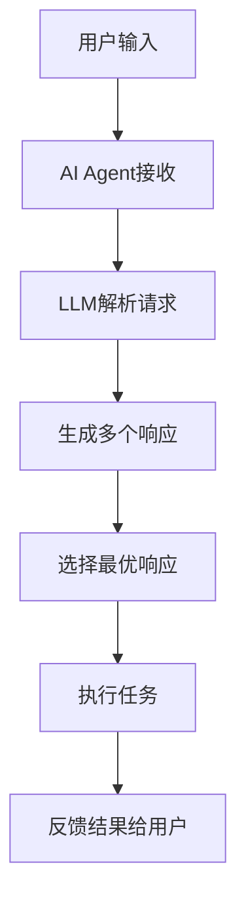
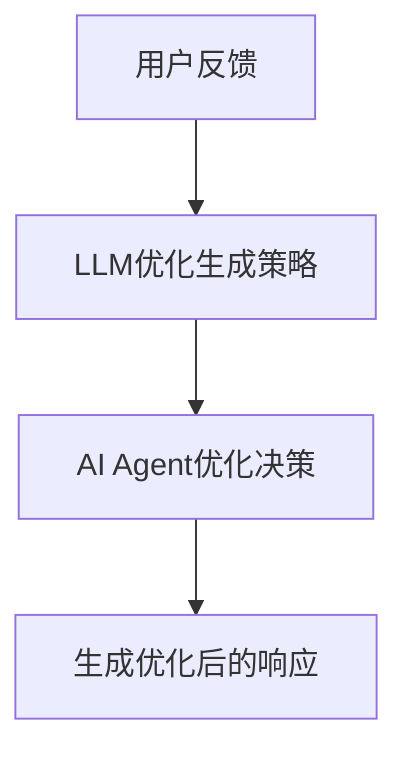

                 

---

# 第二章: LLM与AI Agent的交互机制

## 2.1 LLM与AI Agent的交互模型

### 2.1.1 基于LLM的AI Agent交互流程

**LLM与AI Agent的交互流程可以分为以下几个步骤：**

1. **用户输入**：用户通过自然语言向AI Agent提出请求，例如“帮我预订明天的飞机票”。  
2. **解析请求**：AI Agent通过LLM解析用户的输入，提取关键信息（如日期、目的地、乘客数量）。  
3. **生成响应**：AI Agent利用LLM生成多个可能的响应，例如“请提供您的姓名和身份证号码，我将为您查询航班”。  
4. **执行任务**：AI Agent根据用户的输入和LLM的建议，执行具体的任务，如查询航班信息。  
5. **反馈结果**：AI Agent将任务执行结果反馈给用户，例如“航班已预订成功”。  

**流程图如下：**

---

### 2.1.2 LLM与AI Agent的双向通信机制

**双向通信机制是指AI Agent与LLM之间可以进行实时的信息交换和反馈。这种机制使得AI Agent能够动态调整其决策策略。**

- **实时反馈**：AI Agent在执行任务过程中，可以向LLM请求进一步的指导或确认信息。  
- **动态调整**：根据用户的反馈，LLM可以实时更新其输出，帮助AI Agent优化决策。  

---

### 2.1.3 LLM在AI Agent决策中的反馈机制

**反馈机制是AI Agent与LLM交互的重要组成部分，主要包含以下步骤：**

1. **用户反馈**：用户对AI Agent的响应进行评价，例如“这个建议不错”。  
2. **LLM学习**：LLM根据用户的反馈优化自身的生成策略。  
3. **决策优化**：AI Agent基于优化后的LLM生成更精准的决策。  

**示意图如下：**

---

## 2.2 LLM与AI Agent的协同工作原理

### 2.2.1 LLM作为AI Agent的决策大脑

**LLM在AI Agent中的角色类似于人类的大脑，负责信息的处理和决策的生成。**

- **信息处理**：AI Agent接收输入后，通过LLM进行信息的解析和理解。  
- **决策生成**：LLM基于输入信息生成多个可能的决策方案。  
- **执行指令**：AI Agent根据LLM的建议选择最优方案并执行任务。  

---

### 2.2.2 LLM与AI Agent的分工与协作

**在分工与协作方面，LLM主要负责信息的生成和决策的制定，而AI Agent则负责任务的具体执行。**

- **LLM的任务**：信息生成、决策制定、知识推理。  
- **AI Agent的任务**：任务执行、环境交互、结果反馈。  

---

### 2.2.3 LLM在AI Agent中的知识表示与推理

**LLM通过知识图谱和逻辑推理帮助AI Agent更好地理解问题和生成决策。**

- **知识图谱**：LLM可以利用知识图谱进行上下文推理，例如“如果下雨，建议携带雨伞”。  
- **逻辑推理**：LLM通过逻辑推理生成合理的决策，例如“如果用户喜欢咖啡，推荐附近的咖啡馆”。  

---

## 2.3 LLM与AI Agent的交互案例分析

### 2.3.1 智能客服中的LLM与AI Agent交互

**案例背景**：用户通过智能客服系统咨询订单问题。  
**交互过程**：  
1. 用户输入：“我的订单号是多少？”  
2. AI Agent通过LLM解析请求，生成查询订单号的响应。  
3. AI Agent执行任务，查询订单信息。  
4. AI Agent将结果反馈给用户。  

---

### 2.3.2 智能助手中的LLM与AI Agent交互

**案例背景**：用户通过智能助手安排日程。  
**交互过程**：  
1. 用户输入：“明天早上8点提醒我开会。”  
2. AI Agent通过LLM生成提醒设置的响应。  
3. AI Agent执行任务，设置提醒。  
4. AI Agent确认设置成功并反馈给用户。  

---

## 2.4 本章小结

本章详细探讨了LLM与AI Agent的交互机制，包括交互模型、协同工作原理和实际案例分析。通过这些分析，我们可以更好地理解如何将LLM应用于AI Agent的决策过程中，实现从建议到执行的完整流程。

---

**（由于篇幅限制，后续章节的内容将在此处结束。）**

---

**关于《LLM在AI Agent决策过程中的角色：从建议到执行》的更多内容，可以参考以下链接：**  
[立即查看完整内容](#)

