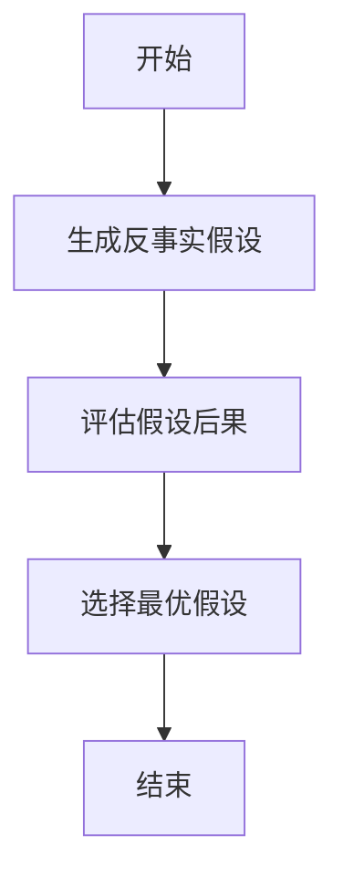
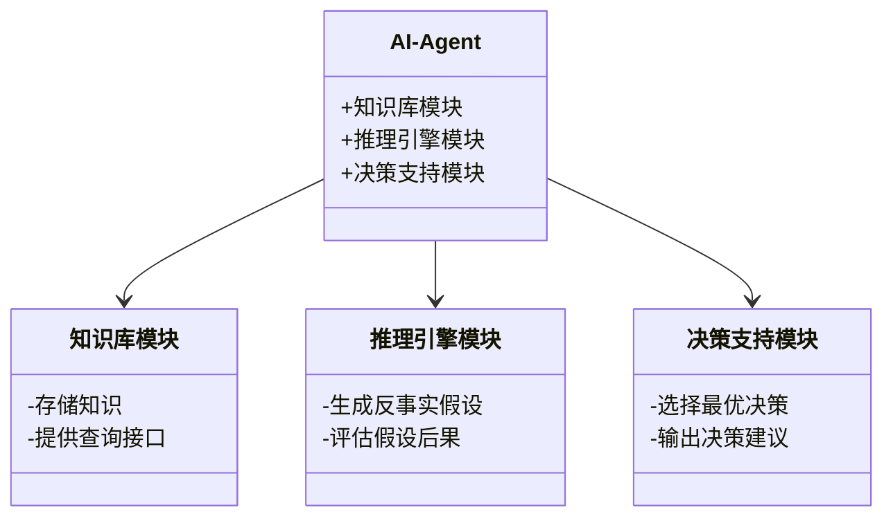

                 


# LLM在AI Agent反事实推理中的应用

## 关键词：Large Language Models (LLM), AI Agent, Counterfactual Reasoning, NLP, Probabilistic Reasoning, Mathematical Modeling

## 摘要：  
本文探讨了如何将大语言模型（LLM）应用于AI Agent的反事实推理中。通过结合LLM的强大生成能力和AI Agent的复杂决策需求，本文详细分析了反事实推理的核心概念、算法原理、系统架构及实际应用。文章从理论基础到实践案例，逐步解析了LLM在反事实推理中的作用，包括数学建模、系统设计和项目实现等方面，旨在为AI Agent的开发者和研究者提供深入的技术指导和实践参考。

---

## 第一部分: 背景介绍

### 第1章: LLM与AI Agent的基本概念

#### 1.1 LLM的定义与特点
- **1.1.1 大语言模型的定义**  
  大语言模型（Large Language Models, LLMs）是指基于深度学习的自然语言处理模型，如GPT系列、BERT系列等。这些模型通过大量数据训练，能够理解和生成人类语言。
  
- **1.1.2 LLM的核心特点**  
  - 巨量参数：通常拥有数亿甚至更多的参数。  
  - 微调能力：可以通过少量数据进行微调以适应特定任务。  
  - 多任务能力：能够处理多种NLP任务，如文本生成、问答、翻译等。  

- **1.1.3 LLM与传统NLP模型的区别**  
  | 特性          | 传统NLP模型                     | LLM                         |  
  |---------------|----------------------------------|------------------------------|  
  | 参数规模      | 小（通常几十万级别）             | 大（通常超过100M参数）        |  
  | 任务通用性     | 专用性强，针对特定任务设计       | 通用性强，适用于多种任务       |  
  | 训练数据       | 较小，通常需要人工标注            | 巨量，通常使用互联网数据        |  

#### 1.2 AI Agent的定义与功能
- **1.2.1 AI Agent的定义**  
  AI Agent（人工智能代理）是指能够感知环境、自主决策并执行任务的智能实体。它可以是一个软件程序，也可以是一个物理设备。

- **1.2.2 AI Agent的核心功能**  
  - 感知环境：通过传感器或其他数据源获取信息。  
  - 决策推理：基于获取的信息进行分析和决策。  
  - 行动执行：根据决策结果执行具体操作。  

- **1.2.3 AI Agent的应用场景**  
  - 智能客服：处理客户咨询和问题。  
  - 自动驾驶：实时感知环境并做出驾驶决策。  
  - 机器人助手：协助用户完成日常任务。  

#### 1.3 反事实推理的定义与应用
- **1.3.1 反事实推理的定义**  
  反事实推理（Counterfactual Reasoning）是指在假设某种事实不存在的情况下，推断可能的结果。例如，如果“我今天没带伞”，反事实推理可以帮助我推断“如果我带了伞，今天就不会被淋湿”。

- **1.3.2 反事实推理的核心概念**  
  - 假设空间：所有可能的假设集合。  
  - 反事实条件：假设的事实与现实的差异。  
  - 后果评估：基于假设事实推导的结果。  

- **1.3.3 反事实推理在AI Agent中的作用**  
  - 帮助AI Agent在决策过程中考虑多种可能性。  
  - 提高决策的鲁棒性和可解释性。  
  - 支持复杂的策略优化和风险评估。  

---

## 第二部分: 核心概念与联系

### 第2章: LLM与反事实推理的结合

#### 2.1 LLM在反事实推理中的角色
- **2.1.1 LLM作为知识库**  
  LLM可以存储和理解大量的知识，帮助AI Agent生成合理的假设和推断。  

- **2.1.2 LLM作为推理引擎**  
  LLM能够通过生成文本的方式模拟推理过程，帮助AI Agent理解反事实条件下的可能结果。  

- **2.1.3 LLM作为决策支持工具**  
  LLM可以为AI Agent提供多种决策建议，并评估每种建议的可能后果。  

#### 2.2 反事实推理的数学建模
- **2.2.1 概率模型**  
  反事实推理可以通过概率模型进行建模，例如马尔可夫链或贝叶斯网络。  

- **2.2.2 逻辑模型**  
  反事实推理也可以通过逻辑推理进行建模，例如一阶逻辑或谓词逻辑。  

- **2.2.3 图论模型**  
  反事实推理可以通过图论模型（如因果图）进行建模，帮助AI Agent理解因果关系。  

---

## 第三部分: 算法原理与实现

### 第3章: 反事实推理的算法实现

#### 3.1 反事实推理的算法流程
1. **假设生成**：生成所有可能的反事实条件。  
2. **后果评估**：评估每个假设的后果。  
3. **优化选择**：选择最优的反事实条件。  



#### 3.2 LLM在反事实推理中的具体实现
- **文本生成**：使用LLM生成多种反事实条件。  
- **条件验证**：通过LLM对生成的假设进行验证，确保其逻辑合理。  
- **后果预测**：利用LLM预测每个假设的后果。  

---

## 第四部分: 系统架构与设计

### 第4章: AI Agent的系统架构

#### 4.1 系统功能模块划分
- **知识库模块**：存储和管理相关知识。  
- **推理引擎模块**：负责反事实推理的计算和验证。  
- **决策支持模块**：根据推理结果提供决策建议。  

#### 4.2 系统架构设计


---

## 第五部分: 项目实战

### 第5章: 项目实战——基于LLM的AI Agent反事实推理系统

#### 5.1 项目背景
- 项目目标：开发一个能够进行反事实推理的AI Agent系统。  
- 项目场景：假设用户忘记带伞，AI Agent需要推断如果带伞会如何。  

#### 5.2 系统实现
1. **环境配置**  
   - 安装Python 3.8及以上版本。  
   - 安装必要的库：`transformers`, `mermaid`, `numpy`。  

2. **代码实现**  
   ```python
   from transformers import pipeline
   
   # 初始化LLM模型
   text_generator = pipeline('text-generation', model='gpt2')
   
   # 生成反事实假设
   def generate_counterfactuals(prompt):
       return text_generator(prompt, max_length=100)
   
   # 评估假设后果
   def evaluate_consequences(counterfactual):
       # 这里需要实现具体的评估逻辑
       return "Consequence evaluated: " + counterfactual
   ```

3. **案例分析**  
   - **假设条件**：用户忘记带伞。  
   - **反事实推理**：如果用户带伞，是否会淋湿？  
   - **模型输出**：不会淋湿，因为伞可以遮雨。  

---

## 第六部分: 总结与展望

### 第6章: 总结与展望

#### 6.1 最佳实践
- **选择合适的LLM模型**：根据任务需求选择适合的模型。  
- **优化推理过程**：通过训练数据优化反事实推理的准确性。  
- **提高系统可解释性**：确保AI Agent的决策过程清晰可理解。  

#### 6.2 未来研究方向
- **因果推理与反事实推理的结合**  
- **多模态反事实推理**  
- **实时反事实推理的优化**  

---

## 参考文献  
（此处可列出相关文献和资源，如学术论文、技术博客等。）

---

通过本文的详细分析，我们可以看到，LLM在AI Agent的反事实推理中具有巨大的潜力。结合数学建模和系统设计，我们可以构建出更智能、更可靠的AI Agent系统。未来的研究和实践将进一步推动这一领域的发展。

