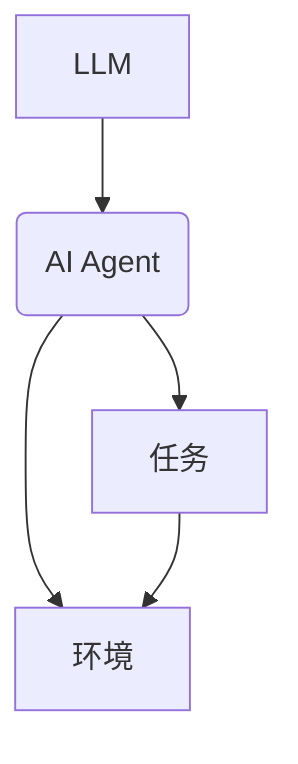
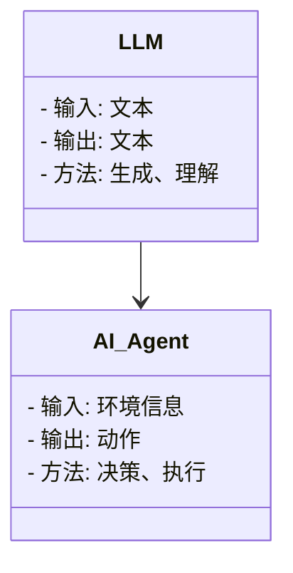
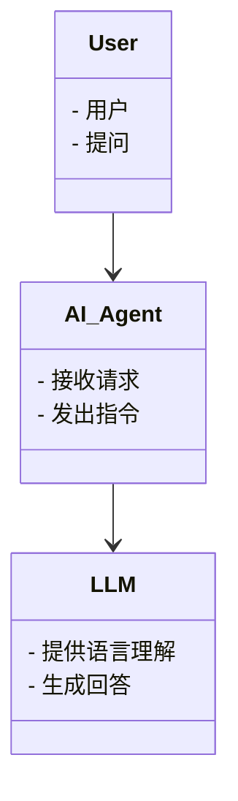
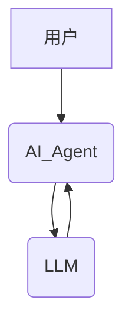
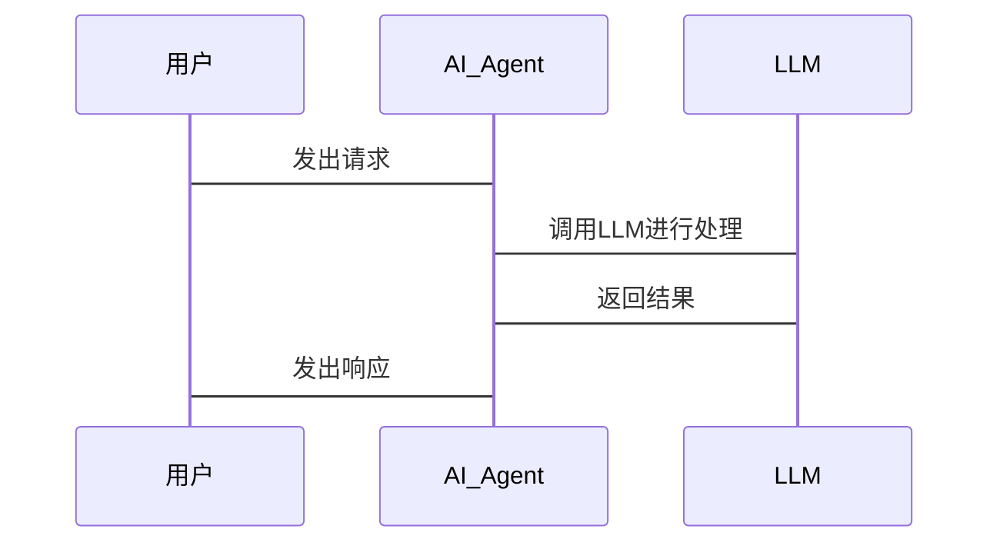

                 


# LLM在AI Agent抽象思维形成中的应用

## 关键词：LLM, AI Agent, 抽象思维, 人工智能, 大语言模型

## 摘要：本文深入探讨了大语言模型（LLM）在AI Agent抽象思维形成中的应用，分析了LLM与AI Agent的结合背景、核心概念、算法原理、系统架构设计以及实际项目实现，旨在帮助读者理解并掌握如何利用LLM赋能AI Agent的抽象思维能力。

---

# 第一部分: LLM与AI Agent概述

## 第1章: LLM与AI Agent的基本概念

### 1.1 LLM的定义与特点

#### 1.1.1 大语言模型的定义
大语言模型（LLM）是指经过大量数据训练的大型神经网络模型，能够理解和生成人类语言。LLM的核心在于其庞大的参数量和深度学习架构，使其能够捕捉语言的复杂模式。

#### 1.1.2 LLM的核心特点
- **大规模数据训练**：LLM通常使用数百万条数据进行训练，使其具有广泛的知识覆盖。
- **上下文理解**：能够理解上下文关系，生成连贯的文本。
- **多任务能力**：可以执行多种NLP任务，如翻译、问答、摘要等。

#### 1.1.3 LLM与传统NLP模型的区别
- **传统NLP模型**：通常针对特定任务训练，性能受限于训练数据和任务范围。
- **LLM**：通用性强，适用于多种任务，具有更强的泛化能力。

### 1.2 AI Agent的定义与特点

#### 1.2.1 AI Agent的定义
AI Agent（人工智能代理）是指能够感知环境、自主决策并执行任务的智能体。它能够根据环境反馈调整行为，以实现目标。

#### 1.2.2 AI Agent的核心特点
- **自主性**：能够在没有外部干预的情况下执行任务。
- **反应性**：能够根据环境变化实时调整行为。
- **目标导向**：所有行为都围绕实现特定目标展开。

#### 1.2.3 AI Agent与传统AI系统的区别
- **传统AI系统**：通常运行于特定环境中，行为固定，缺乏自主性。
- **AI Agent**：具有自主性和适应性，能够与动态环境交互。

### 1.3 LLM在AI Agent中的作用

#### 1.3.1 LLM如何赋能AI Agent的抽象思维
LLM通过理解和生成语言，帮助AI Agent进行高层次的思考和推理。

#### 1.3.2 LLM与AI Agent的协同工作原理
- LLM为AI Agent提供语言理解和生成能力。
- AI Agent利用LLM的能力进行决策和规划。

#### 1.3.3 LLM在AI Agent中的应用场景
- **智能问答**：通过LLM理解用户问题并生成回答。
- **任务规划**：利用LLM进行多步骤推理，制定执行计划。

---

## 第2章: LLM与AI Agent的结合背景

### 2.1 当前AI技术的发展趋势

#### 2.1.1 大语言模型的崛起
近年来，随着计算能力的提升和数据量的增加，大语言模型逐渐成为NLP领域的主流技术。

#### 2.1.2 AI Agent的市场需求
随着AI技术的进步，市场对能够自主决策和执行任务的智能代理需求日益增长。

#### 2.1.3 两者的结合是必然趋势
LLM的通用性和AI Agent的自主性结合，能够实现更强大的人机交互和自动化任务处理。

### 2.2 抽象思维在AI Agent中的重要性

#### 2.2.1 抽象思维的定义与特点
抽象思维是指从具体事物中提炼出一般性特征的能力，是高级认知功能的体现。

#### 2.2.2 抽象思维在AI Agent中的作用
- 使AI Agent能够理解复杂情境。
- 支持AI Agent进行高层次的推理和决策。

#### 2.2.3 抽象思维如何提升AI Agent的智能水平
通过抽象思维，AI Agent能够从具体实例中归纳出一般性规则，从而更好地应对新问题。

### 2.3 LLM在抽象思维形成中的优势

#### 2.3.1 LLM的语言理解能力
LLM能够理解复杂的语言结构和语义关系，为抽象思维提供基础。

#### 2.3.2 LLM的推理能力
LLM具备一定的推理能力，能够进行逻辑推断和问题解决。

#### 2.3.3 LLM的自适应能力
LLM可以根据上下文动态调整输出，适应不同的应用场景。

---

# 第二部分: 核心概念与联系

## 第3章: LLM与AI Agent的核心概念与联系

### 3.1 核心概念原理

#### 3.1.1 LLM的核心原理
- **神经网络架构**：通常使用Transformer架构，通过自注意力机制捕捉语言的长距离依赖。
- **训练目标**：通过预训练任务（如遮蔽词预测）学习语言的表示。

#### 3.1.2 AI Agent的核心原理
- **感知与决策**：通过传感器获取环境信息，利用算法进行决策。
- **执行与反馈**：根据决策执行动作，并根据反馈调整行为。

### 3.2 LLM与AI Agent的对比分析

| 特性          | LLM                     | AI Agent                |
|---------------|-------------------------|-------------------------|
| 核心能力      | 语言理解和生成         | 自主决策与执行         |
| 应用场景      | NLP任务（翻译、问答）   | 自动化任务、智能交互     |
| 学习方式      | 监督学习、无监督学习     | � � 强化学习、监督学习    |

### 3.3 实体关系图与领域模型





---

## 第4章: 算法原理与数学模型

### 4.1 LLM的算法原理

#### 4.1.1 Transformer架构
Transformer由编码器和解码器组成，通过自注意力机制处理输入序列。

#### 4.1.2 自注意力机制
$$\text{Attention}(Q, K, V) = \text{softmax}\left(\frac{QK^T}{\sqrt{d_k}}\right)V$$

### 4.2 AI Agent的决策算法

#### 4.2.1 状态空间与动作空间
- **状态空间**：环境中的所有可能状态。
- **动作空间**：AI Agent可以执行的所有动作。

#### 4.2.2 基于LLM的决策模型
AI Agent通过LLM生成多个可能的决策选项，并评估每个选项的优劣，选择最优动作。

---

# 第三部分: 系统分析与架构设计

## 第5章: 系统分析与架构设计

### 5.1 项目介绍

#### 5.1.1 项目背景
本项目旨在开发一个基于LLM的智能助手，帮助用户完成日常任务。

### 5.2 功能设计

#### 5.2.1 领域模型


### 5.3 系统架构设计

#### 5.3.1 系统架构图


#### 5.3.2 接口设计
- **输入接口**：接收用户的请求。
- **输出接口**：生成AI Agent的响应。

### 5.4 交互流程

#### 5.4.1 序列图


---

## 第6章: 项目实战

### 6.1 环境搭建

#### 6.1.1 安装必要的库
```bash
pip install transformers torch
```

### 6.2 核心实现

#### 6.2.1 意图识别
```python
from transformers import pipeline

classifier = pipeline("text-classification", model="bert-base-uncased")
result = classifier("你的查询内容")
```

#### 6.2.2 任务规划
```python
def plan_task(tasks, current_state):
    # 使用LLM生成任务执行计划
    pass
```

---

## 第7章: 最佳实践与总结

### 7.1 小结
本文详细探讨了LLM在AI Agent中的应用，从理论到实践，全面分析了其在抽象思维形成中的作用。

### 7.2 注意事项
- **数据隐私**：处理用户数据时需注意隐私保护。
- **模型选择**：选择合适的LLM模型，确保性能和成本的平衡。

### 7.3 拓展阅读
- 推荐阅读《大语言模型的原理与应用》和《人工智能代理的设计与实现》。

---

通过以上内容，读者可以系统地了解LLM在AI Agent抽象思维形成中的应用，从基础概念到实际项目，全面掌握相关知识。

