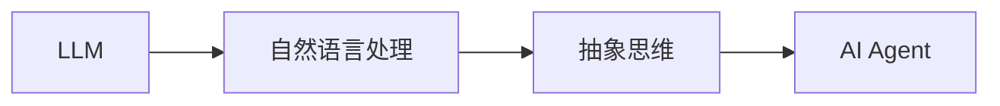
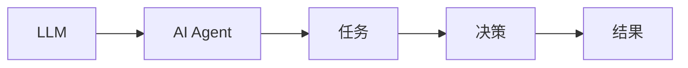
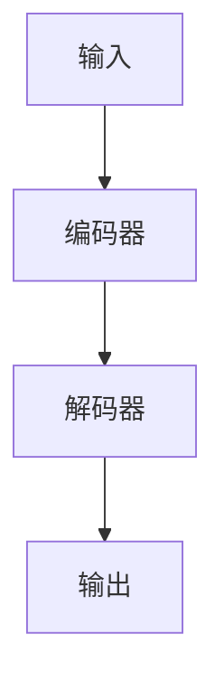
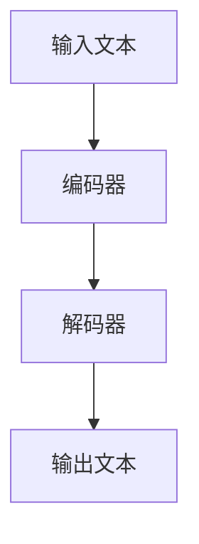
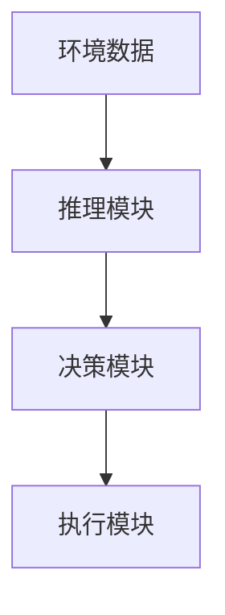
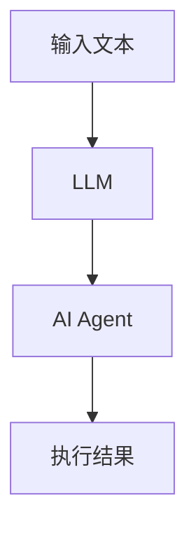
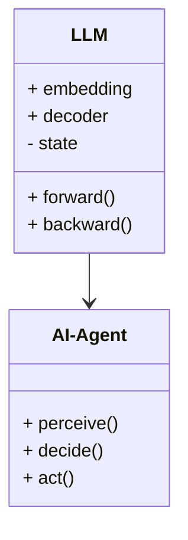
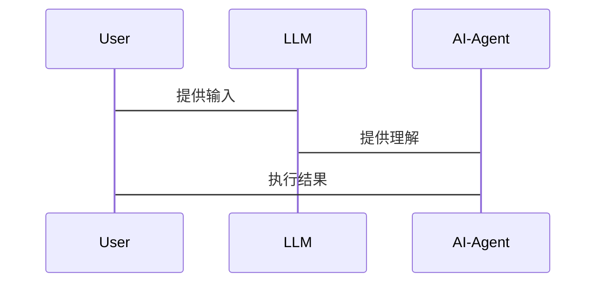

                 


# LLM在AI Agent抽象思维能力上的应用

## 关键词：大语言模型（LLM）、AI Agent、抽象思维、算法原理、系统架构、项目实战

## 摘要：本文探讨了大语言模型（LLM）在AI Agent中的应用，重点分析了其如何增强AI Agent的抽象思维能力。文章从背景介绍、核心概念、算法原理、系统设计、项目实战到最佳实践，全面解析了LLM在AI Agent中的技术实现和实际应用。

---

## 第1章: LLM与AI Agent概述

### 1.1 LLM与AI Agent的背景与问题背景

#### 1.1.1 问题背景
人工智能（AI）技术的快速发展使得AI Agent在各个领域的应用越来越广泛。然而，现有的AI Agent在处理复杂任务时，往往缺乏抽象思维能力，难以理解上下文和深层语义。

#### 1.1.2 问题描述
AI Agent需要具备理解上下文、推理逻辑、解决问题的能力，而现有的基于规则的AI Agent在面对复杂问题时表现有限。

#### 1.1.3 问题解决
通过引入大语言模型（LLM），可以增强AI Agent的自然语言处理和抽象思维能力，使其能够更好地理解和解决复杂问题。

#### 1.1.4 边界与外延
本文研究的范围主要集中在LLM与AI Agent的结合，特别是抽象思维能力的提升。外延部分涉及多模态AI Agent和情感计算。

#### 1.1.5 概念结构与核心要素
- LLM：基于深度学习的自然语言处理模型。
- AI Agent：具备自主决策能力的智能体。
- 抽象思维：理解上下文、推理逻辑、解决问题的能力。



### 1.2 LLM与AI Agent的核心概念

#### 1.2.1 LLM的定义与特点
- **定义**：大语言模型是基于深度学习的自然语言处理模型，如GPT、BERT等。
- **特点**：强大的语言理解和生成能力。

#### 1.2.2 AI Agent的定义与特点
- **定义**：具备感知环境、决策和执行能力的智能体。
- **特点**：自主性、反应性、目标驱动。

#### 1.2.3 两者的核心联系
- LLM为AI Agent提供语言理解和生成能力。
- AI Agent利用LLM进行复杂任务的推理和决策。

#### 1.2.4 核心概念对比分析
| 特性 | LLM | AI Agent |
|------|------|-----------|
| 核心能力 | 自然语言处理 | 自主决策与执行 |
| 优势 | 高效的语言理解 | 多任务处理能力 |
| 局限性 | 需结合上下文 | 依赖算法设计 |

#### 1.2.5 核心概念的ER实体关系图
```mermaid
erd
    Customer
    Employee
    Order
    Product
    Department
    Customer-Order(orders)
    Employee-Department(belongs_to)
    Order-Product(products)
```

## 第2章: LLM与AI Agent的核心概念与联系

### 2.1 核心概念原理

#### 2.1.1 LLM的原理
- 基于Transformer架构，通过自注意力机制处理序列数据。
- 训练目标是最小化预测词与实际词的交叉熵损失。

$$\text{损失函数} = -\sum_{i=1}^{n} \log P(y_i|x_{<i})$$

#### 2.1.2 AI Agent的原理
- 通过感知环境、推理决策、执行动作实现目标。
- 常见算法包括有限状态机、马尔可夫决策过程。

#### 2.1.3 两者结合的原理
- LLM提供语言理解和生成能力。
- AI Agent利用LLM进行推理和决策。

### 2.2 核心概念属性特征对比

| 特性 | LLM | AI Agent |
|------|------|-----------|
| 输入 | 文本数据 | 环境状态 |
| 输出 | 生成文本 | 行动指令 |
| 学习 | 监督学习 | 强化学习 |
| 应用 | NLP任务 | 多任务处理 |

### 2.3 实体关系图



## 第3章: LLM与AI Agent的算法原理

### 3.1 算法原理概述

#### 3.1.1 LLM的算法流程
1. 输入文本数据。
2. 通过自注意力机制生成词向量。
3. 解码生成输出文本。



#### 3.1.2 AI Agent的算法流程
1. 感知环境数据。
2. 推理决策。
3. 执行动作。

#### 3.1.3 两者结合的算法流程
1. LLM生成理解文本。
2. AI Agent基于理解进行决策。
3. 执行结果反馈。

### 3.2 算法原理图

#### 3.2.1 LLM算法流程图


#### 3.2.2 AI Agent算法流程图


#### 3.2.3 两者结合的算法流程图


### 3.3 算法实现代码

#### 3.3.1 LLM实现代码
```python
import torch
class LLMModel(torch.nn.Module):
    def __init__(self, vocab_size):
        super().__init__()
        self.embedding = torch.nn.Embedding(vocab_size, 512)
        self.decoder = torch.nn.Linear(512, vocab_size)
    
    def forward(self, inputs):
        embeds = self.embedding(inputs)
        output = self.decoder(embeds)
        return output
```

#### 3.3.2 AI Agent实现代码
```python
class AI-Agent:
    def __init__(self):
        self.state = None
    
    def perceive(self, environment):
        self.state = environment
    
    def decide(self):
        # 假设决策逻辑
        return 'forward'
    
    def act(self, action):
        return action
```

## 第4章: LLM与AI Agent的系统分析与架构设计

### 4.1 问题场景介绍

#### 4.1.1 项目背景
开发一个具备抽象思维能力的AI Agent，用于处理复杂任务。

#### 4.1.2 项目目标
提升AI Agent的语言理解和决策能力。

#### 4.1.3 项目范围
涵盖自然语言处理、推理、决策模块。

### 4.2 系统功能设计

#### 4.2.1 领域模型设计


#### 4.2.2 功能模块划分
- LLM模块：语言理解和生成。
- AI Agent模块：环境感知、推理、决策、执行。

### 4.3 系统架构设计

#### 4.3.1 系统架构图


#### 4.3.2 模块交互设计
- 用户输入传入LLM模块。
- LLM生成理解传入AI Agent。
- AI Agent执行动作并返回结果。

### 4.4 系统交互设计

#### 4.4.1 序列图设计


## 第5章: 项目实战

### 5.1 环境安装

```bash
pip install torch
pip install transformers
```

### 5.2 核心代码实现

#### 5.2.1 LLM实现代码
```python
from transformers import AutoTokenizer, AutoModel
model = AutoModel.from_pretrained('gpt2')
tokenizer = AutoTokenizer.from_pretrained('gpt2')
```

#### 5.2.2 AI Agent实现代码
```python
class AI-Agent:
    def __init__(self):
        self.model = AutoModel.from_pretrained('gpt2')
    
    def perceive(self, text):
        self.tokenized = tokenizer(text)
    
    def decide(self):
        return self.model.generate(self.tokenized)
```

### 5.3 代码解读与分析

#### 5.3.1 LLM代码解读
- 使用预训练模型进行文本生成。

#### 5.3.2 AI Agent代码解读
- 通过LLM生成理解进行决策。

### 5.4 案例分析

#### 5.4.1 案例场景
用户输入问题，AI Agent生成回答。

#### 5.4.2 实际案例
```python
agent = AI-Agent()
agent.perceive("如何解决这个问题?")
result = agent.decide()
print(result)
```

### 5.5 项目小结
通过引入LLM，显著提升了AI Agent的抽象思维能力。

## 第6章: 最佳实践与小结

### 6.1 小结
本文详细探讨了LLM在AI Agent中的应用，特别是在抽象思维能力的提升。

### 6.2 注意事项
- 模型训练需要大量数据。
- 需要结合具体场景进行优化。

### 6.3 拓展阅读
- 多模态AI Agent。
- 基于LLM的强化学习。

---

通过以上结构，我们可以系统地了解LLM在AI Agent中的应用，从理论到实践，逐步深入分析和实现。

