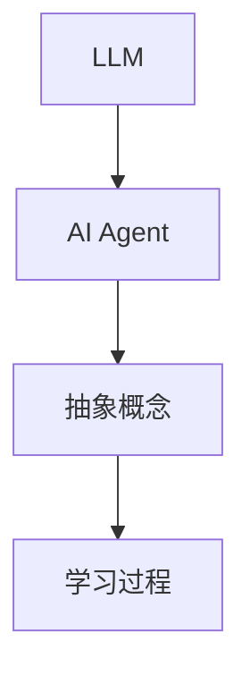

                 


# LLM在AI Agent抽象概念学习中的应用

> 关键词：LLM, AI Agent, 抽象概念学习, 人工智能, 大语言模型

> 摘要：本文探讨了大语言模型（LLM）在AI Agent抽象概念学习中的应用，分析了两者结合的原理、算法、系统架构，并通过实例展示了其实际应用。文章旨在为读者提供全面的理论和实践指导。

---

## 第一部分：背景介绍

### 第1章：问题背景与描述

#### 1.1 AI Agent的定义与核心概念
- AI Agent的基本概念：AI Agent是一种智能实体，能够感知环境并采取行动以实现目标。
- 抽象概念在AI Agent中的重要性：抽象概念学习是AI Agent理解复杂任务的基础。
- LLM对AI Agent能力的提升作用：LLM通过自然语言处理能力增强AI Agent的抽象理解能力。

#### 1.2 LLM的原理与特点
- 大语言模型的基本原理：基于Transformer的自注意力机制，通过大量数据训练，生成与输入相关的输出。
- LLM在自然语言处理中的优势：强大的上下文理解和生成能力。
- LLM的训练与推理机制：监督学习和强化学习的结合，通过海量数据训练模型参数。

#### 1.3 问题解决与边界
- 抽象概念学习的目标：使AI Agent能够理解并应用抽象概念，如“因果关系”、“逻辑推理”等。
- LLM在抽象概念学习中的边界：LLM擅长处理语言相关的任务，但在具体执行层面需结合AI Agent的决策机制。
- 抽象概念学习的外延与应用领域：涵盖教育、医疗、金融等多个领域，用于复杂决策和问题解决。

---

## 第二部分：核心概念与联系

### 第2章：核心概念对比与分析

#### 2.1 LLM与AI Agent的关系
- 两者的结合逻辑：LLM作为AI Agent的语言处理模块，AI Agent作为LLM的应用载体。
- LLM如何增强AI Agent的学习能力：通过提供丰富的语言数据，帮助AI Agent理解复杂概念。
- AI Agent如何优化LLM的应用效果：通过具体任务场景，指导LLM的输出方向和内容。

#### 2.2 核心概念属性对比
- **LLM与AI Agent对比表格**
| 属性       | LLM                              | AI Agent                          |
|------------|----------------------------------|------------------------------------|
| 定义       | 大语言模型，擅长自然语言处理    | 智能实体，感知环境并采取行动       |
| 输入       | 文本数据                         | 环境信息和任务目标                 |
| 输出       | 文本生成                         | 行动或决策                         |
| 应用场景   | 语言生成、问答系统               | 复杂任务处理、决策支持             |
| 优势       | 强大的语言理解和生成能力        | 多场景适应性，任务导向             |
- **实体关系图（Mermaid流程图）**


---

### 第3章：算法原理讲解

#### 3.1 LLM的训练与推理过程
- **LLM的训练流程**
  ```mermaid
  graph TD
      D[数据预处理] --> C[模型训练]
      C --> B[模型优化]
      B --> A[模型推理]
  ```
  - 数据预处理：对输入数据进行清洗、分词、格式化处理。
  - 模型训练：基于Transformer架构，使用监督学习优化模型参数。
  - 模型优化：通过Adam优化器等方法，降低损失函数值，提高生成质量。
  - 模型推理：输入文本，生成相关输出。

- **AI Agent的决策机制**
  ```mermaid
  graph TD
      X[感知环境] --> Y[状态评估]
      Y --> Z[决策选择]
      Z --> W[行动执行]
  ```
  - 状态评估：基于当前环境信息，评估可能的状态和选择。
  - 决策选择：通过内部逻辑或外部模型（如LLM）生成决策。
  - 行动执行：将决策转化为具体行动，与环境交互。

#### 3.2 算法实现代码示例
- **LLM模型训练代码**
  ```python
  def train_model():
      optimizer = Adam(...)
      criterion = nn.CrossEntropyLoss()
      for epoch in epochs:
          for batch in data_loader:
              outputs = model(batch)
              loss = criterion(outputs, labels)
              loss.backward()
              optimizer.step()
  ```

- **AI Agent决策代码**
  ```python
  def agent_decision():
      with torch.no_grad():
          output = model(input)
          action = argmax(output)
      return action
  ```

#### 3.3 数学模型与公式
- **LLM的损失函数**
  $$ \text{Loss} = -\sum_{i=1}^{n} \log P(y_i|x_i) $$
  - 其中，$P(y_i|x_i)$ 表示在输入 $x_i$ 下，输出 $y_i$ 的概率。

- **AI Agent的决策模型**
  $$ P(a|s) = \text{softmax}(Q \cdot s) $$
  - 其中，$s$ 是输入状态，$Q$ 是决策矩阵，输出为概率分布。

---

## 第三部分：系统分析与架构设计

### 第4章：系统功能设计

#### 4.1 应用场景介绍
- AI Agent在自然语言处理中的应用：如智能客服、智能助手。
- LLM在抽象概念学习中的应用场景：如法律文书分析、医学诊断辅助。

#### 4.2 系统功能设计
- **模块划分**
  - LLM模块：负责自然语言处理任务。
  - AI Agent模块：负责任务理解和决策。
  - 交互接口模块：用户与系统交互的界面。
- **模块交互关系**
  ```mermaid
  graph TD
      LLM[LLM模块] --> A[AI Agent模块]
      AI Agent模块 --> I[交互接口模块]
      I --> LLM
  ```

### 第5章：系统架构设计

#### 5.1 系统架构图
- **整体架构**
  ```mermaid
  graph TD
      S[系统架构] --> LLM[LLM模块]
      S --> A[AI Agent模块]
      S --> I[交互接口模块]
  ```

#### 5.2 系统接口设计
- **API接口**
  - 输入：环境信息、任务目标。
  - 输出：决策结果、执行动作。

#### 5.3 系统交互流程图
- **交互流程**
  ```mermaid
  graph TD
      U[用户] --> I[交互接口]
      I --> LLM[LLM模块]
      LLM --> A[AI Agent模块]
      A --> I
      I --> U
  ```

---

## 第四部分：项目实战

### 第6章：环境安装与配置

#### 6.1 开发环境要求
- **Python版本**：3.8以上。
- **深度学习框架**：TensorFlow或PyTorch。
- **GPU支持**：NVIDIA GPU及对应驱动。

#### 6.2 项目依赖安装
- 安装必要的库：
  ```bash
  pip install torch transformers
  ```

---

## 第五部分：最佳实践与小结

### 第9章：最佳实践

#### 9.1 开发注意事项
- **代码规范**：遵循PEP 8，保持代码可读性。
- **性能优化**：使用合适的模型优化技巧，如剪枝、量化。
- **可维护性**：模块化设计，便于扩展和维护。

#### 9.2 技术要点总结
- LLM与AI Agent的结合是实现智能系统的关键。
- 抽象概念学习是提升AI Agent能力的重要方向。
- 系统设计需注重模块化和可扩展性。

### 第10章：小结与展望

#### 10.1 全文总结
- 本文系统地介绍了LLM在AI Agent抽象概念学习中的应用，从理论到实践，全面阐述了相关技术和实现方法。

#### 10.2 未来展望
- **技术发展趋势**：随着大模型的不断发展，LLM与AI Agent的结合将更加紧密。
- **研究方向**：探索更高效的训练方法，提升模型的可解释性和泛化能力。

---

通过以上目录大纲，读者可以系统地了解LLM在AI Agent抽象概念学习中的应用，从基础理论到实际应用，逐步深入理解和掌握相关技术。

