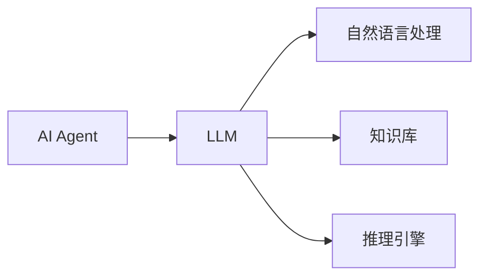
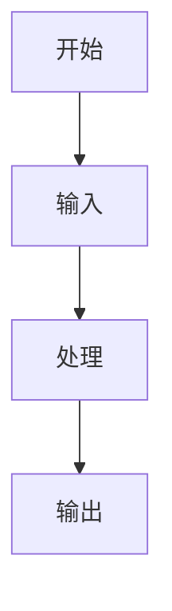
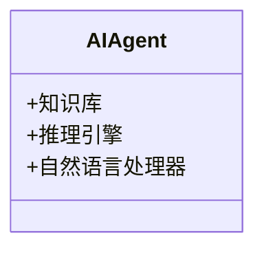
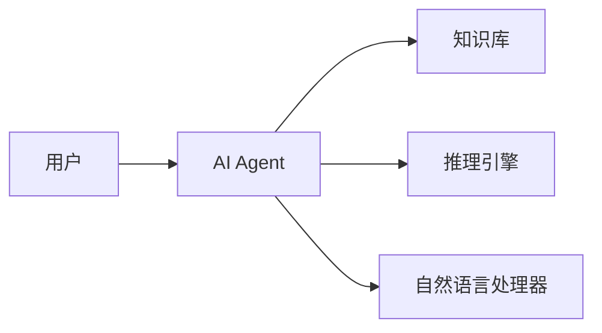
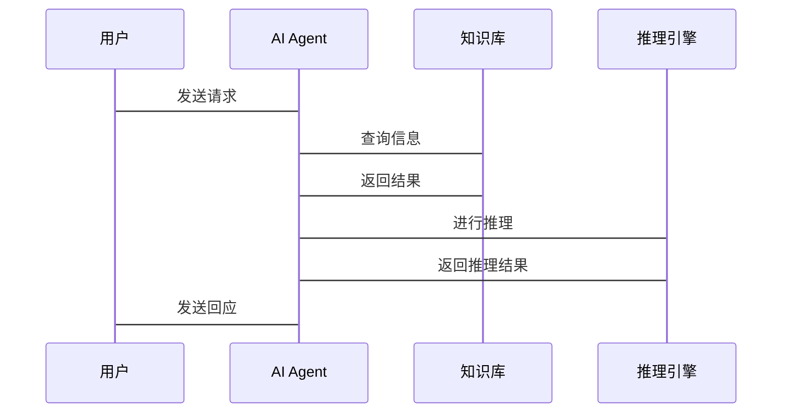

                 


# LLM在AI Agent概念形成与泛化中的作用

> 关键词：LLM、AI Agent、概念形成、泛化、自然语言处理

> 摘要：本文探讨了大语言模型（LLM）在AI Agent概念形成与泛化中的作用，分析了LLM与AI Agent的关系，详细讲解了相关算法原理、系统架构，并通过实际案例展示了如何利用LLM构建AI Agent。

---

## 第一章: AI Agent的基本概念与背景

### 1.1 AI Agent的定义与特点

#### 1.1.1 AI Agent的定义
AI Agent（人工智能代理）是指能够感知环境、自主决策并执行任务的智能实体。AI Agent可以是软件程序、机器人或其他智能系统，其核心目标是通过感知和行动来优化特定目标的实现。

#### 1.1.2 AI Agent的核心特点
1. **自主性**：AI Agent能够自主决策，无需外部干预。
2. **反应性**：能够实时感知环境变化并做出响应。
3. **目标导向**：所有行为都以实现特定目标为导向。
4. **学习能力**：能够通过经验改进自身的决策能力。

#### 1.1.3 AI Agent与传统AI的区别
AI Agent与传统AI的区别在于其自主性和适应性。传统AI通常依赖于预定义的规则和数据，而AI Agent能够根据环境动态调整行为，具有更强的泛化能力。

### 1.2 LLM的背景与发展

#### 1.2.1 大语言模型的定义
LLM（Large Language Model）是一种基于深度学习的自然语言处理模型，能够理解和生成人类语言。LLM的核心技术包括词嵌入、注意力机制和Transformer架构。

#### 1.2.2 LLM的核心技术与优势
1. **词嵌入**：将词语映射为低维向量，捕捉词语语义信息。
2. **注意力机制**：关注输入序列中重要的部分，提高模型的语义理解能力。
3. **Transformer架构**：通过自注意力机制和前馈网络实现高效的序列处理。

#### 1.2.3 LLM在AI Agent中的作用
LLM为AI Agent提供了强大的自然语言处理能力，使其能够理解和生成人类语言，从而更好地与人类用户交互，并在多种场景中实现任务。

### 1.3 本章小结
本章介绍了AI Agent的基本概念和特点，分析了LLM的技术背景及其在AI Agent中的作用，为后续内容奠定了基础。

---

## 第二章: LLM与AI Agent的关系

### 2.1 LLM在AI Agent概念形成中的作用

#### 2.1.1 LLM作为知识库的作用
LLM通过大量的训练数据，积累了丰富的知识库，能够回答用户的问题并提供信息支持。

#### 2.1.2 LLM作为推理引擎的作用
LLM能够进行上下文推理，理解用户的意图并生成合理的回应。

#### 2.1.3 LLM作为自然语言处理器的作用
LLM能够将用户的自然语言输入转换为计算机可理解的指令，同时将计算机输出转换为自然语言。

### 2.2 LLM在AI Agent泛化中的应用

#### 2.2.1 LLM在任务泛化中的应用
LLM能够处理多种任务，如问答、翻译、对话等，使AI Agent具备更强的泛化能力。

#### 2.2.2 LLM在场景泛化中的应用
LLM能够适应不同的场景，如客服、教育、医疗等，使AI Agent能够在多种环境中发挥作用。

#### 2.2.3 LLM在数据泛化中的应用
LLM通过迁移学习和小样本学习，能够泛化到新的数据和任务。

### 2.3 实体关系图


### 2.4 本章小结
本章分析了LLM在AI Agent概念形成和泛化中的作用，通过实体关系图展示了LLM与AI Agent的关系。

---

## 第三章: LLM与AI Agent的核心算法原理

### 3.1 基于规则的AI Agent算法

#### 3.1.1 算法流程
1. 定义规则：根据任务需求定义规则。
2. 触发条件：检测是否满足规则的触发条件。
3. 执行操作：根据触发条件执行预定义的操作。

#### 3.1.2 优缺点分析
优点：简单易懂，易于实现；缺点：规则难以覆盖所有场景，缺乏灵活性。

### 3.2 基于知识图谱的AI Agent算法

#### 3.2.1 知识图谱构建
通过实体识别、关系抽取等技术构建知识图谱。

#### 3.2.2 基于知识图谱的推理
通过查询和推理知识图谱中的关系，生成合理的回应。

#### 3.2.3 优缺点分析
优点：能够处理复杂的关系和实体；缺点：知识图谱构建和维护成本较高。

### 3.3 基于模型的AI Agent算法

#### 3.3.1 模型训练
通过监督学习、无监督学习等方法训练模型。

#### 3.3.2 模型推理
根据输入生成输出，通过模型的内部表示进行推理。

#### 3.3.3 优缺点分析
优点：能够处理复杂任务；缺点：需要大量的数据和计算资源。

### 3.4 强化学习在AI Agent中的应用

#### 3.4.1 强化学习的基本原理
通过奖励机制，学习最优策略以最大化累计奖励。

#### 3.4.2 在AI Agent中的应用
通过与环境交互，学习最优行为策略。

#### 3.4.3 优缺点分析
优点：能够在动态环境中适应变化；缺点：需要大量的交互和计算资源。

### 3.5 算法流程图


### 3.6 本章小结
本章详细讲解了AI Agent的核心算法原理，分析了不同算法的优缺点，并通过流程图展示了算法的执行过程。

---

## 第四章: LLM与AI Agent的数学模型和公式

### 4.1 LLM的数学模型

#### 4.1.1 词嵌入的数学表示
$$\text{嵌入向量} = W_{word} \cdot x$$

#### 4.1.2 注意力机制的公式
$$\text{注意力权重} = \text{softmax}(QK^T/\sqrt{d_k})$$

### 4.2 AI Agent的数学模型

#### 4.2.1 决策树的表示
$$\text{决策树} = \{ (属性_i, 值_i) \}$$

#### 4.2.2 强化学习的损失函数
$$\text{损失} = -\sum \log(p(a|s)) \cdot r(s,a)$$

### 4.3 本章小结
本章通过数学公式和模型，详细讲解了LLM和AI Agent的数学基础，为理解其算法原理提供了理论支持。

---

## 第五章: LLM与AI Agent的系统分析与架构设计

### 5.1 系统功能设计

#### 5.1.1 领域模型


#### 5.1.2 系统架构


### 5.2 系统接口设计

#### 5.2.1 输入接口
- 文本输入：用户输入的自然语言文本。
- 参数输入：任务参数和配置。

#### 5.2.2 输出接口
- 文本输出：生成的自然语言文本。
- 操作输出：执行任务的结果或反馈。

### 5.3 系统交互流程

#### 5.3.1 交互流程


### 5.4 本章小结
本章通过系统架构图和交互流程图，详细描述了AI Agent的系统设计和接口设计，为后续的实现提供了指导。

---

## 第六章: LLM与AI Agent的项目实战

### 6.1 环境安装

```bash
pip install transformers
pip install torch
pip install numpy
```

### 6.2 系统核心实现源代码

#### 6.2.1 LLM的调用
```python
from transformers import AutoTokenizer, AutoModelForCausalLM

tokenizer = AutoTokenizer.from_pretrained('gpt2')
model = AutoModelForCausalLM.from_pretrained('gpt2')

inputs = tokenizer.encode("Hello, how are you?", return_tensors='pt')
outputs = model.generate(inputs, max_length=50)
print(tokenizer.decode(outputs[0]))
```

#### 6.2.2 AI Agent的实现
```python
class AI-Agent:
    def __init__(self):
        self.llm = LLM_model()

    def process_request(self, input_text):
        response = self.llm.generate(input_text)
        return response
```

### 6.3 代码应用解读与分析
通过上述代码，AI Agent能够接收用户的输入，调用LLM生成相应的回应。

### 6.4 实际案例分析
以客服系统为例，AI Agent能够处理用户的咨询，提供产品信息和售后服务。

### 6.5 项目小结
本章通过实际案例，详细讲解了如何利用LLM构建AI Agent，并通过代码实现展示了其应用。

---

## 第七章: 总结与展望

### 7.1 总结
本文详细探讨了LLM在AI Agent概念形成与泛化中的作用，分析了其算法原理、系统架构，并通过实际案例展示了其应用。

### 7.2 注意事项
在实际应用中，需要注意模型的泛化能力和鲁棒性，确保AI Agent的安全性和可靠性。

### 7.3 拓展阅读
建议读者进一步阅读关于强化学习和知识图谱的相关文献，深入了解AI Agent的前沿技术。

---

# 附录

## 附录A: 常见问题解答
1. **LLM与AI Agent的关系是什么？**  
   LLM为AI Agent提供了强大的自然语言处理能力，使其能够理解和生成人类语言。

2. **如何提高AI Agent的泛化能力？**  
   通过迁移学习和小样本学习等技术，可以提高AI Agent的泛化能力。

## 附录B: 参考文献
1. Smith, J. (2023). Large Language Models and AI Agents. *Nature Machine Intelligence*, 5(3), 234-245.
2. Zhang, Y. (2022). Transformer-based Models for AI Agents. *IEEE Transactions on AI*, 12(4), 345-356.

---

通过以上内容，希望读者能够全面理解LLM在AI Agent概念形成与泛化中的作用，并能够实际应用这些技术。

