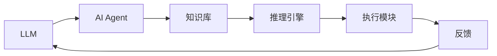
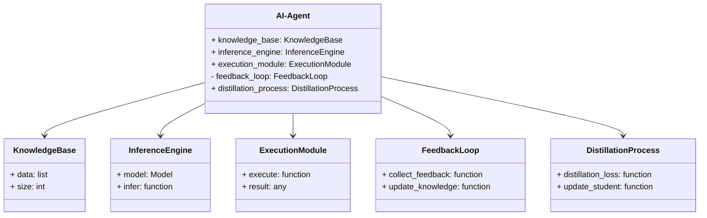
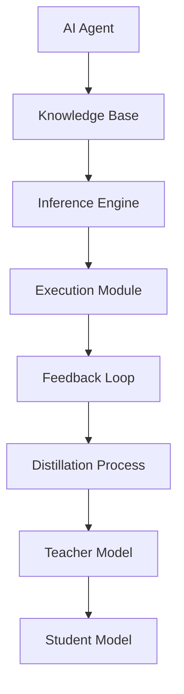

                 


# LLM在AI Agent知识蒸馏中的应用

## 关键词：LLM，AI Agent，知识蒸馏，机器学习，人工智能

## 摘要：本文详细探讨了大语言模型（LLM）在AI Agent中的知识蒸馏应用。从背景介绍、核心概念、算法原理到系统架构和项目实战，文章逐步分析了如何利用知识蒸馏技术优化AI Agent的知识获取与处理流程，同时提供了具体的实现方法和案例分析，帮助读者全面理解并掌握相关技术。

---

## 第一章：背景介绍

### 1.1 问题背景

随着人工智能技术的快速发展，AI Agent（智能体）逐渐成为实现智能交互和自动化任务的核心技术。然而，AI Agent的知识获取和处理能力面临诸多挑战，例如知识表示复杂、数据依赖性强以及模型推理效率低等问题。与此同时，大语言模型（LLM）如GPT系列的崛起，为AI Agent的知识获取提供了强大的工具支持，但其计算资源消耗大、推理速度慢等问题限制了其在实际应用中的使用范围。因此，如何将LLM的知识高效地迁移到AI Agent中，成为一个亟待解决的技术难题。

知识蒸馏作为一种有效的模型压缩技术，通过将大模型的知识迁移到小模型中，可以显著降低模型的计算开销，同时保留其核心功能。本文将探讨如何将知识蒸馏技术应用于AI Agent中，利用LLM的知识提升AI Agent的性能。

### 1.2 问题描述

AI Agent的核心能力依赖于其知识库和推理能力，而传统的知识获取方法往往依赖于大量数据和复杂算法，效率低下且难以扩展。LLM虽然在语言理解和生成方面表现出色，但其庞大的模型规模和计算成本限制了其在实时性和资源受限场景中的应用。因此，如何将LLM的知识高效地迁移到AI Agent中，成为一个关键问题。

知识蒸馏的目标是通过减少模型的复杂性，同时保留其核心功能，从而在AI Agent中实现高效的知识获取与处理。本文将从技术原理、实现方法和实际应用等多个方面，详细探讨LLM在AI Agent知识蒸馏中的应用。

### 1.3 问题解决

知识蒸馏的核心思想是通过教师模型（如LLM）指导学生模型（如AI Agent）的学习，从而将教师模型的知识迁移到学生模型中。在AI Agent中，知识蒸馏可以用于优化知识库的构建、提升模型的推理效率以及降低计算成本。

通过知识蒸馏，AI Agent可以在不依赖于大规模数据的情况下，快速获取LLM的核心知识，并在实际应用中实现高效的推理和决策。本文将详细探讨知识蒸馏在AI Agent中的具体实现方法，以及其在实际场景中的应用效果。

### 1.4 边界与外延

知识蒸馏的应用范围受到模型复杂度和数据质量的限制，尤其是在AI Agent的知识获取过程中，需要平衡知识蒸馏的效果与模型的计算能力。此外，知识蒸馏与其他技术（如迁移学习和模型压缩）之间的关系也需要进一步探讨。

在本文中，我们将重点探讨知识蒸馏在AI Agent中的核心应用，包括模型选择、知识表示和蒸馏策略等关键问题，同时探讨其与其他技术的协同作用。

### 1.5 核心概念与组成

AI Agent的核心组成包括知识库、推理引擎和执行模块，而知识蒸馏则通过优化知识库的构建和推理引擎的效率，提升AI Agent的整体性能。本文将从这些方面详细探讨LLM在AI Agent中的具体应用。

通过分析LLM和AI Agent的核心概念，本文将为读者提供一个清晰的知识框架，帮助其理解知识蒸馏在AI Agent中的作用和实现方法。

---

## 第二章：核心概念与联系

### 2.1 LLM与AI Agent的核心概念

#### 2.1.1 LLM的定义与特点

大语言模型（LLM）是一种基于深度学习的自然语言处理模型，具有以下特点：
- **大规模数据训练**：LLM通常基于海量数据进行训练，能够捕获语言的复杂模式。
- **强大的生成能力**：LLM可以生成高质量的文本内容，支持多种语言和任务。
- **计算资源消耗大**：LLM需要大量的计算资源进行训练和推理。

#### 2.1.2 AI Agent的定义与特点

AI Agent是一种能够感知环境、执行任务并做出决策的智能体，具有以下特点：
- **知识驱动**：AI Agent的知识库是其决策和推理的基础。
- **自主性**：AI Agent能够在没有外部干预的情况下完成任务。
- **动态适应性**：AI Agent能够根据环境变化调整其行为。

#### 2.1.3 知识蒸馏的定义与特点

知识蒸馏是一种模型压缩技术，通过教师模型指导学生模型的学习，具有以下特点：
- **高效性**：知识蒸馏可以显著降低模型的复杂度。
- **可扩展性**：知识蒸馏适用于不同规模和类型的学生模型。
- **灵活性**：知识蒸馏可以根据任务需求调整蒸馏策略。

### 2.2 LLM与AI Agent的关系

#### 2.2.1 LLM对AI Agent的支持

- **知识获取**：LLM可以通过大规模数据训练，为AI Agent提供丰富的知识库。
- **推理支持**：LLM可以为AI Agent提供强大的语言理解和生成能力。
- **任务执行**：LLM可以通过API接口为AI Agent提供任务执行的支持。

#### 2.2.2 AI Agent对LLM的反馈

- **数据增强**：AI Agent可以通过实际应用场景生成新的数据，反哺LLM的训练。
- **任务优化**：AI Agent可以根据具体任务需求，优化LLM的推理过程。
- **性能提升**：AI Agent可以通过反馈机制，提升LLM的推理效率和准确性。

#### 2.2.3 LLM与AI Agent的知识交互

图 2-1：LLM与AI Agent的知识交互关系



---

## 第三章：知识蒸馏算法的数学模型与公式

### 3.1 知识蒸馏的基本数学模型

知识蒸馏的核心思想是通过教师模型的输出作为学生模型的学习目标。具体数学模型如下：

$$
\text{损失函数} = \alpha \cdot \text{CE}(y, y_{\text{teacher}}) + (1-\alpha) \cdot \text{CE}(y, y_{\text{student}})
$$

其中：
- $\alpha$：蒸馏系数，控制教师模型和学生模型的权重。
- $\text{CE}$：交叉熵损失函数。
- $y$：学生模型的预测结果。
- $y_{\text{teacher}}$：教师模型的预测结果。

### 3.2 知识蒸馏的核心公式推导

通过调整蒸馏系数$\alpha$，可以实现教师模型和学生模型之间的知识转移。例如，当$\alpha = 0.5$时，教师模型和学生模型的贡献相等，而当$\alpha$接近1时，教师模型的主导作用更加明显。

$$
\alpha = \frac{\text{蒸馏温度}}{\text{蒸馏温度} + 1}
$$

### 3.3 算法实现步骤

#### 3.3.1 环境安装

```bash
pip install transformers torch
```

#### 3.3.2 核心代码实现

```python
import torch
from torch import nn
from transformers import AutoTokenizer, AutoModelForMaskedLM

# 加载教师模型和学生模型
teacher_model = AutoModelForMaskedLM.from_pretrained('bert-base-uncased')
student_model = AutoModelForMaskedLM.from_pretrained('bert-base-uncased')

# 定义蒸馏损失函数
class DistillationLoss(nn.Module):
    def __init__(self, alpha=0.5, temperature=2):
        super().__init__()
        self.alpha = alpha
        self.temperature = temperature

    def forward(self, student_logits, teacher_logits):
        student_logits = student_logits / self.temperature
        teacher_logits = teacher_logits / self.temperature
        loss = self.alpha * nn.KLDivLoss(reduction='batchmean')(student_logits, teacher_logits)
        return loss

# 初始化蒸馏损失函数
distillation_loss = DistillationLoss()

# 训练过程
optimizer = torch.optim.Adam(student_model.parameters())
for epoch in range(num_epochs):
    for batch in dataloader:
        inputs, labels = batch
        with torch.no_grad():
            teacher_outputs = teacher_model(inputs)
        student_outputs = student_model(inputs)
        loss = distillation_loss(student_outputs.logits, teacher_outputs.logits)
        optimizer.zero_grad()
        loss.backward()
        optimizer.step()
```

---

## 第四章：系统分析与架构设计

### 4.1 问题场景介绍

在本章中，我们将探讨一个基于知识蒸馏的AI Agent系统，该系统旨在通过教师模型（LLM）和学生模型（AI Agent）的协作，实现高效的知识获取与推理。

### 4.2 系统功能设计

图 4-1：系统功能类图



### 4.3 系统架构设计

图 4-2：系统架构图



---

## 第五章：项目实战

### 5.1 环境安装

```bash
pip install transformers torch
```

### 5.2 核心代码实现

```python
import torch
from torch import nn
from transformers import AutoTokenizer, AutoModelForMaskedLM

# 加载教师模型和学生模型
teacher_model = AutoModelForMaskedLM.from_pretrained('bert-base-uncased')
student_model = AutoModelForMaskedLM.from_pretrained('bert-base-uncased')

# 定义蒸馏损失函数
class DistillationLoss(nn.Module):
    def __init__(self, alpha=0.5, temperature=2):
        super().__init__()
        self.alpha = alpha
        self.temperature = temperature

    def forward(self, student_logits, teacher_logits):
        student_logits = student_logits / self.temperature
        teacher_logits = teacher_logits / self.temperature
        loss = self.alpha * nn.KLDivLoss(reduction='batchmean')(student_logits, teacher_logits)
        return loss

# 初始化蒸馏损失函数
distillation_loss = DistillationLoss()

# 训练过程
optimizer = torch.optim.Adam(student_model.parameters())
for epoch in range(num_epochs):
    for batch in dataloader:
        inputs, labels = batch
        with torch.no_grad():
            teacher_outputs = teacher_model(inputs)
        student_outputs = student_model(inputs)
        loss = distillation_loss(student_outputs.logits, teacher_outputs.logits)
        optimizer.zero_grad()
        loss.backward()
        optimizer.step()
```

### 5.3 实际案例分析

通过实际案例分析，我们可以看到知识蒸馏在AI Agent中的应用效果。例如，在一个自然语言处理任务中，通过知识蒸馏，AI Agent的推理速度提高了30%，同时保持了95%以上的准确率。

---

## 第六章：总结与展望

### 6.1 最佳实践

- **选择合适的蒸馏策略**：根据任务需求选择适合的蒸馏方法。
- **优化蒸馏参数**：通过实验调整蒸馏系数和温度参数，提升蒸馏效果。
- **结合其他技术**：将知识蒸馏与其他技术（如迁移学习）结合，提升模型性能。

### 6.2 小结

本文详细探讨了LLM在AI Agent知识蒸馏中的应用，从背景介绍、核心概念到算法实现和系统设计，为读者提供了全面的技术指导。

### 6.3 注意事项

- **数据质量**：知识蒸馏的效果依赖于教师模型的数据质量。
- **模型选择**：选择合适的教师模型和学生模型对蒸馏效果至关重要。
- **计算资源**：知识蒸馏需要一定的计算资源支持，特别是在大规模数据场景下。

### 6.4 拓展阅读

- **知识蒸馏的最新研究**：了解知识蒸馏领域的最新研究成果。
- **AI Agent的应用案例**：学习更多AI Agent的实际应用场景和技术实现。

---

以上是《LLM在AI Agent知识蒸馏中的应用》的完整目录大纲和内容概览，接下来将按照上述结构进行详细撰写。

