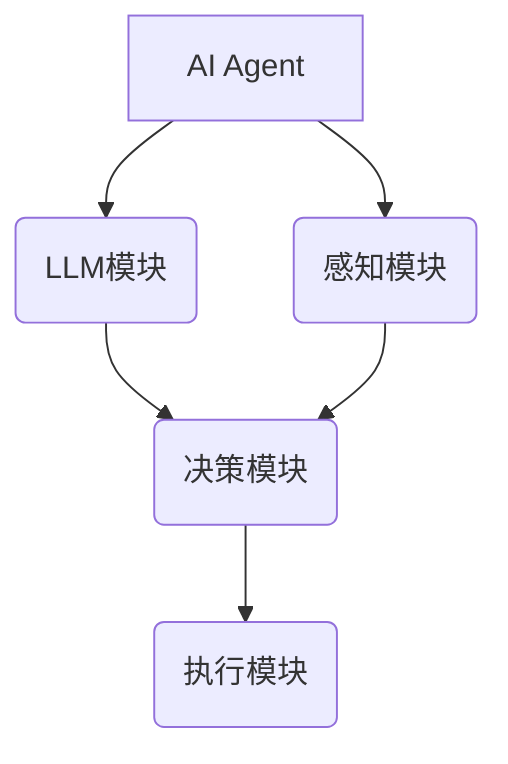

                 


# LLM在AI Agent自我意识模拟中的应用

> 关键词：LLM, AI Agent, 自我意识模拟, 大语言模型, AI代理, 人工智能

> 摘要：本文探讨了大语言模型（LLM）在AI Agent自我意识模拟中的应用。通过分析LLM的核心原理、AI Agent的架构设计以及两者的结合方式，本文详细阐述了如何利用LLM实现AI Agent的自我意识模拟。文章从背景介绍、核心概念、算法原理、系统架构、项目实战到总结与扩展，全面深入地分析了LLM在AI Agent中的应用，并通过具体案例展示了其实现过程和应用场景。

---

## 第一部分: LLM与AI Agent背景介绍

### 第1章: LLM与AI Agent概述

#### 1.1 问题背景
近年来，人工智能技术迅速发展，大语言模型（LLM）的出现为AI Agent的智能化提供了新的可能。LLM具有强大的生成能力和理解能力，能够帮助AI Agent更好地模拟人类的自我意识。然而，如何将LLM与AI Agent结合，实现自我意识模拟，仍然是一个需要深入研究的问题。

#### 1.2 问题描述
AI Agent需要具备自我意识才能更好地完成复杂任务。自我意识模拟的核心是让AI Agent能够理解自身的状态、环境和目标，并根据这些信息进行决策和行动。LLM作为强大的语言模型，可以为AI Agent提供生成文本、理解意图和推理的能力，从而支持其自我意识的实现。

#### 1.3 问题解决思路
为了实现AI Agent的自我意识模拟，我们需要将LLM嵌入到AI Agent的架构中，使其能够通过语言模型的能力进行自我反思和决策。同时，还需要设计合理的算法和系统架构，以确保AI Agent能够高效地处理信息并做出准确的判断。

#### 1.4 边界与外延
自我意识模拟的边界在于AI Agent能够理解自身状态和环境，但并不意味着AI Agent具备真正的人类意识。外延方面，LLM在AI Agent中的应用可以扩展到多种场景，如智能助手、机器人控制等。

#### 1.5 核心概念与组成
- **LLM**：大语言模型，具有强大的生成和理解能力。
- **AI Agent**：具备自主决策能力的智能代理。
- **自我意识模拟**：AI Agent通过LLM实现对自身状态和环境的理解和反思。

---

## 第二部分: LLM与AI Agent的核心概念

### 第2章: LLM的原理与实现

#### 2.1 LLM的原理
LLM基于深度学习技术，通过大量的数据训练，能够生成与上下文相关的文本。其核心原理包括模型的训练过程和生成机制。

##### 2.1.1 模型的训练过程
- **输入数据**：大量的文本数据，包括书籍、网页等。
- **训练目标**：最小化预测概率与真实标签之间的差距。
- **损失函数**：交叉熵损失函数，公式为：
  $$ L = -\sum_{i=1}^{n} y_i \log p(y_i) $$
  其中，$y_i$ 是真实标签的概率，$p(y_i)$ 是模型预测的概率。

##### 2.1.2 模型的生成机制
- **解码过程**：模型通过解码器生成输出文本，生成过程通常采用贪心搜索或采样方法。
- **注意力机制**：模型通过注意力机制捕捉输入文本中的重要信息，公式为：
  $$ \alpha_i = \frac{\exp(e_i)}{\sum_{j=1}^{n} \exp(e_j)} $$
  其中，$e_i$ 是查询与第$i$个键的匹配度，$\alpha_i$ 是注意力权重。

##### 2.1.3 模型的可解释性
- **Token重要性分析**：通过分析生成文本中每个Token的贡献度，理解模型的生成逻辑。
- **注意力可视化**：通过可视化注意力权重，理解模型对输入文本的关注点。

#### 2.2 LLM的核心属性
- **生成能力**：能够生成与上下文相关的文本。
- **理解能力**：能够理解输入文本的语义和上下文。
- **知识库调用能力**：能够调用外部知识库进行推理和回答。

#### 2.3 LLM与传统NLP模型的对比
| 特性         | 传统NLP模型       | LLM           |
|--------------|--------------------|---------------|
| 模型结构     | 单层或浅层网络     | 深层网络       |
| 参数数量     | 较少              | 数以亿计       |
| 上下文理解   | 有限              | 强大的上下文理解 |
| 应用场景     | 简单任务（如分类） | 复杂任务（如生成） |

---

### 第3章: AI Agent的原理与架构

#### 3.1 AI Agent的基本原理
AI Agent是一种具备自主决策能力的智能代理，能够感知环境、理解任务目标并采取行动。其核心原理包括：

- **感知能力**：通过传感器或接口获取环境信息。
- **决策能力**：基于感知信息和内部知识库进行推理和决策。
- **执行能力**：通过执行器或接口将决策转化为具体行动。
- **学习能力**：通过与环境的交互不断优化自身的决策策略。

#### 3.2 AI Agent的核心属性
- **自主性**：能够在没有外部干预的情况下自主决策。
- **反应性**：能够实时感知环境并做出反应。
- **目标导向性**：具备明确的目标，并根据目标采取行动。
- **学习能力**：能够通过经验优化自身的决策策略。

#### 3.3 AI Agent的架构设计
AI Agent的架构设计通常包括以下几个部分：

- **感知模块**：负责获取环境信息。
- **决策模块**：负责基于感知信息进行推理和决策。
- **执行模块**：负责将决策转化为具体行动。
- **知识库**：存储AI Agent所需的知识和经验。

##### 3.3.1 感知模块
感知模块通过传感器或接口获取环境信息，包括文本、图像、声音等多种形式。例如，在自然语言处理任务中，感知模块可以通过LLM获取用户的输入文本。

##### 3.3.2 决策模块
决策模块基于感知信息和内部知识库进行推理和决策。例如，AI Agent可以通过LLM生成文本并根据生成结果采取相应的行动。

##### 3.3.3 执行模块
执行模块负责将决策转化为具体行动。例如，AI Agent可以通过发送指令到其他系统或输出结果来执行决策。

##### 3.3.4 知识库
知识库存储AI Agent所需的知识和经验，包括规则、案例、数据等。例如，AI Agent可以通过查询知识库获取上下文信息以辅助决策。

#### 3.4 AI Agent的实现步骤
1. **获取环境信息**：通过感知模块获取环境信息。
2. **生成决策**：通过LLM生成决策文本。
3. **执行决策**：通过执行模块将决策转化为具体行动。
4. **优化策略**：通过学习模块优化自身的决策策略。

---

## 第三部分: LLM在AI Agent中的应用

### 第4章: LLM与AI Agent的结合

#### 4.1 LLM在AI Agent中的作用
LLM在AI Agent中的作用主要体现在以下几个方面：

- **生成能力**：通过LLM生成与任务相关的文本。
- **理解能力**：通过LLM理解输入文本的语义和上下文。
- **推理能力**：通过LLM调用外部知识库进行推理和回答。

#### 4.2 LLM与AI Agent的结合方式
- **直接调用**：将LLM作为AI Agent的生成模块，直接生成决策文本。
- **嵌入式调用**：将LLM嵌入到AI Agent的决策模块中，辅助决策过程。
- **知识库调用**：通过LLM调用外部知识库进行推理和回答。

#### 4.3 LLM与AI Agent的结合流程
1. **获取环境信息**：AI Agent通过感知模块获取环境信息。
2. **调用LLM生成文本**：AI Agent通过LLM生成与任务相关的文本。
3. **基于文本进行推理**：AI Agent通过生成的文本进行推理和决策。
4. **执行决策**：AI Agent通过执行模块将决策转化为具体行动。

#### 4.4 LLM在AI Agent中的优势
- **强大的生成能力**：LLM能够生成与任务相关的高质量文本。
- **强大的理解能力**：LLM能够理解输入文本的语义和上下文。
- **强大的推理能力**：LLM能够调用外部知识库进行推理和回答。

---

### 第5章: LLM在AI Agent中的具体应用

#### 5.1 自然语言处理任务
- **文本生成**：通过LLM生成高质量的文本，例如生成文章、对话等。
- **文本理解**：通过LLM理解输入文本的语义和上下文，例如问答系统、情感分析等。

#### 5.2 自我意识模拟
- **自我反思**：AI Agent通过LLM进行自我反思，理解自身的状态和环境。
- **目标设定**：AI Agent通过LLM设定目标并制定实现目标的计划。

#### 5.3 多模态任务
- **图像理解**：通过LLM与图像处理模型结合，实现图像理解和生成。
- **声音处理**：通过LLM与语音处理模型结合，实现语音理解和生成。

---

## 第四部分: 项目实战

### 第6章: LLM与AI Agent的项目实战

#### 6.1 项目介绍
本项目旨在通过LLM实现AI Agent的自我意识模拟。项目主要包括以下几个部分：

1. **环境搭建**：安装必要的开发工具和库。
2. **系统设计**：设计AI Agent的架构和功能模块。
3. **系统实现**：通过代码实现AI Agent的核心功能。
4. **案例分析**：通过具体案例展示AI Agent的自我意识模拟过程。

#### 6.2 系统设计

##### 6.2.1 功能设计
- **环境感知**：获取环境信息，例如用户输入、传感器数据等。
- **生成决策**：通过LLM生成决策文本。
- **执行决策**：将决策转化为具体行动。
- **学习优化**：通过学习模块优化自身的决策策略。

##### 6.2.2 系统架构设计


##### 6.2.3 接口设计
- **输入接口**：接收环境信息，例如用户输入、传感器数据等。
- **输出接口**：输出决策结果，例如生成文本、执行指令等。

#### 6.3 系统实现

##### 6.3.1 环境搭建
```bash
pip install transformers
pip install torch
pip install numpy
```

##### 6.3.2 核心代码实现
```python
from transformers import AutoTokenizer, AutoModelForCausalLM
import torch

# 初始化LLM模型
tokenizer = AutoTokenizer.from_pretrained("gpt2")
model = AutoModelForCausalLM.from_pretrained("gpt2")

# 生成决策文本
def generate_decision(input_text):
    inputs = tokenizer.encode(input_text, return_tensors="pt")
    outputs = model.generate(inputs, max_length=50, num_beams=5)
    decision = tokenizer.decode(outputs[0], skip_special_tokens=True)
    return decision

# 执行决策
def execute_decision(decision):
    # 实现具体的执行逻辑
    pass
```

#### 6.4 案例分析
- **案例1**：AI Agent通过LLM生成对话文本，与用户进行交互。
- **案例2**：AI Agent通过LLM进行自我反思，优化自身的决策策略。

---

## 第五部分: 总结与扩展

### 第7章: 总结与扩展

#### 7.1 最佳实践
- **模型选择**：根据具体任务选择合适的LLM模型。
- **系统优化**：通过优化算法和架构提高系统的效率和性能。
- **安全与伦理**：确保AI Agent的行为符合伦理规范，避免潜在风险。

#### 7.2 小结
本文详细探讨了LLM在AI Agent自我意识模拟中的应用，从背景介绍、核心概念、算法原理到系统架构和项目实战，全面分析了如何利用LLM实现AI Agent的自我意识模拟。

#### 7.3 注意事项
- **数据隐私**：确保数据的隐私和安全。
- **模型优化**：通过优化模型参数提高生成质量。
- **用户体验**：确保AI Agent的交互体验符合用户需求。

#### 7.4 拓展阅读
- **推荐书籍**：《Deep Learning》、《Natural Language Processing with PyTorch》
- **推荐论文**：《Attention Is All You Need》、《The Transformer

