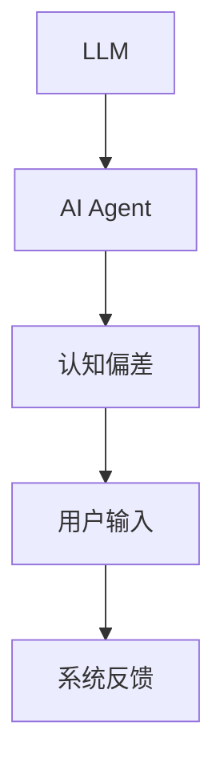
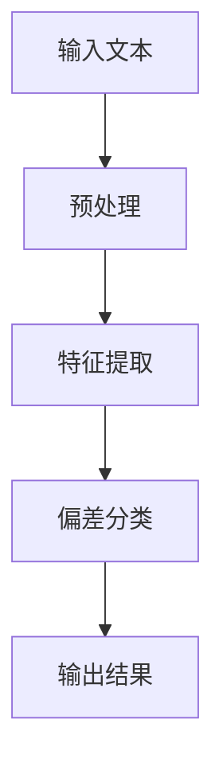
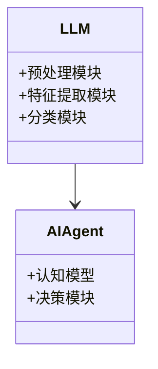
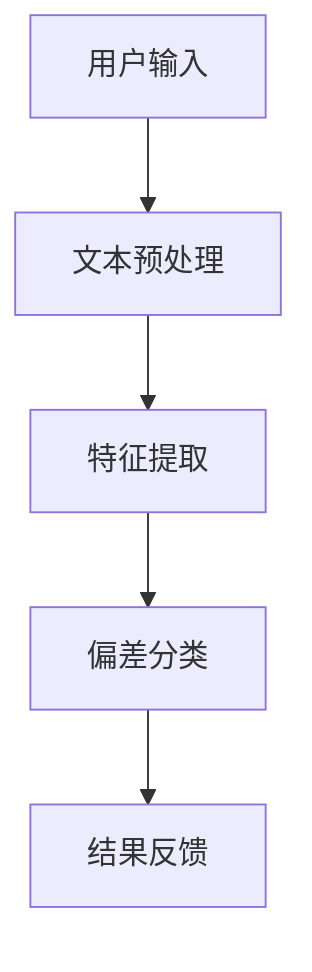
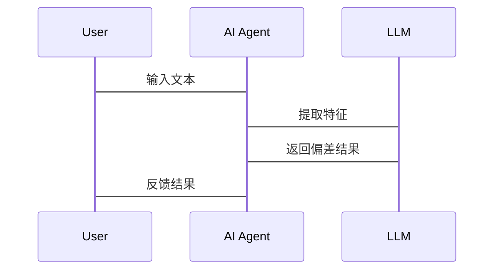

                 


# LLM在AI Agent认知偏差识别中的应用

## 关键词：LLM, AI Agent, 认知偏差, 自然语言处理, 人工智能, 偏差检测

## 摘要：本文探讨了大语言模型（LLM）在AI Agent认知偏差识别中的应用。通过分析认知偏差的定义、分类及其在AI系统中的影响，结合LLM的特性，提出了一种基于LLM的AI Agent认知偏差识别方法。文章详细阐述了该方法的算法原理、系统架构、项目实现及最佳实践，旨在为AI Agent的优化提供理论依据和技术支持。

---

## 第一章: 问题背景与定义

### 1.1 问题背景

#### 1.1.1 认知偏差的基本概念
认知偏差是指个体在信息处理过程中，由于主观因素的影响，导致对客观事实的歪曲或误解。例如，确认偏差（confirmation bias）是指人们倾向于接受与自己已有信念一致的信息，而忽略或拒绝相反的信息。

#### 1.1.2 AI Agent在认知偏差识别中的作用
AI Agent是一种能够感知环境、执行任务并做出决策的智能实体。在实际应用中，AI Agent可能由于算法、数据或设计的局限性而产生认知偏差。例如，推荐系统可能因为训练数据的偏差而向用户推荐不公平的内容。

#### 1.1.3 当前技术的局限性与挑战
传统的认知偏差识别方法通常依赖于规则或基于统计的特征工程，这种方法在面对复杂、多样化的偏差时显得力不从心。而基于LLM的AI Agent可以通过深度学习技术，从大规模数据中学习复杂的模式，从而更准确地识别认知偏差。

### 1.2 LLM与AI Agent的定义

#### 1.2.1 大语言模型（LLM）的定义
LLM是基于深度学习的自然语言处理模型，通过监督学习和无监督学习相结合的方式，从大量文本数据中学习语言表示。例如，GPT-3、PaLM等模型都属于LLM的范畴。

#### 1.2.2 AI Agent的基本概念
AI Agent是一种智能实体，能够通过感知环境、与用户交互并执行任务来实现特定目标。AI Agent可以是软件程序、机器人或其他智能系统。

#### 1.2.3 LLM在AI Agent中的应用潜力
LLM的强大语言理解和生成能力，使得AI Agent能够更自然地与人类交互，并能够更准确地识别和纠正认知偏差。例如，AI Agent可以利用LLM来分析用户的输入，识别其中的偏差，并提供相应的建议或纠正。

### 1.3 问题解决思路

#### 1.3.1 认知偏差识别的必要性
认知偏差可能导致AI系统做出错误的决策，影响用户体验和系统性能。例如，推荐系统中的偏差可能导致用户看到不公平的内容，进而影响用户的决策。

#### 1.3.2 LLM在偏差识别中的优势
LLM具有强大的上下文理解和生成能力，能够从大量的文本数据中学习复杂的模式。这使得LLM能够更准确地识别和分类认知偏差。

#### 1.3.3 技术实现的基本框架
技术实现的基本框架包括数据收集、模型训练、偏差识别和结果反馈四个阶段。通过这些阶段，AI Agent可以利用LLM的能力，实现对认知偏差的识别和纠正。

---

## 第二章: 核心概念与联系

### 2.1 核心概念原理

#### 2.1.1 LLM的工作原理
LLM通过多层神经网络结构，将输入文本映射到高维向量空间，并通过自注意力机制捕捉文本中的语义信息。模型通过大量数据的训练，能够生成与训练数据一致的输出。

#### 2.1.2 AI Agent的认知模型
AI Agent的认知模型通常包括感知、推理和决策三个部分。通过LLM的强大语言能力，AI Agent可以更准确地理解和推理用户的意图，从而更有效地识别认知偏差。

#### 2.1.3 认知偏差的分类与特征
认知偏差可以分为多种类型，例如确认偏差、过度自信偏差等。每种偏差都有其独特的特征和表现形式，这使得在识别过程中需要针对不同的偏差类型设计不同的检测方法。

### 2.2 概念属性对比表

| 概念       | 特性                     |
|------------|--------------------------|
| LLM        | 大规模预训练，强大的语言生成能力 |
| AI Agent    | 具备感知和决策能力       |
| 认知偏差    | 由主观因素导致的信息处理误差 |

### 2.3 ER实体关系图



---

## 第三章: 算法原理与实现

### 3.1 算法原理

#### 3.1.1 基于LLM的偏差识别流程
1. 输入文本预处理：对输入文本进行清洗和标准化处理。
2. 特征提取：利用LLM提取文本中的语义特征。
3. 偏差分类：基于训练好的分类模型，识别文本中的认知偏差类型。

#### 3.1.2 偏差检测的特征提取方法
特征提取方法包括词袋模型、TF-IDF和基于深度学习的特征提取方法。其中，基于深度学习的方法能够提取更复杂的语义特征。

#### 3.1.3 偏差分类的模型选择
常用的分类模型包括支持向量机（SVM）、随机森林和深度神经网络。对于大规模数据，深度神经网络通常表现更好。

### 3.2 算法流程图



### 3.3 Python代码实现

```python
def detect_bias(text):
    # 预处理
    preprocessed = preprocess(text)
    # 特征提取
    features = extract_features(preprocessed)
    # 偏差分类
    model = load_model()
    prediction = model.predict(features)
    return prediction
```

### 3.4 数学模型与公式

#### 3.4.1 损失函数
$$
L = -\sum_{i=1}^{n} y_i \log(p_i) + (1 - y_i) \log(1 - p_i)
$$

#### 3.4.2 优化目标
$$
\text{优化目标} = \min_{\theta} L
$$

---

## 第四章: 数学模型与公式

### 4.1 损失函数
$$
L = -\sum_{i=1}^{n} y_i \log(p_i) + (1 - y_i) \log(1 - p_i)
$$

### 4.2 优化目标
$$
\text{优化目标} = \min_{\theta} L
$$

---

## 第五章: 系统分析与架构设计方案

### 5.1 问题场景介绍

#### 5.1.1 项目介绍
本项目旨在利用LLM技术，构建一个能够识别认知偏差的AI Agent系统。通过分析用户的输入文本，系统能够自动识别并纠正其中的认知偏差。

#### 5.1.2 系统功能设计
系统功能包括文本输入、偏差识别、结果反馈和用户交互等模块。

### 5.2 系统架构设计

#### 5.2.1 领域模型


#### 5.2.2 系统架构


### 5.3 接口设计和交互流程图

#### 5.3.1 系统接口
系统接口包括文本输入接口、结果输出接口和用户反馈接口。

#### 5.3.2 交互流程图


---

## 第六章: 项目实战

### 6.1 环境安装

#### 6.1.1 环境配置
安装Python、TensorFlow、Keras等必要的库。

#### 6.1.2 数据准备
收集和整理认知偏差相关的文本数据，进行标注。

### 6.2 系统核心实现源代码

#### 6.2.1 预处理代码
```python
def preprocess(text):
    # 去除特殊符号
    text = re.sub(r'[^\w\s]', '', text)
    # 转换为小写
    text = text.lower()
    return text
```

#### 6.2.2 特征提取代码
```python
def extract_features(text):
    vectorizer = TfidfVectorizer()
    features = vectorizer.fit_transform([text])
    return features
```

#### 6.2.3 分类模型代码
```python
def train_model(X_train, y_train):
    model = SVC()
    model.fit(X_train, y_train)
    return model
```

### 6.3 代码应用解读与分析
通过对代码的解读和分析，可以更好地理解LLM在认知偏差识别中的应用。预处理模块用于清理输入文本，特征提取模块利用TF-IDF方法提取文本特征，分类模型则利用SVM算法进行偏差分类。

### 6.4 案例分析
通过实际案例分析，验证系统的有效性和准确性。例如，输入文本“我认为所有专家都支持这个观点”，系统可以识别出确认偏差，并提供相应的纠正建议。

### 6.5 项目小结
本项目通过结合LLM和AI Agent技术，成功实现了认知偏差的识别和纠正。系统的实现不仅提高了用户体验，还为后续研究提供了宝贵的参考。

---

## 第七章: 最佳实践

### 7.1 小结
本文详细探讨了LLM在AI Agent认知偏差识别中的应用，从理论到实践，全面分析了技术实现的各个环节。

### 7.2 注意事项
在实际应用中，需要注意数据质量和模型的泛化能力。同时，还需要关注模型的可解释性和用户体验。

### 7.3 拓展阅读
推荐阅读相关领域的最新研究，例如基于LLM的实时偏差检测、多语言认知偏差识别等。

---

## 总结

本文通过详细分析LLM在AI Agent认知偏差识别中的应用，为相关领域的研究和实践提供了理论依据和技术支持。未来的研究可以进一步探索更高效的算法和更广泛的应用场景，以期为AI系统的优化和改进做出更大的贡献。

