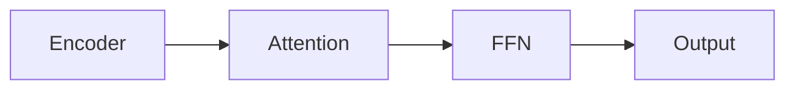
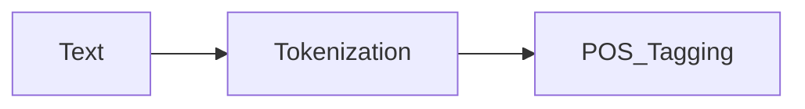
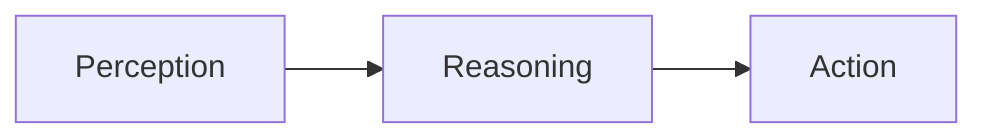

                 


# LLM在AI Agent语义网络构建中的应用

> 关键词：LLM、AI Agent、语义网络、自然语言处理、知识图谱、大语言模型

> 摘要：本文探讨了大语言模型（LLM）在AI Agent语义网络构建中的应用。首先介绍了LLM和AI Agent的基本概念，分析了语义网络在智能系统中的重要性。接着深入探讨了LLM的原理与技术细节，包括模型结构与训练方法。随后，详细讲解了语义网络的构建过程，包括数据预处理、模型训练和语义推理。最后，通过项目实战，展示了如何利用LLM构建高效的AI Agent语义网络，并讨论了系统的优化与部署策略。

---

## 第1章: LLM与AI Agent语义网络概述

### 1.1 LLM的定义与特点

#### 1.1.1 大语言模型的定义
大语言模型（LLM）是一种基于深度学习的自然语言处理模型，通常采用Transformer架构，能够处理和生成人类语言。LLM的核心在于其强大的上下文理解和生成能力，能够进行复杂的语义分析和推理。

**公式：**
$$LLM = \text{Transformer}(input\_text)$$

#### 1.1.2 LLM的核心特点
- **大规模训练数据：** LLM通常使用海量的语料库进行训练，能够学习到丰富的语言模式。
- **自注意力机制：** 通过自注意力机制，模型可以捕捉到输入文本中的长距离依赖关系。
- **多任务学习能力：** LLM可以通过微调适应多种NLP任务，如文本生成、问答系统等。

#### 1.1.3 LLM与传统NLP模型的区别
| 特性      | LLM                     | 传统NLP模型               |
|-----------|--------------------------|---------------------------|
| 模型结构   | 基于Transformer架构      | 基于RNN或CNN               |
| 训练数据   | 大规模多样化语料库       | 较小规模特定任务数据       |
| 应用能力   | 支持多种任务，无需微调    | 需要针对特定任务进行调整    |

### 1.2 AI Agent的定义与分类

#### 1.2.1 AI Agent的基本概念
AI Agent（人工智能代理）是指能够感知环境并采取行动以实现目标的智能实体。AI Agent可以是软件程序或物理设备，通过与环境交互来完成特定任务。

**公式：**
$$AI\ Agent = \text{感知} \times \text{推理} \times \text{行动}$$

#### 1.2.2 AI Agent的主要分类
| 类型       | 描述                       | 示例                       |
|------------|----------------------------|---------------------------|
| 感知型     | 专注于感知环境信息           | 智能音箱                   |
| 推理型     | 专注于推理和决策             | 问答系统                   |
| 执行型     | 专注于执行具体任务           | 自动化机器人               |

#### 1.2.3 AI Agent的应用场景
- **智能对话系统：** 如智能客服、虚拟助手。
- **自然语言理解：** 如文本分类、情感分析。
- **复杂任务处理：** 如自动驾驶、智能监控。

### 1.3 语义网络的概念与作用

#### 1.3.1 语义网络的基本定义
语义网络是一种知识表示方法，通过节点和边来表示概念及其关系。节点代表实体或概念，边代表它们之间的关系。

**Mermaid图表：**


#### 1.3.2 语义网络在AI Agent中的作用
语义网络为AI Agent提供了知识表示和推理的基础，帮助其更好地理解和处理复杂的信息。

#### 1.3.3 语义网络与知识图谱的区别
| 属性       | 语义网络                 | 知识图谱                 |
|------------|--------------------------|--------------------------|
| 表示方式     | 主要使用节点和边         | 包括节点、边和属性         |
| 应用场景     | 小型知识表示             | 大规模知识整合           |
| 复杂度       | 较低                     | 较高                     |

---

## 第2章: LLM的原理与技术细节

### 2.1 LLM的模型结构

#### 2.1.1 Transformer模型的基本结构
Transformer模型由编码器和解码器组成，编码器负责将输入序列编码为向量，解码器负责将编码向量解码为输出序列。

**Mermaid图表：**


#### 2.1.2 多层感知机与注意力机制
注意力机制帮助模型关注输入序列中的重要部分，提升语义理解能力。

**公式：**
$$\text{Attention}(Q, K, V) = \text{softmax}\left(\frac{QK^T}{\sqrt{d_k}}\right)V$$

---

## 第3章: 语义网络的构建

### 3.1 数据预处理

#### 3.1.1 分词与标注
将文本数据进行分词处理，并标注词性、实体等信息。

**Mermaid图表：**


#### 3.1.2 数据清洗与归一化
去除噪声数据，统一数据格式。

---

## 第4章: AI Agent的体系结构

### 4.1 系统架构设计

#### 4.1.1 分层架构
AI Agent通常采用分层架构，包括感知层、推理层和执行层。

**Mermaid图表：**


---

## 第5章: 项目实战

### 5.1 环境安装

```bash
pip install transformers
pip install torch
pip install mermaid
```

### 5.2 核心代码实现

```python
import torch
from transformers import AutoTokenizer, AutoModelForMaskedLM

model_name = "bert-base-uncased"
tokenizer = AutoTokenizer.from_pretrained(model_name)
model = AutoModelForMaskedLM.from_pretrained(model_name)

def semantic_networkconstruction():
    # 数据预处理
    text = "The cat sits on the mat."
    tokens = tokenizer.tokenize(text)
    # 语义分析
    model.eval()
    with torch.no_grad():
        outputs = model(torch.tensor([tokenizer.convert_tokens_to_ids(tokens)]))
        last_hidden_states = outputs.last_hidden_state
    # 返回语义向量
    return last_hidden_states

semantic_networkconstruction()
```

---

## 第6章: 总结与展望

### 6.1 总结
本文详细探讨了LLM在AI Agent语义网络构建中的应用，从基本概念到技术细节，再到项目实战，为读者提供了全面的指导。

### 6.2 展望
未来，随着LLM技术的不断发展，AI Agent的语义网络构建将更加高效和智能，应用场景也将更加广泛。

---

通过以上内容，读者可以系统地了解LLM在AI Agent语义网络构建中的应用，从理论到实践，逐步掌握相关技术和方法。

