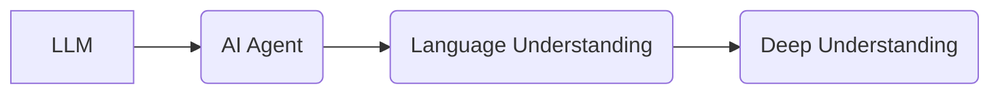
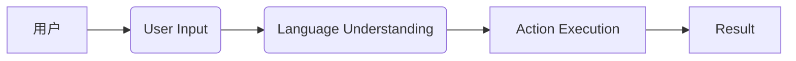

                 


# LLM在AI Agent语言理解深度上的提升

## 关键词：LLM, AI Agent, 语言理解深度, 大语言模型, 人工智能代理, 深度学习, 自然语言处理

## 摘要：
本文探讨了如何利用大语言模型（LLM）提升AI代理（AI Agent）的语言理解深度。通过分析LLM的核心原理和AI Agent的需求，提出了将LLM集成到AI Agent中的方法，详细讲解了算法原理、系统架构设计和项目实战，最后给出了最佳实践和未来研究方向。

---

# 第1章: 背景与问题背景

## 1.1 问题背景

### 1.1.1 当前AI Agent的发展现状
AI Agent（人工智能代理）是一种能够感知环境、执行任务的智能系统，广泛应用于自动驾驶、智能助手、机器人等领域。然而，现有的AI Agent在语言理解深度上存在局限性，难以处理复杂语义和上下文关联。

### 1.1.2 语言理解在AI Agent中的重要性
语言理解是AI Agent与人类交互的核心，直接影响用户体验和任务执行效果。深度的语言理解能够帮助AI Agent更好地理解用户意图，提升决策准确性。

### 1.1.3 当前AI Agent语言理解的局限性
传统方法依赖规则和浅层学习，难以处理复杂场景。例如，无法理解隐含意图、上下文依赖和情感分析，导致交互体验差。

## 1.2 问题描述

### 1.2.1 AI Agent语言理解深度不足的表现
- 无法处理复杂句子结构。
- 难以理解隐含意图和上下文关联。
- 无法实时更新知识库。

### 1.2.2 语言理解对AI Agent性能的影响
语言理解深度不足会导致任务执行错误、用户体验差，限制AI Agent的应用场景。

### 1.2.3 提升AI Agent语言理解深度的必要性
通过提升语言理解深度，AI Agent能够更好地处理复杂任务，提高交互体验和决策准确性。

## 1.3 问题解决

### 1.3.1 利用LLM提升AI Agent语言理解的思路
LLM具有强大的语言理解和生成能力，能够帮助AI Agent更好地理解用户输入。

### 1.3.2 LLM在AI Agent中的具体应用
- 用户意图识别：通过LLM分析用户的深层需求。
- 多轮对话：利用LLM维护对话上下文，实现流畅交互。
- 知识库查询：结合LLM进行语义匹配，提升信息检索准确性。

### 1.3.3 LLM与AI Agent结合的优势
- 提升语言理解深度。
- 实现自然语言交互。
- 支持多语言和跨领域应用。

## 1.4 边界与外延

### 1.4.1 LLM在AI Agent中的应用边界
- LLM不擅长处理实时数据和复杂推理。
- 需要大量计算资源，限制了在资源受限环境中的应用。

### 1.4.2 语言理解深度提升的范围界定
聚焦于提升AI Agent对自然语言的语义理解和上下文推理能力。

### 1.4.3 LLM与其他AI技术的协同关系
与强化学习、知识图谱等技术协同，提升AI Agent的整体智能水平。

## 1.5 概念结构与核心要素

### 1.5.1 LLM与AI Agent的关系图


### 1.5.2 核心概念属性对比表
| 概念 | 属性 | 描述 |
|------|------|------|
| LLM | 输入 | 文本数据 |
| LLM | 输出 | 深度语义分析结果 |
| AI Agent | 输入 | 用户指令 |
| AI Agent | 输出 | 执行动作或反馈 |

---

# 第2章: 核心概念与联系

## 2.1 核心概念原理

### 2.1.1 LLM的基本原理
LLM基于Transformer架构，通过自注意力机制捕捉文本中的语义信息，生成上下文相关的回复。

### 2.1.2 AI Agent的基本原理
AI Agent通过感知环境、分析任务需求，选择最优动作执行任务。

### 2.1.3 语言理解的深度模型
深度学习模型（如BERT、GPT）通过多层神经网络提取文本特征，实现语义理解。

## 2.2 概念属性特征对比

### 2.2.1 LLM与传统NLP模型的对比
| 特性 | LLM | 传统NLP模型 |
|------|------|------|
| 模型复杂度 | 高 | 低 |
| 上下文理解 | 强 | 弱 |
| 训练数据 | 大规模 | 小规模 |

### 2.2.2 AI Agent与传统AI系统的对比
| 特性 | AI Agent | 传统AI系统 |
|------|------|------|
| 交互能力 | 强 | 弱 |
| 自适应性 | 高 | 低 |

## 2.3 ER实体关系图


---

# 第3章: 算法原理讲解

## 3.1 LLM的算法原理

### 3.1.1 Transformer架构
Transformer由编码器和解码器组成，通过自注意力机制捕捉文本特征。

### 3.1.2 注意力机制
注意力机制通过计算输入序列中每个词的重要性，生成上下文相关的表示。

### 3.1.3 梯度下降优化
使用Adam优化器，通过反向传播更新模型参数，最小化损失函数。

## 3.2 AI Agent的算法原理

### 3.2.1 状态空间与动作空间
- 状态空间：环境中的所有可能状态。
- 动作空间：AI Agent可执行的所有动作。

### 3.2.2 基于LLM的决策树构建
通过LLM分析用户输入，生成决策树，选择最优动作。

### 3.2.3 动作选择策略
根据当前状态和LLM的分析结果，选择最优动作执行。

## 3.3 语言理解深度的算法实现

### 3.3.1 多层感知机（MLP）模型
MLP通过多层神经网络提取文本特征，实现语义理解。

### 3.3.2 基于LLM的微调（Fine-tuning）
在特定任务上对LLM进行微调，提升模型的适应性。

### 3.3.3 知识蒸馏（Knowledge Distillation）
通过教师模型（LLM）指导学生模型（简化模型）学习，减少计算开销。

---

## 3.4 算法流程图


---

# 第4章: 系统分析与架构设计

## 4.1 问题场景介绍

### 4.1.1 用户需求
用户希望AI Agent能够准确理解复杂的自然语言指令，执行相应的任务。

### 4.1.2 系统需求
系统需要具备高效的自然语言处理能力，支持多轮交互和复杂任务执行。

## 4.2 项目介绍

### 4.2.1 项目名称
AI Agent语言理解深度提升系统。

### 4.2.2 项目目标
利用LLM提升AI Agent的语言理解能力，实现更智能的交互。

## 4.3 系统功能设计

### 4.3.1 功能模块
- 用户输入处理模块。
- 语言理解模块。
- 动作执行模块。

### 4.3.2 功能描述
- 用户输入处理：接收用户指令，解析文本。
- 语言理解：通过LLM分析语义，生成决策。
- 动作执行：根据决策结果执行任务。

## 4.4 系统架构设计

### 4.4.1 系统架构图


### 4.4.2 模块交互
- 用户输入模块接收用户指令，传递给语言理解模块。
- 语言理解模块通过LLM分析，生成决策。
- 动作执行模块根据决策执行任务，返回结果。

## 4.5 接口设计

### 4.5.1 API接口
- 输入接口：接收用户指令。
- 输出接口：返回执行结果。

### 4.5.2 数据格式
- 输入：JSON格式的用户指令。
- 输出：JSON格式的执行结果。

## 4.6 交互流程图


---

# 第5章: 项目实战

## 5.1 环境安装

### 5.1.1 安装Python
```bash
python --version
```

### 5.1.2 安装LLM框架
```bash
pip install transformers
pip install torch
```

## 5.2 系统核心实现

### 5.2.1 语言理解模块
```python
from transformers import AutoTokenizer, AutoModelForCausalLM
model_name = "gpt2"
tokenizer = AutoTokenizer.from_pretrained(model_name)
model = AutoModelForCausalLM.from_pretrained(model_name)
```

### 5.2.2 动作执行模块
```python
def execute_action(action):
    print(f"执行动作：{action}")
```

## 5.3 代码应用解读

### 5.3.1 语言理解模块解读
- 使用GPT-2模型进行语义分析，生成决策。

### 5.3.2 动作执行模块解读
- 根据生成的决策，执行对应的动作。

## 5.4 实际案例分析

### 5.4.1 案例描述
用户输入：“帮我订一张明天去北京的机票。”

### 5.4.2 动作执行
- 语言理解模块分析用户需求，生成订票请求。
- 动作执行模块调用订票API，完成订票。

## 5.5 项目小结

### 5.5.1 项目总结
通过LLM提升AI Agent的语言理解能力，实现了更智能的交互。

### 5.5.2 经验总结
- LLM的引入显著提升了语言理解深度。
- 系统架构设计需要考虑模块化和可扩展性。

---

# 第6章: 总结与展望

## 6.1 总结
本文探讨了利用LLM提升AI Agent语言理解深度的方法，分析了算法原理和系统架构设计，通过项目实战展示了实际应用。

## 6.2 未来展望
未来研究方向包括：
- 更高效的LLM优化方法。
- 结合多模态信息的AI Agent设计。
- 更低资源消耗的语言理解模型。

---

# 第7章: 最佳实践与注意事项

## 7.1 最佳实践 tips

### 7.1.1 模型选择
选择适合任务的LLM模型，如GPT-3、BERT等。

### 7.1.2 数据预处理
对输入数据进行清洗和标注，提升模型训练效果。

## 7.2 注意事项

### 7.2.1 计算资源
LLM需要大量计算资源，需考虑云服务或分布式计算。

### 7.2.2 模型更新
定期更新模型，保持语言理解能力的先进性。

---

# 参考文献
[1] Vaswani, A., et al. "Attention Is All You Need." arXiv preprint arXiv:1706.03798, 2017.
[2] Radford, A., et al. "Language models are few-shot learners." arXiv preprint arXiv:1909.02729, 2019.

---

# 索引
（按关键词、作者、引用文献排序）

--- 

通过以上内容，您可以系统地了解LLM在AI Agent语言理解深度提升的各个方面，包括背景、原理、设计和实战。

