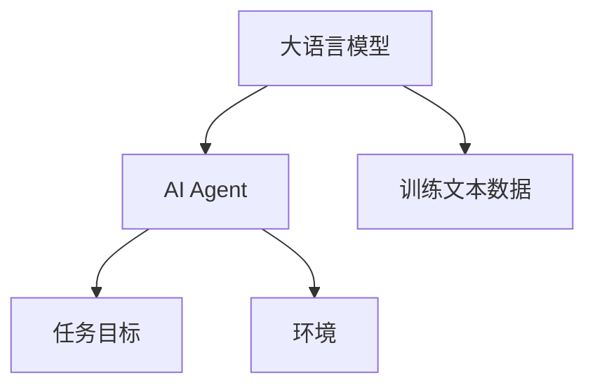
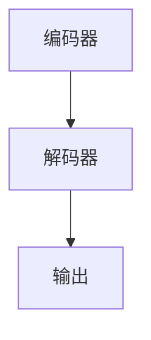
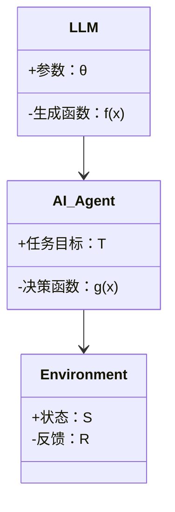
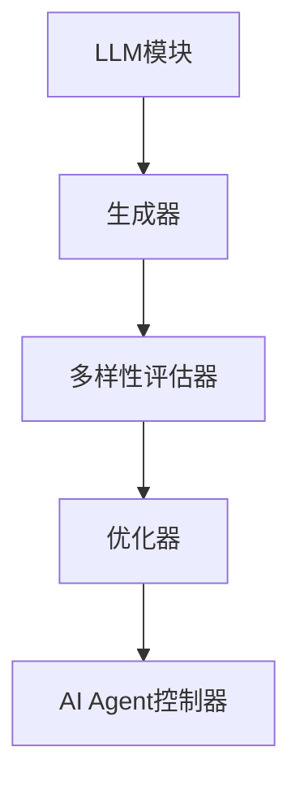

                 


# LLM在AI Agent语言生成多样性上的优化

> **关键词**：大语言模型、AI Agent、语言生成多样性、优化算法、系统架构

> **摘要**：本文探讨了如何优化大语言模型（LLM）在AI Agent中的语言生成多样性，通过分析背景、核心概念、算法原理、系统架构以及实际案例，提出了一套完整的优化方案，为相关领域的研究和应用提供了理论和实践指导。

---

## 第1章: LLM与AI Agent概述

### 1.1 LLM的基本概念

#### 1.1.1 大语言模型的定义
大语言模型（Large Language Models, LLMs）是指基于深度学习技术构建的、具有大规模参数的自然语言处理模型。这些模型通常使用Transformer架构，通过大量的文本数据进行预训练，能够理解和生成多种语言的自然文本。

#### 1.1.2 LLM的核心特点
- **大规模参数**：通常拥有 billions（十亿）级别的参数，如GPT-3、GPT-4等。
- **多任务能力**：通过微调可以适应多种NLP任务，如文本生成、机器翻译、问答系统等。
- **上下文理解**：能够处理长上下文，生成连贯的文本。

#### 1.1.3 LLM与传统NLP模型的区别
传统的NLP模型（如SVM、CRF等）依赖于特征工程，而LLM通过端到端的深度学习，能够自动学习复杂的语言特征，尤其是在生成任务中表现出色。

### 1.2 AI Agent的基本概念

#### 1.2.1 AI Agent的定义
AI Agent（智能体）是指在环境中能够感知并自主行动以实现目标的实体。它可以是一个软件程序，也可以是物理机器人，通过与环境交互，完成特定任务。

#### 1.2.2 AI Agent的核心功能
- **感知环境**：通过传感器或API获取环境信息。
- **决策制定**：基于感知信息，选择最优行动方案。
- **执行行动**：通过执行器或API与环境交互。

#### 1.2.3 AI Agent与传统程序的区别
AI Agent具有自主性、反应性和目标导向性，能够动态适应环境变化，而传统程序通常基于固定的规则执行任务。

---

## 第2章: 语言生成多样性的重要性

### 2.1 语言生成多样性的定义
语言生成多样性指的是生成系统能够输出多种不同但同样合理和连贯的文本结果。多样性是生成模型能力的重要衡量指标，能够提升用户体验和任务灵活性。

### 2.2 生成多样性在AI Agent中的作用
- **提升用户体验**：多样化的回复使用户感受到更智能和个性化的服务。
- **增强任务适应性**：在不同场景下，多样化的生成能力能够更好地满足任务需求。
- **避免生成偏差**：多样性有助于减少模型生成内容的单一性和偏差。

### 2.3 当前LLM在生成多样性上的挑战
- **训练数据限制**：模型可能受到训练数据的影响，生成内容不够多样化。
- **生成策略限制**：传统的生成策略可能难以有效控制生成多样性。
- **评估指标不足**：缺乏有效的评估指标来量化生成多样性。

---

## 第3章: LLM与AI Agent的关系

### 3.1 LLM作为AI Agent的语言生成模块
LLM作为AI Agent的语言生成模块，负责将AI Agent的决策转化为自然语言文本，或者直接处理用户的自然语言输入。

### 3.2 AI Agent对LLM生成多样性的影响
AI Agent的任务需求会直接影响LLM的生成策略。例如，一个问答型AI Agent可能需要在生成答案时注重准确性和相关性，而一个对话型AI Agent则需要注重流畅性和多样性。

### 3.3 LLM与AI Agent的协同优化
通过将LLM与AI Agent的决策模块结合，可以实现生成内容的多样性和高质量。例如，AI Agent可以根据上下文选择不同的生成策略，而LLM则根据这些策略生成相应的文本。

---

## 第4章: 核心概念对比与ER实体关系图

### 4.1 LLM与AI Agent的核心概念对比
以下是LLM与AI Agent的核心概念对比表格：

| **属性**      | **LLM**                     | **AI Agent**              |
|----------------|-----------------------------|---------------------------|
| 核心功能       | 生成和理解语言文本           | 感知环境并自主行动         |
| 依赖条件       | 大规模语言数据              | 环境信息和任务目标         |
| 输出形式       | 文本、翻译、摘要等           | 行动、决策、反馈           |

### 4.2 ER实体关系图（Mermaid）



---

## 第5章: LLM的训练与优化

### 5.1 LLM的预训练过程
预训练是通过大量未标注文本数据进行模型参数的初始化，通常采用自监督学习，目标是让模型预测下一个词或填补缺失的词。

### 5.2 LLM的微调策略
微调是通过特定任务的标注数据对模型进行进一步训练，使模型适应具体应用场景的需求。例如，针对对话生成任务，可以使用对话数据对模型进行微调。

### 5.3 基于LLM的生成算法原理

#### 5.3.1 解码策略（Mermaid流程图）



#### 5.3.2 多样性评估指标（数学公式）

生成多样性的评估指标之一是困惑度（Perplexity），公式如下：

$$ \text{Perplexity} = -\frac{1}{N}\sum_{i=1}^{N}\log P(w_i) $$

其中，$N$是生成文本的长度，$P(w_i)$是第$i$个词的概率。

---

## 第6章: 生成多样性优化算法

### 6.1 基于奖励的生成优化
通过定义奖励函数，对生成的文本进行打分，然后利用强化学习方法优化生成策略。例如，使用REINFORCE算法：

$$ \nabla \theta \leftarrow \sum_{t} r_t \nabla \log p_\theta(a_t) $$

其中，$\theta$是模型参数，$r_t$是第$t$步的奖励，$a_t$是生成动作。

### 6.2 基于对抗训练的生成优化
通过引入判别器，生成器和判别器交替训练，使生成器生成的文本更难被判别器识别为假样本。判别器的目标函数为：

$$ \mathcal{L}_D = \mathbb{E}_{x\sim P_{\text{真实}}}[f(x)] - \mathbb{E}_{x\sim P_{\text{生成}}}[f(x)] $$

### 6.3 基于层次化生成的多样性优化
将生成过程分解为多个层次，例如全局规划和局部生成。通过在高层进行多样化的规划，生成多样的文本。

---

## 第7章: 系统分析与架构设计方案

### 7.1 问题场景与系统功能设计

#### 7.1.1 领域模型类图（Mermaid）



#### 7.1.2 系统架构设计（Mermaid）



#### 7.1.3 系统接口设计
- **LLM模块接口**：`generate(text: str, params: dict) -> str`
- **多样性评估器接口**：`evaluate(text: str, diversity_level: int) -> float`

---

## 第8章: 项目实战

### 8.1 环境安装
安装必要的Python库：

```bash
pip install transformers numpy
```

### 8.2 核心代码实现

#### 8.2.1 LLM微调代码

```python
from transformers import AutoTokenizer, AutoModelForCausalLM
import torch

# 加载预训练模型
model = AutoModelForCausalLM.from_pretrained('gpt2')
tokenizer = AutoTokenizer.from_pretrained('gpt2')

# 微调训练
optimizer = torch.optim.Adam(model.parameters(), lr=1e-5)
criterion = torch.nn.CrossEntropyLoss()

# 训练循环
for epoch in range(num_epochs):
    for batch in train_loader:
        inputs, labels = batch
        outputs = model(inputs.input_ids, labels=inputs.labels)
        loss = criterion(outputs.logits, inputs.labels)
        optimizer.zero_grad()
        loss.backward()
        optimizer.step()
```

#### 8.2.2 多样性评估代码

```python
def calculate_diversity(text_sequences):
    perplexity = 0
    for seq in text_sequences:
        prob = model.generate(seq)
        perplexity += -torch.mean(torch.log(prob))
    return perplexity / len(text_sequences)
```

### 8.3 实际案例分析
通过实际案例分析，展示如何在AI Agent中应用优化后的LLM生成多样化的语言文本。

---

## 第9章: 最佳实践与小结

### 9.1 最佳实践
- 定期更新训练数据，保持生成内容的多样性和相关性。
- 在生成过程中结合上下文和任务目标，动态调整生成策略。
- 使用多种评估指标综合衡量生成多样性。

### 9.2 小结
本文详细探讨了LLM在AI Agent语言生成多样性上的优化方法，从算法原理到系统架构，再到实际案例，为相关研究和应用提供了全面的指导。

### 9.3 注意事项
- 生成多样性不应以牺牲准确性为代价。
- 在实际应用中，需要根据具体需求调整优化策略。

### 9.4 拓展阅读
建议读者进一步阅读相关领域的最新论文和书籍，深入了解生成多样性优化的前沿技术。

---

# 结语

通过本文的探讨，我们深入分析了LLM在AI Agent中的应用，并提出了优化生成多样性的具体方法。希望本文能够为相关领域的研究和实践提供有价值的参考。

