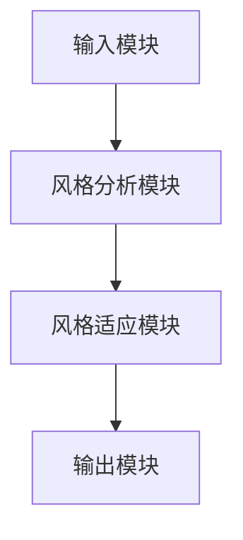

                 


# LLM在AI Agent语言风格适应中的应用

> 关键词：LLM，AI Agent，语言风格适应，自然语言处理，人工智能

> 摘要：本文深入探讨了大语言模型（LLM）在AI Agent中的语言风格适应应用。从LLM的基本概念到AI Agent的功能，再到语言风格适应的背景、技术实现和系统架构，详细分析了LLM在语言风格适应中的核心作用，并通过实际案例展示了如何实现一个基于LLM的AI Agent语言风格适应系统。最后，本文还总结了最佳实践和未来发展方向。

---

# 第1章 LLM与AI Agent概述

## 1.1 LLM的基本概念

### 1.1.1 大语言模型的定义
大语言模型（Large Language Model，LLM）是指经过训练的深度学习模型，能够理解和生成人类语言。LLM通常基于Transformer架构，通过大量数据训练而成，具备强大的上下文理解和生成能力。

### 1.1.2 LLM的核心特点
- **大规模数据训练**：LLM使用海量文本数据进行训练，能够捕捉语言的多样性和复杂性。
- **自注意力机制**：通过自注意力机制，模型可以理解文本中的长距离依赖关系。
- **生成与理解能力**：LLM不仅能够生成文本，还能进行问答、摘要、翻译等多种任务。

### 1.1.3 LLM与传统NLP模型的区别
传统的NLP模型通常针对特定任务训练，如词性标注或句法分析。而LLM是通用模型，能够在多种任务中发挥作用，具有更强的泛化能力。

## 1.2 AI Agent的基本概念

### 1.2.1 AI Agent的定义
AI Agent（人工智能代理）是指能够感知环境并采取行动以实现目标的智能体。AI Agent可以是软件程序，也可以是物理机器人，通过与用户或环境交互，完成特定任务。

### 1.2.2 AI Agent的核心功能
- **感知环境**：通过传感器或用户输入获取信息。
- **决策与推理**：基于获取的信息进行推理和决策。
- **执行动作**：根据决策结果执行相应动作，如生成文本、操作设备等。

### 1.2.3 AI Agent的应用场景
- **智能助手**：如Siri、Alexa等，帮助用户完成日常任务。
- **客户服务**：用于自动化客户服务，解答用户问题。
- **教育辅助**：为学生提供个性化的学习建议。

## 1.3 LLM在AI Agent中的作用

### 1.3.1 LLM如何赋能AI Agent
- **自然语言处理**：LLM为AI Agent提供了强大的自然语言理解与生成能力。
- **多任务处理**：LLM能够处理多种任务，如问答、翻译、情感分析等。
- **实时交互**：LLM支持实时对话，使AI Agent能够进行动态交互。

### 1.3.2 LLM在AI Agent语言风格适应中的应用
- **个性化交互**：根据用户偏好调整语言风格。
- **上下文理解**：根据对话历史生成合适的回应。
- **风格多样性**：支持多种语言风格，如正式、非正式、友好、严肃等。

### 1.3.3 LLM与AI Agent结合的优势
- **灵活性**：LLM能够快速适应不同场景和用户需求。
- **高效性**：LLM的处理速度较快，适合实时交互。
- **智能性**：通过LLM的强大能力，AI Agent能够提供更智能的服务。

## 1.4 本章小结
本章介绍了LLM和AI Agent的基本概念，并探讨了LLM在AI Agent中的作用。通过LLM的强大语言处理能力，AI Agent能够实现个性化的语言风格适应，为用户提供更优质的服务。

---

# 第2章 语言风格适应的背景与需求

## 2.1 语言风格适应的定义

### 2.1.1 语言风格的定义
语言风格指的是文本在表达时所采用的方式和语气，包括正式、非正式、友好、严肃等多种风格。

### 2.1.2 语言风格适应的定义
语言风格适应是指根据不同的场景、用户偏好或上下文，动态调整文本的语言风格，使其更符合特定需求。

### 2.1.3 语言风格适应的重要性
- **提升用户体验**：根据用户偏好调整语言风格，提升用户的满意度。
- **增强交互效果**：通过合适的语言风格，增强人机交互的效果。
- **适应不同场景**：在不同场景下，使用不同的语言风格，提高AI Agent的适用性。

## 2.2 不同场景下的语言风格需求

### 2.2.1 商业场景中的语言风格需求
- **正式风格**：适用于商务沟通，如邮件、合同等。
- **友好风格**：适用于客户服务，增强客户信任感。
- **简洁风格**：适用于快速信息传递，如短信通知。

### 2.2.2 教育场景中的语言风格需求
- **正式风格**：适用于学术论文、研究报告。
- **简洁风格**：适用于知识点讲解，帮助学生快速理解。
- **鼓励风格**：适用于激励学生，增强学习动力。

### 2.2.3 娱乐场景中的语言风格需求
- **幽默风格**：适用于娱乐内容，增加趣味性。
- **个性化风格**：根据用户喜好，调整娱乐内容的语言风格。

## 2.3 AI Agent语言风格适应的挑战

### 2.3.1 语言风格多样性的挑战
- **风格多样性**：需要支持多种语言风格，模型需要具备灵活的风格切换能力。
- **风格一致性**：在动态调整风格时，需保持内容的连贯性和一致性。

### 2.3.2 不同用户偏好的挑战
- **个性化需求**：每个用户可能有不同的语言风格偏好，需要进行个性化调整。
- **偏好变化**：用户的偏好可能随时间变化，需要实时捕捉并适应。

### 2.3.3 实时适应的挑战
- **实时响应**：需要在用户交互过程中实时调整语言风格，这对模型的处理速度提出了高要求。
- **上下文依赖**：语言风格的调整需要依赖对话历史和当前上下文，增加了复杂性。

## 2.4 本章小结
本章探讨了语言风格适应的背景和不同场景下的语言风格需求，并分析了AI Agent在语言风格适应过程中面临的挑战。理解这些背景和挑战，有助于我们更好地设计和实现适应性强的AI Agent。

---

# 第3章 LLM的语言风格分析技术

## 3.1 语言风格分析的基本原理

### 3.1.1 文本特征提取
- **词汇特征**：通过分析文本中的词汇使用频率，判断语言风格。
- **句法特征**：通过分析句子的结构和复杂性，判断语言风格。
- **语义特征**：通过分析文本的主题和情感倾向，判断语言风格。

### 3.1.2 风格分类算法
- **传统机器学习算法**：如支持向量机（SVM）、随机森林（Random Forest）等。
- **深度学习算法**：如卷积神经网络（CNN）、循环神经网络（RNN）等。
- **预训练模型微调**：如BERT、GPT等模型的微调。

### 3.1.3 风格分析的评估指标
- **准确率（Accuracy）**：分类正确的样本数占总样本数的比例。
- **精确率（Precision）**：分类结果中正确样本数占总预测为正样本数的比例。
- **召回率（Recall）**：分类结果中正确样本数占总实际为正样本数的比例。
- **F1值（F1 Score）**：精确率和召回率的调和平均数。

## 3.2 基于LLM的风格分析方法

### 3.2.1 基于Transformer的风格分析
- **模型结构**：Transformer模型通过自注意力机制捕捉文本的长距离依赖关系。
- **训练目标**：通过风格标签的监督学习，训练模型识别语言风格。

### 3.2.2 基于BERT的风格分析
- **预训练目标**：BERT通过掩码任务和下句预测任务进行预训练。
- **微调任务**：在特定风格分析任务上进行微调，提升模型性能。

### 3.2.3 基于GPT的风格分析
- **生成机制**：GPT通过生成式模型，根据上下文生成合适的文本。
- **风格控制**：通过调整生成策略，控制生成文本的语言风格。

## 3.3 风格分析的实现细节

### 3.3.1 数据预处理
- **数据清洗**：去除噪音数据，如特殊符号、停用词等。
- **数据标注**：为每个文本样本标注语言风格。
- **数据划分**：将数据划分为训练集、验证集和测试集。

### 3.3.2 模型训练
- **训练数据**：使用标注好的语言风格数据进行训练。
- **训练参数**：调整学习率、批量大小、训练轮数等参数，优化模型性能。
- **模型评估**：通过准确率、F1值等指标评估模型的风格分析能力。

### 3.3.3 模型调优
- **超参数调优**：通过网格搜索或随机搜索，找到最优的模型参数。
- **数据增强**：通过数据增强技术，增加训练数据的多样性。
- **模型集成**：通过集成多个模型的结果，提升整体性能。

## 3.4 本章小结
本章详细介绍了语言风格分析的基本原理和基于LLM的风格分析方法。通过有效的数据预处理和模型训练，可以实现高性能的语言风格分析。

---

# 第4章 基于LLM的AI Agent语言风格适应策略

## 4.1 语言风格适应的基本策略

### 4.1.1 预设风格库的构建
- **风格分类**：将语言风格分为若干类别，如正式、非正式、友好、严肃等。
- **风格模板**：为每个风格类别设计模板，指导生成文本的风格。

### 4.1.2 用户偏好分析
- **用户画像**：根据用户的行为数据和偏好数据，构建用户画像。
- **风格偏好预测**：通过用户画像，预测用户的语言风格偏好。

### 4.1.3 实时反馈调整
- **实时监测**：通过实时监测用户反馈，调整语言风格。
- **动态调整**：根据反馈结果，动态调整生成文本的语言风格。

## 4.2 基于LLM的风格生成方法

### 4.2.1 基于模板的风格生成
- **模板设计**：为每个语言风格设计模板，指导生成文本的结构和用词。
- **模板应用**：根据当前需要的风格，选择合适的模板生成文本。

### 4.2.2 基于Prompt的风格生成
- **Prompt设计**：设计提示词（Prompt），指导模型生成特定风格的文本。
- **Prompt调优**：通过实验，找到最优的Prompt，提升生成效果。

### 4.2.3 基于微调的风格生成
- **微调任务**：在特定风格生成任务上对模型进行微调。
- **风格适应**：通过微调，使模型适应特定的语言风格。

## 4.3 风格适应的优化策略

### 4.3.1 多模态信息融合
- **多模态数据**：结合文本、语音、图像等多种模态数据，提升语言风格适应的准确性。
- **多模态模型**：使用多模态模型，综合分析多种数据，生成更合适的语言风格。

### 4.3.2 风格迁移技术
- **风格迁移定义**：将一种风格的文本转换为另一种风格的文本。
- **风格迁移方法**：使用预训练模型进行风格迁移，如基于BERT的风格迁移。

### 4.3.3 实时反馈机制
- **实时反馈收集**：通过用户反馈，实时调整语言风格。
- **反馈分析**：分析用户反馈，优化生成策略。

## 4.4 本章小结
本章探讨了基于LLM的AI Agent语言风格适应策略，包括预设风格库的构建、用户偏好分析、实时反馈调整等方法。通过这些方法，可以实现灵活、高效的语言风格适应。

---

# 第5章 AI Agent语言风格适应的系统架构

## 5.1 系统架构概述

### 5.1.1 系统模块划分
- **输入模块**：接收用户输入，解析需求。
- **风格分析模块**：分析用户输入的语言风格。
- **风格适应模块**：根据分析结果，生成适应风格的文本。
- **输出模块**：将生成的文本输出给用户。

### 5.1.2 模块之间的交互关系
- **输入模块与风格分析模块**：输入模块将用户输入传递给风格分析模块。
- **风格分析模块与风格适应模块**：风格分析模块将分析结果传递给风格适应模块。
- **风格适应模块与输出模块**：风格适应模块将生成的文本传递给输出模块。

### 5.1.3 系统的可扩展性
- **模块化设计**：各个模块相对独立，便于扩展和维护。
- **接口设计**：通过标准化接口，方便与其他系统集成。

## 5.2 系统功能设计

### 5.2.1 领域模型设计
- **领域模型定义**：定义系统的功能模块及其关系。
- **领域模型图**：使用Mermaid图展示系统功能模块之间的关系。



### 5.2.2 系统架构设计
- **分层架构**：将系统分为数据层、业务逻辑层和表现层。
- **组件化设计**：将系统划分为可复用的组件，便于扩展和维护。

### 5.2.3 系统交互设计
- **交互流程**：用户输入 -> 风格分析 -> 风格适应 -> 文本输出。
- **交互界面**：设计友好的用户界面，提升用户体验。

## 5.3 系统实现细节

### 5.3.1 环境安装
- **编程语言**：Python 3.8+
- **深度学习框架**：TensorFlow或PyTorch
- **LLM模型**：如GPT-3、BERT等。

### 5.3.2 核心实现代码

```python
def analyze_style(text):
    # 语言风格分析代码
    pass

def adapt_style(style, text):
    # 风格适应代码
    pass

def generate_response(style, text):
    # 根据风格生成响应
    pass
```

### 5.3.3 代码解读与分析
- **analyze_style函数**：接收文本输入，返回语言风格分析结果。
- **adapt_style函数**：根据分析结果，调整文本的风格。
- **generate_response函数**：根据调整后的风格，生成响应文本。

## 5.4 本章小结
本章详细介绍了AI Agent语言风格适应系统的架构设计和实现细节，为实际应用提供了参考。

---

# 第6章 项目实战：基于LLM的AI Agent语言风格适应系统

## 6.1 项目背景与目标

### 6.1.1 项目背景
- **需求背景**：用户希望AI Agent能够根据不同的场景和用户偏好，动态调整语言风格。
- **项目目标**：开发一个基于LLM的AI Agent语言风格适应系统，实现个性化交互。

## 6.2 系统实现

### 6.2.1 系统核心功能
- **语言风格分析**：分析用户输入的语言风格。
- **语言风格适应**：根据分析结果，生成适应风格的文本。
- **实时交互**：支持用户与AI Agent的实时对话。

### 6.2.2 核心代码实现

```python
import transformers

def analyze_style(text):
    model = transformers.AutoModelForTokenClassification.from_pretrained("bert-base")
    tokenizer = transformers.AutoTokenizer.from_pretrained("bert-base")
    inputs = tokenizer(text, return_tensors="np")
    outputs = model(**inputs)
    # 获取风格分析结果
    return outputs

def adapt_style(style, text):
    # 使用GPT生成适应风格的文本
    model = transformers.AutoModelForCausalLM.from_pretrained("gpt2")
    tokenizer = transformers.AutoTokenizer.from_pretrained("gpt2")
    inputs = tokenizer(style + text, return_tensors="pt")
    outputs = model.generate(inputs.input_ids)
    return tokenizer.decode(outputs[0], skip_special_tokens=True)

def generate_response(style, text):
    response = adapt_style(style, text)
    return response
```

### 6.2.3 代码解读
- **analyze_style函数**：使用BERT模型进行语言风格分析。
- **adapt_style函数**：使用GPT模型生成适应风格的文本。
- **generate_response函数**：调用analyze_style和adapt_style函数，生成最终的响应文本。

## 6.3 项目测试与优化

### 6.3.1 测试方案
- **单元测试**：测试每个功能模块的独立性。
- **集成测试**：测试系统整体功能。
- **用户测试**：邀请用户进行测试，收集反馈。

### 6.3.2 性能优化
- **模型优化**：通过模型剪枝、蒸馏等技术，提升模型性能。
- **算法优化**：优化算法复杂度，提升处理速度。

## 6.4 项目总结

### 6.4.1 项目成果
- **系统实现**：成功开发了一个基于LLM的AI Agent语言风格适应系统。
- **技术突破**：实现了语言风格分析和适应的核心功能。

### 6.4.2 项目经验
- **技术经验**：掌握了基于LLM的语言风格分析和生成技术。
- **项目管理经验**：了解了从需求分析到系统实现的完整流程。

## 6.5 本章小结
本章通过一个实际项目，详细展示了基于LLM的AI Agent语言风格适应系统的开发过程，包括系统设计、核心代码实现和项目测试与优化。

---

# 第7章 总结与展望

## 7.1 本章总结
本文深入探讨了LLM在AI Agent语言风格适应中的应用，从理论到实践，详细分析了语言风格适应的背景、技术实现和系统架构。通过实际项目，展示了如何实现一个基于LLM的AI Agent语言风格适应系统。

## 7.2 未来展望
- **技术发展**：随着LLM技术的不断进步，AI Agent的语言风格适应能力将越来越强。
- **应用场景扩展**：语言风格适应技术将在更多领域得到应用，如教育、医疗、金融等。
- **多模态融合**：未来的AI Agent将更加注重多模态信息的融合，提升语言风格适应的准确性和效果。

## 7.3 最佳实践Tips
- **数据质量**：语言风格适应的效果很大程度上依赖于数据质量，需要确保训练数据的多样性和代表性。
- **模型选择**：根据具体需求选择合适的模型，如需要生成文本，可以选择GPT类模型；需要进行风格分析，可以选择BERT类模型。
- **用户反馈**：实时收集用户反馈，动态调整语言风格，提升用户体验。

## 7.4 注意事项
- **隐私保护**：在处理用户数据时，需要注意隐私保护，遵守相关法律法规。
- **模型调优**：模型调优是提升性能的关键，需要耐心和细致地调整参数和优化策略。
- **系统维护**：系统上线后，需要进行定期维护和更新，确保系统的稳定性和安全性。

## 7.5 拓展阅读
- **推荐书籍**：《Deep Learning》、《自然语言处理入门》。
- **推荐论文**：关注最新的自然语言处理和生成技术，如最近的Transformers相关论文。

## 7.6 本章小结
本文总结了LLM在AI Agent语言风格适应中的应用，并展望了未来的发展方向。通过本文的分析和实践，读者可以更好地理解和应用相关技术，为实际项目提供参考。

---

# 结语

随着人工智能技术的不断进步，LLM在AI Agent中的应用将越来越广泛。语言风格适应作为人机交互的重要组成部分，将为用户提供更加个性化的服务。通过本文的探讨，我们希望能够为相关领域的研究和实践提供有价值的参考。未来，随着技术的进一步发展，AI Agent的语言风格适应能力将更加智能化和个性化，为人类社会带来更多的便利和价值。

--- 

以上是完整的文章结构和内容，涵盖了从理论到实践的各个方面，确保读者能够全面理解LLM在AI Agent语言风格适应中的应用。

