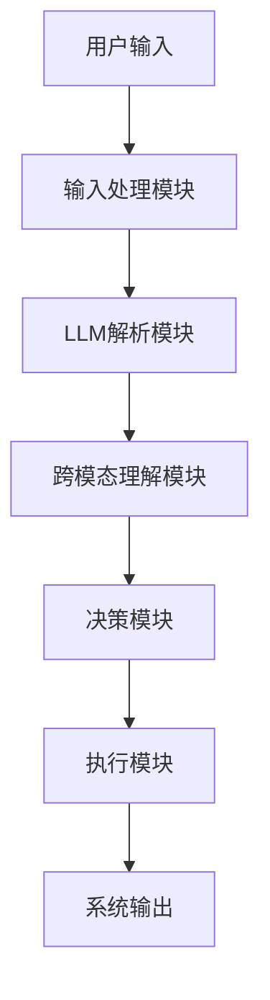

                 


# LLM在AI Agent跨模态理解中的应用

## 关键词：LLM, AI Agent, 跨模态理解, 自然语言处理, 多模态数据

## 摘要

随着人工智能技术的飞速发展，大语言模型（LLM）在AI Agent中的应用日益广泛。本文深入探讨了LLM在跨模态理解中的作用，详细介绍了LLM与AI Agent的基本概念、核心算法、系统架构设计以及实际应用场景。通过具体的项目案例，展示了如何将LLM应用于多模态数据的处理和理解，帮助AI Agent实现更智能的决策和交互。本文还讨论了跨模态理解的技术挑战和未来发展方向，为相关领域的研究和实践提供了有价值的参考。

---

## 第1章: LLM与AI Agent的基本概念

### 1.1 LLM的定义与特点

#### 1.1.1 大语言模型的定义
大语言模型（LLM）是一种基于深度学习的自然语言处理模型，通常使用 transformer 架构，通过大量的文本数据进行预训练，具备强大的语言理解和生成能力。

#### 1.1.2 LLM的核心特点
- **大规模预训练**：LLM通过海量数据的预训练，掌握了广泛的知识和语言规律。
- **上下文理解**：能够理解上下文关系，进行推理和对话。
- **多语言支持**：支持多种语言的处理和生成。
- **动态适应性**：可以根据输入内容动态调整输出，适应不同的应用场景。

#### 1.1.3 LLM与传统NLP模型的区别
传统的NLP模型通常针对特定任务（如分类、翻译）进行训练，而LLM是通用模型，适用于多种任务，且性能更优。

### 1.2 AI Agent的定义与特点

#### 1.2.1 AI Agent的基本概念
AI Agent是一种智能实体，能够感知环境、理解用户需求，并通过执行任务来满足这些需求。它可以是一个软件程序，也可以是一个物理设备。

#### 1.2.2 AI Agent的核心功能
- **感知环境**：通过传感器或数据接口获取信息。
- **理解需求**：解析用户的意图和目标。
- **决策与执行**：基于理解和推理做出决策，并执行任务。
- **自适应性**：能够根据环境变化调整行为。

#### 1.2.3 AI Agent与传统软件的区别
传统软件依赖于固定的规则和逻辑，而AI Agent具备学习和自适应能力，能够处理复杂和不确定的任务。

### 1.3 跨模态理解的定义与应用场景

#### 1.3.1 跨模态理解的定义
跨模态理解是指在同一任务中同时处理和理解多种类型的数据（如文本、图像、语音等），并实现信息的融合和协同。

#### 1.3.2 跨模态理解的主要应用场景
- **多模态问答系统**：结合文本和图像信息回答问题。
- **智能助手**：整合文本、语音和视觉信息提供服务。
- **自动驾驶**：融合视觉、雷达和GPS数据进行决策。

#### 1.3.3 跨模态理解的技术挑战
- **数据异构性**：不同模态的数据形式和语义差异大。
- **信息融合难度**：如何有效地将多种模态信息结合起来。
- **计算资源需求**：跨模态处理通常需要强大的计算能力。

---

## 第2章: LLM在AI Agent中的作用

### 2.1 LLM作为AI Agent的核心驱动力

#### 2.1.1 LLM在自然语言处理中的优势
- **强大的语言理解能力**：能够处理复杂的文本信息。
- **生成能力**：可以生成自然流畅的文本，用于对话和解释。

#### 2.1.2 LLM在跨模态理解中的应用潜力
- **文本与图像的协同理解**：LLM可以分析图像内容并生成描述性文本。
- **语音与视觉的结合**：LLM可以处理语音指令并结合视觉信息进行操作。
- **多模态对话**：支持同时处理文本、语音和图像的对话系统。

#### 2.1.3 LLM如何赋能AI Agent的智能决策
通过跨模态理解，LLM可以帮助AI Agent更好地理解用户需求，结合多源信息做出更准确的决策。

### 2.2 LLM与AI Agent的协同工作原理

#### 2.2.1 LLM作为AI Agent的“大脑”
LLM负责理解和生成语言信息，为AI Agent提供决策支持。

#### 2.2.2 AI Agent作为LLM的“执行者”
AI Agent根据LLM的指令，执行具体任务，如调用API、操作设备等。

#### 2.2.3 LLM与AI Agent的协作流程
1. AI Agent接收用户的输入（如语音或文本）。
2. LLM解析输入，理解用户意图。
3. LLM生成指令或解释，指导AI Agent执行任务。
4. AI Agent执行任务并返回结果。
5. LLM将结果反馈给用户，或进一步优化指令。

### 2.3 跨模态理解在AI Agent中的具体应用

#### 2.3.1 文本与图像的跨模态理解
- **图像描述生成**：AI Agent接收图像后，通过LLM生成描述性文本。
- **图像搜索与识别**：结合文本查询和图像识别技术，提供更精准的结果。

#### 2.3.2 声音与视频的跨模态理解
- **语音识别与翻译**：结合LLM进行语音识别和多语言翻译。
- **视频内容理解**：通过LLM分析视频内容，生成摘要或标签。

#### 2.3.3 多模态数据融合的挑战与解决方案
- **数据对齐**：不同模态的数据需要在语义上对齐。
- **特征提取**：提取各模态的特征并进行融合。
- **模型训练**：设计多模态模型，联合优化各模态的表示。

---

## 第3章: 跨模态理解的核心算法与模型

### 3.1 跨模态理解的主要算法

#### 3.1.1 多模态编码器（MM Encoder）
- **功能**：将多种模态的数据转换为统一的表示形式。
- **实现**：可以使用多层感知机或自注意力机制进行编码。

#### 3.1.2 多模态解码器（MM Decoder）
- **功能**：将统一的表示解码为特定模态的输出。
- **实现**：可以采用生成对抗网络（GAN）或变分自编码器（VAE）。

#### 3.1.3 对比学习（Contrastive Learning）
- **功能**：通过对比不同模态的数据，学习它们之间的关联性。
- **实现**：使用对比损失函数，优化数据的相似性。

### 3.2 基于LLM的跨模态理解模型

#### 3.2.1 LLM在跨模态理解中的适应性改造
- **微调**：在特定任务上对LLM进行微调，增强其跨模态理解能力。
- **多模态提示（Prompt）**：设计多模态提示，指导LLM处理不同模态的数据。

#### 3.2.2 LLM与多模态数据的融合方法
- **早期融合**：在特征提取阶段进行模态融合。
- **晚期融合**：在高层语义表示阶段进行模态融合。

#### 3.2.3 基于LLM的跨模态理解的优势
- **通用性**：LLM适用于多种跨模态任务。
- **可解释性**：LLM的处理过程相对透明，便于解释。

### 3.3 跨模态理解的数学模型

#### 3.3.1 多模态数据表示的数学公式
$$ x = \{x_1, x_2, ..., x_n\} $$
其中，$x_i$表示不同模态的数据。

#### 3.3.2 跨模态注意力机制的数学模型
$$ \alpha_i = \frac{\exp(s_i)}{\sum_{j} \exp(s_j)} $$
其中，$s_i$表示第i个模态的注意力得分。

#### 3.3.3 跨模态融合的数学框架
$$ y = f(x_1, x_2, ..., x_n) $$
其中，$f$表示融合函数，$y$表示融合后的输出。

---

## 第4章: AI Agent的系统架构与设计

### 4.1 AI Agent的系统架构

#### 4.1.1 AI Agent的基本架构
```
+----------------+     +----------------+
|  用户输入      |     |  系统输出      |
|  (文本/语音/图像)|     |  (文本/语音/图像)|
+----------------+     +----------------+
          |                   ^
          |                   |
+----------------+     +----------------+
|  LLM处理模块   |     |  执行模块      |
|                |     |  (API调用/设备控制)|
+----------------+     +----------------+
          |                   ^
          |                   |
+----------------+     +----------------+
|  跨模态理解模块 |     |  决策模块      |
|                |     |  (任务规划)    |
+----------------+     +----------------+
```

#### 4.1.2 基于LLM的AI Agent架构
- **输入处理**：接收多模态输入并解析。
- **LLM解析**：通过LLM理解用户需求。
- **决策与执行**：基于LLM的解析结果，决策并执行任务。

#### 4.1.3 跨模态理解模块的设计
- **数据输入**：接收多种模态的数据。
- **模态处理**：对每种模态数据进行预处理。
- **融合与理解**：将模态数据进行融合，生成统一的语义表示。

### 4.2 跨模态理解模块的系统设计

#### 4.2.1 模块功能划分
- **文本处理模块**：负责文本的解析和生成。
- **图像处理模块**：负责图像的识别和分析。
- **融合模块**：将文本和图像信息进行融合。

#### 4.2.2 模块之间的数据流设计
1. 用户输入多种模态数据。
2. 各模态数据分别处理。
3. 融合模块将处理后的数据进行融合。
4. LLM解析融合后的数据，生成指令。
5. AI Agent执行指令并返回结果。

#### 4.2.3 模块的交互协作
- **协同工作**：各模块协同完成跨模态任务。
- **动态调整**：根据任务需求动态调整处理流程。

### 4.3 跨模态理解的系统架构图



---

## 第5章: 项目实战

### 5.1 项目背景与目标

#### 5.1.1 项目背景
设计一个基于LLM的多模态智能助手，实现文本、图像和语音的跨模态理解与交互。

#### 5.1.2 项目目标
- 实现多模态数据的输入与解析。
- 构建跨模态理解模块，实现多模态数据的融合与分析。
- 设计AI Agent，根据理解结果执行任务。

### 5.2 环境安装与配置

#### 5.2.1 环境安装
- **Python 3.8+**
- **TensorFlow/PyTorch**
- **Hugging Face Transformers库**
- **其他依赖库**（如图像处理库、语音处理库）

#### 5.2.2 配置说明
- 安装必要的Python包。
- 配置开发环境（如Jupyter Notebook、IDE）。

### 5.3 核心实现代码

#### 5.3.1 跨模态数据处理代码

```python
import torch
from transformers import AutoTokenizer, AutoModelForSeq2Seq
import cv2

def process_image(image_path):
    # 图像处理代码
    img = cv2.imread(image_path)
    return img

def process_text(text):
    # 文本处理代码
    return text

def multimodal_process(image_path, text):
    image = process_image(image_path)
    processed_text = process_text(text)
    return image, processed_text
```

#### 5.3.2 融合与理解代码

```python
def multimodal_fuse(image, text):
    # 融合图像和文本信息
    # 这里可以使用模型进行融合
    pass

def llm_inference(processed_input):
    # 调用LLM进行解析
    pass

def main():
    image_path = "input/image.jpg"
    text = "please describe the image"
    image, processed_text = multimodal_process(image_path, text)
    fused_input = multimodal_fuse(image, processed_text)
    result = llm_inference(fused_input)
    print(result)

if __name__ == "__main__":
    main()
```

#### 5.3.3 AI Agent执行代码

```python
def execute_task(task):
    # 根据任务执行操作
    pass

def agent_main():
    task = llm_parse("please take a photo of the room")
    execute_task(task)
    print("Task completed")

agent_main()
```

### 5.4 案例分析与实现解读

#### 5.4.1 案例分析
设计一个多模态智能助手，能够接收用户的语音指令和图像输入，完成拍照任务。

#### 5.4.2 实现解读
- **语音指令解析**：通过语音识别技术将语音转换为文本。
- **图像识别**：分析图像内容，理解用户需求。
- **任务执行**：根据解析结果，调用拍照设备完成任务。

### 5.5 项目小结

通过本项目，我们实现了基于LLM的多模态智能助手，展示了跨模态理解在实际应用中的潜力。项目的成功实施依赖于各模块的协同工作和高效的数据处理能力。

---

## 第6章: 最佳实践与总结

### 6.1 最佳实践

#### 6.1.1 数据处理
- 确保数据的多样性和高质量。
- 对数据进行预处理，减少噪声。

#### 6.1.2 模型优化
- 根据具体任务调整模型参数。
- 使用迁移学习，提高模型的泛化能力。

#### 6.1.3 系统设计
- 设计清晰的模块划分，便于维护和扩展。
- 使用高效的通信机制，确保模块之间的高效交互。

### 6.2 小结

本文系统地探讨了LLM在AI Agent跨模态理解中的应用，从基本概念到算法原理，再到系统设计和项目实战，全面介绍了相关技术和实现方法。通过具体的项目案例，展示了跨模态理解在实际应用中的巨大潜力。

### 6.3 注意事项

- 在实际应用中，需注意数据隐私和安全问题。
- 跨模态理解模型的训练需要大量的计算资源，需做好硬件支持。
- 模型的可解释性和透明度是用户信任的重要因素。

### 6.4 拓展阅读

- 《Large Language Models in AI Agent Design》
- 《Cross-Modal Understanding in Computer Vision and NLP》
- 《Multi-modal Fusion Networks for Complex Tasks》

---

通过本文的详细阐述，读者可以全面了解LLM在AI Agent跨模态理解中的应用，并掌握相关的技术细节和实现方法。希望本文能为相关领域的研究和实践提供有价值的参考。

