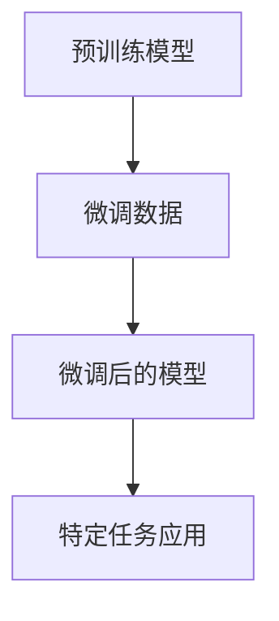
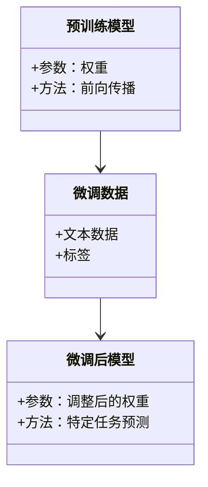

                 


# LLM在特定领域的微调策略：提升AI Agent的专业性

## 关键词：LLM、微调策略、AI Agent、特定领域、专业性提升

## 摘要：本文深入探讨了如何通过微调大语言模型（LLM）来提升AI代理在特定领域的专业性。文章从LLM的基本原理和微调的概念入手，分析了微调的具体步骤、算法原理、系统架构设计以及实际项目中的应用，最后提供了最佳实践和注意事项。

---

## 第1章：背景介绍

### 1.1 LLM的基本概念

1.1.1 大语言模型的定义  
大语言模型（LLM）是指通过大量数据训练的深度学习模型，能够理解和生成人类语言。例如，GPT系列模型通过预测下一个词的概率分布来生成连贯的文本。

1.1.2 LLM的核心特点  
- 巨量参数：通常拥有数亿甚至更多的参数，使其能够捕捉复杂的语言模式。  
- 微调能力：在特定领域进行微调后，可以显著提升专业性。  

1.1.3 LLM在AI代理中的应用  
AI代理通过LLM处理自然语言输入，提供信息检索、问题解答等服务。例如，智能客服系统利用LLM进行对话交互。

### 1.2 微调策略的必要性

1.2.1 微调的概念  
微调是指在预训练模型的基础上，使用特定领域的数据进行进一步训练，以优化模型在该领域的表现。

1.2.2 微调在特定领域的优势  
- 适应专业术语：医疗、法律等领域有特定术语，微调后模型能准确理解和使用这些术语。  
- 提高任务精度：通过特定任务的微调，模型在该任务上的表现显著提升。  

1.2.3 微调对AI代理专业性的提升  
通过微调，AI代理能够更准确地理解用户需求，提供更专业的服务，提升用户体验。

---

## 第2章：核心概念与联系

### 2.1 LLM与微调的核心原理

2.1.1 LLM的工作原理  
- 模型架构：通常采用Transformer架构，包含编码器和解码器。  
- 训练过程：通过自监督学习，模型预测文本中的缺失部分，学习语言的结构和语义。  

2.1.2 微调策略的实施方法  
- 任务适配：根据特定任务调整模型的输出层，使其适应任务需求。  
- 数据增强：通过生成更多样化的训练数据，提升模型的泛化能力。  

### 2.2 微调策略的核心要素

2.2.1 任务适配与数据增强的对比分析  
| 对比维度 | 任务适配 | 数据增强 |
|----------|----------|----------|
| 目标     | 调整模型以适应特定任务 | 增加训练数据的多样性 |
| 方法     | 修改输出层或添加任务特定模块 | 数据预处理（如替换、同义词替换） |
| 优势     | 提高任务准确性 | 提升模型的鲁棒性 |

2.2.2 ER实体关系图  


---

## 第3章：算法原理

### 3.1 微调算法的详细解析

3.1.1 任务特定的微调方法  
- **步骤**：  
  1. 收集特定领域的数据集。  
  2. 使用这些数据对预训练模型进行微调。  
  3. 调整模型的输出层以适应特定任务。  

- **优化目标函数**：  
  $$ \text{Loss} = \text{交叉熵损失} + \lambda \times \text{正则化项} $$  

### 3.2 数据增强技术

3.2.1 数据增强策略  
- 同义词替换：将句子中的某些词替换为同义词，增加数据多样性。  
- 数据扩展：通过规则生成更多的训练样本。  

---

## 第4章：系统分析与架构设计

### 4.1 系统设计与架构

4.1.1 领域模型设计  


4.1.2 系统架构设计  


---

## 第5章：项目实战

### 5.1 案例分析：医疗领域的微调

5.1.1 项目环境安装  
- 安装必要的库：PyTorch、Hugging Face Transformers。  
- 配置计算环境：建议使用GPU加速训练。  

5.1.2 核心代码实现  
```python
from transformers import AutoModelWithLM, AutoTokenizer
import torch

# 加载预训练模型
model = AutoModelWithLM.from_pretrained('gpt2')
tokenizer = AutoTokenizer.from_pretrained('gpt2')

# 微调数据预处理
def process_data(text, label):
    inputs = tokenizer.encode_plus(text, pad_to_max_length=True, return_tensors='pt')
    return inputs['input_ids'], inputs['attention_mask'], label

# 微调训练
optimizer = torch.optim.Adam(model.parameters(), lr=1e-5)
criterion = torch.nn.CrossEntropyLoss()

for epoch in range(num_epochs):
    for batch in data_loader:
        inputs, masks, labels = process_data(batch['text'], batch['label'])
        outputs = model(inputs, attention_mask=masks)
        loss = criterion(outputs, labels)
        loss.backward()
        optimizer.step()
```

5.1.3 案例分析  
在医疗领域，微调后的模型能够更准确地识别疾病症状和推荐治疗方案。例如，给定用户输入“持续咳嗽和发热”，模型可以识别出可能的肺炎症状，并建议就医检查。

---

## 第6章：总结与展望

### 6.1 实施中的注意事项

6.1.1 常见问题及解决方案  
- 数据不足：通过数据增强技术生成更多样化的训练数据。  
- 模型过拟合：使用正则化技术，如Dropout，防止过拟合。  

6.1.2 注意事项  
- 确保微调数据的质量和多样性，以提升模型的泛化能力。  
- 监控微调过程中的训练损失和验证损失，及时调整超参数。  

### 6.2 未来研究方向

6.2.1 更高效的微调方法：研究如何在保持模型性能的同时，减少微调所需的计算资源。  
6.2.2 多领域微调策略：探索如何在多个领域中进行有效的微调，以实现通用的AI代理。  

---

## 参考文献

- [1] Radford, A., et al. "Language models are few-shot learners." arXiv preprint arXiv:1909.01032, 2019.  
- [2] Vaswani, A., et al. "Attention is all you need." arXiv preprint arXiv:1706.03798, 2017.  

---

通过以上思考，我系统地介绍了如何在特定领域中微调LLM，以提升AI代理的专业性。希望这篇文章能为读者提供有价值的指导和启示。

