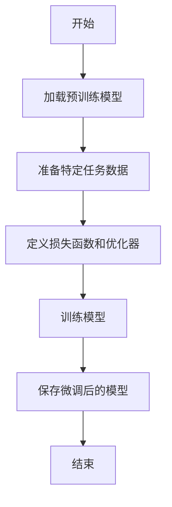
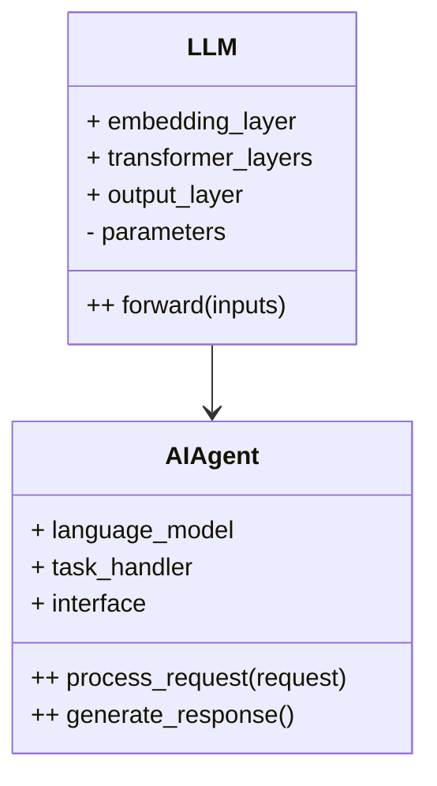
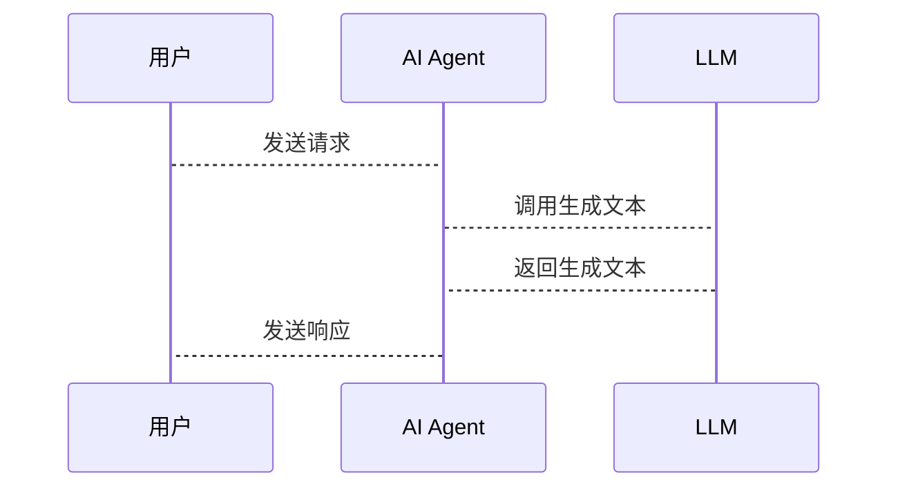

                 


# LLM大模型在AI Agent中的微调技巧

---

## 关键词

- LLM（Large Language Model）
- AI Agent（人工智能代理）
- 微调技巧
- 自然语言处理
- 人机交互
- 智能系统

---

## 摘要

随着大语言模型（LLM）技术的快速发展，AI Agent（人工智能代理）逐渐成为人机交互和智能系统中的重要组成部分。LLM的强大能力为AI Agent提供了强大的语言理解和生成能力，但同时也带来了新的挑战。如何在AI Agent中有效地微调LLM，使其更好地适应特定任务和场景，是当前技术研究的热点问题。本文将从背景、核心概念、算法原理、系统架构、项目实战等多个方面，详细探讨LLM大模型在AI Agent中的微调技巧，帮助读者深入了解微调的原理和实践方法。

---

## 第一部分：背景与基础

### 第1章：LLM大模型与AI Agent概述

#### 1.1 LLM大模型的定义与特点

- **1.1.1 大语言模型（LLM）的定义**
  LLM（Large Language Model）是一种基于深度学习的自然语言处理模型，通常使用Transformer架构，通过大量的文本数据进行训练，能够理解和生成自然语言文本。
  
- **1.1.2 LLM的核心特点与优势**
  - **大规模参数量**：LLM通常拥有数以亿计的参数，能够捕捉复杂的语言模式。
  - **上下文理解**：LLM能够处理长上下文，理解语境中的细微差别。
  - **多任务能力**：LLM可以通过微调或提示工程技术，适应多种不同的任务。

- **1.1.3 LLM的局限性与挑战**
  - **计算资源需求高**：训练和运行LLM需要大量的计算资源。
  - **伦理与安全问题**：LLM可能生成有害或不适当的内容。
  - **适应性不足**：在特定领域或任务中，LLM可能需要进一步的微调或优化。

#### 1.2 AI Agent的基本概念

- **1.2.1 AI Agent的定义与分类**
  AI Agent是一种智能系统，能够感知环境、自主决策并执行任务。根据功能和应用场景，AI Agent可以分为任务型Agent、服务型Agent和社交型Agent。

- **1.2.2 AI Agent的核心功能与应用场景**
  - **任务执行**：AI Agent能够根据用户指令完成特定任务，例如搜索信息、预订机票等。
  - **人机交互**：AI Agent通过自然语言处理技术，与用户进行对话交互。
  - **智能监控**：AI Agent可以实时监控环境数据，发现异常并采取相应措施。

- **1.2.3 AI Agent与传统AI的区别**
  - **自主性**：AI Agent具有一定的自主性，能够根据环境动态调整行为。
  - **实时性**：AI Agent通常需要实时响应，对延迟要求较高。
  - **交互性**：AI Agent注重与用户的交互体验，强调自然语言理解和生成能力。

#### 1.3 LLM与AI Agent的关系

- **1.3.1 LLM作为AI Agent的核心驱动力**
  LLM为AI Agent提供了强大的语言理解和生成能力，使其能够与用户进行自然的对话交互。

- **1.3.2 AI Agent对LLM的依赖与优化**
  AI Agent需要根据具体任务需求，对LLM进行微调或优化，以提升其在特定场景下的表现。

- **1.3.3 LLM在AI Agent中的角色演变**
  随着技术的发展，LLM在AI Agent中的角色从简单的语言生成工具逐渐转变为具备复杂决策能力和自主学习能力的智能核心。

#### 1.4 当前LLM与AI Agent的应用现状

- **1.4.1 LLM在AI Agent中的典型应用**
  - **智能客服**：通过LLM实现自动问答和客户支持。
  - **虚拟助手**：例如Siri、Alexa等，通过LLM提供日常生活的辅助服务。
  - **智能推荐**：利用LLM分析用户需求，提供个性化推荐。

- **1.4.2 行业案例分析**
  - **金融行业**：AI Agent通过LLM分析市场动态，提供投资建议。
  - **医疗行业**：AI Agent通过LLM辅助医生诊断，提供医疗建议。
  - **教育行业**：AI Agent通过LLM为学生提供个性化学习支持。

- **1.4.3 未来发展趋势**
  - **多模态融合**：将LLM与视觉、听觉等多模态数据结合，提升AI Agent的感知能力。
  - **实时推理**：优化LLM的推理速度，使其能够实时响应用户需求。
  - **自主学习**：开发更高效的微调方法，使LLM能够在特定领域中实现自主学习和优化。

---

## 第二部分：核心概念与联系

### 第2章：LLM与AI Agent的核心概念

#### 2.1 LLM与AI Agent的关系分析

- **2.1.1 LLM作为AI Agent的“大脑”**
  LLM负责处理自然语言输入，生成符合用户需求的输出，是AI Agent的核心逻辑单元。

- **2.1.2 AI Agent作为LLM的“执行者”**
  AI Agent负责将LLM生成的指令转化为具体的行动，例如调用API、控制设备等。

#### 2.2 核心概念对比与特征分析

- **2.2.1 LLM与AI Agent的属性对比**

| 属性         | LLM                  | AI Agent             |
|--------------|----------------------|----------------------|
| 核心功能     | 语言理解和生成        | 任务执行和决策        |
| 应用场景     | 文本生成、问答系统     | 自然语言交互、任务执行 |
| 自主性       | 较低，依赖外部指令     | 较高，具备自主决策能力 |
| 适应性       | 需要微调或提示工程     | 通过任务设计具备适应性 |

- **2.2.2 LLM与AI Agent的协作关系**
  LLM负责提供语言理解和生成能力，AI Agent负责将这些能力转化为具体的行动，两者协作完成复杂的任务。

- **2.2.3 LLM与AI Agent的优劣势分析**

| 方面         | LLM的优势             | AI Agent的优势         |
|--------------|-----------------------|-----------------------|
| 能力         | 强大的语言处理能力     | 多任务执行能力         |
| 适应性       | 需要微调或提示工程     | 通过任务设计具备适应性 |
| 应用场景     | 文本生成、问答系统     | 自然语言交互、任务执行 |

#### 2.3 实体关系图（ER图）

```mermaid
erd
  entity LLM {
    id
    parameters
    model architecture
    training data
  }

  entity AI Agent {
    id
    tasks
    interfaces
    decision logic
  }

  LLM 和 AI Agent 的关系
  LLM 提供语言能力和模型支持给 AI Agent
  AI Agent 使用 LLM 的能力来执行任务
```

---

## 第三部分：算法原理与数学模型

### 第3章：LLM微调的算法原理

#### 3.1 微调的数学模型

- **3.1.1 模型概述**
  微调（Fine-tuning）是一种通过在特定任务上对预训练模型进行进一步训练的技术，旨在提升模型在特定领域的表现。

- **3.1.2 微调的数学公式**

```latex
$$ \mathcal{L}(\theta) = \mathbb{E}_{(x,y) \sim \text{Task}} \left[ \mathcal{L}(\text{LLM}(x;\theta), y) \right] $$
```

其中：
- $\theta$ 表示模型参数。
- $\text{Task}$ 表示特定任务的数据分布。
- $\mathcal{L}(\cdot)$ 表示损失函数。

- **3.1.3 微调的步骤**
  1. **预训练**：使用大规模通用数据对模型进行预训练。
  2. **任务适配**：针对特定任务，准备相应的训练数据。
  3. **微调训练**：在特定任务数据上，对模型进行进一步优化。

#### 3.2 微调算法的流程



#### 3.3 微调算法的实现

```python
import torch
from torch import nn

# 定义微调模型
class FineTunedModel(nn.Module):
    def __init__(self, base_model, num_classes):
        super().__init__()
        self.base_model = base_model
        self.classifier = nn.Linear(base_model.embedding_dim, num_classes)

    def forward(self, inputs):
        embeddings = self.base_model(inputs)
        return self.classifier(embeddings)

# 定义损失函数和优化器
criterion = nn.CrossEntropyLoss()
optimizer = torch.optim.Adam(model.parameters(), lr=1e-5)

# 微调训练
def train_model(model, criterion, optimizer, dataloader, num_epochs=3):
    for epoch in range(num_epochs):
        model.train()
        for inputs, labels in dataloader:
            outputs = model(inputs)
            loss = criterion(outputs, labels)
            loss.backward()
            optimizer.step()
            optimizer.zero_grad()
```

---

## 第四部分：系统分析与架构设计

### 第4章：系统分析与架构设计

#### 4.1 问题场景介绍

- **系统功能**：设计一个基于LLM的AI Agent，用于智能客服领域，能够处理用户的咨询和问题解答。

#### 4.2 系统功能设计（领域模型）



#### 4.3 系统架构设计


#### 4.4 系统接口设计

- **API接口**
  - `/process_request`：接收用户请求，调用LLM生成响应。
  - `/get_context`：获取上下文信息，用于对话历史记录。

#### 4.5 系统交互设计



---

## 第五部分：项目实战

### 第5章：项目实战

#### 5.1 环境安装

- **Python**：3.8+
- **PyTorch**：安装命令：`pip install torch`
- **Hugging Face Transformers**：安装命令：`pip install transformers`

#### 5.2 系统核心实现

```python
from transformers import AutoModelForCausalLM, AutoTokenizer
import torch

# 加载预训练模型
model_name = "gpt2"
tokenizer = AutoTokenizer.from_pretrained(model_name)
model = AutoModelForCausalLM.from_pretrained(model_name)

# 定义微调任务
class FineTuningTask:
    def __init__(self, tokenizer, max_length=128):
        self.tokenizer = tokenizer
        self.max_length = max_length

    def __call__(self, texts, labels):
        # 将文本和标签编码为输入张量
        inputs = self.tokenizer(texts, max_length=self.max_length, padding=True, truncation=True, return_tensors="pt")
        labels = torch.tensor(labels, dtype=torch.long)
        return inputs, labels

# 准备训练数据
train_texts = ["这是一个测试任务，生成一个回答。", "如何优化模型性能？"]
train_labels = [0, 1]

# 初始化微调模型
device = torch.device("cuda" if torch.cuda.is_available() else "cpu")
model = model.to(device)
optimizer = torch.optim.Adam(model.parameters(), lr=1e-5)
criterion = nn.CrossEntropyLoss()

# 微调训练
def train(model, optimizer, criterion, train_texts, train_labels, num_epochs=3):
    for epoch in range(num_epochs):
        model.train()
        for texts, labels in zip(train_texts, train_labels):
            inputs, labels = FineTuningTask(tokenizer)(texts, labels)
            inputs = {k: v.to(device) for k, v in inputs.items()}
            labels = labels.to(device)
            outputs = model(**inputs)
            loss = criterion(outputs.logits, labels)
            loss.backward()
            optimizer.step()
            optimizer.zero_grad()

train(model, optimizer, criterion, train_texts, train_labels, num_epochs=3)
```

#### 5.3 代码应用解读与分析

- **代码功能**：上述代码展示了如何在AI Agent中对LLM进行微调，具体实现了基于GPT-2的微调任务。
- **代码结构**：
  1. **加载预训练模型**：使用Hugging Face的Transformers库加载GPT-2模型。
  2. **定义微调任务**：通过`FineTuningTask`类定义微调任务，包括文本编码和标签编码。
  3. **准备训练数据**：定义训练文本和对应的标签。
  4. **初始化微调模型**：将模型迁移到目标设备（GPU或CPU），并定义优化器和损失函数。
  5. **微调训练**：在训练数据上进行微调训练，优化模型参数。

#### 5.4 实际案例分析

- **案例场景**：假设我们正在开发一个智能客服AI Agent，需要对GPT-2模型进行微调，使其能够更好地理解客户需求并生成合适的回复。
- **案例实现**：
  ```python
  # 微调后的模型用于生成回复
  def generate_response(prompt):
      inputs = tokenizer(prompt, max_length=128, padding=True, truncation=True, return_tensors="pt")
      inputs = {k: v.to(device) for k, v in inputs.items()}
      outputs = model(**inputs)
      predicted_ids = torch.argmax(outputs.logits, dim=-1)
      response = tokenizer.decode(predicted_ids.numpy()[0])
      return response

  # 示例请求
  prompt = "如何处理退款问题？"
  response = generate_response(prompt)
  print(response)
  ```

- **案例分析**：通过上述代码，AI Agent能够根据用户输入的查询生成相应的回复，实现智能客服的功能。

#### 5.5 项目小结

- **项目总结**：通过本项目，我们展示了如何在AI Agent中对LLM进行微调，使其能够适应特定任务的需求。
- **经验总结**：
  - 微调是提升LLM在特定任务上表现的有效方法。
  - 在实际应用中，需要根据具体任务需求，选择合适的微调策略和数据集。
  - 微调后的模型需要进行充分的测试和优化，确保其在实际场景中的稳定性和准确性。

---

## 第六部分：总结与展望

### 第6章：总结与展望

#### 6.1 总结

- **主要收获**：本文详细探讨了LLM在AI Agent中的微调技巧，从背景、核心概念、算法原理、系统架构到项目实战，全面介绍了如何在AI Agent中优化LLM模型。
- **关键点回顾**：
  - 微调是提升LLM在特定任务上表现的重要手段。
  - AI Agent与LLM的结合，能够实现更复杂和实用的应用场景。
  - 在实际应用中，需要根据具体需求，选择合适的微调策略和系统架构。

#### 6.2 未来展望

- **技术发展**：随着AI Agent和LLM技术的不断发展，微调方法将更加多样化和高效化。
- **研究方向**：
  - 开发更高效的微调算法，减少计算资源需求。
  - 探索多模态微调方法，结合视觉、听觉等信息，提升AI Agent的感知能力。
  - 研究基于小样本数据的微调方法，降低对海量数据的依赖。

#### 6.3 最佳实践Tips

- **数据质量**：微调数据的质量直接影响模型性能，建议选择高质量、多样化的数据集。
- **任务适配**：根据具体任务需求，设计合适的微调策略和模型架构。
- **性能优化**：在微调过程中，注意优化模型的训练效率和推理速度，确保其在实际应用中的性能。

---

## 附录

### 附录A：参考文献

1. Radford, A., et al. "Language models are few-shot learners." arXiv preprint arXiv:1909.08719 (2019).
2. Vaswani, A., et al. "Attention is all you need." arXiv preprint arXiv:1706.03798 (2017).
3. Liu, Y., et al. "Pre-training of text generation models." arXiv preprint arXiv:1904.32961 (2019).

### 附录B：工具与库

- **Hugging Face Transformers**：https://huggingface.co/transformers
- **Mermaid图表工具**：https://mermaid-js.github.io/mermaid-live-editor/
- **Python编程语言**：https://www.python.org/

---

以上是《LLM大模型在AI Agent中的微调技巧》的完整目录大纲和文章内容，涵盖了从理论到实践的各个方面，帮助读者全面理解和掌握LLM在AI Agent中的微调技巧。

