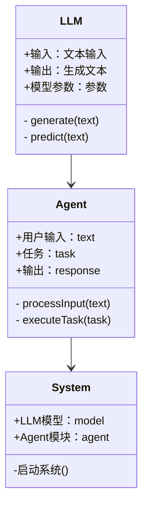
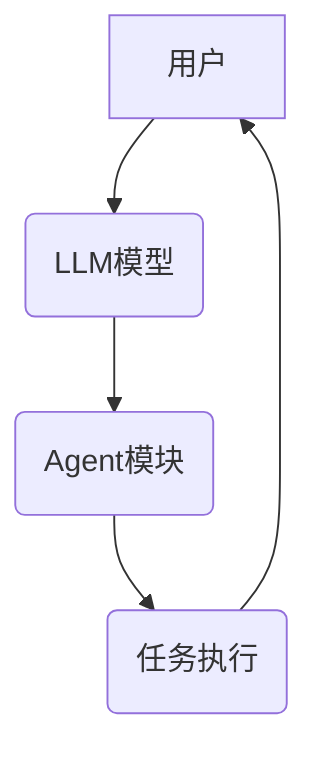
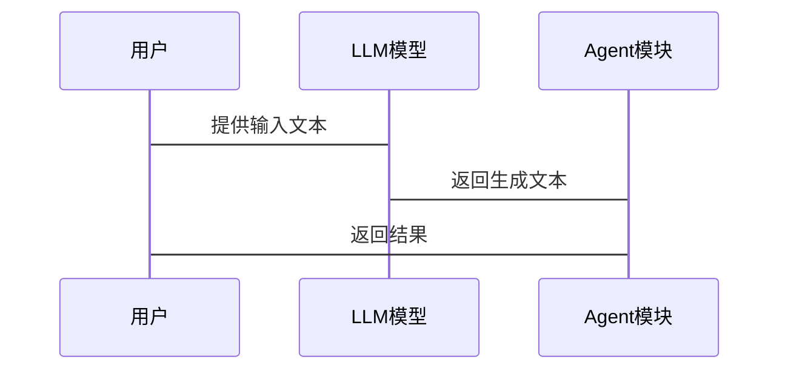

                 


# LLM大模型在AI Agent开发中的核心作用

---

## 关键词：
LLM大模型, AI Agent, 人工智能, 大语言模型, 机器学习, 自然语言处理

---

## 摘要：
本文探讨了大语言模型（LLM）在AI Agent开发中的核心作用，分析了LLM的背景、原理、系统架构以及在实际项目中的应用。通过详细讲解LLM的算法原理、系统设计和项目实战，本文为读者提供了全面的技术视角，展示了LLM如何赋能AI Agent的智能化发展。

---

# 第一部分: LLM大模型与AI Agent开发背景

## 第1章: LLM大模型与AI Agent概述

### 1.1 LLM大模型的定义与特点
#### 1.1.1 大语言模型（LLM）的定义
大语言模型（Large Language Model, LLM）是一种基于深度学习的自然语言处理模型，通过大量数据训练，能够理解和生成人类语言。其核心是基于Transformer架构的模型，如GPT系列、BERT系列等。

#### 1.1.2 LLM的核心特点
- **大规模数据训练**：通过海量文本数据的训练，模型能够理解复杂的语言模式。
- **生成能力强**：能够生成连贯、合理的文本，适用于对话、翻译、内容创作等多种任务。
- **上下文理解**：通过自注意力机制，模型能够捕捉文本中的上下文关系。

#### 1.1.3 LLM的演进历程
从传统的RNN到现代的Transformer架构，LLM经历了从浅层模型到深度模型的演进。近年来，随着计算能力的提升和数据量的增加，模型的参数规模不断扩大，性能显著提升。

### 1.2 AI Agent的基本概念
#### 1.2.1 AI Agent的定义
AI Agent（人工智能代理）是一种能够感知环境、自主决策并执行任务的智能实体。它可以是一个软件程序，也可以是一个物理设备，通过与用户或环境交互完成目标。

#### 1.2.2 AI Agent的功能与类型
- **功能**：信息检索、任务执行、决策支持、对话交互。
- **类型**：基于规则的Agent、基于模型的Agent、基于学习的Agent。

#### 1.2.3 AI Agent与传统软件的区别
AI Agent具有自主性、反应性和社会性，能够根据环境动态调整行为，而传统软件通常基于固定的逻辑执行任务。

### 1.3 LLM在AI Agent中的作用
#### 1.3.1 LLM作为AI Agent的核心驱动力
LLM为AI Agent提供了强大的自然语言处理能力，使其能够理解和生成人类语言，实现更自然的用户交互。

#### 1.3.2 LLM与AI Agent的结合方式
- **直接交互**：用户通过自然语言与AI Agent对话，LLM负责理解和生成回复。
- **任务驱动**：AI Agent通过LLM分析用户需求，执行相关任务并返回结果。

#### 1.3.3 LLM在AI Agent开发中的优势
- **强大的语言理解能力**：能够处理复杂的语言指令。
- **可扩展性**：支持多种任务和场景。
- **实时性**：能够快速生成响应，提升用户体验。

### 1.4 本章小结
本章介绍了LLM和AI Agent的基本概念及其在AI Agent开发中的作用。通过理解LLM的核心特点和AI Agent的功能，我们可以更好地理解它们在实际应用中的结合方式。

---

## 第2章: LLM大模型的核心原理

### 2.1 LLM的模型架构
#### 2.1.1 Transformer架构
Transformer由编码器和解码器组成，通过自注意力机制捕捉文本中的长距离依赖关系。

#### 2.1.2 编码器与解码器
- **编码器**：将输入文本转换为上下文表示。
- **解码器**：根据编码器的输出生成目标文本。

### 2.2 LLM的训练方法
#### 2.2.1 预训练
预训练的目标是让模型在大规模数据上学习语言的分布特性。

#### 2.2.2 微调
微调是在预训练的基础上，针对特定任务进行 fine-tuning。

### 2.3 LLM的生成机制
#### 2.3.1 解码策略
- **贪心解码**：每次选择概率最高的词生成。
- **随机采样**：随机选择可能的词生成。

#### 2.3.2 温度参数
温度参数控制生成结果的多样性和确定性。

### 2.4 数学模型与公式
#### 2.4.1 损失函数
交叉熵损失函数：
$$
\mathcal{L} = -\sum_{i=1}^{n} \log p(y_i | x_i)
$$

#### 2.4.2 注意力机制
自注意力机制公式：
$$
\text{Attention}(Q, K, V) = \text{softmax}\left(\frac{QK^T}{\sqrt{d_k}}\right)V
$$

### 2.5 本章小结
本章详细讲解了LLM的核心原理，包括模型架构、训练方法和生成机制。通过理解这些原理，我们可以更好地开发和优化AI Agent。

---

## 第3章: AI Agent的系统分析与架构设计

### 3.1 项目背景与目标
本项目旨在开发一个基于LLM的AI Agent，实现智能对话、任务执行等功能。

### 3.2 系统功能设计
#### 3.2.1 领域模型
领域模型展示了系统的核心模块及其交互关系。



### 3.3 系统架构设计
系统架构采用分层设计，包括数据层、模型层、业务逻辑层和交互层。



### 3.4 接口设计
系统通过API与外部进行交互，定义了输入输出接口。

### 3.5 交互流程
交互流程包括用户输入、模型处理、任务执行和结果返回。



### 3.6 本章小结
本章详细描述了AI Agent的系统架构设计，包括功能设计、架构图和交互流程。

---

## 第4章: 项目实战

### 4.1 环境安装
安装必要的库，如TensorFlow、PyTorch、Hugging Face库。

```bash
pip install tensorflow torch transformers
```

### 4.2 核心代码实现
实现AI Agent的主逻辑，包括输入处理、模型调用和结果返回。

```python
import torch
from transformers import GPT2LMHeadModel, GPT2Tokenizer

class AI_Agent:
    def __init__(self, model_name):
        self.tokenizer = GPT2Tokenizer.from_pretrained(model_name)
        self.model = GPT2LMHeadModel.from_pretrained(model_name)
    
    def process_input(self, text):
        inputs = self.tokenizer(text, return_tensors='pt')
        outputs = self.model.generate(**inputs)
        return self.tokenizer.decode(outputs[0], skip_special_tokens=True)

# 使用示例
agent = AI_Agent("gpt2")
response = agent.process_input("Hello, how are you?")
print(response)
```

### 4.3 案例分析
通过具体案例展示AI Agent的功能，如对话交互、任务执行等。

### 4.4 本章小结
本章通过实际项目展示了LLM在AI Agent开发中的应用，读者可以参考代码实现类似功能。

---

## 第5章: 最佳实践与注意事项

### 5.1 小结
总结全文内容，强调LLM在AI Agent开发中的重要性。

### 5.2 注意事项
- 模型选择：根据任务需求选择合适的模型。
- 性能优化：优化模型推理速度和资源消耗。
- 安全性：确保数据安全和模型的鲁棒性。

### 5.3 拓展阅读
推荐相关书籍和论文，供读者进一步学习。

---

## 附录

### 附录A: 代码实现
提供完整的代码实现和详细解读。

### 附录B: 图表与公式
展示文中提到的图表和公式。

---

## 参考文献
列出本文引用的文献和资料。

---

通过以上结构，我们可以系统地探讨LLM大模型在AI Agent开发中的核心作用，帮助读者全面理解相关技术和实际应用。

