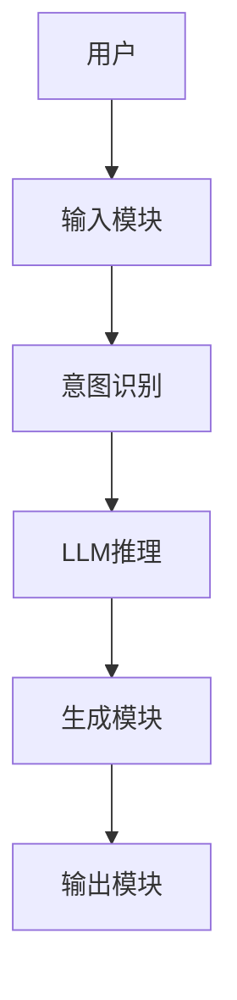

                 


# LLM大模型在AI Agent开发中的核心作用

> 关键词：LLM大模型，AI Agent，自然语言处理，知识整合，算法原理，系统架构，项目实战

> 摘要：随着大语言模型（LLM）的迅速发展，其在AI Agent开发中的作用日益凸显。本文从LLM的基本概念出发，详细探讨其在AI Agent中的核心功能，包括自然语言理解与生成、知识整合与推理、个性化与可定制性等方面。接着，深入分析LLM的算法原理，涵盖其数学模型和训练方法。随后，阐述AI Agent的系统架构设计，包括功能模块划分、系统接口设计和交互流程优化。最后，通过实际项目案例，展示LLM在AI Agent开发中的应用，并总结经验和未来趋势。

---

# 第一部分: LLM大模型与AI Agent开发基础

## 第1章: LLM大模型与AI Agent概述

### 1.1 LLM大模型的基本概念

#### 1.1.1 大语言模型（LLM）的定义
大语言模型（Large Language Model，LLM）是指基于深度学习技术构建的、具有大规模参数的自然语言处理模型。这些模型通常基于Transformer架构，能够处理长文本序列，并通过大量的训练数据学习语言的结构和语义。

#### 1.1.2 AI Agent的定义与特点
AI Agent（智能代理）是指能够在特定环境中感知状态、自主决策并执行任务的智能系统。AI Agent可以是软件程序，也可以是硬件设备，其核心目标是通过与环境的交互实现特定目标。

#### 1.1.3 LLM与AI Agent的关系
LLM作为AI Agent的重要组成部分，提供了自然语言处理能力，使得AI Agent能够理解和生成人类语言，从而更好地与人类用户交互，并在复杂的场景中执行任务。

### 1.2 LLM大模型的核心技术

#### 1.2.1 自然语言处理（NLP）基础
自然语言处理是LLM的核心技术，主要包括文本的分词、词性标注、句法分析、语义理解等任务。

#### 1.2.2 大模型的训练与优化
大模型的训练通常采用大规模数据集，并使用分布式训练和优化算法（如Adam、AdamW）来优化模型参数。

#### 1.2.3 多模态能力与扩展性
现代LLM不仅支持文本处理，还可以扩展到图像、语音等多种模态，具备多模态处理能力。

### 1.3 AI Agent的开发背景

#### 1.3.1 AI Agent的应用场景
AI Agent广泛应用于智能客服、智能助手、自动驾驶、智能推荐等领域。

#### 1.3.2 传统Agent与现代AI Agent的区别
传统Agent通常基于规则或简单机器学习模型，而现代AI Agent借助LLM具备更强的自然语言理解和生成能力。

#### 1.3.3 LLM对AI Agent开发的推动作用
LLM的引入显著提升了AI Agent的智能性，使其能够处理复杂的语言任务和知识推理。

### 1.4 本章小结
本章介绍了LLM和AI Agent的基本概念，探讨了LLM在AI Agent开发中的重要性，并为后续章节奠定了基础。

---

## 第2章: LLM大模型在AI Agent中的核心功能

### 2.1 自然语言理解与生成

#### 2.1.1 文本理解的实现原理
文本理解主要基于LLM的编码能力，将输入文本映射到语义向量空间。

#### 2.1.2 文本生成的实现原理
文本生成基于LLM的解码能力，通过生成模型输出符合语义的文本。

#### 2.1.3 多轮对话中的上下文处理
多轮对话中，LLM需要维护对话历史，理解上下文关系，确保生成的回复连贯一致。

### 2.2 知识整合与推理

#### 2.2.1 知识图谱的构建与应用
知识图谱将分散的知识点组织成结构化的图数据，LLM可以通过查询知识图谱进行推理。

#### 2.2.2 基于LLM的推理机制
LLM可以通过自注意力机制捕捉文本中的关系和逻辑，进行简单的推理任务。

#### 2.2.3 复杂问题的分解与解决
复杂问题可以通过LLM的分解能力，逐步拆解为多个子问题，并分别解决。

### 2.3 个性化与可定制性

#### 2.3.1 用户意图的识别与匹配
LLM可以通过上下文分析用户意图，并匹配最佳的响应策略。

#### 2.3.2 个性化生成策略
根据用户偏好或上下文信息，生成个性化文本内容。

#### 2.3.3 模型的可定制化开发
通过微调或参数调整，可以定制LLM以适应特定场景的需求。

### 2.4 本章小结
本章详细探讨了LLM在AI Agent中的核心功能，包括自然语言处理、知识整合与推理、个性化生成等方面。

---

## 第3章: LLM大模型的算法原理

### 3.1 LLM大模型的训练框架

#### 3.1.1 Transformer架构的原理
Transformer由编码器和解码器组成，通过自注意力机制捕捉序列关系。

#### 3.1.2 自注意力机制的数学表达
自注意力机制的计算公式为：
$$
\text{Attention}(Q, K, V) = \text{softmax}\left(\frac{QK^T}{\sqrt{d_k}}\right)V
$$

其中，$Q$、$K$、$V$分别是查询、键、值向量，$d_k$是向量维度。

#### 3.1.3 梯度下降与优化算法
常用的优化算法包括Adam、AdamW等，优化目标是最小化损失函数。

### 3.2 多模态模型的融合方法

#### 3.2.1 文本与图像的联合表示
通过将文本和图像特征映射到同一向量空间，实现跨模态信息融合。

#### 3.2.2 声音与文本的联合处理
利用声音特征和文本特征的联合表示，提升多模态模型的表达能力。

#### 3.2.3 跨模态注意力机制
跨模态注意力机制允许模型在不同模态之间分配注意力权重，提升信息提取能力。

### 3.3 模型压缩与推理优化

#### 3.3.1 模型剪枝技术
通过去除冗余参数，降低模型的计算复杂度。

#### 3.3.2 知识蒸馏方法
通过教师模型指导学生模型学习，实现模型轻量化。

#### 3.3.3 轻量化推理框架
采用高效的推理框架（如TNN、TensorRT）优化模型推理性能。

### 3.4 本章小结
本章深入分析了LLM的算法原理，包括模型架构、训练优化和推理优化等内容。

---

## 第4章: AI Agent的系统架构设计

### 4.1 Agent的功能模块划分

#### 4.1.1 感知模块
负责接收输入信息，解析用户意图。

#### 4.1.2 决策模块
基于感知信息，制定行动策略。

#### 4.1.3 执行模块
根据决策结果，执行具体操作。

### 4.2 基于LLM的系统架构设计

#### 4.2.1 系统功能设计
- 用户输入处理
- 意图识别
- 内容生成
- 交互反馈

#### 4.2.2 系统架构设计
使用Mermaid图展示系统架构：



#### 4.2.3 系统接口设计
- 输入接口：接收用户输入
- 输出接口：返回生成内容
- 状态接口：管理内部状态

### 4.3 本章小结
本章详细探讨了AI Agent的系统架构设计，包括功能模块划分、系统架构图和接口设计。

---

## 第5章: 项目实战——基于LLM的智能客服系统开发

### 5.1 环境配置

#### 5.1.1 安装必要的依赖
```bash
pip install transformers torch mermaid
```

### 5.2 核心实现

#### 5.2.1 意图识别模块
```python
from transformers import AutoTokenizer, AutoModelForSequenceClassification

tokenizer = AutoTokenizer.from_pretrained('model_name')
model = AutoModelForSequenceClassification.from_pretrained('model_name')

def predict_intent(text):
    inputs = tokenizer(text, return_tensors='np')
    outputs = model(**inputs)
    return outputs.logits.argmax().item()
```

#### 5.2.2 内容生成模块
```python
from transformers import AutoTokenizer, AutoModelForCausalLM

tokenizer = AutoTokenizer.from_pretrained('gpt2')
model = AutoModelForCausalLM.from_pretrained('gpt2')

def generate_response(prompt):
    inputs = tokenizer(prompt, return_tensors='np')
    outputs = model.generate(**inputs, max_length=50)
    return tokenizer.decode(outputs[0], skip_special_tokens=True)
```

### 5.3 案例分析

#### 5.3.1 系统交互流程
- 用户输入：我需要帮助
- 系统响应：请问您需要帮助解决什么问题？
- 用户输入：我的订单丢失了
- 系统响应：请提供订单号，我将帮您查询。

#### 5.3.2 性能优化
- 采用缓存机制减少重复计算
- 使用分布式训练提升模型推理效率

### 5.4 本章小结
本章通过实际案例展示了如何基于LLM开发智能客服系统，并提供了详细的代码实现和优化建议。

---

## 第6章: 总结与展望

### 6.1 总结
本文详细探讨了LLM在AI Agent开发中的核心作用，涵盖技术原理、系统设计和项目实战等方面。

### 6.2 最佳实践
- 在实际应用中，建议结合具体场景对LLM进行微调
- 注意模型的可解释性和伦理问题
- 采用高效的推理框架优化性能

### 6.3 未来展望
随着LLM技术的不断进步，AI Agent将在更多领域发挥重要作用，如智能医疗、智能教育等。

### 6.4 本章小结
本章总结了全文内容，并展望了未来的发展趋势。

---

# 附录: 参考文献

- 省略

---

以上是《LLM大模型在AI Agent开发中的核心作用》的技术博客文章的完整目录和内容框架，涵盖了从基础概念到实际应用的各个方面。

