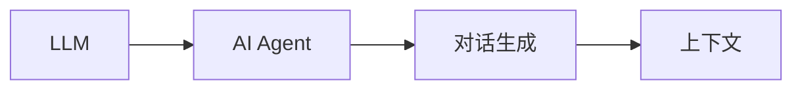

                 


# LLM支持的AI Agent上下文感知对话生成

## 关键词：LLM, AI Agent, 上下文感知, 对话生成, 大语言模型, 智能对话

## 摘要：本文详细探讨了如何利用大语言模型（LLM）支持的AI Agent实现上下文感知对话生成。通过分析LLM的算法原理、上下文感知对话生成的算法实现、系统架构设计以及实际项目案例，本文为读者提供了从理论到实践的全面指导。文章最后总结了关键点，并展望了未来的研究方向。

---

# 第1章: LLM与AI Agent概述

## 1.1 LLM与AI Agent的基本概念

### 1.1.1 大语言模型（LLM）的定义
大语言模型（Large Language Model，LLM）是指基于深度学习技术训练的大型神经网络模型，能够理解和生成人类语言文本。LLM的核心目标是通过大量数据学习语言的统计规律，从而实现自然语言处理任务，如文本生成、翻译、问答等。

### 1.1.2 AI Agent的核心概念
AI Agent（人工智能代理）是指能够感知环境、执行任务并做出决策的智能体。AI Agent可以是软件程序、机器人或其他智能系统，其核心能力包括感知、推理、学习和执行。AI Agent的目标是通过与环境交互，实现特定任务的目标。

### 1.1.3 LLM与AI Agent的结合
LLM与AI Agent的结合使得AI Agent具备了强大的语言理解和生成能力。通过LLM，AI Agent能够理解用户输入的自然语言文本，并生成符合上下文的回复。这种结合使得AI Agent在对话生成、任务执行等领域具有更广泛的应用场景。

## 1.2 上下文感知对话生成的背景

### 1.2.1 对话生成的基本问题
对话生成是指基于给定的对话历史，生成符合逻辑和语境的回复。传统对话生成方法往往忽略了对话的上下文信息，导致生成的回复缺乏连贯性和相关性。

### 1.2.2 上下文感知的重要性
上下文感知是指在对话生成过程中，充分考虑对话历史、当前语境以及其他相关背景信息。通过上下文感知，AI Agent能够生成更符合用户意图和对话情境的回复，从而提高对话的质量和用户体验。

### 1.2.3 LLM在对话生成中的优势
LLM在对话生成中的优势主要体现在以下几个方面：
1. **大规模数据学习**：LLM通过大量数据训练，能够捕捉到语言的复杂模式和上下文关系。
2. **上下文理解能力**：LLM能够理解对话中的上下文信息，并生成与之相关的回复。
3. **动态调整能力**：LLM可以根据对话的动态变化，实时调整生成的回复内容。

## 1.3 本章小结

### 1.3.1 核心概念回顾
- LLM：基于深度学习的大规模语言模型，能够生成自然语言文本。
- AI Agent：具备感知、推理和执行能力的智能体，能够与环境交互。
- 上下文感知对话生成：基于对话历史和上下文信息生成相关回复。

### 1.3.2 问题背景总结
- 对话生成的传统方法忽略了上下文信息，导致回复缺乏连贯性。
- 上下文感知对话生成通过考虑对话历史和语境，提高了对话的质量。

### 1.3.3 下文分析
- LLM与AI Agent的结合为上下文感知对话生成提供了技术支持。
- 上下文感知对话生成的应用场景广泛，包括智能客服、智能助手、虚拟对话伙伴等。

---

# 第2章: 上下文感知对话生成的核心概念

## 2.1 核心概念的定义与属性

### 2.1.1 上下文感知的定义
上下文感知是指在生成对话回复时，充分考虑对话的上下文信息，包括对话历史、当前语境、用户意图等。通过上下文感知，AI Agent能够生成更符合用户期望的回复。

### 2.1.2 对话生成的属性
对话生成的属性主要包括：
1. **相关性**：生成的回复与当前对话主题相关。
2. **连贯性**：回复与对话历史保持逻辑连贯。
3. **自然性**：回复符合自然语言表达习惯。

### 2.1.3 LLM与上下文的关系
LLM通过训练数据学习语言的模式和上下文关系，能够在生成对话回复时考虑上下文信息。LLM与上下文的关系是动态的，随着对话的进行，LLM不断调整生成的回复内容。

## 2.2 核心概念的对比分析

### 2.2.1 不同模型的对比
| 模型类型 | 基于规则 | 基于统计 | 基于深度学习 |
|----------|-----------|-----------|--------------|
| 优点     | 简单易实现 | 统计规律明显 | 强大学习能力 |
| 缺点     | 无法处理复杂场景 | 过度依赖数据 | 计算资源消耗大 |

### 2.2.2 对话生成的特征对比
| 特征     | 基于LLM | 基于规则 | 基于统计 |
|----------|----------|-----------|-----------|
| 上下文感知 | 强 | 弱 | 中 |
| 生成质量 | 高 | 低 | 中 |
| 计算资源 | 高 | 低 | 中 |

### 2.2.3 LLM与其他生成方法的对比
LLM相较于传统生成方法，具有以下优势：
1. **生成质量高**：LLM通过大规模数据训练，能够生成高质量的对话回复。
2. **上下文感知能力强**：LLM能够理解对话的上下文信息，并生成相关回复。
3. **适应性强**：LLM能够适应不同的对话场景和主题。

## 2.3 核心概念的ER实体关系图



## 2.4 本章小结

### 2.4.1 核心概念的总结
- LLM与AI Agent的结合为上下文感知对话生成提供了技术支持。
- 上下文感知对话生成的核心在于考虑对话的上下文信息，生成符合逻辑和语境的回复。

### 2.4.2 概念对比的启示
- LLM相较于传统生成方法，具有生成质量高、上下文感知能力强等优势。
- 不同模型的对比分析有助于选择适合特定场景的生成方法。

### 2.4.3 实体关系图的意义
- 实体关系图展示了LLM、AI Agent、对话生成和上下文之间的关系，明确了各部分的相互作用。

---

# 第3章: LLM的算法原理

## 3.1 LLM的基本原理

### 3.1.1 变压器模型的结构
LLM通常基于Transformer模型构建，其核心结构包括编码器和解码器。编码器负责将输入文本转换为高维向量，解码器负责根据编码结果生成目标文本。

### 3.1.2 注意力机制的作用
注意力机制（Attention Mechanism）是Transformer模型的核心组件，用于计算输入序列中每个位置的重要性权重。注意力机制能够捕捉文本中的长距离依赖关系，从而提高生成的回复质量。

### 3.1.3 梯度下降优化方法
梯度下降是一种常用的优化算法，用于最小化模型的损失函数。在LLM的训练过程中，通过不断调整模型参数，使得生成的文本与真实文本的差异最小化。

## 3.2 LLM的训练过程

### 3.2.1 数据预处理
数据预处理是LLM训练的基础，主要包括分词、去除停用词、数据清洗等步骤。高质量的数据预处理能够提高模型的训练效果。

### 3.2.2 模型训练
模型训练是LLM的核心过程，包括前向传播和反向传播两个阶段。前向传播用于生成模型的输出，反向传播用于计算损失并更新模型参数。

### 3.2.3 超参数调整
超参数调整是提高模型性能的重要步骤，包括学习率、批量大小、训练轮数等参数的调整。通过合理的超参数调整，能够提高模型的生成质量。

## 3.3 LLM的数学模型

### 3.3.1 模型的数学表达
$$P(x_{i}|x_{<i}) = \text{softmax}(QK^T/V)$$

### 3.3.2 注意力机制的公式
$$\text{Attention}(Q,K,V) = \text{softmax}\left(\frac{QK^T}{\sqrt{d_k}}\right)V$$

## 3.4 本章小结

### 3.4.1 算法原理的总结
- LLM基于Transformer模型，通过注意力机制捕捉上下文信息。
- 梯度下降优化方法用于模型的训练和调优。

### 3.4.2 数学模型的理解
- 注意力机制通过计算输入序列中每个位置的权重，实现上下文信息的编码。
- 模型的数学表达式展示了LLM生成文本的基本原理。

### 3.4.3 实际应用的启示
- LLM的算法原理为上下文感知对话生成提供了理论基础。
- 模型的训练和优化方法是提高生成质量的关键。

---

# 第4章: 上下文感知对话生成的算法

## 4.1 对话生成的基本算法

### 4.1.1 基于规则的生成
基于规则的生成方法通过预定义的规则和模板生成对话回复。这种方法简单易实现，但生成的回复缺乏灵活性和多样性。

### 4.1.2 基于统计的生成
基于统计的生成方法通过统计语言模型捕捉语言的规律，生成概率最高的回复。这种方法能够生成多样化的回复，但难以捕捉复杂的上下文信息。

### 4.1.3 基于深度学习的生成
基于深度学习的生成方法通过神经网络模型捕捉语言的复杂模式，生成高质量的对话回复。这种方法能够较好地处理上下文信息，是当前的研究热点。

## 4.2 上下文感知的算法实现

### 4.2.1 上下文表示方法
上下文表示方法包括基于词向量、句向量和语境向量的表示方法。通过这些方法，能够将对话历史编码为向量表示，供模型生成回复时使用。

### 4.2.2 对话历史的编码
对话历史的编码方法包括循环神经网络（RNN）和Transformer模型。通过编码对话历史，模型能够捕捉对话的上下文信息。

### 4.2.3 上下文融合策略
上下文融合策略包括基于注意力机制的融合和基于门控机制的融合。通过这些策略，模型能够将上下文信息与当前输入结合，生成更符合语境的回复。

## 4.3 基于LLM的上下文感知算法

### 4.3.1 LLM的输入处理
LLM的输入处理包括将对话历史和当前输入合并为一个输入序列，供模型生成回复。

### 4.3.2 上下文的编码方式
上下文的编码方式包括将对话历史作为上下文输入，模型通过注意力机制生成回复。

### 4.3.3 LLM的输出调整
LLM的输出调整包括对生成的回复进行后处理，如去除无关内容、调整语气等。

## 4.4 本章小结

### 4.4.1 算法实现的总结
- 上下文感知对话生成的算法实现包括上下文表示、对话历史编码和上下文融合策略。
- LLM的输入处理和输出调整是实现上下文感知对话生成的关键步骤。

### 4.4.2 算法对比的启示
- 基于深度学习的生成方法在上下文感知能力上具有明显优势。
- 不同的上下文表示和融合策略能够影响生成回复的质量。

### 4.4.3 实际应用的启示
- 上下文感知对话生成的算法实现需要结合具体的场景和需求进行调整。
- LLM的输入处理和输出调整是提高生成质量的重要环节。

---

# 第5章: 系统架构设计与实现

## 5.1 系统功能设计

### 5.1.1 功能模块划分
系统功能设计包括对话历史存储、上下文感知生成、回复输出等模块。每个模块负责特定的功能，如对话历史存储用于记录对话内容，上下文感知生成用于生成回复。

### 5.1.2 功能流程图


## 5.2 系统架构设计

### 5.2.1 系统架构图


### 5.2.2 模块交互流程
1. 用户输入对话内容。
2. 对话历史存储模块记录对话内容。
3. 上下文感知生成模块根据对话历史生成回复。
4. 回复输出模块将生成的回复返回给用户。
5. 用户反馈用于更新对话历史。

## 5.3 系统接口设计

### 5.3.1 输入接口
- 对话历史输入接口：用于接收对话历史数据。
- 当前输入接口：用于接收用户的当前输入。

### 5.3.2 输出接口
- 回复输出接口：用于输出生成的回复内容。
- 反馈接口：用于接收用户反馈并更新对话历史。

## 5.4 本章小结

### 5.4.1 系统功能设计的总结
- 系统功能设计包括对话历史存储、上下文感知生成和回复输出三个模块。
- 功能流程图展示了各模块之间的交互关系。

### 5.4.2 系统架构设计的意义
- 系统架构设计为上下文感知对话生成提供了明确的实现路径。
- 模块交互流程明确了系统的运行机制。

### 5.4.3 系统接口设计的启示
- 系统接口设计需要考虑输入输出的规范性和灵活性。
- 反馈接口的引入能够提高系统的动态调整能力。

---

# 第6章: 项目实战

## 6.1 环境安装与配置

### 6.1.1 环境需求
- 操作系统：Linux/Windows/MacOS
- Python版本：3.6+
- 依赖库：transformers, torch, numpy

### 6.1.2 安装步骤
```bash
pip install transformers torch numpy
```

## 6.2 核心代码实现

### 6.2.1 对话历史存储模块
```python
class DialogueHistory:
    def __init__(self):
        self.history = []

    def add(self, message):
        self.history.append(message)
```

### 6.2.2 上下文感知生成模块
```python
from transformers import AutoModelForCausalLM, AutoTokenizer

class ContextAwareGenerator:
    def __init__(self, model_name):
        self.model = AutoModelForCausalLM.from_pretrained(model_name)
        self.tokenizer = AutoTokenizer.from_pretrained(model_name)

    def generate(self, context, max_length=50):
        inputs = self.tokenizer.encode(context + self.tokenizer.eos_token, return_tensors='pt')
        outputs = self.model.generate(inputs, max_length=max_length)
        return self.tokenizer.decode(outputs[0], skip_special_tokens=True)
```

### 6.2.3 回复输出模块
```python
class ResponseOutput:
    def __init__(self):
        pass

    def display(self, response):
        print("AI: " + response)
```

## 6.3 代码应用与分析

### 6.3.1 代码实现的细节
- 对话历史存储模块通过类`DialogueHistory`实现，支持对话历史的添加和查询。
- 上下文感知生成模块基于预训练的LLM实现，能够根据对话历史生成回复。
- 回复输出模块通过简单的文本输出实现，便于用户查看生成的回复。

### 6.3.2 代码实现的意义
- 对话历史存储模块为上下文感知生成提供了数据支持。
- 上下文感知生成模块是实现上下文感知对话生成的核心部分。
- 回复输出模块是用户与系统交互的接口，确保生成的回复能够被用户查看。

## 6.4 本章小结

### 6.4.1 项目实战的总结
- 项目实战展示了上下文感知对话生成系统的实现过程。
- 代码实现部分详细说明了各模块的具体实现方法。

### 6.4.2 代码实现的启示
- 代码实现需要结合具体的场景和需求进行调整。
- 对话历史存储和上下文感知生成是实现上下文感知对话生成的关键模块。

### 6.4.3 项目部署的注意事项
- 系统的部署需要考虑计算资源和存储资源的需求。
- 系统的维护需要定期更新对话历史和模型参数。

---

# 第7章: 系统优化与调优

## 7.1 模型优化策略

### 7.1.1 参数调整
- 学习率调整：通过调整学习率，优化模型的收敛速度和生成质量。
- 批量大小调整：通过调整批量大小，优化模型的训练效率和生成质量。

### 7.1.2 模型剪枝
模型剪枝是一种优化方法，通过去除模型中冗余的部分，降低模型的复杂度，提高模型的推理效率。

### 7.1.3 模型融合
模型融合是通过将多个模型的输出进行融合，生成更高质量的回复。模型融合方法包括投票、加权平均等。

## 7.2 系统调优方法

### 7.2.1 对话历史优化
- 对话历史的存储优化：通过压缩和归档，减少存储空间的占用。
- 对话历史的查询优化：通过索引和缓存，提高对话历史的查询效率。

### 7.2.2 回复生成优化
- 回复生成的并行处理：通过并行计算，提高生成效率。
- 回复生成的缓存优化：通过缓存生成的回复，减少重复计算。

## 7.3 性能评估指标

### 7.3.1 生成质量评估
- 回复的相关性：生成的回复是否与对话主题相关。
- 回复的连贯性：生成的回复是否与对话历史连贯。

### 7.3.2 系统性能评估
- 响应时间：系统生成回复的平均时间。
- 吞吐量：系统每单位时间生成的回复数量。

## 7.4 本章小结

### 7.4.1 系统优化的总结
- 模型优化和系统调优是提高生成质量和系统性能的关键。
- 对话历史优化和回复生成优化是系统优化的重要组成部分。

### 7.4.2 性能评估的启示
- 性能评估指标是衡量系统优劣的重要依据。
- 不同的评估指标适用于不同的系统优化目标。

### 7.4.3 优化策略的注意事项
- 模型优化和系统调优需要结合具体的场景和需求进行。
- 性能评估需要基于实际数据进行，确保评估结果的客观性。

---

# 第8章: 扩展与未来方向

## 8.1 当前研究的局限性

### 8.1.1 上下文理解的深度
当前的上下文理解主要基于对话历史的浅层信息，缺乏对语义和情感的理解。

### 8.1.2 模型的泛化能力
LLM的泛化能力有限，难以应对复杂的对话场景和多语言支持。

## 8.2 未来研究方向

### 8.2.1 多模态对话生成
多模态对话生成是将视觉、听觉等多模态信息融入对话生成，提高生成回复的丰富性和多样性。

### 8.2.2 情感智能对话生成
情感智能对话生成是通过理解用户的情感和意图，生成更符合用户情感需求的回复。

### 8.2.3 分布式对话生成
分布式对话生成是通过分布式系统实现对话生成，提高系统的扩展性和响应速度。

## 8.3 本章小结

### 8.3.1 当前研究的局限性
- 上下文理解的深度和广度有限。
- 模型的泛化能力不足。

### 8.3.2 未来研究方向的展望
- 多模态对话生成：通过多模态信息的融合，提高生成回复的丰富性和多样性。
- 情感智能对话生成：通过情感理解和生成，提高对话的个性化和用户体验。
- 分布式对话生成：通过分布式系统实现，提高系统的扩展性和响应速度。

### 8.3.3 研究方向的启示
- 未来的研究需要结合多模态、情感智能和分布式等技术，推动上下文感知对话生成的发展。

---

# 总结与展望

## 总结

本文系统地探讨了LLM支持的AI Agent上下文感知对话生成的理论与实践。从LLM的基本原理到上下文感知对话生成的算法实现，从系统架构设计到项目实战，再到系统的优化与调优，本文为读者提供了从理论到实践的全面指导。通过本文的学习，读者能够深入了解LLM支持的AI Agent上下文感知对话生成的核心技术，并能够将其应用于实际场景中。

## 展望

未来的研究方向包括多模态对话生成、情感智能对话生成和分布式对话生成等。这些方向将推动上下文感知对话生成技术的发展，使其在更多领域得到广泛应用。同时，随着技术的进步，上下文感知对话生成的生成质量和服务能力将进一步提高，为人类与智能系统的交互提供更丰富、更自然的体验。

---

# 结束语

上下文感知对话生成是一项具有广泛应用前景的技术。通过LLM支持的AI Agent，我们能够实现更自然、更智能的对话生成。未来，随着技术的不断进步，上下文感知对话生成将为人类与智能系统的交互带来更多的可能性和便利性。

