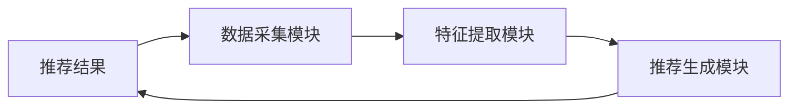
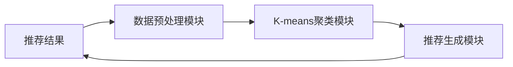
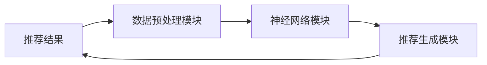
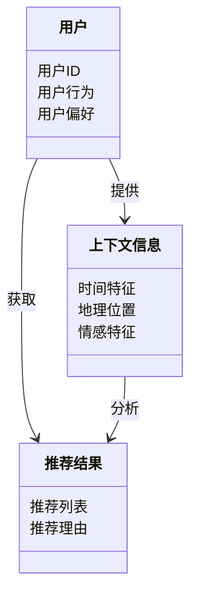
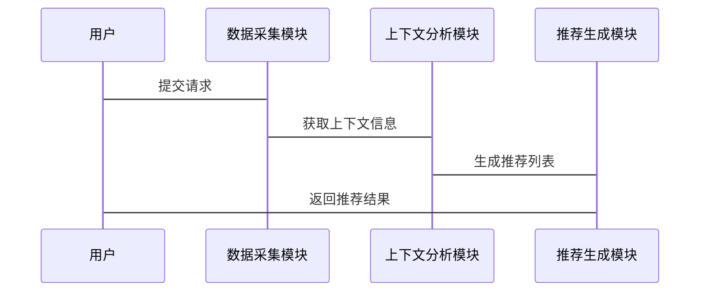

                 


# LLM支持的AI Agent上下文感知推荐技术

## 关键词：LLM, AI Agent, 上下文感知推荐, 推荐系统, 人工智能

## 摘要：本文详细探讨了LLM（大语言模型）支持的AI Agent在上下文感知推荐技术中的应用。通过分析推荐系统的背景、核心概念、算法原理、系统架构以及实际案例，本文为读者提供了从理论到实践的全面指导，帮助理解如何利用LLM增强推荐系统的上下文感知能力，从而提升推荐的准确性和用户满意度。

---

# 第一部分: LLM支持的AI Agent上下文感知推荐技术背景

# 第1章: 上下文感知推荐技术概述

## 1.1 问题背景与问题描述

### 1.1.1 当前推荐系统面临的挑战
传统的推荐系统主要基于用户的显式行为（如点击、评分）或隐式行为（如浏览、停留时间）进行推荐。然而，这些方法往往忽略了以下问题：
- **上下文信息不足**：推荐结果可能与当前用户所处的场景（如时间、地点、情绪）不匹配。
- **个性化不足**：推荐系统难以充分理解用户的动态需求和复杂场景。
- **实时性问题**：在动态变化的场景中，推荐系统难以快速响应。

### 1.1.2 上下文感知推荐技术的提出
上下文感知推荐技术通过引入多维度的上下文信息（如用户行为、环境特征、时间特征、情感特征等），增强了推荐系统的个性化和场景适应性。结合LLM的强大自然语言处理能力，AI Agent能够实时理解和分析上下文信息，从而生成更精准的推荐。

### 1.1.3 LLM在推荐系统中的作用
大语言模型（LLM）通过其强大的语义理解能力，能够从非结构化的文本数据中提取有用的特征，并结合结构化数据生成推荐结果。LLM还可以通过对话式交互与用户实时沟通，进一步理解用户需求，动态调整推荐策略。

## 1.2 问题解决思路与技术路线

### 1.2.1 上下文感知推荐的核心目标
- 基于多维度上下文信息，提供个性化推荐。
- 实时感知用户需求和场景变化，动态调整推荐策略。

### 1.2.2 LLM支持的AI Agent技术路线
1. **数据采集**：收集用户行为、环境特征、时间特征等多维度数据。
2. **上下文分析**：利用LLM对上下文信息进行语义理解和特征提取。
3. **推荐生成**：基于上下文分析结果，结合传统推荐算法生成推荐列表。
4. **交互优化**：通过人机交互进一步优化推荐结果，提升用户体验。

### 1.2.3 系统架构与功能模块划分
- 数据采集模块：负责收集用户行为、环境特征等数据。
- 上下文分析模块：利用LLM进行语义理解和特征提取。
- 推荐生成模块：结合传统推荐算法生成推荐结果。
- 交互优化模块：通过人机交互动态调整推荐策略。

## 1.3 问题的边界与外延

### 1.3.1 上下文感知推荐的边界
- 推荐系统的上下文感知能力仅限于当前场景和用户行为。
- 无法预测用户未来的需求变化。

### 1.3.2 LLM支持的AI Agent的应用场景
- 电子商务：基于用户行为和场景推荐商品。
- 媒体推荐：根据用户情绪和时间推荐内容。
- 教育推荐：基于学习进度和兴趣推荐课程。

### 1.3.3 技术的适用范围与限制
- 适用范围：适用于需要动态调整推荐策略的场景。
- 限制：依赖于高质量的上下文数据和LLM的性能。

## 1.4 核心概念与技术框架

### 1.4.1 上下文感知推荐的核心概念
- **上下文**：包括用户行为、环境特征、时间特征等多维度信息。
- **推荐系统**：基于上下文信息生成个性化推荐列表。

### 1.4.2 LLM支持的AI Agent技术框架
- **数据流**：从数据采集到推荐生成的完整流程。
- **功能模块**：数据采集、上下文分析、推荐生成、交互优化。

## 1.5 本章小结
本章介绍了上下文感知推荐技术的背景、核心目标、技术路线以及系统的架构设计，为后续章节的深入分析奠定了基础。

---

# 第二部分: 核心概念与技术联系

# 第2章: 上下文感知推荐技术的核心原理

## 2.1 核心概念原理

### 2.1.1 上下文感知推荐的基本原理
上下文感知推荐通过结合多维度的上下文信息，利用LLM的强大语义理解能力，动态生成个性化推荐列表。其核心在于将非结构化的上下文信息转化为可计算的特征，并结合传统推荐算法生成推荐结果。

### 2.1.2 LLM在推荐系统中的应用
LLM通过语义理解、特征提取和对话交互，增强了推荐系统的上下文感知能力。例如，LLM可以分析用户的文本输入，提取情感特征、主题特征等，并结合这些特征生成推荐结果。

### 2.1.3 AI Agent的上下文理解机制
AI Agent通过实时感知用户的上下文信息（如地理位置、时间、情绪等），利用LLM进行语义分析，生成动态调整的推荐策略。

## 2.2 核心概念属性对比表

| 概念         | 属性               | 描述                                                                 |
|--------------|--------------------|----------------------------------------------------------------------|
| 上下文感知推荐 | 数据来源           | 用户行为、环境特征、时间特征、情感特征等                                         |
|              | 推荐目标           | 用户的个性化需求                                                     |
|              | 推荐依据           | 多维度上下文信息                                                     |

## 2.3 ER实体关系图

```mermaid
er
actor: 用户
agent: AI Agent
context: 上下文信息
recommendation: 推荐结果
actor --> agent: 提交请求
agent --> context: 获取上下文
agent --> recommendation: 生成推荐
```

## 2.4 本章小结
本章通过对比和图表分析，详细解释了上下文感知推荐技术的核心概念和工作原理，为后续的算法设计和系统实现提供了理论基础。

---

# 第三部分: 算法原理与数学模型

# 第3章: 上下文感知推荐算法原理

## 3.1 算法原理概述

### 3.1.1 基于协同过滤的上下文感知推荐
协同过滤是一种经典的推荐算法，通过分析用户行为和物品特征生成推荐列表。结合上下文信息，可以进一步提升推荐的准确性。

#### 3.1.1.1 协同过滤算法流程



### 3.1.1.2 协同过滤算法实现

```python
def collaborative_filtering(user_id, user_item_matrix, k=5):
    # 计算用户相似度
    similarity = cosine_similarity(user_item_matrix[user_id], user_item_matrix)
    # 获取相似用户的Top-k物品
    recommended_items = []
    for i in range(len(similarity)):
        if i != user_id and similarity[i] > 0.5:
            recommended_items.extend(user_item_matrix[i].nonzero()[1])
    # 去重并排序
    recommended_items = list(set(recommended_items))
    recommended_items.sort(key=lambda x: similarity[x], reverse=True)
    return recommended_items
```

### 3.1.1.3 协同过滤的数学模型
$$\text{相似度} = \cos(\theta) = \frac{\mathbf{u} \cdot \mathbf{v}}{|\mathbf{u}| |\mathbf{v}|}$$

---

### 3.1.2 基于聚类的上下文感知推荐
聚类算法通过将用户或物品分成不同的类别，生成个性化推荐列表。结合上下文信息，可以进一步提升推荐的准确性。

#### 3.1.2.1 聚类算法流程



### 3.1.2.2 聚类算法实现

```python
from sklearn.cluster import KMeans

def kmeans_clustering(user_features, n_clusters=5):
    model = KMeans(n_clusters=n_clusters, random_state=42)
    model.fit(user_features)
    return model.predict(user_features)
```

### 3.1.2.3 聚类算法的数学模型
$$\text{损失函数} = \sum_{i=1}^{n} \sum_{j=1}^{k} (x_i - c_j)^2$$

---

### 3.1.3 基于深度学习的上下文感知推荐
深度学习模型（如神经网络）通过端到端学习，结合多维度上下文信息，生成推荐列表。

#### 3.1.3.1 深度学习算法流程



### 3.1.3.2 深度学习算法实现

```python
import tensorflow as tf
from tensorflow.keras import layers

def deep_learning_model(input_dim):
    model = tf.keras.Sequential()
    model.add(layers.Dense(64, activation='relu', input_dim=input_dim))
    model.add(layers.Dense(32, activation='relu'))
    model.add(layers.Dense(1, activation='sigmoid'))
    model.compile(optimizer='adam', loss='binary_crossentropy', metrics=['accuracy'])
    return model
```

### 3.1.3.3 深度学习算法的数学模型
$$\text{损失函数} = -\sum_{i=1}^{n} [y_i \log(\hat{y}_i) + (1-y_i) \log(1-\hat{y}_i)]$$

---

## 3.2 算法原理小结
本章详细介绍了上下文感知推荐技术的算法原理，包括协同过滤、聚类和深度学习三种方法，并通过代码示例和数学公式进行了深入讲解。

---

# 第四部分: 系统分析与架构设计

# 第4章: 系统分析与架构设计

## 4.1 系统分析

### 4.1.1 问题场景介绍
系统需要在动态变化的场景中，实时感知用户的上下文信息，结合LLM生成个性化推荐列表。

### 4.1.2 项目介绍
本项目旨在设计一个基于LLM的AI Agent推荐系统，结合多维度上下文信息，提供个性化推荐服务。

## 4.2 系统功能设计

### 4.2.1 领域模型



### 4.2.2 系统架构设计


### 4.2.3 系统接口设计
- 数据接口：负责数据的采集和传输。
- 推荐接口：负责推荐结果的生成和返回。
- 交互接口：负责用户与系统的实时交互。

### 4.2.4 系统交互流程



## 4.3 本章小结
本章通过系统分析和架构设计，详细描述了LLM支持的AI Agent推荐系统的整体架构和功能模块，为后续的实现提供了指导。

---

# 第五部分: 项目实战

# 第5章: 项目实战

## 5.1 环境安装

### 5.1.1 安装Python和必要的库
```bash
pip install numpy scikit-learn tensorflow
```

### 5.1.2 安装LLM模型
```bash
pip install transformers
```

## 5.2 系统核心实现源代码

### 5.2.1 数据预处理模块

```python
import pandas as pd

def preprocess_data(dataframe):
    # 数据清洗
    dataframe.dropna(inplace=True)
    # 特征提取
    user_features = dataframe[['user_id', 'item_id', 'rating']]
    return user_features
```

### 5.2.2 上下文分析模块

```python
from transformers import pipeline

def analyze_context(context):
    # 使用LLM进行语义分析
    nlp = pipeline("text-classification", model="bert-base-uncased")
    return nlp(context)
```

### 5.2.3 推荐生成模块

```python
def generate_recommendations(user_id, user_features, model):
    # 基于模型生成推荐
    predictions = model.predict(user_features[user_id])
    return predictions
```

## 5.3 代码应用解读与分析

### 5.3.1 数据预处理模块
数据预处理模块负责对原始数据进行清洗和特征提取，为后续的推荐生成提供干净的数据。

### 5.3.2 上下文分析模块
上下文分析模块利用LLM对用户输入的上下文信息进行语义分析，提取有用的特征。

### 5.3.3 推荐生成模块
推荐生成模块结合上下文分析结果和传统推荐算法，生成最终的推荐列表。

## 5.4 实际案例分析

### 5.4.1 案例介绍
以电影推荐为例，系统需要根据用户的观影历史、当前时间、地理位置等因素，推荐相关电影。

### 5.4.2 案例分析
- **用户行为**：用户最近观看了哪些电影？
- **上下文信息**：用户当前的位置、时间、情绪。
- **推荐结果**：基于上述信息推荐相似的电影。

## 5.5 项目小结
本章通过实际案例分析，展示了LLM支持的AI Agent推荐系统的实现过程，帮助读者更好地理解理论与实践的结合。

---

# 第六部分: 最佳实践与总结

# 第6章: 最佳实践

## 6.1 最佳实践Tips

### 6.1.1 数据处理
- 确保数据质量，清洗和预处理是关键。
- 结合上下文信息，提取有用的特征。

### 6.1.2 模型选择
- 根据具体场景选择合适的推荐算法。
- 结合LLM进行语义分析，增强上下文感知能力。

### 6.1.3 交互优化
- 通过人机交互动态调整推荐策略。
- 提供多样化的推荐结果，满足用户需求。

## 6.2 小结
本章总结了上下文感知推荐技术的核心要点，为读者提供了实际应用的参考。

## 6.3 注意事项

### 6.3.1 数据隐私
- 确保用户数据的安全和隐私。
- 遵守相关法律法规。

### 6.3.2 模型性能
- 定期更新模型，保持推荐的准确性。
- 优化算法性能，提升推荐效率。

## 6.4 拓展阅读

### 6.4.1 推荐系统领域的最新研究
- 关注学术界最新的研究成果。
- 参加相关技术会议和研讨会。

### 6.4.2 LLM在推荐系统中的应用
- 深入研究LLM在推荐系统中的应用。
- 探索新的技术方向。

---

# 第七部分: 总结

# 第7章: 总结

## 7.1 核心内容回顾
本文详细探讨了LLM支持的AI Agent上下文感知推荐技术，从理论到实践进行了全面分析。

## 7.2 未来展望
随着LLM和AI技术的不断进步，上下文感知推荐技术将更加智能化和个性化，为推荐系统带来更大的价值。

---

# 结语

感谢您的阅读！希望本文能为您提供有价值的技术见解和实践指导。如需进一步探讨或交流，请随时联系。

