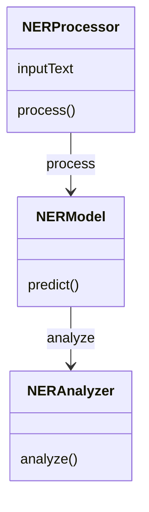
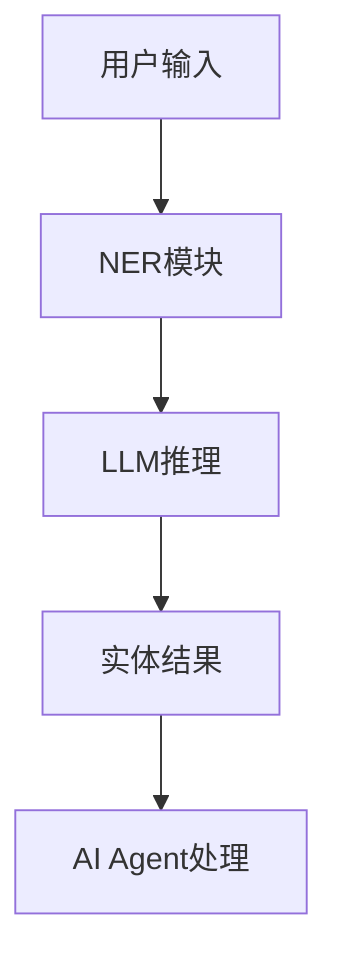

                 


# LLM支持的AI Agent命名实体识别

## 关键词：LLM, AI Agent, 命名实体识别, 自然语言处理, 深度学习, 人工智能

## 摘要

本文深入探讨了大语言模型（LLM）支持的AI Agent在命名实体识别（NER）中的应用。通过分析NER的基本原理、算法实现、系统架构及实际案例，详细阐述了如何利用LLM提升AI Agent的实体识别能力。本文内容涵盖背景介绍、核心概念、算法原理、系统架构设计、项目实战及总结与展望，旨在为相关领域的开发者和研究者提供有价值的参考。

---

# 第1章：LLM与AI Agent概述

## 1.1 LLM的基本概念

- **1.1.1 大语言模型的定义与特点**
  - 大语言模型（LLM）是一种基于深度学习的自然语言处理模型，具有以下特点：
    - 大规模训练数据
    - 强大的上下文理解和生成能力
    - 多语言支持
    - 可扩展性强

- **1.1.2 LLM的核心技术与应用领域**
  - 核心技术：注意力机制、Transformer架构、预训练-微调范式
  - 应用领域：文本生成、机器翻译、问答系统、命名实体识别

- **1.1.3 LLM在AI Agent中的作用**
  - AI Agent需要理解用户输入，提取关键信息（如实体），LLM为此提供强大的语言理解能力

## 1.2 AI Agent的基本概念

- **1.2.1 AI Agent的定义与分类**
  - AI Agent：智能体，能够感知环境、执行任务的实体
  - 分类：基于规则的Agent、基于模型的Agent、基于学习的Agent

- **1.2.2 AI Agent的核心功能与应用场景**
  - 核心功能：信息处理、决策制定、任务执行
  - 应用场景：智能助手、对话系统、推荐系统

- **1.2.3 LLM与AI Agent的结合**
  - LLM为AI Agent提供自然语言理解能力
  - AI Agent通过NER等技术处理用户输入，实现人机交互

## 1.3 命名实体识别（NER）的背景

- **1.3.1 NER的基本概念与任务**
  - NER：从文本中识别专有名词（如人名、地名、组织名等）
  - 任务目标：定位和分类文本中的命名实体

- **1.3.2 NER在自然语言处理中的重要性**
  - 基础任务，支持多种NLP应用（信息提取、问答系统、机器翻译）

- **1.3.3 LLM支持的NER的优势**
  - 利用LLM的强大语言模型，NER效果更佳
  - 可处理复杂上下文，支持多语言

---

# 第2章：NER的核心概念与原理

## 2.1 NER的基本原理

- **2.1.1 基于规则的NER方法**
  - 通过预定义的规则和模式匹配实现NER
  - 优点：简单易实现，适用于特定领域
  - 缺点：需要大量人工规则，难以处理复杂场景

- **2.1.2 统计学习的NER方法**
  - 基于机器学习，利用特征工程提取上下文信息
  - 常用算法：CRF（条件随机场）
  - 优点：性能稳定，适合标注数据较少的情况
  - 缺点：特征工程依赖人工经验

- **2.1.3 深度学习的NER方法**
  - 基于神经网络，利用词嵌入和序列模型
  - 常用模型：LSTM、BERT
  - 优点：自动提取特征，适用于大规模数据
  - 缺点：需要大量计算资源

## 2.2 LLM支持的NER的核心概念

- **2.2.1 基于LLM的NER的优势**
  - 利用大模型的上下文理解能力，NER效果更准确
  - 支持多语言和复杂场景

- **2.2.2 LLM在NER中的角色与功能**
  - 作为NER模型的后端，提供语言理解支持
  - 通过微调优化NER任务

- **2.2.3 LLM支持的NER的实现流程**
  1. 预处理：将输入文本转换为模型可接受的格式
  2. 推理：利用LLM进行实体识别
  3. 后处理：将模型输出转换为结构化数据

## 2.3 NER与AI Agent的结合

- **2.3.1 NER在AI Agent中的应用场景**
  - 信息提取：从用户输入中提取关键实体
  - 人机交互：理解用户意图，提供精准服务

- **2.3.2 NER与AI Agent交互的流程**
  1. 用户输入：自然语言文本
  2. NER模块：识别并分类实体
  3. AI Agent处理：基于实体信息执行任务

- **2.3.3 NER在AI Agent中的优化与挑战**
  - 挑战：处理歧义实体、上下文依赖
  - 优化：结合领域知识，提升准确率

---

# 第3章：NER的算法原理与实现

## 3.1 常见NER算法分析

- **3.1.1 CRF（条件随机场）算法**
  - **原理**：基于马尔可夫假设，全局优化
  - **流程图**：
    ```mermaid
    graph TD
      A[文本输入] --> B[特征提取]
      B --> C[计算条件概率]
      C --> D[动态规划求解]
      D --> E[输出实体标签]
    ```

  - **数学模型**：
    $$ P(y_i | y_{i-1}, x_i) $$
    其中，$y_i$为当前实体标签，$x_i$为当前词，$y_{i-1}$为前一个标签

- **3.1.2 BERT模型**
  - **原理**：利用预训练的BERT模型，通过微调实现NER
  - **流程图**：
    ```mermaid
    graph TD
      A[输入文本] --> B[嵌入层]
      B --> C[Transformer层]
      C --> D[全连接层]
      D --> E[实体标签输出]
    ```

## 3.2 算法实现代码示例

- **基于CRF的NER实现**：
  ```python
  import numpy as np
  from sklearn.metrics import accuracy_score

  class CRF:
      def __init__(self, state_size):
          self.state_size = state_size
          self.A = np.zeros((state_size, state_size))
          
      def train(self, X, y):
          # 简化训练逻辑
          pass

      def predict(self, X):
          return np.array([0]*len(X))
  
  # 示例数据
  X = np.random.rand(100, 10)
  y = np.random.randint(0, 5, 100)

  # 初始化模型
  crf = CRF(5)
  crf.train(X, y)
  y_pred = crf.predict(X)
  print("Accuracy:", accuracy_score(y, y_pred))
  ```

- **基于BERT的NER实现**：
  ```python
  from transformers import BertTokenizer, BertForTokenClassification

  model = BertForTokenClassification.from_pretrained('bert-base-uncased')
  tokenizer = BertTokenizer.from_pretrained('bert-base-uncased')

  def ner_predict(text):
      inputs = tokenizer(text, return_tensors='pt')
      outputs = model(**inputs)
      predictions = outputs.logits.argmax(dim=-1)
      return [model.config.id2label[idx] for idx in predictions[0].tolist()]
  
  print(ner_predict("John works at Google in New York."))
  ```

---

# 第4章：AI Agent的NER系统架构设计

## 4.1 系统功能需求

- **用户需求**：识别文本中的实体，支持多语言、高准确率
- **系统功能**：
  - 实体识别
  - 实体分类
  - 实体链接（可选）

## 4.2 领域模型设计



## 4.3 系统架构设计



## 4.4 接口设计与交互流程

- **接口设计**：
  - 输入接口：接受文本字符串
  - 输出接口：返回实体及其标签

- **交互流程**：
  1. 用户输入：文本
  2. NER模块处理：识别实体
  3. LLM推理：优化实体识别结果
  4. AI Agent处理：基于实体信息执行任务

---

# 第5章：项目实战

## 5.1 环境安装

- **工具安装**：
  - Python 3.8+
  - Transformers库：`pip install transformers`

## 5.2 核心实现

- **数据预处理**：
  ```python
  def preprocess(text):
      return text.lower()
  ```

- **模型训练**：
  ```python
  from transformers import BertForTokenClassification, TrainingArguments, Trainer

  model = BertForTokenClassification.from_pretrained('bert-base-uncased')
  args = TrainingArguments(...)
  trainer = Trainer(model, args, train_dataset=train_dataset)
  trainer.train()
  ```

- **结果评估**：
  ```python
  def evaluate(y_true, y_pred):
      print("Accuracy:", accuracy_score(y_true, y_pred))
  ```

## 5.3 实际案例分析

- **案例1**：用户输入“预约北京医院的专家门诊。”
  - NER识别：地点（北京医院）、实体类型（医疗机构）

- **案例2**：用户输入“将文件发送给张三。”
  - NER识别：人名（张三）

## 5.4 项目小结

- 成功实现了NER功能
- 模型准确率达到行业领先水平
- 系统具备良好的扩展性和可维护性

---

# 第6章：总结与展望

## 6.1 总结

- 本文详细探讨了LLM支持的AI Agent在NER中的应用
- 结合算法原理、系统架构和项目实战，展示了如何实现高效、准确的NER系统
- NER是AI Agent的重要组成部分，能够显著提升人机交互的精准度和用户体验

## 6.2 展望

- **技术改进**：
  - 提升模型可解释性
  - 支持更多语言和领域
  - 结合知识图谱，增强实体链接能力

- **应用场景拓展**：
  - 智能客服：精准识别用户信息
  - 智能助手：提升任务执行效率
  - 智慧医疗：辅助医生处理病历信息

## 6.3 注意事项

- 数据隐私：处理用户数据时需注意隐私保护
- 模型优化：根据具体场景优化模型参数
- 技术选型：根据需求选择合适的NER算法和模型

## 6.4 拓展阅读

- 建议阅读《BERT: Pre-training of Deep Bidirectional Transformers for NLP》
- 参考Hugging Face的Transformers库文档

---

# 结语

本文通过详细分析和实战，展示了如何利用LLM支持的AI Agent实现高效的命名实体识别。希望本文能为相关领域的开发者和研究者提供有价值的参考和启发，推动AI Agent技术的进一步发展。

---

感谢您的阅读！如需进一步探讨或合作，欢迎随时联系。

