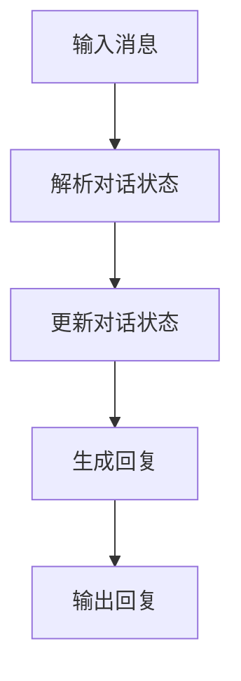
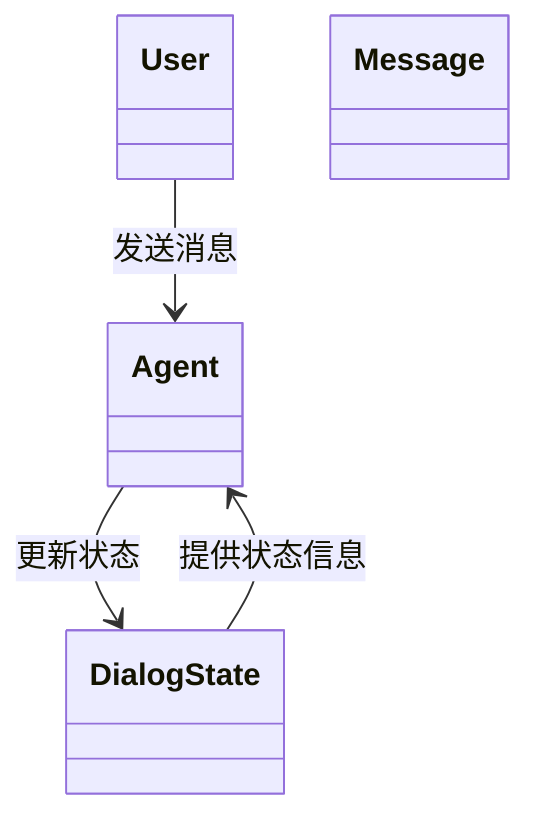

                 


# LLM支持的AI Agent对话状态跟踪

> 关键词：LLM, AI Agent, 对话状态跟踪, 自然语言处理, 机器学习, 大语言模型

> 摘要：本文探讨了LLM支持的AI Agent在对话状态跟踪中的应用，分析了对话状态跟踪的重要性、核心概念、算法原理、系统架构、项目实战及最佳实践。通过详细的技术分析和实例演示，展示了如何利用LLM提升AI Agent的对话能力。

---

# 第一部分: 背景介绍

## 第1章: 问题背景

### 1.1 对话状态跟踪的定义与重要性
对话状态跟踪（Dialog State Tracking）是自然语言处理中的关键任务，旨在实时记录和更新对话过程中双方交流的信息。它帮助AI Agent理解当前对话内容、用户意图和上下文信息，从而做出准确的回应。

### 1.2 LLM在对话状态跟踪中的作用
大语言模型（LLM）通过其强大的语言理解和生成能力，为对话状态跟踪提供了新的解决方案。LLM能够捕捉对话中的隐含信息，识别多轮对话中的模式，并动态更新对话状态，提升对话的连贯性和准确性。

### 1.3 当前对话状态跟踪的挑战与机遇
传统对话状态跟踪方法依赖于规则或统计模型，存在信息抽取不准确、上下文理解不足等问题。LLM的出现克服了这些限制，通过深度学习模型提高了对话状态的理解和跟踪能力。

## 第2章: 问题描述

### 2.1 对话状态跟踪的核心目标
对话状态跟踪的目标是准确记录对话中的关键信息，包括用户意图、实体识别、上下文关系等，确保AI Agent能够理解当前对话的含义。

### 2.2 LLM支持的AI Agent对话状态跟踪的复杂性
LLM支持的对话状态跟踪涉及多轮对话、复杂上下文以及动态信息更新，需要处理大量的语义信息和逻辑推理。

### 2.3 现有技术的局限性与改进方向
传统方法在处理复杂对话时表现不佳，而基于LLM的方法通过大规模预训练和微调，显著提升了对话状态跟踪的准确性和效率。

## 第3章: 问题解决

### 3.1 基于LLM的对话状态跟踪方法
基于LLM的对话状态跟踪方法利用模型的上下文理解和生成能力，动态更新对话状态，提升对话的连贯性和准确性。

### 3.2 对话状态跟踪的关键技术
关键技术包括意图识别、实体识别、上下文分析和对话历史记录等，这些技术共同确保对话状态的准确更新。

### 3.3 LLM支持的AI Agent对话状态跟踪的优势
LLM的优势在于其强大的语义理解和生成能力，能够处理复杂的对话场景，提高对话的自然性和流畅性。

## 第4章: 边界与外延

### 4.1 对话状态跟踪的边界
对话状态跟踪仅关注对话中的关键信息，不涉及用户的隐私或外部知识库的数据。

### 4.2 LLM支持的AI Agent对话状态跟踪的外延
外延包括多轮对话、复杂场景下的对话状态跟踪，以及与其他NLP任务的结合应用。

### 4.3 相关概念的对比与区分
对比了对话状态跟踪与其他NLP任务的区别，如意图识别、情感分析等，明确了对话状态跟踪的独特性。

## 第5章: 概念结构与核心要素组成

### 5.1 对话状态跟踪的核心要素
包括用户输入、对话历史、实体信息、意图信息等关键要素。

### 5.2 LLM在对话状态跟踪中的角色
LLM作为模型，负责解析对话内容，生成对话状态更新信息。

### 5.3 AI Agent与对话状态跟踪的关系
AI Agent依赖对话状态跟踪结果进行决策和回应，对话状态跟踪是AI Agent实现智能交互的基础。

---

# 第二部分: 核心概念与联系

## 第6章: 核心概念原理

### 6.1 对话状态跟踪的基本原理
通过解析用户输入，识别意图和实体，更新对话状态，生成适当的回应。

### 6.2 LLM在对话状态跟踪中的原理
基于预训练的大语言模型，通过输入对话历史和当前输入，生成对话状态更新。

### 6.3 AI Agent与对话状态跟踪的结合原理
AI Agent根据对话状态更新信息，进行下一步的决策和回应生成。

## 第7章: 概念属性特征对比

| 概念         | 属性               | 特征                               |
|--------------|--------------------|------------------------------------|
| 对话状态      | 信息完整性         | 需要跟踪对话中的所有关键信息     |
| LLM支持      | 计算能力           | 基于大规模预训练模型的推理能力     |
| AI Agent     | 行为自主性         | 可以根据对话状态自主决策           |

## 第8章: ER实体关系图

```mermaid
er
    actor: 用户
    agent: AI Agent
    dialog_state: 对话状态
    message: 消息
    relation: 用户发送消息 -> AI Agent处理 -> 对话状态更新 -> AI Agent生成回复
```

---

# 第三部分: 算法原理讲解

## 第9章: 对话状态跟踪算法流程



## 第10章: Python核心实现代码

```python
def track_dialog_state(messages):
    # 初始化对话状态
    dialog_state = {}
    for message in messages:
        # 解析消息内容
        parsed_message = parse_message(message)
        # 更新对话状态
        dialog_state.update(parsed_message)
    return dialog_state
```

---

# 第四部分: 系统分析与架构设计

## 第11章: 问题场景介绍

### 11.1 项目介绍
本文将设计一个基于LLM的AI Agent对话系统，重点实现对话状态跟踪功能。

## 第12章: 系统功能设计

### 12.1 领域模型


### 12.2 系统架构设计


## 第13章: 系统接口设计

### 13.1 对话状态更新接口
接口用于接收用户消息，更新对话状态并返回新的状态。

### 13.2 对话回复生成接口
根据对话状态生成回复消息。

---

# 第五部分: 项目实战

## 第14章: 环境安装

### 14.1 安装Python
```bash
python --version
```

### 14.2 安装依赖
```bash
pip install transformers
```

## 第15章: 核心实现代码

### 15.1 对话状态跟踪代码
```python
from transformers import AutoTokenizer, AutoModel

tokenizer = AutoTokenizer.from_pretrained("facebook/llama-7b")
model = AutoModel.from_pretrained("facebook/llama-7b")

def track_dialog_state(messages):
    inputs = tokenizer.encode_plus(messages, return_tensors="pt")
    outputs = model.generate(inputs.input_ids)
    dialog_state = decode(outputs)
    return dialog_state
```

## 第16章: 实际案例分析

### 16.1 案例介绍
用户与AI Agent对话，跟踪对话状态。

### 16.2 分析与解读
通过解析对话内容，更新对话状态，生成适当的回复。

---

# 第六部分: 最佳实践

## 第17章: 小结与注意事项

### 17.1 小结
本文详细介绍了LLM支持的AI Agent对话状态跟踪的实现过程，展示了如何利用大语言模型提升对话能力。

### 17.2 注意事项
在实际应用中，需要注意模型的选择、对话状态的准确更新以及系统的性能优化。

## 第18章: 拓展阅读

### 18.1 推荐书籍
- 《Large Language Models》
- 《对话系统入门》

### 18.2 推荐文章
- "Improving Dialog State Tracking with LLMs"
- "Advanced Techniques in Dialog System"

---

# 结语

通过本文的详细讲解，读者可以全面了解LLM支持的AI Agent对话状态跟踪的核心概念、算法原理和实现方法。希望本文能够为相关领域的研究和应用提供有价值的参考和启示。

