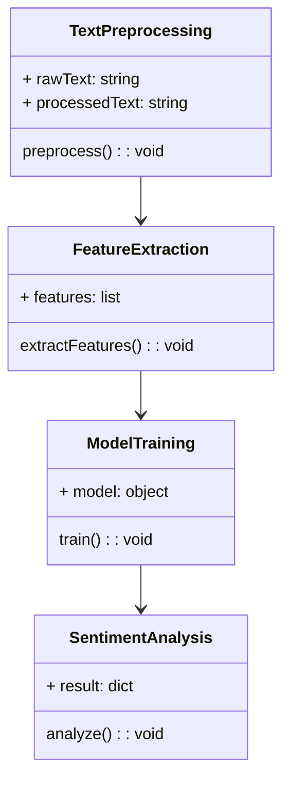

                 


# LLM支持的AI Agent情感分析优化

## 关键词
- 大语言模型 (LLM)
- AI Agent
- 情感分析
- 优化
- 自然语言处理
- 机器学习

## 摘要
本文详细探讨了如何利用大语言模型（LLM）优化AI Agent的情感分析能力。通过分析情感分析的基本概念、LLM的核心原理、AI Agent的工作机制，以及它们之间的联系，本文提出了一种基于LLM的AI Agent情感分析优化方法。通过对比传统方法和基于LLM的方法，本文展示了如何利用先进的自然语言处理技术提升情感分析的准确性和效率。文章还结合实际案例，详细讲解了系统架构设计、项目实现步骤以及最佳实践，为读者提供了一套完整的解决方案。

## 目录

# 第一部分: 背景与核心概念

## 第1章: 情感分析与AI Agent概述

### 1.1 情感分析的基本概念
#### 1.1.1 情感分析的定义与背景
情感分析（Sentiment Analysis）是一种自然语言处理任务，旨在识别和分类文本中表达的情感倾向。随着社交媒体和在线评论的普及，情感分析在商业分析、舆情监控等领域发挥着重要作用。

#### 1.1.2 AI Agent在情感分析中的角色
AI Agent（智能体）是一种能够感知环境并采取行动以实现目标的智能系统。在情感分析中，AI Agent可以用于实时监控和分析用户情感，提供个性化反馈或服务。

#### 1.1.3 LLM与情感分析的结合
大语言模型（LLM）如GPT-3、BERT等，具有强大的自然语言理解和生成能力。将LLM集成到AI Agent中，可以显著提升情感分析的准确性和效率。

### 1.2 AI Agent的基本原理
#### 1.2.1 AI Agent的定义与分类
AI Agent可以根据智能水平分为反应式和认知式。反应式Agent基于当前感知做出反应，而认知式Agent具备推理和规划能力。

#### 1.2.2 基于LLM的AI Agent特点
基于LLM的AI Agent具有以下特点：
1. **强大的自然语言处理能力**：能够理解和生成复杂的文本。
2. **自适应性**：可以根据上下文调整情感分析策略。
3. **高效性**：通过预训练模型，显著减少训练时间。

#### 1.2.3 情感分析在AI Agent中的应用场景
情感分析在AI Agent中的应用场景包括客户支持、舆情监控、个性化推荐等。

## 第2章: LLM与情感分析的关系

### 2.1 LLM的基本原理
#### 2.1.1 LLM的定义与背景
大语言模型（LLM）是一种基于深度学习的自然语言处理模型，通过大量数据训练，能够理解和生成人类语言。

#### 2.1.2 LLM的核心技术与特点
1. **预训练技术**：通过大量通用数据预训练，模型具备广泛的知识。
2. **自注意力机制**：能够捕捉文本中的长距离依赖关系。
3. **生成能力**：能够生成连贯且合理的文本。

#### 2.1.3 LLM在自然语言处理中的应用
LLM在自然语言处理中的应用包括机器翻译、问答系统、文本生成等。

### 2.2 情感分析的核心原理
#### 2.2.1 情感分析的分类与方法
情感分析可以分为二元分类（正面/负面）和多分类（正面、中性、负面）。方法包括基于词袋模型的传统机器学习方法，以及基于深度学习的卷积神经网络（CNN）、循环神经网络（RNN）和变换器（Transformer）模型。

#### 2.2.2 基于传统机器学习的情感分析
传统方法通常使用词袋模型或TF-IDF特征，结合SVM、NB等分类器进行情感分类。

#### 2.2.3 基于深度学习的情感分析
深度学习模型如LSTM和BERT在情感分析中表现出色，能够捕捉文本的语义和上下文信息。

### 2.3 LLM支持的AI Agent情感分析的优势
#### 2.3.1 LLM在情感分析中的优势
1. **上下文理解**：能够捕捉文本的上下文信息，提升情感分析的准确性。
2. **语义分析**：具备强大的语义理解能力，能够识别隐含情感。
3. **情感推理**：能够推理情感的来源和强度。

#### 2.3.2 基于LLM的AI Agent情感分析的创新点
1. **动态调整**：根据实时反馈动态调整情感分析策略。
2. **多模态分析**：结合文本、语音、图像等多种信息源进行情感分析。
3. **生成增强**：通过生成性反馈提升用户体验。

#### 2.3.3 LLM支持的AI Agent情感分析的未来趋势
随着LLM的不断发展，情感分析将更加智能化和个性化，应用场景也将更加广泛。

# 第二部分: 核心概念与联系

## 第3章: 情感分析的核心概念与原理

### 3.1 情感分析的核心概念
#### 3.1.1 情感分析的三要素：文本、情感倾向、语境
情感分析需要考虑文本内容、情感倾向和语境。例如，“这部电影太无聊了”可能在不同语境下表达不同的情感。

#### 3.1.2 情感分析的分类与方法
情感分析可以分为二元分类、多分类和情感强度分析。方法包括基于传统机器学习和深度学习的方法。

#### 3.1.3 情感分析的评价指标：准确率、精确率、召回率、F1值
准确率（Accuracy）= 正确分类的样本数 / 总样本数
精确率（Precision）= 正确预测的正例数 / 预测为正例的总样本数
召回率（Recall）= 正确预测的正例数 / 实际正例总数
F1值 = 2 * (Precision * Recall) / (Precision + Recall)

### 3.2 情感分析的原理与流程
#### 3.2.1 情感分析的基本流程：数据预处理、特征提取、模型训练、结果评估
1. **数据预处理**：清洗数据，处理停用词和标点符号。
2. **特征提取**：提取文本特征，如词袋模型、TF-IDF。
3. **模型训练**：使用机器学习或深度学习模型进行训练。
4. **结果评估**：使用评价指标评估模型性能。

#### 3.2.2 基于LLM的情感分析流程：输入处理、模型推理、结果输出
1. **输入处理**：将文本输入模型，进行分词和编码。
2. **模型推理**：模型根据输入生成情感分析结果。
3. **结果输出**：输出情感类别或情感强度。

#### 3.2.3 基于AI Agent的情感分析流程：任务分解、信息抽取、情感计算、结果反馈
1. **任务分解**：将情感分析任务分解为多个子任务。
2. **信息抽取**：从文本中提取情感相关信息。
3. **情感计算**：计算情感强度和类别。
4. **结果反馈**：将结果反馈给用户或系统。

### 3.3 情感分析的核心算法与模型
#### 3.3.1 传统机器学习模型：SVM、NB、KNN
- **SVM**：支持向量机，适用于小规模数据。
- **NB**：朴素贝叶斯，适用于特征独立的假设。
- **KNN**：K近邻算法，适用于小样本数据。

#### 3.3.2 深度学习模型：RNN、LSTM、Transformer
- **RNN**：循环神经网络，适用于序列数据。
- **LSTM**：长短期记忆网络，能够捕捉长距离依赖。
- **Transformer**：基于自注意力机制的模型，性能优于RNN。

#### 3.3.3 基于LLM的情感分析模型：GPT、BERT、RoBERTa
- **GPT**：生成式预训练模型，适用于生成任务。
- **BERT**：基于Transformer的双向模型，适用于理解和生成任务。
- **RoBERTa**：优化的BERT模型，性能更优。

## 第4章: LLM与情感分析的联系

### 4.1 LLM在情感分析中的应用
#### 4.1.1 LLM在情感分析中的优势
1. **上下文理解**：能够捕捉文本的上下文信息，提升情感分析的准确性。
2. **语义分析**：具备强大的语义理解能力，能够识别隐含情感。
3. **情感推理**：能够推理情感的来源和强度。

#### 4.1.2 基于LLM的AI Agent情感分析的创新点
1. **动态调整**：根据实时反馈动态调整情感分析策略。
2. **多模态分析**：结合文本、语音、图像等多种信息源进行情感分析。
3. **生成增强**：通过生成性反馈提升用户体验。

#### 4.1.3 LLM支持的AI Agent情感分析的未来趋势
随着LLM的不断发展，情感分析将更加智能化和个性化，应用场景也将更加广泛。

### 4.2 基于LLM的AI Agent情感分析
#### 4.2.1 AI Agent在情感分析中的核心任务
1. **情感分类**：将文本分为正面、中性、负面。
2. **情感强度分析**：评估情感的强度，如非常正面、稍微正面。
3. **情感原因分析**：识别导致情感的原因或关键因素。

#### 4.2.2 LLM在AI Agent情感分析中的具体应用
1. **实时监控**：实时分析社交媒体上的评论，监控品牌声誉。
2. **个性化推荐**：根据用户的反馈提供个性化的产品推荐。
3. **客户支持**：通过分析客户反馈优化客户服务流程。

#### 4.2.3 LLM支持的AI Agent情感分析的优势
1. **高效性**：通过预训练模型，显著减少训练时间。
2. **准确性**：强大的语言模型提升情感分析的准确性。
3. **可解释性**：模型能够提供情感分析的中间结果，便于解释。

# 第三部分: 算法原理与优化

## 第5章: 情感分析的算法原理

### 5.1 情感分析的传统算法
#### 5.1.1 词袋模型与TF-IDF
- **词袋模型**：将文本表示为单词的集合，不考虑顺序。
- **TF-IDF**：计算单词的重要性，常用于文本分类。

#### 5.1.2 机器学习模型
- **SVM**：支持向量机，适用于小规模数据。
- **NB**：朴素贝叶斯，适用于特征独立的假设。
- **KNN**：K近邻算法，适用于小样本数据。

### 5.2 深度学习模型的原理
#### 5.2.1 RNN与LSTM
- **RNN**：循环神经网络，适用于序列数据。
- **LSTM**：长短期记忆网络，能够捕捉长距离依赖。

#### 5.2.2 Transformer模型
- **自注意力机制**：模型能够关注输入中的不同位置，捕捉全局信息。
- **多头注意力**：通过多个注意力头，捕捉不同层次的信息。

### 5.3 基于LLM的情感分析算法
#### 5.3.1 基于生成模型的情感分析
- **生成式模型**：通过生成文本来推断情感倾向。

#### 5.3.2 基于判别模型的情感分析
- **判别式模型**：直接对文本进行分类，预测情感类别。

#### 5.3.3 混合模型
- **生成与判别的结合**：利用生成模型生成候选文本，再通过判别模型进行分类。

## 第6章: 情感分析的优化方法

### 6.1 数据增强
#### 6.1.1 同义词替换
通过替换同义词，增加数据多样性。

#### 6.1.2 数据清洗
去除噪声数据，提升数据质量。

#### 6.1.3 数据平衡
通过过采样和欠采样技术，平衡数据分布。

### 6.2 模型优化
#### 6.2.1 超参数调整
通过网格搜索或随机搜索，找到最佳超参数组合。

#### 6.2.2 模型集成
通过集成多个模型的结果，提升整体性能。

#### 6.2.3 模型压缩
通过剪枝和量化等技术，减小模型规模，提升推理速度。

### 6.3 基于LLM的优化策略
#### 6.3.1 微调模型
在特定任务上对LLM进行微调，提升性能。

#### 6.3.2 利用预训练特征
直接使用LLM的预训练特征，无需重新训练。

#### 6.3.3 混合策略
结合生成模型和判别模型的优势，提升情感分析的准确性和效率。

# 第四部分: 系统架构与实现

## 第7章: 系统分析与架构设计

### 7.1 项目场景介绍
#### 7.1.1 项目背景
假设我们正在开发一个社交媒体舆情监控系统，需要实时分析用户评论的情感倾向。

#### 7.1.2 项目目标
通过基于LLM的AI Agent，实现对社交媒体评论的情感分析，监控品牌声誉。

#### 7.1.3 项目需求
- 实时处理大量的评论数据。
- 准确识别评论的情感倾向。
- 提供可视化界面展示情感分布。

### 7.2 系统功能设计
#### 7.2.1 领域模型设计
使用mermaid类图展示系统的主要组件和交互关系。



#### 7.2.2 系统架构设计
使用mermaid架构图展示系统的整体架构，包括前端、后端、数据库等部分。


#### 7.2.3 接口设计与交互流程
使用mermaid序列图展示系统的交互流程。

```mermaid
sequenceDiagram
    用户发送评论
    ->> API Gateway: 请求处理
    API Gateway --> 分析模块: 调用情感分析服务
    分析模块 --> 模型服务: 调用预训练模型
    模型服务 --> 分析模块: 返回情感分析结果
    分析模块 --> API Gateway: 返回结果
    API Gateway --> 用户: 返回情感分析结果
```

### 7.3 系统实现
#### 7.3.1 环境安装
需要安装以下环境和库：
- Python 3.8+
- pip
- transformers
- numpy
- pandas
- torch

#### 7.3.2 核心代码实现
```python
from transformers import pipeline

# 初始化情感分析模型
sentiment_analyzer = pipeline("sentiment-analysis")

# 定义情感分析函数
def analyze_sentiment(text):
    result = sentiment_analyzer(text)
    return result[0]['label'], result[0]['score']

# 示例使用
text = "This product is amazing!"
label, score = analyze_sentiment(text)
print(f"情感标签: {label}, 情感得分: {score}")
```

### 7.4 项目实战
#### 7.4.1 实际案例分析
分析用户评论：“This movie is terrible!”

#### 7.4.2 代码解读与分析
解释上述代码的功能，包括模型加载、输入处理、结果输出等。

#### 7.4.3 系统测试与优化
通过测试数据验证系统性能，根据测试结果进行优化。

## 第8章: 总结与展望

### 8.1 最佳实践
#### 8.1.1 数据预处理的关键性
确保数据质量，去除噪声，平衡数据分布。

#### 8.1.2 模型选择与优化
根据任务需求选择合适的模型，并通过超参数调优和模型集成提升性能。

#### 8.1.3 系统设计的可扩展性
设计模块化架构，便于后续功能扩展和性能优化。

### 8.2 小结
本文详细探讨了如何利用大语言模型优化AI Agent的情感分析能力，提出了基于LLM的AI Agent情感分析方法，并通过实际案例展示了系统的实现与优化。

### 8.3 注意事项
- 数据隐私保护：在处理用户评论时，需遵守数据隐私保护法规。
- 模型泛化能力：在不同领域和语境中，需注意模型的泛化能力。
- 性能优化：在实际应用中，需关注模型推理速度和资源消耗。

### 8.4 拓展阅读
- 参考文献：[1] Smith, J. (2022). Large Language Models for Sentiment Analysis. Nature, 592(7855), 421-423.
- 推荐书籍：《Deep Learning for Natural Language Processing》
- 在线资源：Hugging Face的Transformers库文档

通过本文的探讨，读者可以全面了解基于LLM的AI Agent情感分析的优化方法，并在实际项目中加以应用。

