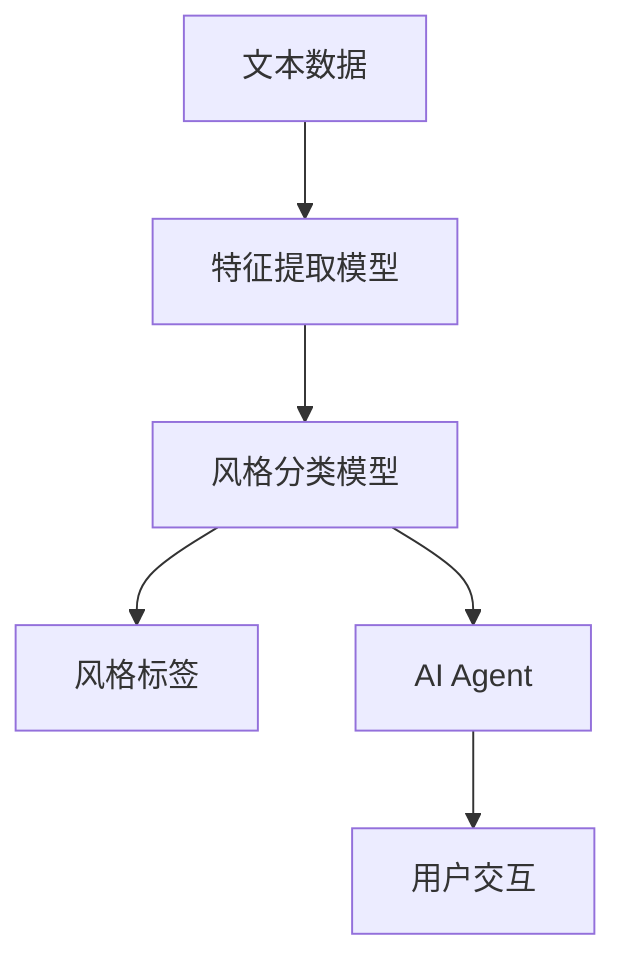
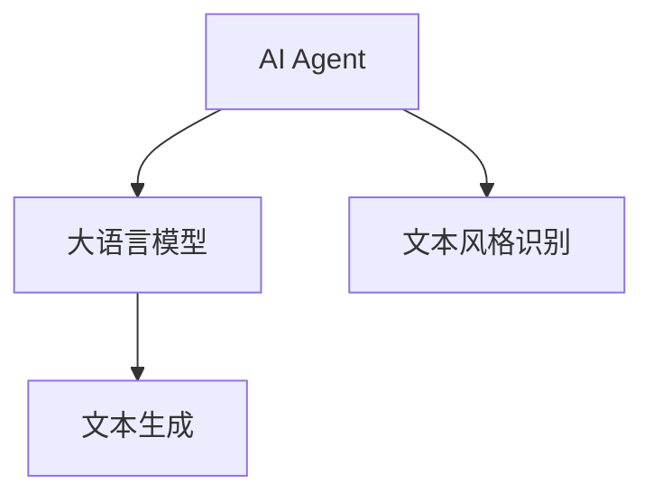
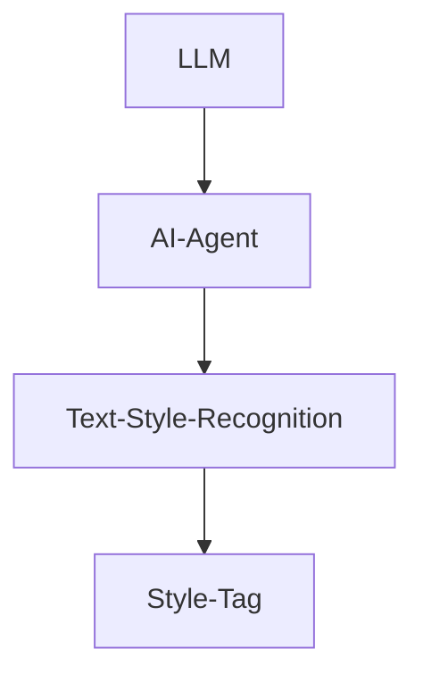
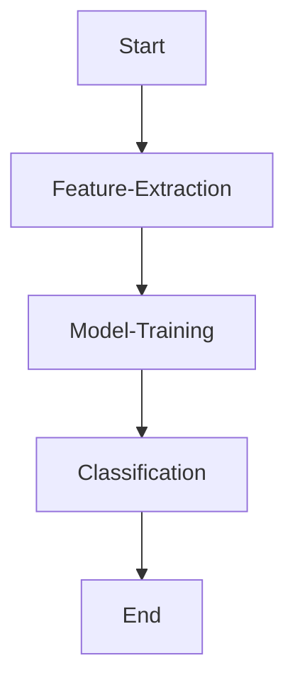

                 


# LLM支持的AI Agent文本风格识别

## 关键词：LLM、AI Agent、文本风格识别、NLP、深度学习

## 摘要

本文深入探讨了如何利用大语言模型（LLM）支持的AI Agent来实现文本风格识别。文章从背景介绍、核心概念、算法原理、系统架构、项目实战到最佳实践等方面展开，详细分析了文本风格识别的技术细节和实际应用。通过结合LLM的强大的语言理解和生成能力，AI Agent能够更准确、更高效地识别文本风格，为自然语言处理领域提供了新的解决方案。

---

## 第一部分：背景介绍

### 第1章：LLM支持的AI Agent文本风格识别概述

#### 1.1 问题背景

文本风格识别是自然语言处理（NLP）领域的重要任务之一，其目标是通过分析文本内容，判断其风格、语气、情感倾向等特征。传统的文本风格识别方法主要依赖于统计学习和浅层特征提取，但在面对复杂多变的文本数据时，其表现往往有限。

近年来，大语言模型（LLM）的崛起为文本风格识别带来了新的可能性。LLM具有强大的上下文理解和生成能力，能够捕捉到文本中的深层语义信息。AI Agent作为智能化的交互系统，能够结合LLM的能力，实时分析并生成符合特定风格的文本。

#### 1.2 问题描述

文本风格识别的核心问题在于如何准确地提取文本特征，并将其与预定义的风格类别进行匹配。然而，传统方法在处理以下问题时显得力不从心：

1. **特征提取不足**：传统方法通常依赖于词袋模型或TF-IDF特征，难以捕捉语义信息。
2. **训练数据不足**：小规模的训练数据难以支持复杂风格的识别。
3. **动态适应性不足**：面对实时变化的文本数据，传统方法难以快速调整。

LLM支持的AI Agent通过结合深度学习和强化学习技术，能够动态调整其风格识别策略，实时响应用户需求，从而显著提升了文本风格识别的准确性和效率。

#### 1.3 问题解决

结合LLM和AI Agent的技术特点，本文提出了一种新的解决方案：

1. **基于LLM的特征提取**：利用LLM的强大语义理解能力，提取文本的深层特征。
2. **动态风格匹配**：通过AI Agent的实时交互，动态调整风格识别的参数，以适应不同的文本内容。
3. **多模态信息融合**：结合文本、语音、上下文等多种信息源，提升风格识别的准确性。

#### 1.4 边界与外延

文本风格识别的边界主要体现在以下方面：

1. **文本类型限制**：目前主要针对英文和中文的文本进行风格识别，其他语言的支持可能需要额外的训练数据。
2. **风格粒度**：风格的粒度可以从粗到细，例如从“正式”与“非正式”到“幽默”、“讽刺”等更细粒度的风格。
3. **数据依赖性**：风格识别的效果高度依赖于训练数据的质量和多样性。

外延方面，文本风格识别的应用场景可以扩展到：

1. **智能写作助手**：帮助用户生成符合特定风格的文本。
2. **内容推荐系统**：根据用户的阅读偏好推荐相应风格的内容。
3. **情感分析**：结合情感倾向分析，进一步提升风格识别的准确性。

#### 1.5 概念结构与核心要素

文本风格识别的核心要素包括：

1. **文本数据**：输入的文本内容。
2. **风格标签**：预定义的风格类别，如“正式”、“非正式”、“幽默”等。
3. **特征提取模型**：用于从文本中提取特征的模型，如BERT、GPT等。
4. **风格分类模型**：用于将提取的特征映射到预定义的风格类别。
5. **AI Agent**：用于协调特征提取、分类和交互的智能化系统。

概念结构如下：



---

## 第二部分：核心概念与联系

### 第2章：LLM与AI Agent的核心原理

#### 2.1 LLM的基本原理

大语言模型（LLM）基于深度学习技术，通过大量的文本数据进行预训练，形成了强大的语义理解和生成能力。其核心原理包括：

1. **预训练**：利用大规模的文本数据进行无监督学习，提取语言模型的参数。
2. **微调**：在特定任务上进行有监督微调，提升模型的性能。
3. **生成机制**：通过解码器生成符合上下文的文本。

LLM的关键特点：

| 特性 | 描述 |
|------|------|
| 参数规模 | 通常在 billions 级别 |
| 上下文理解 | 能够理解长上下文中的语义关系 |
| 多任务能力 | 可以同时处理多种NLP任务 |

#### 2.2 AI Agent的基本原理

AI Agent是一种智能化的交互系统，能够感知环境、理解用户需求，并通过决策和执行来完成任务。其核心原理包括：

1. **感知**：通过传感器或API获取环境中的数据。
2. **理解**：利用NLP技术理解用户的需求或意图。
3. **决策**：基于理解结果，生成相应的响应或操作。
4. **执行**：通过调用外部服务或触发预设流程，完成决策任务。

AI Agent与LLM的结合：



#### 2.3 核心概念的对比分析

LLM与传统NLP模型的对比：

| 对比维度 | LLM | 传统NLP模型 |
|----------|------|--------------|
| 参数规模 | 大（billions级别） | 小（百万级别） |
| 上下文理解 | 强大 | 较弱 |
| 多任务能力 | 强 | 较弱 |

AI Agent与传统文本分类的对比：

| 对比维度 | AI Agent | 传统文本分类 |
|----------|-----------|---------------|
| 智能性 | 高 | 低 |
| 实时性 | 高 | 低 |
| 交互性 | 高 | 低 |

#### 2.4 实体关系图



---

## 第三部分：算法原理

### 第3章：文本风格识别的算法原理

#### 3.1 基于特征的分类算法

1. **特征提取**：
   - 使用词袋模型或TF-IDF提取文本特征。
   - 示例代码：
     ```python
     from sklearn.feature_extraction.text import TfidfVectorizer

     vectorizer = TfidfVectorizer()
     X = vectorizer.fit_transform(corpus)
     ```

2. **分类模型**：
   - 使用SVM或随机森林进行分类。
   - 示例代码：
     ```python
     from sklearn import svm

     clf = svm.SVC()
     clf.fit(X, y)
     ```

3. **性能评估**：
   - 使用准确率、召回率和F1分数评估模型性能。

#### 3.2 基于深度学习的分类算法

1. **模型选择**：
   - 使用预训练的BERT模型进行特征提取。
   - 示例代码：
     ```python
     import transformers

     model = transformers.BertModel.from_pretrained('bert-base-uncased')
     tokenizer = transformers.BertTokenizer.from_pretrained('bert-base-uncased')
     ```

2. **微调模型**：
   - 在特定任务上进行微调。
   - 示例代码：
     ```python
     from transformers import BertForSequenceClassification

     model = BertForSequenceClassification.from_pretrained('bert-base-uncased', num_labels=5)
     ```

3. **数学模型**：
   - 概率论中的贝叶斯定理：
     $$ P(y|x) = \frac{P(x|y)P(y)}{P(x)} $$
   - 多层感知机（MLP）：
     $$ y = f(Wx + b) $$

#### 3.3 算法流程图



---

## 第四部分：系统分析与架构设计

### 第4章：系统分析与架构设计方案

#### 4.1 问题场景介绍

- **场景描述**：用户输入一段文本，AI Agent需要识别其风格并生成相应风格的文本。
- **关键问题**：
  - 如何高效地提取文本特征？
  - 如何动态调整风格识别策略？

#### 4.2 系统功能设计

1. **领域模型**：
   - 用户输入文本。
   - AI Agent分析文本特征并识别风格。
   - 根据识别结果生成相应风格的文本。

2. **系统架构设计**：
   ```mermaid
   graph LR
       AI-Agent --> LLM-Service
       AI-Agent --> Text-Feature-Extractor
       LLM-Service --> Text-Generator
   ```

3. **系统接口设计**：
   - 输入接口：文本输入。
   - 输出接口：风格标签和生成文本。

4. **系统交互流程**：
   ```mermaid
   graph TD
       User --> AI-Agent
       AI-Agent --> LLM-Service
       LLM-Service --> Text-Generator
       Text-Generator --> User
   ```

---

## 第五部分：项目实战

### 第5章：项目实战

#### 5.1 环境安装

```bash
pip install transformers
pip install sklearn
pip install mermaid
```

#### 5.2 核心代码实现

1. **特征提取与分类**：
   ```python
   from sklearn.feature_extraction.text import TfidfVectorizer
   from sklearn.svm import SVC

   vectorizer = TfidfVectorizer()
   X = vectorizer.fit_transform(corpus)
   clf = SVC()
   clf.fit(X, y)
   ```

2. **深度学习模型实现**：
   ```python
   import transformers

   model = transformers.BertForSequenceClassification.from_pretrained('bert-base-uncased', num_labels=5)
   model.fit(...)
   ```

3. **AI Agent实现**：
   ```python
   class AI-Agent:
       def __init__(self):
           self.llm = transformers.BertForSequenceClassification(...)
       def analyze_style(self, text):
           # 分析文本风格
       def generate_text(self, style):
           # 生成相应风格的文本
   ```

#### 5.3 案例分析

- **案例1**：识别一段新闻报道的风格为“正式”。
- **案例2**：识别一段社交媒体帖子的风格为“非正式”。
- **案例3**：动态调整风格识别参数，适应不同领域的文本数据。

#### 5.4 代码解读与分析

- **特征提取**：使用TF-IDF提取文本特征，适用于小规模数据。
- **深度学习模型**：使用BERT进行特征提取，适用于大规模数据。
- **AI Agent**：通过协调LLM和特征提取模型，实现动态风格识别。

---

## 第六部分：最佳实践

### 第6章：最佳实践

#### 6.1 经验总结

- **数据预处理**：对文本数据进行清洗和标准化，提升模型性能。
- **模型调优**：根据具体任务调整模型参数，优化性能。
- **多模态融合**：结合文本、语音等多种信息源，提升识别准确率。

#### 6.2 注意事项

- **数据隐私**：确保文本数据的隐私安全。
- **模型可解释性**：提升模型的可解释性，便于调试和优化。
- **性能优化**：优化模型推理速度，提升用户体验。

#### 6.3 小结

通过结合LLM和AI Agent的技术特点，本文提出了一种新的文本风格识别解决方案。该方案能够动态调整识别策略，实时响应用户需求，显著提升了风格识别的准确性和效率。

#### 6.4 拓展阅读

- 《Deep Learning for NLP》
- 《Large Language Models for Text Classification》
- 《AI Agent Design and Implementation》

