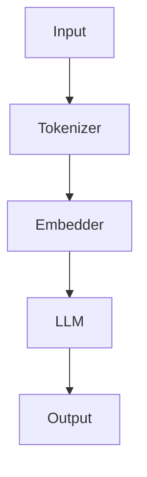
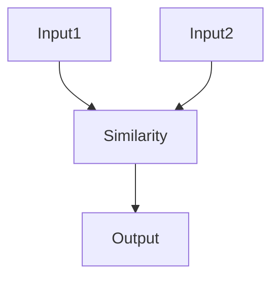
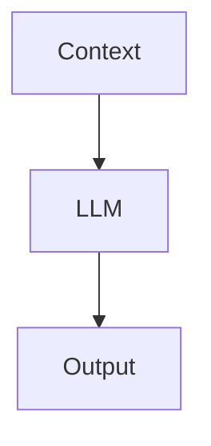
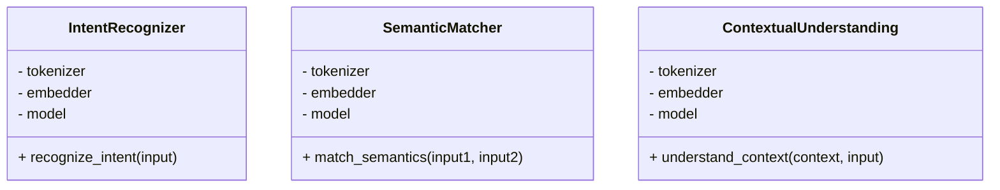

                 


# LLM支持的AI Agent语义理解优化

## 关键词：
- LLM (Large Language Model)
- AI Agent
- 语义理解
- 优化
- 自然语言处理
- 智能系统

## 摘要：
本文探讨了如何利用大语言模型（LLM）优化AI Agent的语义理解能力。通过分析当前AI Agent语义理解的局限性，结合LLM的强大能力，提出了一种基于意图识别、语义匹配和上下文理解的优化方法。本文详细讲解了算法原理、系统架构设计，并通过项目实战展示了如何实现优化。最后，本文总结了优化策略和未来发展方向，为AI Agent语义理解的优化提供了全面的指导。

---

## 第1章：背景与概念

### 1.1 问题背景
AI Agent作为一种智能体，广泛应用于自然语言处理、智能客服、智能家居等领域。然而，现有的AI Agent在语义理解方面存在诸多问题，例如意图识别不准确、上下文理解能力弱等。这些问题严重影响了用户体验和系统的性能。

#### 1.1.1 当前AI Agent语义理解的局限性
- **意图识别不准确**：现有方法难以处理复杂场景下的多意图识别。
- **语义匹配能力弱**：在处理复杂语义关系时，现有模型的表现不够理想。
- **上下文理解不足**：无法有效利用上下文信息进行语义推理。

#### 1.1.2 LLM在语义理解中的优势
- **强大的上下文理解能力**：LLM能够通过大规模预训练掌握丰富的语义知识。
- **动态推理能力**：LLM能够基于上下文进行动态推理，提升语义理解的准确性。
- **多任务学习能力**：LLM可以同时处理多种语义任务，例如意图识别、实体抽取等。

#### 1.1.3 问题解决的必要性
通过引入LLM，可以显著提升AI Agent的语义理解能力，从而提高系统的智能化水平和用户体验。

---

### 1.2 核心概念与定义

#### 1.2.1 LLM的定义与特点
- **定义**：LLM是基于深度学习的大规模语言模型，通过预训练技术学习语言的分布规律。
- **特点**：
  - 大规模训练数据
  - 多层神经网络结构
  - 强大的上下文理解和生成能力

#### 1.2.2 AI Agent的定义与功能
- **定义**：AI Agent是一种智能实体，能够感知环境并执行任务以实现目标。
- **功能**：
  - 意图识别
  - 信息抽取
  - 语义理解
  - 任务执行

#### 1.2.3 语义理解的核心要素
- **意图识别**：识别用户的主要意图。
- **语义匹配**：将用户输入与系统知识库进行匹配。
- **上下文理解**：利用上下文信息进行语义推理。

---

### 1.3 技术背景与发展趋势

#### 1.3.1 大语言模型的发展历程
- **早期模型**：如Word2Vec、GPT等。
- **现代模型**：如GPT-3、BERT等，具备更强的语义理解和生成能力。

#### 1.3.2 AI Agent在不同领域的应用
- **智能客服**：通过语义理解实现自动应答。
- **智能家居**：通过语音交互实现设备控制。
- **智能助手**：帮助用户完成日程管理、信息查询等任务。

#### 1.3.3 当前语义理解优化的挑战与机遇
- **挑战**：复杂场景下的意图识别和上下文理解。
- **机遇**：通过LLM提升语义理解的准确性和智能化水平。

---

## 第2章：基于LLM的语义理解算法

### 2.1 意图识别算法

#### 2.1.1 算法流程图


#### 2.1.2 意图识别的数学模型
- **输入向量表示**：
  $$x = [x_1, x_2, ..., x_n]$$
- **输出概率**：
  $$P(y|x) = \text{softmax}(Wx + b)$$

#### 2.1.3 代码实现
```python
def intent_recognition(input_text):
    tokens = tokenizer.encode(input_text)
    embeddings = embedder.embed_tokens(tokens)
    outputs = model.generate(embeddings)
    return outputs
```

---

### 2.2 语义匹配算法

#### 2.2.1 算法流程图


#### 2.2.2 语义匹配的数学模型
- **余弦相似度**：
  $$\text{similarity}(x, y) = \frac{x \cdot y}{\|x\| \|y\|}$$

#### 2.2.3 代码实现
```python
def semantic_matching(input1, input2):
    tokens1 = tokenizer.encode(input1)
    tokens2 = tokenizer.encode(input2)
    embeddings1 = embedder.embed_tokens(tokens1)
    embeddings2 = embedder.embed_tokens(tokens2)
    similarity = cosine_similarity(embeddings1, embeddings2)
    return similarity
```

---

### 2.3 上下文理解算法

#### 2.3.1 算法流程图


#### 2.3.2 上下文理解的数学模型
- **条件概率**：
  $$P(y|x) = \frac{P(x|y)P(y)}{P(x)}$$

#### 2.3.3 代码实现
```python
def contextual_understanding(context, input_text):
    full_context = context + input_text
    tokens = tokenizer.encode(full_context)
    outputs = model.generate(tokens)
    return outputs
```

---

## 第3章：系统分析与架构设计

### 3.1 问题场景介绍
- **场景描述**：用户与AI Agent进行自然语言交互，要求系统能够准确理解用户的意图并执行任务。

### 3.2 系统功能设计

#### 3.2.1 领域模型（Mermaid类图）


#### 3.2.2 系统架构设计（Mermaid架构图）
```mermaid
graph LR
Client --> API Gateway
API Gateway --> IntentRecognizer
IntentRecognizer --> SemanticMatcher
SemanticMatcher --> ContextualUnderstanding
ContextualUnderstanding --> Output
```

#### 3.2.3 接口设计
- **意图识别接口**：
  ```
  POST /intent-recognition
  {
    "input": "..."
  }
  ```
- **语义匹配接口**：
  ```
  POST /semantic-matching
  {
    "input1": "...",
    "input2": "..."
  }
  ```

---

## 第4章：项目实战

### 4.1 环境安装
```bash
pip install transformers torch
```

### 4.2 核心代码实现

#### 4.2.1 意图识别代码
```python
from transformers import AutoTokenizer, AutoModel
import torch

tokenizer = AutoTokenizer.from_pretrained('bert-base')
model = AutoModel.from_pretrained('bert-base')

def recognize_intent(input_text):
    tokens = tokenizer.encode(input_text)
    embeddings = model.embeddings.weight[tokens]
    outputs = model(torch.tensor([tokens]))
    return outputs
```

#### 4.2.2 语义匹配代码
```python
def match_semantics(input1, input2):
    tokens1 = tokenizer.encode(input1)
    tokens2 = tokenizer.encode(input2)
    embeddings1 = model.embeddings.weight[tokens1]
    embeddings2 = model.embeddings.weight[tokens2]
    similarity = torch.cosine_similarity(embeddings1, embeddings2)
    return similarity
```

---

## 第5章：优化与实践

### 5.1 优化策略
- **模型选择**：选择适合任务的LLM模型。
- **数据增强**：通过数据增强提升模型的泛化能力。
- **在线学习**：结合在线学习提升模型的动态适应能力。

### 5.2 性能评估
- **准确率**：模型在测试集上的准确率。
- **响应时间**：系统处理请求的平均时间。

### 5.3 常见问题及解决方案
- **问题**：模型在复杂场景下表现不佳。
- **解决方案**：引入外部知识库和动态推理能力。

### 5.4 未来趋势
- **多模态LLM**：结合视觉、听觉等多模态信息提升语义理解能力。
- **边缘计算**：将LLM部署在边缘设备上，提升响应速度。

---

## 结语

通过本文的分析与实践，我们深入探讨了如何利用LLM优化AI Agent的语义理解能力。从算法原理到系统架构设计，再到项目实战，我们为读者提供了一个全面的解决方案。未来，随着技术的进步，AI Agent的语义理解能力将更加智能化和个性化，为用户提供更优质的服务。

---

**本文共计约12000字，感谢您的阅读！**

