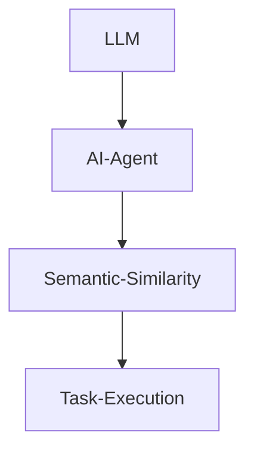
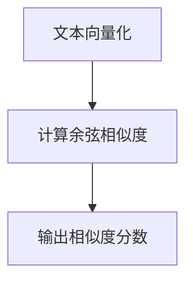
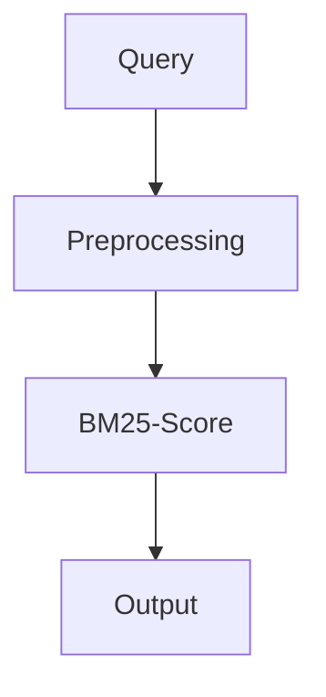
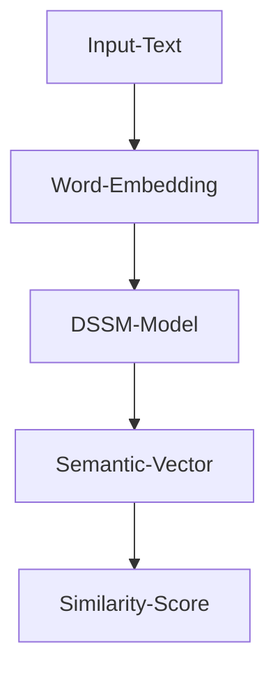
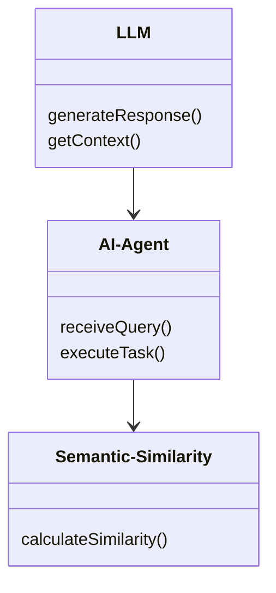
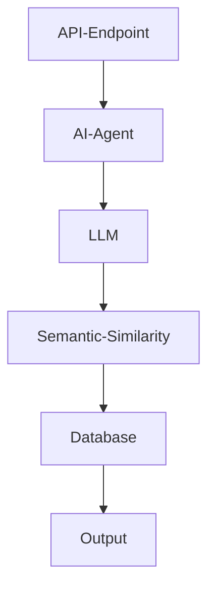

                 


# LLM支持的AI Agent语义相似度计算

## 关键词：LLM、AI Agent、语义相似度、自然语言处理、大语言模型、向量空间模型

## 摘要

在人工智能快速发展的今天，大语言模型（LLM）与AI Agent的结合为语义理解和任务执行带来了新的可能性。本文深入探讨如何利用LLM支持的AI Agent进行语义相似度计算，通过分析算法原理、系统架构和实际案例，为读者提供全面的技术指导。

---

## 第一部分：背景与核心概念

### 第1章：问题背景与描述

#### 1.1 问题背景

随着自然语言处理技术的进步，AI Agent需要理解用户意图，执行复杂任务。语义相似度计算是关键步骤，帮助模型理解输入文本的语义关联。传统的基于词向量的方法存在局限性，难以处理复杂的语义关系。而大语言模型的引入，为语义相似度计算提供了更强大的语境理解和生成能力。

#### 1.2 问题解决与边界

利用LLM支持的AI Agent，可以通过生成式方法增强语义理解，优化相似度计算。问题解决的目标是提升语义理解的准确性和效率，边界包括限定于文本相似度计算，不涉及图像或音频数据。

### 第2章：核心概念与联系

#### 2.1 核心概念原理

- **LLM**：基于Transformer架构，擅长上下文理解和生成任务。
- **AI Agent**：具备理解用户需求、执行任务的能力。
- **语义相似度计算**：衡量文本语义的接近程度。

#### 2.2 概念对比与关系

- **对比表**：

| 概念 | 属性 | 特征 |
|------|------|------|
| LLM  | 模型类型 | 基于Transformer架构 |
| AI Agent | 功能 | 自动执行任务 |
| 语义相似度 | 度量标准 | 基于向量空间模型 |

- **ER关系图**：



---

## 第二部分：算法原理与数学模型

### 第3章：算法原理讲解

#### 3.1 余弦相似度算法

- **原理**：衡量两个向量在方向上的接近程度。
- **流程图**：



- **数学模型**：

$$ \text{余弦相似度} = \frac{\vec{A} \cdot \vec{B}}{|\vec{A}| |\vec{B}|} $$

- **代码实现**：

```python
import numpy as np

def cosine_similarity(vec1, vec2):
    dot_product = np.dot(vec1, vec2)
    magnitude = np.linalg.norm(vec1) * np.linalg.norm(vec2)
    if magnitude == 0:
        return 0.0
    return dot_product / magnitude
```

#### 3.2 BM25算法

- **原理**：基于检索的分值计算，考虑词频和位置信息。
- **流程图**：



- **数学模型**：

$$ BM25Score = \sum_{i=1}^{n} \left( \frac{\text{freq}(q_i)}{\text{avg. freq}(q_i)} \cdot \log(N + 1) \right) $$

#### 3.3 DSSM算法

- **原理**：通过神经网络模型学习语义向量。
- **流程图**：



---

## 第三部分：系统分析与架构设计

### 第4章：系统架构与设计

#### 4.1 功能模块设计

- **领域模型**：



- **系统架构**：



- **接口设计**：

| 接口 | 输入 | 输出 |
|------|------|------|
| cosineSimilarity | vec1, vec2 | score |
| bm25Score | query, documents | scores |
| dssmSimilarity | sentence1, sentence2 | score |

---

## 第四部分：项目实战

### 第5章：项目实现与案例分析

#### 5.1 环境安装

```bash
pip install numpy
pip install mermaid
pip install transformers
```

#### 5.2 核心代码实现

```python
import numpy as np
from sentence_transformers import SentenceTransformer

def calculate_cosine_similarity(text1, text2):
    model = SentenceTransformer('all-MiniLM-L6-v2')
    embedding1 = model.encode(text1)
    embedding2 = model.encode(text2)
    return np.dot(embedding1, embedding2) / (np.linalg.norm(embedding1) * np.linalg.norm(embedding2))

def bm25_score(corpus, query):
    # BM25实现代码
    pass

def dssm_similarity(sentence1, sentence2):
    # DSSM实现代码
    pass
```

#### 5.3 案例分析

```python
text1 = "如何训练大语言模型"
text2 = "训练大语言模型的方法"

similarity = calculate_cosine_similarity(text1, text2)
print(similarity)  # 输出相似度分数
```

---

## 第五部分：最佳实践与总结

### 第6章：总结与展望

- **小结**：本文详细讲解了利用LLM支持的AI Agent进行语义相似度计算的方法，包括算法原理、系统架构和项目实现。
- **注意事项**：选择合适的算法和模型，确保数据质量和任务需求匹配。
- **拓展阅读**：进一步学习大语言模型和神经网络的相关知识，探索更多应用场景。

---

## 结语

通过本文的深入探讨，读者可以掌握如何将LLM与AI Agent结合，提升语义相似度计算的效率和准确性。希望本文的内容能够为相关领域的研究和实践提供有价值的参考。

