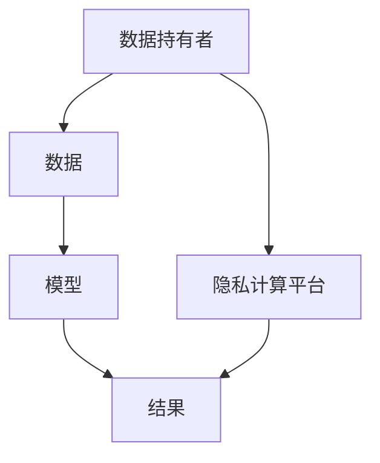
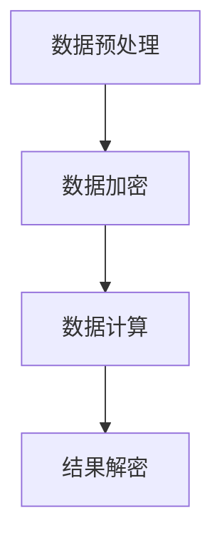
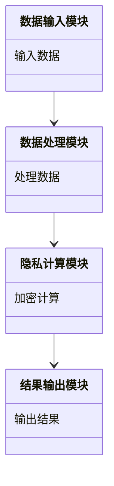
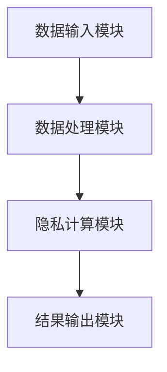
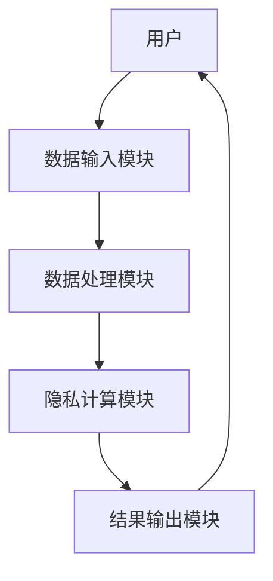

                 


# LLM支持的AI Agent隐私计算技术

## 关键词
LLM, AI Agent, 隐私计算, 同态加密, 分布式计算, 人工智能

## 摘要
本文详细探讨了在AI Agent中利用大语言模型（LLM）进行隐私计算的技术。文章从背景、核心概念、算法原理、系统架构设计、项目实战到最佳实践，全面阐述了这一技术的实现细节和应用场景。通过详细的步骤分析和丰富的案例，帮助读者理解如何在保护数据隐私的前提下，充分发挥LLM在AI Agent中的潜力。

---

# 第1章: LLM支持的AI Agent隐私计算技术概述

## 1.1 问题背景与描述

### 1.1.1 AI Agent的概念与应用
AI Agent（人工智能代理）是一种能够感知环境、自主决策并执行任务的智能实体。它广泛应用于推荐系统、智能助手、自动化运维等领域。随着AI Agent的普及，数据隐私问题日益凸显。

### 1.1.2 LLM在AI Agent中的作用
大语言模型（LLM）通过处理大量文本数据，具备强大的自然语言理解能力。在AI Agent中，LLM可以用于生成回答、分析意图和提供决策支持。然而，LLM对数据的处理方式可能暴露用户隐私。

### 1.1.3 隐私计算技术的必要性
隐私计算是在保护数据隐私的前提下进行计算的技术。它通过加密、分布式计算等手段，确保数据在处理过程中不被泄露。隐私计算对于保护用户隐私至关重要，尤其是在处理敏感数据时。

## 1.2 问题解决与边界

### 1.2.1 隐私计算在AI Agent中的核心问题
- 数据隐私保护：防止敏感信息泄露。
- 计算效率：隐私计算可能引入额外的计算开销。
- 安全性：确保计算过程中的数据安全。

### 1.2.2 技术边界与外延
- 技术边界：仅关注数据隐私保护，不涉及计算结果的公开性。
- 外延：结合区块链、联邦学习等技术，进一步提升隐私保护能力。

### 1.2.3 核心要素与组成结构
- 数据持有者：数据的拥有者。
- 数据模型：用于处理数据的算法模型。
- 隐私计算平台：提供隐私计算服务的平台。

## 1.3 核心概念与联系

### 1.3.1 隐私计算技术原理
隐私计算通过加密技术，确保数据在计算过程中不被泄露。常见的隐私计算技术包括同态加密、秘密分享等。

### 1.3.2 核心概念属性对比表

| 概念       | 描述                                                                 |
|------------|----------------------------------------------------------------------|
| 数据持有者 | 数据的拥有者，通常是用户或组织。                                       |
| 数据模型   | 用于处理数据的算法模型，如机器学习模型。                               |
| 隐私计算平台 | 提供隐私计算服务的平台，如加密计算服务。                               |

### 1.3.3 ER实体关系图（Mermaid）



## 1.4 本章小结
本章介绍了LLM支持的AI Agent隐私计算技术的背景、核心问题及技术边界。通过核心概念的对比和实体关系图，明确了各部分之间的关系。

---

# 第2章: LLM支持的AI Agent隐私计算技术核心概念

## 2.1 核心概念原理

### 2.1.1 隐私计算的基本原理
隐私计算通过加密技术，确保数据在计算过程中不被泄露。常见的隐私计算技术包括同态加密和秘密分享。

### 2.1.2 LLM在隐私计算中的角色
LLM作为AI Agent的核心，负责处理自然语言数据，并通过隐私计算技术保护数据隐私。

### 2.1.3 AI Agent的协同计算机制
AI Agent通过分布式计算和隐私计算技术，实现多个数据持有者之间的协同计算。

## 2.2 核心概念属性对比

### 2.2.1 数据隐私性对比
- 同态加密：数据加密后进行计算，结果正确。
- 秘密分享：数据分割后进行计算，结果正确。

### 2.2.2 计算效率对比
- 同态加密：计算效率较低，但安全性高。
- 秘密分享：计算效率较高，但安全性稍低。

### 2.2.3 安全性对比
- 同态加密：安全性高，但计算效率较低。
- 秘密分享：安全性较高，但计算效率较高。

## 2.3 实体关系图（Mermaid）


## 2.4 本章小结
本章详细解释了隐私计算技术的核心概念和原理，并通过对比分析和实体关系图，明确了各部分之间的关系。

---

# 第3章: LLM支持的AI Agent隐私计算技术算法原理

## 3.1 算法原理概述

### 3.1.1 隐私计算算法的基本原理
隐私计算算法通过加密技术，确保数据在计算过程中不被泄露。常见的隐私计算算法包括同态加密和秘密分享。

### 3.1.2 LLM在算法中的应用
LLM通过处理自然语言数据，生成符合隐私要求的计算结果。

### 3.1.3 AI Agent的协同计算流程
AI Agent通过分布式计算和隐私计算技术，实现多个数据持有者之间的协同计算。

## 3.2 算法实现步骤

### 3.2.1 数据预处理

```python
def preprocess(data):
    # 数据预处理代码
    return processed_data
```

### 3.2.2 数据加密

```python
def homomorphic_encrypt(data, key):
    # 同态加密代码
    return encrypted_data
```

### 3.2.3 数据计算

```python
def compute(encrypted_data, model):
    # 计算代码
    return result
```

### 3.2.4 结果解密

```python
def homomorphic_decrypt(result, key):
    # 解密代码
    return decrypted_result
```

## 3.3 算法原理的数学模型和公式

### 3.3.1 同态加密的基本原理
$$ E(x) = x^k \mod n $$

### 3.3.2 分秘密分的原理
$$ x_i = x \mod n_i $$

## 3.4 算法流程图（Mermaid）



## 3.5 本章小结
本章详细讲解了隐私计算技术的算法原理，并通过代码示例和数学公式，明确了算法的实现细节。

---

# 第4章: LLM支持的AI Agent隐私计算技术系统分析与架构设计

## 4.1 系统分析

### 4.1.1 问题场景介绍
AI Agent需要在保护数据隐私的前提下，协同多个数据持有者进行计算。

### 4.1.2 项目介绍
本项目旨在开发一个支持LLM的AI Agent隐私计算平台。

## 4.2 系统功能设计

### 4.2.1 系统功能模块
- 数据输入模块
- 数据处理模块
- 隐私计算模块
- 结果输出模块

### 4.2.2 系统功能类图（Mermaid）



## 4.3 系统架构设计

### 4.3.1 系统架构图（Mermaid）



### 4.3.2 系统接口设计
- 数据输入接口：接收数据输入。
- 数据处理接口：处理数据。
- 隐私计算接口：执行隐私计算。
- 结果输出接口：输出计算结果。

### 4.3.3 系统交互图（Mermaid）



## 4.4 本章小结
本章分析了系统需求，设计了系统功能模块和架构，并通过类图和交互图明确了系统的结构和流程。

---

# 第5章: LLM支持的AI Agent隐私计算技术项目实战

## 5.1 项目环境安装

```bash
pip install -r requirements.txt
```

## 5.2 项目核心实现

### 5.2.1 数据预处理

```python
def preprocess(data):
    # 数据预处理代码
    return processed_data
```

### 5.2.2 数据加密

```python
def homomorphic_encrypt(data, key):
    # 同态加密代码
    return encrypted_data
```

### 5.2.3 数据计算

```python
def compute(encrypted_data, model):
    # 计算代码
    return result
```

### 5.2.4 结果解密

```python
def homomorphic_decrypt(result, key):
    # 解密代码
    return decrypted_result
```

## 5.3 代码应用解读与分析

### 5.3.1 代码解读
- `preprocess`：对数据进行预处理。
- `homomorphic_encrypt`：对数据进行同态加密。
- `compute`：对加密数据进行计算。
- `homomorphic_decrypt`：对计算结果进行解密。

### 5.3.2 代码实现细节
- 使用Python编写代码，确保代码的可读性和可维护性。
- 通过模块化设计，提高代码的复用性。

## 5.4 实际案例分析

### 5.4.1 案例描述
假设我们有一个AI Agent，需要协同多个数据持有者进行计算，同时保护数据隐私。

### 5.4.2 案例实现
```python
# 案例实现代码
data = "输入数据"
key = "加密密钥"
model = "计算模型"
result = homomorphic_decrypt(compute(homomorphic_encrypt(preprocess(data), key), model), key)
```

## 5.5 本章小结
本章通过实际案例，详细讲解了项目的核心实现和代码应用，帮助读者理解如何在实际中应用隐私计算技术。

---

# 第6章: LLM支持的AI Agent隐私计算技术最佳实践

## 6.1 小结

### 6.1.1 核心知识点总结
- 隐私计算技术的基本原理。
- LLM在AI Agent中的应用。
- 系统架构设计和实现。

### 6.1.2 学习要点总结
- 理解隐私计算技术的核心概念。
- 掌握隐私计算算法的实现细节。
- 熟悉系统架构设计和实现。

## 6.2 注意事项

### 6.2.1 实际应用中的注意事项
- 数据隐私保护的重要性。
- 算法效率的优化。
- 系统安全性的维护。

### 6.2.2 进阶学习建议
- 深入学习隐私计算技术。
- 探索新的隐私保护方法。
- 关注相关领域的最新进展。

## 6.3 拓展阅读

### 6.3.1 推荐书籍
- 《隐私计算技术入门与实践》。
- 《大语言模型与人工智能》。

### 6.3.2 推荐博客
- 知乎专栏：人工智能与隐私计算。
- GitHub项目：隐私计算技术实现。

## 6.4 本章小结
本章总结了学习本技术的核心知识点，并给出了实际应用中的注意事项和学习建议。

---

# 结语
通过本篇文章的详细讲解，读者可以全面了解LLM支持的AI Agent隐私计算技术的核心概念、算法原理、系统架构设计和实际应用。希望本文能够为相关领域的研究和实践提供有价值的参考。

