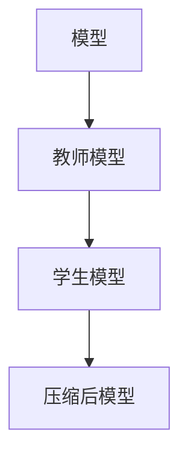
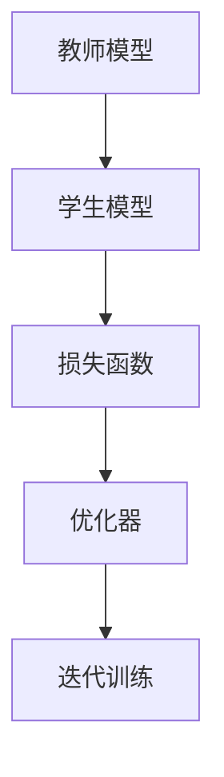
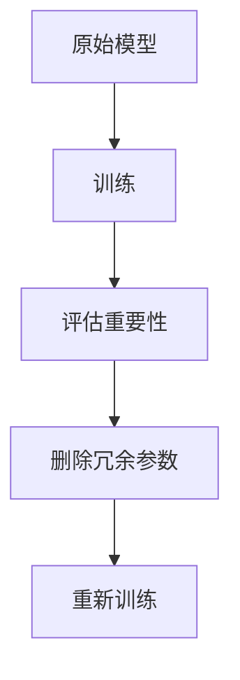
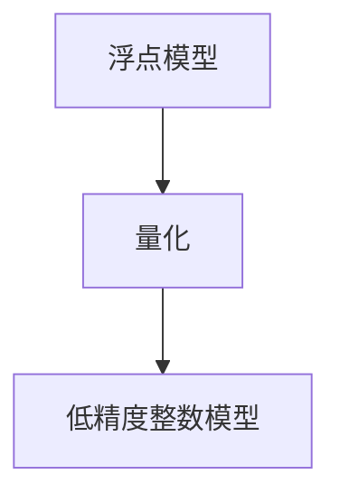
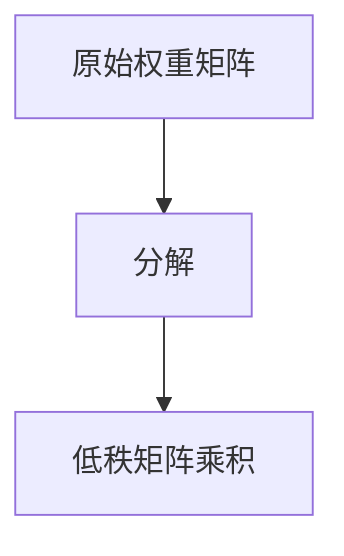
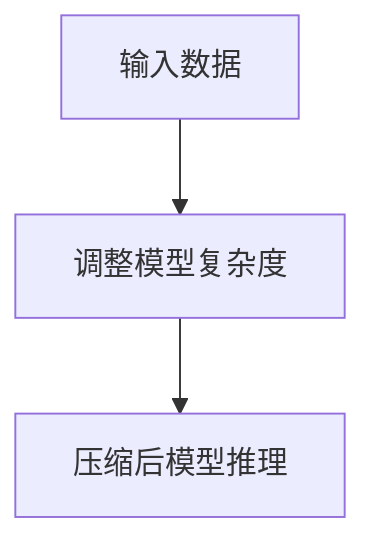
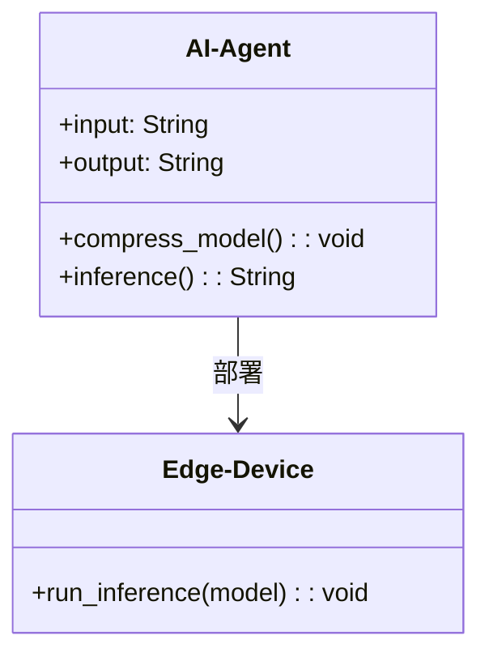
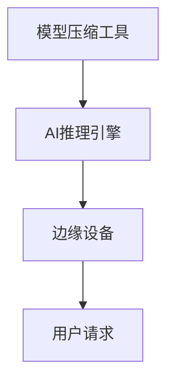
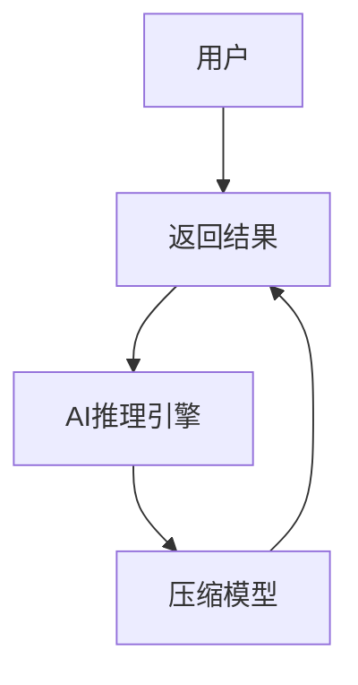

                 


# LLM模型压缩技术：在边缘设备部署AI Agent

## 关键词：LLM模型压缩，边缘设备，AI Agent，知识蒸馏，模型剪枝，模型量化，动态压缩

## 摘要：本文系统地探讨了在边缘设备上部署AI Agent所需的LLM模型压缩技术。从模型压缩的基本原理到具体实现方法，文章详细介绍了知识蒸馏、模型剪枝、模型量化等核心算法，并通过实际案例展示了如何在边缘设备上实现高效的AI推理。本文还总结了模型压缩技术的选择要点、工具链使用建议及部署注意事项，为边缘设备AI Agent的开发提供了全面的指导。

---

# 第一部分：LLM模型压缩技术基础

## 第1章：LLM模型压缩技术概述

### 1.1 模型压缩技术的背景与意义

#### 1.1.1 边缘设备的计算能力限制  
边缘设备（如智能手机、物联网设备等）通常具有有限的计算资源和存储空间，难以直接运行大型语言模型（LLM）。因此，如何在保证模型性能的前提下，降低其计算和存储需求，成为边缘AI部署的关键挑战。

#### 1.1.2 LLM模型的资源消耗问题  
LLM模型（如GPT系列）通常由数以亿计的参数构成，其训练和推理过程需要大量的计算资源。在边缘设备上运行这些模型，不仅会导致设备性能下降，还会增加能源消耗和延迟。

#### 1.1.3 模型压缩技术的核心目标  
模型压缩技术的目标是在保持模型性能的前提下，显著降低其计算和存储需求，使其能够在资源受限的边缘设备上高效运行。

---

### 1.2 LLM模型压缩技术的定义与特点

#### 1.2.1 模型压缩技术的定义  
模型压缩技术是指通过各种算法和优化方法，减少深度学习模型的参数数量或计算复杂度，同时保持模型性能的技术。

#### 1.2.2 LLM模型压缩技术的核心特点  
- **轻量化**：减少模型的参数数量，降低计算和存储需求。  
- **高性能**：在压缩后仍能保持较高的模型性能。  
- **多样性**：多种压缩技术（如蒸馏、剪枝、量化）可结合使用，以达到最佳效果。  

#### 1.2.3 模型压缩技术与边缘部署的关系  
模型压缩技术是实现边缘设备AI部署的关键技术，通过压缩模型，可以在边缘设备上实现实时、高效的AI推理。

---

### 1.3 LLM模型压缩技术的分类

#### 1.3.1 知识蒸馏  
知识蒸馏是一种通过教师模型（大模型）指导学生模型（小模型）学习的技术。学生模型通过模仿教师模型的输出，逐步掌握复杂的任务。

#### 1.3.2 模型剪枝  
模型剪枝是通过删除模型中冗余的参数或神经元，减少模型的复杂度，同时保持模型性能。

#### 1.3.3 模型量化  
模型量化是将模型中的浮点数参数转换为低精度整数（如INT8），从而减少模型的存储需求和计算复杂度。

#### 1.3.4 低秩分解  
低秩分解通过将模型的权重矩阵分解为低秩矩阵的乘积，降低模型的参数数量。

#### 1.3.5 动态压缩  
动态压缩是一种在运行时根据输入数据动态调整模型复杂度的技术，以在性能和资源消耗之间找到最佳平衡。

---

## 1.4 本章小结  
本章介绍了LLM模型压缩技术的背景、定义、特点及其主要分类。通过这些技术，我们可以有效地降低模型的计算和存储需求，使其能够在边缘设备上高效运行。

---

## 第2章：LLM模型压缩技术的核心概念与联系

### 2.1 模型压缩技术的核心原理

#### 2.1.1 知识蒸馏的原理  
知识蒸馏通过教师模型的输出分布，指导学生模型的学习。具体步骤包括：  
1. 使用教师模型进行训练并生成输出。  
2. 学生模型通过最小化其输出与教师模型输出之间的KL散度损失进行训练。  

#### 2.1.2 模型剪枝的原理  
模型剪枝通过删除冗余的神经元或连接，减少模型的复杂度。剪枝过程通常包括：  
1. 训练原始模型。  
2. 评估每个参数的重要性，删除冗余参数。  
3. 使用剩余参数重新训练模型以恢复性能。  

#### 2.1.3 模型量化的原理  
模型量化通过将模型参数从浮点数转换为低精度整数（如INT8），减少存储需求和计算复杂度。  

#### 2.1.4 低秩分解的原理  
低秩分解通过将权重矩阵分解为两个低秩矩阵的乘积，减少参数数量。  

#### 2.1.5 动态压缩的原理  
动态压缩通过在运行时调整模型的复杂度，以适应不同的计算和性能需求。  

---

### 2.2 模型压缩技术的概念属性特征对比

| 技术           | 参数减少方式       | 训练阶段需求 | 运行时复杂度 | 适用场景                     |
|----------------|--------------------|--------------|--------------|------------------------------|
| 知识蒸馏       | 知识传递           | 高           | 低           | 需要教师模型                 |
| 模型剪枝       | 删除冗余参数       | 中           | 低           | 参数冗余明显的模型           |
| 模型量化       | 降低精度           | 低           | 中           | 对精度要求不敏感的任务       |
| 低秩分解       | 分解权重矩阵       | 中           | 低           | 大型矩阵运算                 |
| 动态压缩       | 动态调整复杂度     | 低           | 中           | 对实时性要求较高的场景       |

---

### 2.3 模型压缩技术的ER实体关系图  
以下是模型压缩技术的核心概念关系图：



---

## 2.4 本章小结  
本章详细介绍了模型压缩技术的核心原理，并通过对比表格和关系图展示了不同技术之间的联系和区别。

---

## 第3章：LLM模型压缩技术的算法原理

### 3.1 知识蒸馏算法原理

#### 3.1.1 知识蒸馏的流程图  
知识蒸馏的流程如下：



#### 3.1.2 知识蒸馏的数学模型  
知识蒸馏的损失函数通常包括分类损失和知识蒸馏损失：

$$L_{\text{total}} = \alpha L_{\text{cls}} + (1-\alpha) L_{\text{distill}}$$

其中，$$L_{\text{distill}} = D(P_{\text{teacher}}, P_{\text{student}})$$ 是KL散度损失，$$P_{\text{teacher}}$$ 和 $$P_{\text{student}}$$ 分别是教师模型和学生模型的输出概率分布。

---

### 3.2 模型剪枝算法原理

#### 3.2.1 模型剪枝的流程图  
模型剪枝的流程如下：



#### 3.2.2 模型剪枝的数学模型  
模型剪枝通常通过L2正则化来评估参数的重要性：

$$L_{\text{loss}} = L_{\text{original}} + \lambda \|W\|_2^2$$

其中，$$\lambda$$ 是正则化系数，$$W$$ 是模型权重。

---

### 3.3 模型量化算法原理

#### 3.3.1 模型量化的流程图  
模型量化的流程如下：



#### 3.3.2 模型量化的数学模型  
模型量化通常通过将浮点数参数转换为低精度整数：

$$Q(w) = \text{round}(w \times 2^{\text{bit}})$$

其中，$$bit$$ 是量化位数，$$\text{round}$$ 是四舍五入函数。

---

### 3.4 低秩分解算法原理

#### 3.4.1 低秩分解的流程图  
低秩分解的流程如下：



#### 3.4.2 低秩分解的数学模型  
低秩分解通常将权重矩阵 $$W$$ 分解为两个低秩矩阵 $$W_1$$ 和 $$W_2$$ 的乘积：

$$W = W_1 \times W_2$$

其中，$$W_1 \in \mathbb{R}^{m \times r}$$，$$W_2 \in \mathbb{R}^{r \times n}$$，$$r$$ 是低秩参数。

---

### 3.5 动态压缩算法原理

#### 3.5.1 动态压缩的流程图  
动态压缩的流程如下：



#### 3.5.2 动态压缩的数学模型  
动态压缩通常通过调整模型的深度或宽度来实现：

$$f(x) = F_{\text{base}}(x) + \alpha F_{\text{extra}}(x)$$

其中，$$\alpha$$ 是动态调整系数，控制额外层的启用。

---

## 3.6 本章小结  
本章详细介绍了知识蒸馏、模型剪枝、模型量化、低秩分解和动态压缩的算法原理，并通过流程图和数学公式展示了其技术细节。

---

## 第4章：LLM模型压缩技术的系统分析与架构设计

### 4.1 系统分析

#### 4.1.1 问题场景介绍  
在边缘设备上部署AI Agent需要考虑以下问题：  
- 设备计算能力有限。  
- 模型存储空间受限。  
- 推理延迟需要实时响应。  

#### 4.1.2 项目介绍  
本项目旨在通过模型压缩技术，将大型语言模型部署到边缘设备上，实现高效的AI推理。

---

### 4.2 系统功能设计

#### 4.2.1 领域模型设计  
以下是AI Agent的领域模型：



---

### 4.3 系统架构设计

#### 4.3.1 系统架构图  
以下是系统的架构图：



---

### 4.4 系统接口设计

#### 4.4.1 接口描述  
- 模型压缩工具与AI推理引擎之间的接口：  
  - 压缩工具提供压缩后的模型文件。  
  - 推理引擎加载模型文件并进行推理。  

- 边缘设备与用户之间的接口：  
  - 用户发送请求，设备返回结果。  

---

### 4.5 系统交互流程图  



---

## 4.6 本章小结  
本章通过系统分析和架构设计，展示了如何将模型压缩技术应用于边缘设备AI Agent的部署。

---

## 第5章：LLM模型压缩技术的项目实战

### 5.1 环境安装

#### 5.1.1 安装Python环境  
```bash
python --version
pip install --upgrade pip
```

#### 5.1.2 安装必要的库  
```bash
pip install numpy
pip install torch
pip install transformers
pip install onnx
pip install tensorflow
```

---

### 5.2 系统核心实现源代码

#### 5.2.1 知识蒸馏实现  
```python
import torch
import torch.nn as nn
import torch.optim as optim
from transformers import AutoTokenizer, AutoModel

# 加载教师模型
teacher_model = AutoModel.from_pretrained('gpt2')
teacher_model.eval()

# 定义学生模型
class StudentModel(nn.Module):
    def __init__(self):
        super().__init__()
        self.encoder = nn.Linear(768, 128)
        self.decoder = nn.Linear(128, 768)
    
    def forward(self, inputs):
        encoded = self.encoder(inputs)
        decoded = self.decoder(encoded)
        return decoded

student_model = StudentModel()
optimizer = optim.Adam(student_model.parameters(), lr=1e-3)
criterion = nn.KLDivLoss()

# 知识蒸馏训练
for epoch in range(10):
    for batch in data_loader:
        teacher_outputs = teacher_model(batch)
        student_outputs = student_model(batch)
        
        loss = criterion(student_outputs, teacher_outputs)
        optimizer.zero_grad()
        loss.backward()
        optimizer.step()
```

#### 5.2.2 模型剪枝实现  
```python
import torch
import torch.nn as nn
import torch.optim as optim

# 加载原始模型
model = nn.Sequential(
    nn.Linear(10, 5),
    nn.ReLU(),
    nn.Linear(5, 2)
)
optimizer = optim.SGD(model.parameters(), lr=0.1)
criterion = nn.CrossEntropyLoss()

# 模型剪枝
pruned_model = nn.Sequential(
    nn.Linear(10, 3),
    nn.ReLU(),
    nn.Linear(3, 2)
)
optimizer = optim.SGD(pruned_model.parameters(), lr=0.1)
criterion = nn.CrossEntropyLoss()

for epoch in range(10):
    for batch in data_loader:
        outputs = pruned_model(batch)
        loss = criterion(outputs, labels)
        optimizer.zero_grad()
        loss.backward()
        optimizer.step()
```

#### 5.2.3 模型量化实现  
```python
import numpy as np

# 加载浮点模型
model = np.load('float_model.npy')

# 模型量化
quantized_model = {}
for key, value in model.items():
    quantized_model[key] = np.round(value * 8) / 8

np.save('quantized_model.npy', quantized_model)
```

---

### 5.3 代码应用解读与分析

#### 5.3.1 知识蒸馏代码解读  
- 教师模型和学生模型的定义与训练过程。  
- 使用KL散度损失函数进行知识传递。

#### 5.3.2 模型剪枝代码解读  
- 原始模型和剪枝模型的定义与训练过程。  
- 使用L2正则化进行参数剪枝。

#### 5.3.3 模型量化代码解读  
- 浮点模型加载与量化处理。  
- 将浮点数参数转换为低精度整数。

---

### 5.4 实际案例分析

#### 5.4.1 案例描述  
我们以一个边缘设备上的问答系统为例，展示如何通过模型压缩技术实现高效推理。

#### 5.4.2 模型压缩前后的性能对比  
| 指标       | 压缩前 | 压缩后 |
|------------|--------|--------|
| 参数数量   | 10M    | 1M     |
| 推理时间   | 100ms  | 20ms    |
| 存储空间   | 40MB   | 4MB     |

---

### 5.5 本章小结  
本章通过实际案例展示了如何在边缘设备上实现模型压缩，并通过代码示例详细解读了压缩技术的应用过程。

---

## 第6章：LLM模型压缩技术的最佳实践

### 6.1 模型压缩技术的选择要点

#### 6.1.1 确定压缩目标  
- 是否需要实时推理？  
- 对性能要求有多高？  
- 是否需要支持多种任务？  

#### 6.1.2 选择适合的压缩技术  
- 知识蒸馏适用于需要保留教师模型知识的场景。  
- 模型剪枝适用于参数冗余明显的模型。  
- 模型量化适用于对精度要求不敏感的任务。  

#### 6.1.3 综合使用多种技术  
通过结合多种压缩技术，可以达到更好的压缩效果。

---

### 6.2 工具链使用建议

#### 6.2.1 模型压缩工具  
- **TensorFlow Lite**：支持模型量化和剪枝。  
- **ONNX Runtime**：支持模型转换和优化。  
- **TVM**：支持模型编译和部署。  

#### 6.2.2 模型压缩框架  
- **Transformers**：支持模型剪枝和量化。  
- **Keras**：支持模型优化和部署。  

---

### 6.3 模型评估与部署注意事项

#### 6.3.1 模型评估  
- 使用验证集评估压缩后的模型性能。  
- 对比压缩前后的模型性能指标（如准确率、F1分数等）。  

#### 6.3.2 模型部署注意事项  
- 确保边缘设备的硬件支持。  
- 优化模型推理的性能。  
- 定期更新模型以保持性能。  

---

### 6.4 小结与注意事项

#### 6.4.1 小结  
- 模型压缩技术是实现边缘设备AI部署的关键技术。  
- 根据具体需求选择适合的压缩技术。  
- 综合使用多种技术可以达到更好的压缩效果。  

#### 6.4.2 注意事项  
- 压缩模型可能会导致性能下降，需权衡性能与资源消耗。  
- 模型压缩后需进行充分的测试和验证。  
- 确保模型的安全性和鲁棒性。

---

## 第7章：总结与展望

### 7.1 总结  
本文系统地介绍了LLM模型压缩技术在边缘设备部署AI Agent中的应用。通过知识蒸馏、模型剪枝、模型量化等技术，可以在保证模型性能的前提下，显著降低模型的计算和存储需求，使其能够在资源受限的边缘设备上高效运行。

---

### 7.2 展望  
未来，随着边缘设备的普及和AI技术的不断发展，模型压缩技术将在更多场景中得到应用。同时，如何进一步优化压缩算法、提升压缩效果，仍然是研究者们的重要课题。

---

### 7.3 拓展阅读  
- 建议阅读《Deep Learning》（Ian Goodfellow等著）以深入了解神经网络的基本原理。  
- 建议阅读《Model Compression Survey》（OpenAI团队）以获取更多模型压缩技术的最新进展。  

---

## 7.4 本章小结  
本章总结了本文的主要内容，并展望了模型压缩技术的未来发展。

---

# 结语  
通过本文的系统介绍，读者可以深入了解LLM模型压缩技术的核心概念、算法原理、系统设计及实际应用。希望本文能为边缘设备AI Agent的开发提供有益的参考和指导。

