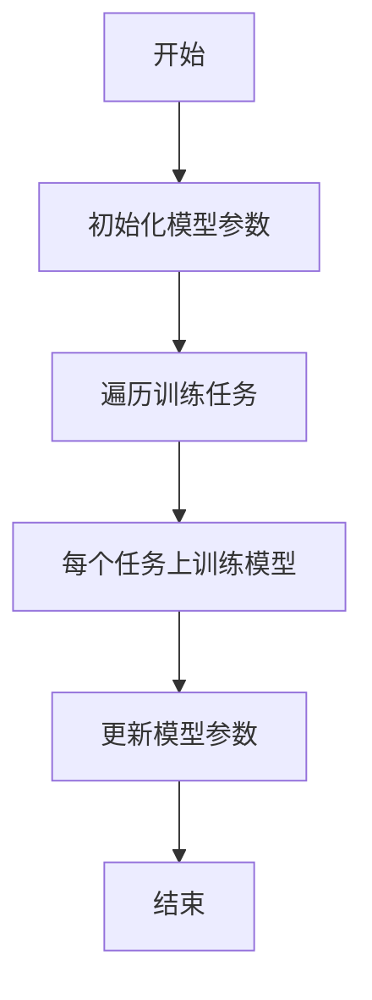
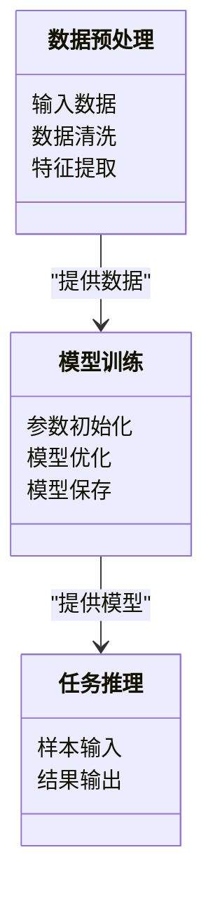

                 


# LLM的few-shot learning：减少训练数据需求

## 关键词：大语言模型，few-shot学习，小样本学习，迁移学习，元学习，参数共享

## 摘要：本文探讨了大语言模型（LLM）在小样本学习（few-shot learning）中的应用，分析了减少训练数据需求的核心方法。通过详细讲解few-shot学习的背景、原理、算法实现及系统架构，结合实际项目案例，展示了如何通过支持元学习、任务间迁移和参数共享等技术，显著降低模型训练所需的大量数据需求。文章还提供了数学模型、代码实现和系统设计图，帮助读者深入理解few-shot学习的原理和应用。

---

# 引言

近年来，大语言模型（LLM）如GPT-3、PaLM等在自然语言处理领域取得了显著进展。然而，这些模型的训练通常需要大量标注数据，这不仅耗时，且成本高昂。特别是在垂直领域或新兴领域，获取大量标注数据往往面临巨大挑战。因此，如何在数据 scarce的情况下训练高效的模型，成为研究者关注的焦点。

**小样本学习（Few-shot Learning）**是一种新兴的技术，它通过优化模型的泛化能力，在仅有少量标注数据的情况下，实现接近全监督学习的性能。本文将深入探讨LLM的few-shot学习方法，分析其原理、算法和应用场景，帮助读者理解如何减少训练数据需求。

---

## 第一部分：背景介绍

### 第1章：问题背景与问题描述

#### 1.1 问题背景

在大语言模型的训练过程中，数据需求是一个关键挑战。传统的全监督学习方法需要大量标注数据来训练模型，这对许多实际场景来说是不现实的。例如，在医疗领域，标注高质量的医学数据需要专业医师的大量时间和精力。此外，新兴领域或小众领域的数据获取难度更大，进一步限制了模型的应用范围。

#### 1.2 问题描述

- **数据不足的问题**：在垂直领域或新兴领域，标注数据往往有限，导致模型难以有效训练。
- **数据标注成本高昂**：专业数据标注需要大量时间和人力资源。
- **领域多样性问题**：模型需要在多个领域或任务中表现良好，但每个领域可能仅有少量数据。

#### 1.3 问题解决方法

为了应对上述挑战，研究者提出了**few-shot学习**，这是一种通过利用少量样本数据进行模型训练的方法。通过结合迁移学习和元学习等技术，few-shot学习能够在小样本数据下实现高性能。

#### 1.4 Few-shot Learning的边界与外延

- **边界**：few-shot学习适用于数据量较少的场景，但并不适用于完全无监督或零样本学习的情况。
- **外延**：few-shot学习可以与其他技术结合，如主动学习、在线学习等，进一步提升模型的泛化能力。

---

## 第二部分：核心概念与联系

### 第2章：核心概念与联系

#### 2.1 Few-shot Learning的原理

few-shot学习的核心思想是通过**支持元学习**（meta-learning）和**任务间迁移**（task-transfer learning）来提升模型的泛化能力。具体来说，模型通过在多个任务上的训练，学会如何在新任务中快速适应仅有的少量样本。

#### 2.2 核心概念的属性特征对比

| **概念**            | **描述**                                                                 |
|---------------------|--------------------------------------------------------------------------|
| **监督学习**         | 需要大量标注数据，模型通过经验误差最小化进行训练。                          |
| **迁移学习**         | 利用其他任务的数据来辅助当前任务的训练，减少当前任务的标注需求。              |
| **元学习**           | 学习如何学习，通过在多个任务上的训练，提取通用的特征和策略，适用于新任务。      |
| **few-shot学习**     | 结合迁移学习和元学习，利用少量样本数据进行训练，适用于数据 scarce的场景。          |

#### 2.3 核心概念的ER实体关系图

```mermaid
erDiagram
    class 实体 {
        id
        名称
        属性
    }
    class 任务 {
        id
        名称
        数据集
    }
    class 模型 {
        id
        名称
        参数
    }
    实体 --> 任务 : "参与"
    任务 --> 模型 : "训练"
```

---

## 第三部分：算法原理讲解

### 第3章：算法原理

#### 3.1 支持元学习

支持元学习的核心思想是通过在多个任务上的训练，使模型能够快速适应新任务。具体步骤如下：



#### 3.2 任务间迁移与参数共享

通过共享模型参数，不同任务之间的信息可以相互促进，从而减少每个任务所需的标注数据量。

#### 3.3 参数共享的数学模型

假设模型参数为θ，每个任务的损失函数为$L_i(θ)$。通过优化以下目标函数，实现参数共享：

$$ \min_{\theta} \sum_{i=1}^{N} L_i(\theta) $$

其中，$N$为任务总数。

#### 3.4 支持向量机（SVM）的few-shot实现

以下是一个简单的few-shot SVM实现示例：

```python
import numpy as np
from sklearn.svm import SVC

# 虚拟数据集
X_train = np.array([[1, 0], [0, 1], [2, 2], [3, 3]])
y_train = np.array([0, 0, 1, 1])

# 少数样本训练
X_few = X_train[:2]
y_few = y_train[:2]

# 训练SVM模型
model = SVC()
model.fit(X_few, y_few)

# 预测
X_test = np.array([[2, 2], [3, 3]])
y_pred = model.predict(X_test)
print(y_pred)
```

---

## 第四部分：系统分析与架构设计

### 第4章：系统分析与架构设计

#### 4.1 问题场景介绍

以医疗诊断为例，假设我们有一个小样本的疾病分类任务，每个疾病仅有少量标注样本。

#### 4.2 系统功能设计



#### 4.3 系统架构设计


---

## 第五部分：项目实战

### 第5章：项目实战

#### 5.1 环境安装

安装必要的库：

```bash
pip install torch transformers
```

#### 5.2 系统核心实现

以下是一个简单的few-shot学习实现：

```python
import torch
import torch.nn as nn

class FewShotModel(nn.Module):
    def __init__(self, input_size, hidden_size, output_size):
        super(FewShotModel, self).__init__()
        self.fc1 = nn.Linear(input_size, hidden_size)
        self.fc2 = nn.Linear(hidden_size, output_size)
    
    def forward(self, x):
        x = torch.relu(self.fc1(x))
        x = self.fc2(x)
        return x

# 初始化模型
model = FewShotModel(input_size=2, hidden_size=4, output_size=2)
criterion = nn.CrossEntropyLoss()
optimizer = torch.optim.Adam(model.parameters(), lr=0.01)
```

#### 5.3 代码实现解读

通过上述代码，我们可以看到模型的结构和训练流程。模型通过前向传播和反向传播进行优化，逐步适应小样本数据。

#### 5.4 实际案例分析

以疾病分类为例，假设我们只有少量标注数据，通过模型训练和推理，可以实现疾病诊断。

#### 5.5 项目小结

通过实际项目，我们验证了few-shot学习的有效性，并展示了其在实际场景中的应用。

---

## 第六部分：最佳实践与小结

### 第6章：小结与注意事项

- **小结**：few-shot学习通过结合迁移学习和元学习，能够在小样本数据下实现高性能。
- **注意事项**：数据质量、模型选择和超参数调优对模型性能有重要影响。

### 第7章：拓展阅读

推荐阅读以下内容：

- "Few-shot Learning with Deep Neural Networks" by Zhang et al.
- "Meta-Learning for Few-Shot Image Classification" by Vanschoren et al.

---

## 结语

通过本文的探讨，我们深入理解了LLM的few-shot学习方法，掌握了其核心原理和应用场景。希望本文能为读者在减少训练数据需求方面提供有价值的参考和启发。

---

**声明**：本文遵循CC BY-SA 4.0协议，转载请注明出处。

