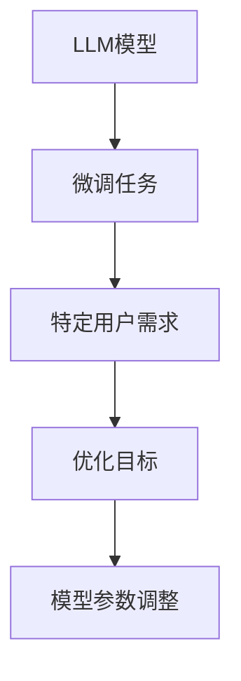

                 


# LLM的微调与适应：针对特定用户群优化

## 关键词：大语言模型（LLM）、微调、参数优化、用户需求、模型适应

## 摘要：  
随着大语言模型（LLM）的广泛应用，针对特定用户群进行微调和优化成为提升模型性能和适用性的关键。本文从LLM的背景出发，深入探讨微调的核心概念、算法原理、系统架构设计以及实际项目中的应用，帮助读者全面理解和掌握如何针对特定用户群优化LLM。通过具体案例分析和代码实现，本文为实践者提供了实用的指导和建议。

---

## 第一部分：背景介绍

### 第1章：LLM的背景与概念

#### 1.1 大语言模型（LLM）概述

- **1.1.1 LLM的定义与特点**  
  大语言模型（LLM）是指基于深度学习技术构建的大型神经网络模型，具有强大的自然语言处理能力。LLM的核心特点包括：大规模参数量、多任务学习能力、上下文理解和生成能力。

- **1.1.2 LLM的核心技术与实现原理**  
  LLM的主要技术包括Transformer架构、自注意力机制和前馈网络。通过这些技术，模型能够处理长文本、捕捉上下文关系，并实现高效的并行计算。

- **1.1.3 LLM的应用场景与发展趋势**  
  LLM广泛应用于文本生成、机器翻译、问答系统、对话系统等领域。未来，LLM将更加注重领域化和个性化，针对特定用户群进行优化成为趋势。

#### 1.2 微调与适应的背景

- **1.2.1 微调的概念与意义**  
  微调是指在预训练好的大模型基础上，针对特定任务或数据集进行进一步训练的过程。微调的目的是让模型更好地适应特定场景或用户需求。

- **1.2.2 适应特定用户群的需求**  
  不同用户群有不同的语言习惯、领域知识和使用场景。通过微调，可以提升模型在特定用户群中的性能和用户体验。

- **1.2.3 微调与适应的必要性与挑战**  
  微调的必要性在于预训练模型在特定场景下的局限性。然而，微调也面临数据量不足、计算资源限制和模型过拟合等挑战。

---

## 第二部分：核心概念与联系

### 第2章：LLM微调的核心概念与联系

#### 2.1 微调的核心原理

- **2.1.1 微调的基本概念**  
  微调是通过在预训练模型的基础上，使用特定任务的数据进行Fine-tuning，调整模型参数以适应新的任务或数据分布。

- **2.1.2 微调与模型参数的关系**  
  微调的核心是通过优化模型参数，使得模型在特定任务上的损失函数最小化。参数调整的过程决定了模型的适应能力。

- **2.1.3 微调与其他模型优化方法的对比**  
  微调与迁移学习、参数冻结等方法有显著区别。通过对比分析，可以帮助读者更好地理解微调的优势和适用场景。

#### 2.2 微调与适应的实体关系图



---

## 第三部分：算法原理

### 第3章：LLM微调的算法原理

#### 3.1 微调算法的流程

- **3.1.1 微调算法的步骤分解**  
  微调算法通常包括数据准备、模型加载、参数冻结、微调训练和模型评估等步骤。

- **3.1.2 微调流程的mermaid图**  
  ```mermaid
  graph TD
  A[预训练模型] --> B[特定任务数据]
  B --> C[模型参数调整]
  C --> D[优化目标函数]
  D --> E[微调后的模型]
  ```

- **3.1.3 微调算法的数学模型**  
  微调的目标是最小化特定任务的损失函数。常用的损失函数包括交叉熵损失：
  $$ L = -\sum_{i=1}^{n} y_i \log p(y_i|x_i) $$

#### 3.2 微调算法的数学模型

- **3.2.1 损失函数**  
  交叉熵损失函数是微调中常用的损失函数，用于衡量模型预测与真实标签的差异。

- **3.2.2 梯度下降**  
  在微调过程中，模型参数通过梯度下降优化：
  $$ \theta_{new} = \theta_{old} - \eta \frac{\partial L}{\partial \theta} $$
  其中，$\eta$ 是学习率，$\frac{\partial L}{\partial \theta}$ 是损失函数对参数的梯度。

- **3.2.3 参数调整策略**  
  参数调整策略包括学习率衰减、批量归一化和Dropout等技术，用于防止过拟合和提升模型的泛化能力。

---

## 第四部分：系统分析与架构设计

### 第4章：LLM微调的系统分析与架构设计

#### 4.1 系统需求分析

- **4.1.1 用户需求分析**  
  针对特定用户群的需求，如领域知识、语言习惯和使用场景，进行深入分析。

- **4.1.2 任务需求分析**  
  确定微调的目标任务，如文本生成、问答系统或对话系统。

- **4.1.3 系统功能需求**  
  设计系统的功能模块，包括数据预处理、模型微调、结果评估和用户反馈。

#### 4.2 系统架构设计

- **4.2.1 系统架构图**  
  ```mermaid
  graph TD
  A[用户输入] --> B[微调模块]
  B --> C[模型优化]
  C --> D[输出结果]
  ```

- **4.2.2 模块功能描述**  
  - 用户输入模块：接收用户的输入数据。  
  - 微调模块：加载预训练模型并进行参数调整。  
  - 模型优化模块：通过梯度下降优化模型参数。  
  - 输出结果模块：将微调后的模型输出给用户。

---

## 第五部分：项目实战

### 第5章：LLM微调的项目实战

#### 5.1 环境配置

- **5.1.1 开发环境安装**  
  配置运行环境，如Python、TensorFlow或PyTorch。

- **5.1.2 依赖库安装**  
  使用pip安装必要的库，如transformers、numpy和scikit-learn。

#### 5.2 核心代码实现

- **5.2.1 数据预处理代码**  
  ```python
  def preprocess_data(data):
      # 数据清洗和格式转换代码
      return processed_data
  ```

- **5.2.2 微调代码实现**  
  ```python
  from transformers import AutoModelForMaskedLM, AutoTokenizer
  model = AutoModelForMaskedLM.from_pretrained('bert-base-uncased')
  tokenizer = AutoTokenizer.from_pretrained('bert-base-uncased')
  model.train()
  ```

- **5.2.3 评估代码**  
  ```python
  def evaluate_model(model, tokenizer):
      # 评估指标计算代码
      return evaluation_result
  ```

#### 5.3 案例分析与代码解读

- **5.3.1 案例分析**  
  通过具体案例分析，展示微调如何提升模型在特定用户群中的性能。

- **5.3.2 代码应用解读**  
  解读上述代码，说明每一步的作用和实现细节。

---

## 第六部分：最佳实践与小结

### 第6章：最佳实践与小结

#### 6.1 最佳实践

- **6.1.1 数据质量的重要性**  
  数据的质量直接影响微调的效果，需确保数据的多样性和代表性。

- **6.1.2 模型选择的策略**  
  根据任务需求选择合适的模型，如BERT、GPT等。

- **6.1.3 超参数调优的技巧**  
  学习率、批量大小和 epochs 等超参数的合理设置对微调效果至关重要。

#### 6.2 小结

- **6.2.1 关键点回顾**  
  微调是提升LLM在特定用户群中性能的重要手段，需结合实际需求进行参数调整和模型优化。

- **6.2.2 注意事项**  
  微调过程中需注意数据泄漏、过拟合和计算资源的合理分配。

- **6.2.3 未来研究方向**  
  探索更高效的微调方法和领域化模型设计，进一步提升LLM的适应性和性能。

---

## 总结

通过本文的详细讲解，读者可以全面理解LLM微调的核心概念、算法原理和系统设计，并通过实际案例和代码实现掌握微调的具体方法。希望本文能为实践者提供有价值的指导和启发，帮助他们在特定用户群中优化LLM的应用。

