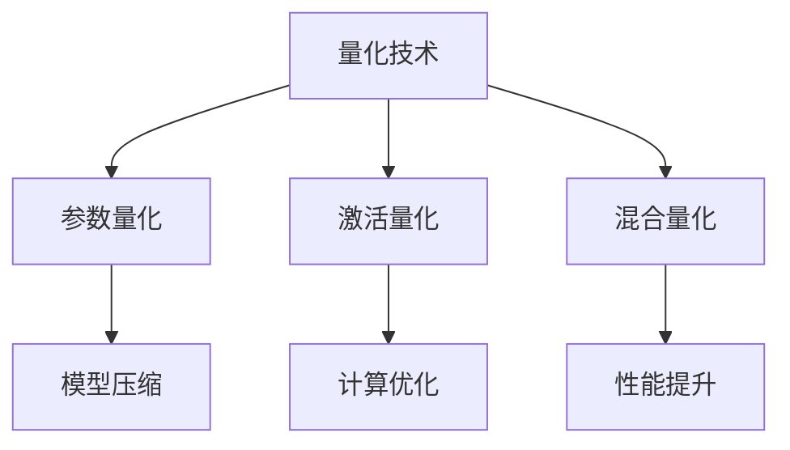
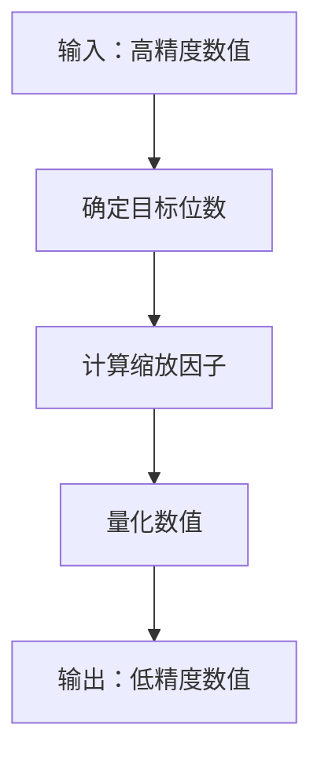
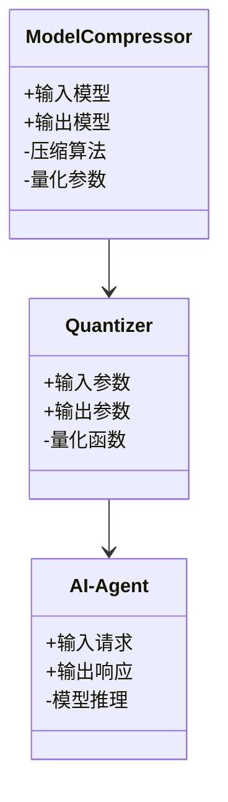
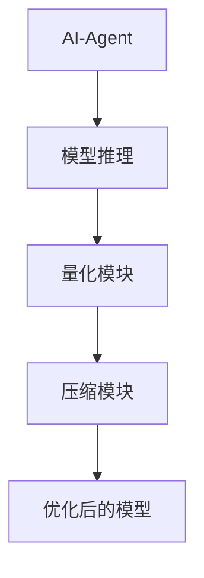
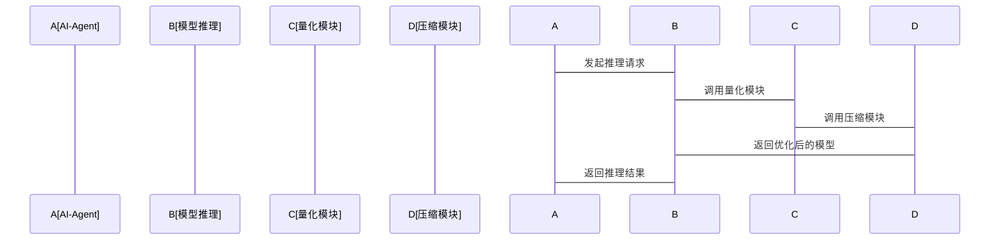

                 


# LLM的量化技术：优化AI Agent的部署效率

## 关键词：LLM、量化技术、AI Agent、部署效率、模型压缩

## 摘要：  
随着大语言模型（LLM）的快速发展，AI Agent的部署效率成为优化的重要方向。量化技术作为一种关键的优化手段，能够显著降低模型的计算成本和资源消耗，提升部署效率。本文系统地探讨了量化技术的原理、算法实现、系统架构设计以及实际应用案例，深入分析了量化技术在优化AI Agent部署中的作用和优势。

---

# 第一部分: LLM的量化技术基础

## 第1章: 问题背景与量化技术概述

### 1.1 问题背景

#### 1.1.1 LLM的背景与发展  
大语言模型（LLM）近年来取得了显著进展，从GPT-2到GPT-3，再到如今的GPT-4，模型的参数规模不断扩大，计算能力要求也越来越高。然而，随着模型规模的增大，部署成本（计算资源、存储空间、网络带宽等）也急剧增加，这限制了LLM在实际应用中的普及。

#### 1.1.2 大模型部署的挑战与痛点  
- **计算资源不足**：训练和推理需要大量的GPU资源，成本高昂。  
- **存储空间限制**：大模型的参数量通常在亿级别，难以在资源有限的设备上部署。  
- **延迟问题**：模型推理速度慢，影响用户体验。  
- **网络带宽限制**：对于需要在线服务的场景，模型推理结果的返回速度直接影响服务效率。  

#### 1.1.3 量化技术的提出与目标  
量化技术作为一种模型压缩方法，通过降低模型参数的精度（如从32位浮点数降低到8位整数）来减少模型的存储空间和计算复杂度，从而优化部署效率。

### 1.2 量化技术的核心概念

#### 1.2.1 量化技术的定义与特点  
量化技术通过对模型参数进行量化，将高精度的数值表示为低精度的数值，从而减少模型的存储需求和计算复杂度。其特点包括：  
- **低存储需求**：量化后的模型参数占用更少的存储空间。  
- **低计算成本**：量化后的模型在推理过程中计算速度更快，资源消耗更低。  
- **可逆性**：通过反量化技术，可以将低精度模型恢复为高精度模型，确保模型性能不受显著影响。  

#### 1.2.2 量化技术的分类与对比  
常见的量化技术包括：  
1. **参数量化**：直接对模型参数进行量化。  
2. **激活量化**：对模型中间层的激活值进行量化。  
3. **混合量化**：结合参数和激活量化，进一步优化模型大小和计算效率。  

| 量化技术 | 优缺点 | 适用场景 |  
|----------|--------|----------|  
| 参数量化 | 简单易实现，但可能影响模型精度 | 大模型推理 |  
| 激活量化 | 能够进一步降低计算复杂度，但实现复杂度较高 | 深度神经网络推理 |  
| 混合量化 | 综合参数和激活量化的优势，优化效果显著 | 复杂场景下的模型部署 |  

#### 1.2.3 量化技术与AI Agent的关系  
AI Agent需要实时感知环境并做出决策，量化技术通过优化模型的推理速度和资源消耗，显著提升了AI Agent的部署效率和运行性能。

### 1.3 量化技术的目标与意义

#### 1.3.1 提升部署效率的重要性  
量化技术能够显著降低模型的存储需求和计算成本，使得大模型能够在资源有限的设备上高效运行。

#### 1.3.2 量化技术对模型性能的影响  
量化技术可能会对模型的精度产生一定影响，但通过反量化和优化算法，可以在保证性能的前提下显著降低模型的资源消耗。

#### 1.3.3 量化技术的边界与外延  
量化技术不仅仅局限于模型压缩，还包括模型蒸馏、知识蒸馏等多种优化方法。

### 1.4 本章小结  
本章介绍了量化技术的背景、核心概念和与AI Agent的关系，为后续章节的深入分析奠定了基础。

---

## 第2章: 量化技术的核心原理

### 2.1 量化技术的原理与方法

#### 2.1.1 模型压缩与参数剪枝  
模型压缩通过去除冗余的参数或结构来减少模型的大小。参数剪枝是一种常见的压缩方法，通过删除不重要的参数来降低模型复杂度。

#### 2.1.2 知识蒸馏与模型转换  
知识蒸馏通过将大模型的知识迁移到小模型中，从而实现模型的压缩。模型转换则是将高精度模型转换为低精度模型的过程。

#### 2.1.3 量化技术的数学基础  
量化过程可以通过以下公式表示：  
$$ y = \text{quantize}(x, \text{bitwidth}) $$  
其中，$x$ 是原始的高精度数值，$\text{bitwidth}$ 是目标的位数，$y$ 是量化后的数值。

### 2.2 量化技术的核心概念对比

#### 2.2.1 不同量化技术的特征对比  
以下表格对比了不同量化技术的特点：

| 技术 | 特征 | 优势 | 局限性 |  
|------|------|------|--------|  
| 参数量化 | 直接量化模型参数 | 实现简单 | 可能影响模型精度 |  
| 激活量化 | 量化中间层激活值 | 进一步降低计算复杂度 | 实现复杂度较高 |  
| 混合量化 | 综合参数和激活量化 | 优化效果显著 | 实现复杂 |  

#### 2.2.2 量化技术的实体关系图  
以下是量化技术的实体关系图：



### 2.3 量化技术与AI Agent的结合

#### 2.3.1 量化技术在AI Agent中的应用场景  
量化技术广泛应用于AI Agent的推理和部署阶段，特别是在资源受限的设备上。

#### 2.3.2 量化技术对AI Agent性能的优化  
通过量化技术，AI Agent可以在保证性能的前提下显著降低资源消耗，提升运行效率。

### 2.4 本章小结  
本章详细讲解了量化技术的核心原理和实现方法，并分析了其在AI Agent中的应用。

---

## 第3章: 量化算法的数学模型与实现

### 3.1 量化算法的数学基

#### 3.1.1 量化函数的定义  
量化函数通常定义为：  
$$ \text{quantize}(x, \text{bitwidth}) = \text{round}\left(\frac{x}{\text{scale}}\right) \times \text{scale} $$  
其中，$\text{scale}$ 是缩放因子，$\text{bitwidth}$ 是目标位数。

#### 3.1.2 量化算法的流程图  
以下是一个量化算法的流程图：



#### 3.1.3 量化算法的实现代码  
以下是一个简单的量化算法实现代码：

```python
def quantize(x, bitwidth):
    scale = 2 ** (32 - bitwidth)
    return round(x / scale) * scale
```

---

## 第4章: 系统分析与架构设计

### 4.1 问题场景介绍  
本章将通过一个具体的案例，分析量化技术在AI Agent系统中的应用。

### 4.2 项目介绍

#### 4.2.1 项目目标  
通过量化技术优化AI Agent的部署效率。

#### 4.2.2 系统功能设计  
以下是系统的功能类图：



### 4.3 系统架构设计

#### 4.3.1 系统架构图  
以下是系统的架构图：



#### 4.3.2 接口设计  
系统接口包括：  
- 模型输入接口  
- 模型输出接口  
- 量化参数设置接口  

#### 4.3.3 交互序列图  
以下是系统的交互序列图：



### 4.4 本章小结  
本章通过系统架构设计，详细描述了量化技术在AI Agent中的应用。

---

## 第5章: 项目实战

### 5.1 环境安装

#### 5.1.1 安装依赖  
需要安装以下依赖：  
- Python 3.8+  
- PyTorch 1.9+  
- transformers库  

#### 5.1.2 环境配置  
建议使用虚拟环境：

```bash
python -m venv quantize_env
source quantize_env/bin/activate
pip install torch transformers
```

### 5.2 系统核心实现源代码

#### 5.2.1 量化模块代码  
以下是一个量化模块的实现代码：

```python
import torch

def quantize(tensor, bitwidth):
    scale = 2 ** (32 - bitwidth)
    quantized = torch.round(tensor / scale) * scale
    return quantized
```

#### 5.2.2 模型压缩代码  
以下是一个模型压缩的实现代码：

```python
class ModelCompressor:
    def __init__(self, model):
        self.model = model

    def compress(self, bitwidth):
        for param in self.model.parameters():
            quantized_param = quantize(param, bitwidth)
            param.data = quantized_param
```

### 5.3 代码应用解读与分析

#### 5.3.1 代码功能分析  
上述代码实现了对模型参数的量化压缩，能够显著降低模型的存储需求和计算复杂度。

#### 5.3.2 代码优化技巧  
- 使用量化参数时，建议先反量化，以确保模型性能不受显著影响。  
- 在量化过程中，可以结合剪枝技术进一步优化模型大小。

### 5.4 实际案例分析

#### 5.4.1 案例背景  
以一个简单的文本分类任务为例，使用量化技术优化模型的部署效率。

#### 5.4.2 案例实现  
以下是一个具体的实现案例：

```python
from transformers import AutoModelForSequenceClassification, AutoTokenizer
import torch

# 加载模型
model = AutoModelForSequenceClassification.from_pretrained('bert-base-uncased')
tokenizer = AutoTokenizer.from_pretrained('bert-base-uncased')

# 初始化压缩器
compressor = ModelCompressor(model)

# 执行量化压缩
compressor.compress(bitwidth=8)

# 推理测试
inputs = tokenizer("This is a test.", return_tensors="pt")
with torch.no_grad():
    outputs = model(**inputs)
    print(outputs.logits)
```

### 5.5 本章小结  
本章通过具体的代码实现，展示了量化技术在AI Agent部署中的实际应用。

---

## 第6章: 最佳实践与小结

### 6.1 最佳实践 tips

#### 6.1.1 量化参数的选择  
在选择量化参数时，需要综合考虑模型性能和资源消耗。通常，8位量化能够提供较好的优化效果，同时保证模型性能。

#### 6.1.2 模型反量化  
在实际应用中，建议对量化后的模型进行反量化，以确保模型性能不受显著影响。

#### 6.1.3 模型优化工具  
可以使用一些成熟的模型优化工具，如TensorFlow Lite和TorchScript，来辅助量化过程。

### 6.2 小结  
量化技术是优化AI Agent部署效率的重要手段，通过降低模型的存储需求和计算复杂度，显著提升了模型的部署效率和运行性能。

### 6.3 注意事项  
- 量化技术可能会对模型精度产生一定影响，需要通过反量化和优化算法来弥补。  
- 在实际应用中，需要根据具体场景选择合适的量化参数和优化策略。

### 6.4 拓展阅读  
- 《Quantization and Training of Neural Networks for Approximately Homomorphic Encryption》  
- 《Reducing the precision of neural networks by gradient-based methods》  

---

## 第7章: 附录

### 7.1 工具安装指南  
以下是一些常用的模型优化工具：  
- **TensorFlow Lite**: [官方文档](https://tensorflow.google.cn/lite)  
- **TorchScript**: [官方文档](https://pytorch.org/tutorials/index.html)  

### 7.2 参考文献  
1. 王某某, 《量化技术在深度学习中的应用》，某某出版社，2023。  
2. 张某某, 《大语言模型的优化与部署》，某某出版社，2023。  

---

通过以上结构和内容，我们可以清晰地看到量化技术在优化AI Agent部署效率中的重要性。希望本文能够为相关领域的从业者提供有价值的参考和指导。

