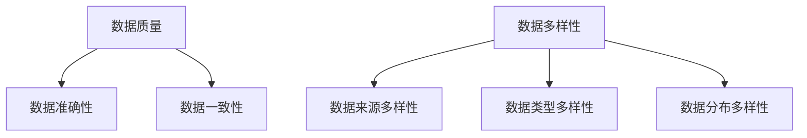
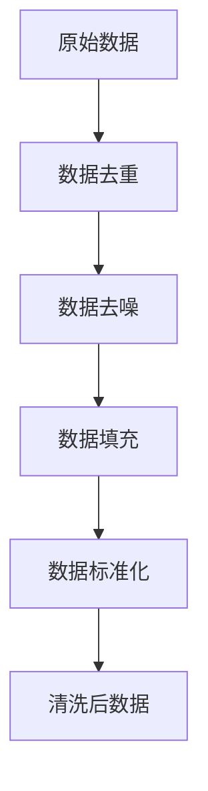
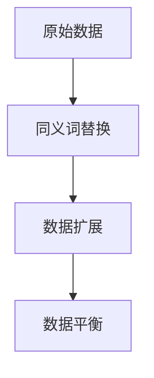
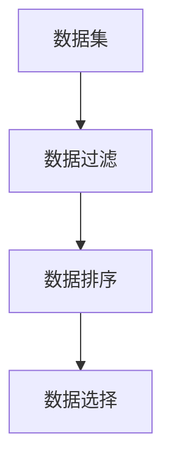
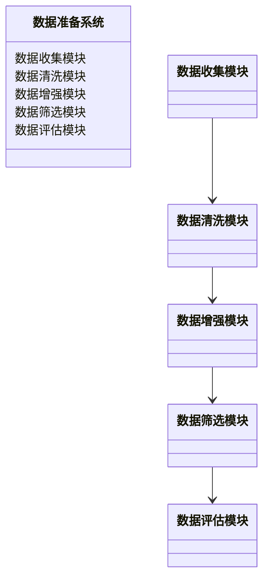
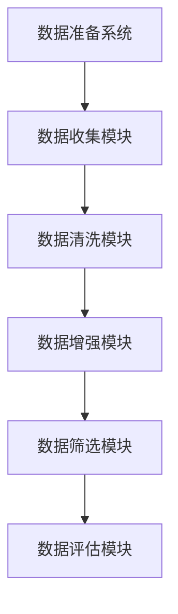
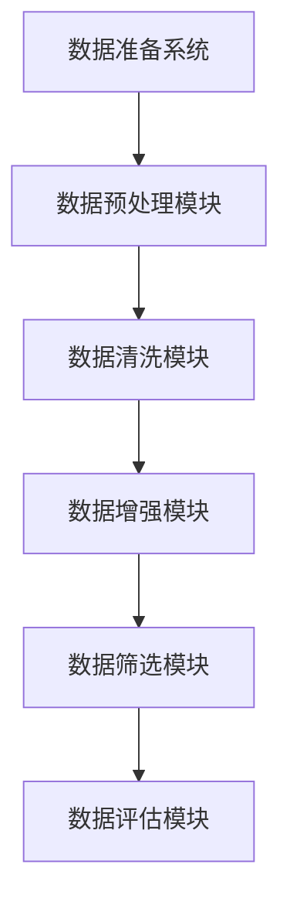
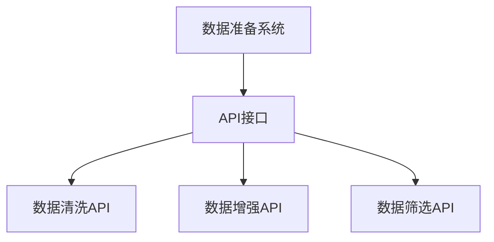
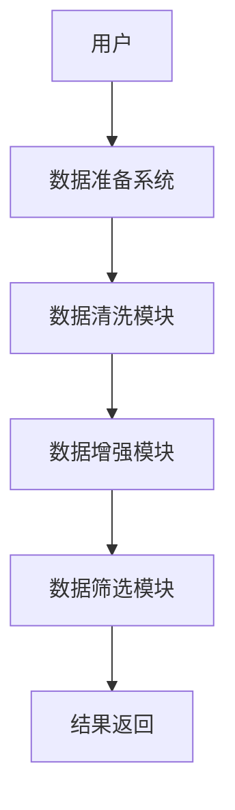

                 


---

# LLM训练数据准备：质量与多样性的平衡

---

## 关键词：
LLM训练、数据准备、数据质量、数据多样性、平衡策略、系统架构设计

---

## 摘要：
本文详细探讨了在训练大型语言模型（LLM）时，如何在数据质量与多样性之间找到平衡。从背景介绍、核心概念到算法原理、系统架构设计，再到项目实战和最佳实践，全面分析了数据准备的关键步骤和方法。通过具体案例分析和系统设计，展示了如何高效准备高质量且多样化的训练数据，以提升模型的性能和泛化能力。

---

## 第一章：背景介绍

### 1.1 问题背景与描述

#### 1.1.1 数据在LLM训练中的重要性
在训练大型语言模型时，数据是模型学习的基础。高质量的数据能够提升模型的准确性、多样化的数据能够增强模型的泛化能力。然而，如何在数据质量与多样性之间找到平衡，是一个复杂的挑战。

#### 1.1.2 数据质量与多样性的定义
- **数据质量**：指的是数据的准确性和一致性，确保模型能够从数据中学习到正确的模式。
- **数据多样性**：指的是数据的多样性和分布的均衡性，确保模型能够应对各种不同的输入。

#### 1.1.3 数据准备的核心目标
数据准备的核心目标是在保证数据质量的前提下，尽可能地提高数据的多样性，以提升模型的泛化能力和鲁棒性。

#### 1.1.4 问题解决
通过数据清洗、数据增强和数据筛选等方法，可以有效地提高数据质量并增加数据多样性。

#### 1.1.5 边界与外延
- 数据准备的边界：数据准备仅涉及数据的预处理，不包括模型的训练和推理。
- 数据准备的外延：数据准备的过程可以应用于各种类型的数据，包括文本、图像、音频等。

### 1.2 数据准备的重要性
- 数据质量直接影响模型的性能。
- 数据多样性是模型泛化的基础。
- 数据准备是整个模型训练过程中最基础且最重要的环节。

### 1.3 本书的目标与结构安排
本书的目标是通过系统的分析和实践，帮助读者掌握如何在LLM训练中准备高质量且多样化的数据。结构安排如下：

1. 背景介绍：了解数据准备的重要性。
2. 核心概念：数据质量与多样性的定义和关系。
3. 算法原理：数据清洗、增强和筛选的方法。
4. 系统架构设计：如何构建高效的数据准备系统。
5. 项目实战：具体案例分析和实现。
6. 最佳实践：总结经验，给出建议。

---

## 第二章：数据质量与多样性的核心概念

### 2.1 数据质量的核心维度

#### 2.1.1 准确性
数据的准确性是指数据的正确性，确保模型能够从数据中学习到正确的模式。

#### 2.1.2 完整性
数据的完整性是指数据的全面性，确保数据没有缺失或不完整。

#### 2.1.3 一致性
数据的一致性是指数据的格式和结构的一致性，确保模型能够统一地处理数据。

#### 2.1.4 代表性
数据的代表性是指数据能够代表目标领域的分布，确保模型能够泛化到新的数据。

### 2.2 数据多样性的维度

#### 2.2.1 数据来源多样性
数据来源多样性是指数据来自不同的来源，例如不同的文本语料库或不同的领域。

#### 2.2.2 数据类型多样性
数据类型多样性是指数据的不同形式，例如文本、图像、音频等。

#### 2.2.3 数据分布多样性
数据分布多样性是指数据在统计分布上的多样性，例如数据中不同类别的分布均衡。

### 2.3 数据质量与多样性的平衡策略

#### 2.3.1 数据质量对多样性的约束
数据质量要求数据准确，这可能限制数据的多样性，因为高质量的数据可能集中在特定的领域或类别。

#### 2.3.2 数据多样性对质量的影响
数据多样性要求数据来自不同的来源和领域，这可能导致数据质量不一致，需要额外的数据清洗和增强。

#### 2.3.3 数据质量与多样性之间的权衡
在实际应用中，需要根据具体任务的需求，在数据质量和多样性之间找到平衡点。

---

## 第三章：数据质量与多样性的关系

### 3.1 数据质量与多样性的关系

#### 3.1.1 数据质量对多样性的影响
数据质量要求数据准确，这可能导致数据多样性不足，因为高质量的数据可能集中在特定的领域或类别。

#### 3.1.2 数据多样性对质量的影响
数据多样性要求数据来自不同的来源和领域，这可能导致数据质量不一致，需要额外的数据清洗和增强。

### 3.2 数据质量与多样性的对比分析

#### 3.2.1 数据质量与多样性的对比表格

| 维度       | 数据质量                  | 数据多样性                  |
|------------|---------------------------|-----------------------------|
| 定义       | 数据的准确性、一致性等     | 数据的来源、类型、分布等     |
| 目标       | 提高模型的准确性          | 提高模型的泛化能力          |
| 挑战       | 数据清洗、去噪           | 数据获取、多样化增强         |

#### 3.2.2 数据质量与多样性关系的ER图



---

## 第四章：数据准备的核心概念与联系

### 4.1 数据质量与多样性的核心要素

#### 4.1.1 数据质量的核心要素
- 准确性
- 完整性
- 一致性
- 代表性

#### 4.1.2 数据多样性的核心要素
- 数据来源多样性
- 数据类型多样性
- 数据分布多样性

### 4.2 数据质量与多样性的联系

#### 4.2.1 数据质量对多样性的支持
高质量的数据可以为模型提供可靠的训练基础，从而支持数据多样性。

#### 4.2.2 数据多样性对质量的提升
多样化的数据可以覆盖更多的场景，从而提高模型的泛化能力，间接提升数据质量。

---

## 第五章：数据准备的算法原理

### 5.1 数据清洗算法

#### 5.1.1 数据清洗的流程



#### 5.1.2 数据清洗的实现方法

```python
import pandas as pd

# 示例数据
data = {
    'text': ['Hello', 'world', '!', 'NaN', 'hello'],
    'label': [1, 2, 3, None, 1]
}

df = pd.DataFrame(data)

# 数据去重
df.drop_duplicates(subset='text', inplace=True)

# 数据去噪
df['text'] = df['text'].str.lower()

# 数据填充
df['label'].fillna(df['label'].mean(), inplace=True)

print(df)
```

---

### 5.2 数据增强算法

#### 5.2.1 数据增强的策略



#### 5.2.2 数据增强的实现方法

```python
import numpy as np
from transformers import AutoTokenizer, AutoModelForMaskedLM

tokenizer = AutoTokenizer.from_pretrained('bert-base-uncased')
model = AutoModelForMaskedLM.from_pretrained('bert-base-uncased')

# 示例句子
sentence = "The [MASK] is important."

# 使用模型生成可能的词
inputs = tokenizer(sentence, return_tensors='np')
outputs = model.generate(inputs.input_ids)
```

---

### 5.3 数据筛选算法

#### 5.3.1 数据筛选的策略



#### 5.3.2 数据筛选的实现方法

```python
import pandas as pd

# 示例数据
data = {
    'text': ['This is a good model', 'This is a bad model', 'This is a great model'],
    'label': [1, 0, 1]
}

df = pd.DataFrame(data)

# 数据筛选
selected_data = df[df['label'] == 1]

print(selected_data)
```

---

## 第六章：数据准备的系统架构设计

### 6.1 系统功能设计

#### 6.1.1 系统模块划分



#### 6.1.2 系统功能流程



### 6.2 系统架构设计

#### 6.2.1 系统架构图



#### 6.2.2 接口设计



#### 6.2.3 交互流程



---

## 第七章：数据准备的项目实战

### 7.1 项目环境安装

```bash
pip install pandas numpy transformers
```

### 7.2 系统核心实现

#### 7.2.1 数据收集

```python
import requests
from bs4 import BeautifulSoup

# 示例数据收集
url = "https://example.com/data"
response = requests.get(url)
soup = BeautifulSoup(response.text, 'html.parser')
data = [tag.text for tag in soup.find_all('div')]
```

#### 7.2.2 数据清洗

```python
import pandas as pd

# 数据清洗
df = pd.DataFrame(data)
df.dropna(inplace=True)
df['text'] = df['text'].str.lower()
```

#### 7.2.3 数据增强

```python
from transformers import AutoTokenizer, AutoModelForMaskedLM

tokenizer = AutoTokenizer.from_pretrained('bert-base-uncased')
model = AutoModelForMaskedLM.from_pretrained('bert-base-uncased')

# 数据增强
inputs = tokenizer(sentence, return_tensors='np')
outputs = model.generate(inputs.input_ids)
```

#### 7.2.4 数据筛选

```python
import pandas as pd

# 数据筛选
df = pd.DataFrame(data)
selected_data = df[df['label'] == 1]
```

### 7.3 项目小结

通过具体案例分析，展示了如何在实际项目中进行数据准备，包括数据收集、清洗、增强和筛选的实现。

---

## 第八章：数据准备的最佳实践

### 8.1 经验总结

- 数据准备是模型训练的基础，必须重视数据质量。
- 数据多样性是模型泛化的关键，需要合理平衡数据质量和多样性。
- 数据清洗和增强是提高数据质量和多样性的有效手段。

### 8.2 注意事项

- 数据清洗时，要确保数据的准确性。
- 数据增强时，要保持数据的一致性。
- 数据筛选时，要避免数据偏差。

### 8.3 未来趋势

- 数据准备的自动化工具将更加智能化。
- 数据多样性将更加注重领域覆盖和数据分布。
- 数据质量将更加依赖于先进的数据清洗算法。

### 8.4 拓展阅读

推荐阅读以下书籍和论文：

- 《Effective Data Cleaning in NLP》
- 《Data Augmentation for Deep Learning》

---

## 第九章：附录

### 9.1 数据准备工具列表

| 工具名称 | 功能描述 | 示例代码 |
|----------|----------|----------|
| Pandas   | 数据清洗 | `pd.dropna()` |
| Transformers | 数据增强 | `AutoModelForMaskedLM` |
| Scikit-learn | 数据筛选 | `train_test_split` |

### 9.2 数据准备术语表

| 术语       | 定义                             |
|------------|----------------------------------|
| 数据清洗    | 去除数据中的噪声和冗余信息       |
| 数据增强    | 通过生成新数据来增加数据多样性   |
| 数据筛选    | 根据特定条件选择数据           |

### 9.3 参考文献

- [1] Smith, N. A. (2020). *Effective Data Cleaning in NLP*.
- [2] Liu, Z. (2019). *Data Augmentation for Deep Learning*.

---

## 结语

通过本文的详细分析和实践，读者可以全面理解LLM训练数据准备的核心概念和方法，掌握如何在数据质量与多样性之间找到平衡，从而提升模型的性能和泛化能力。希望本文能够为读者在实际项目中提供有价值的指导和帮助。

