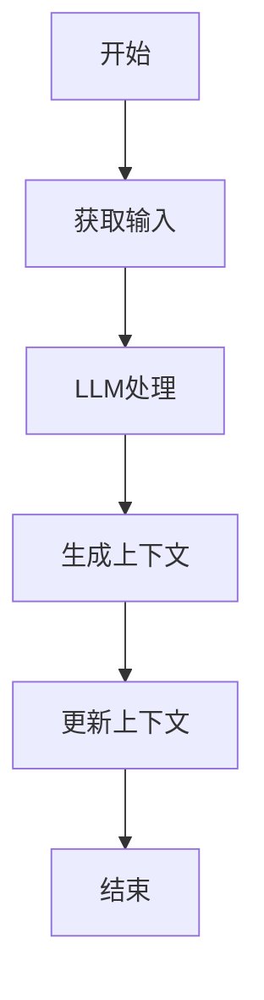
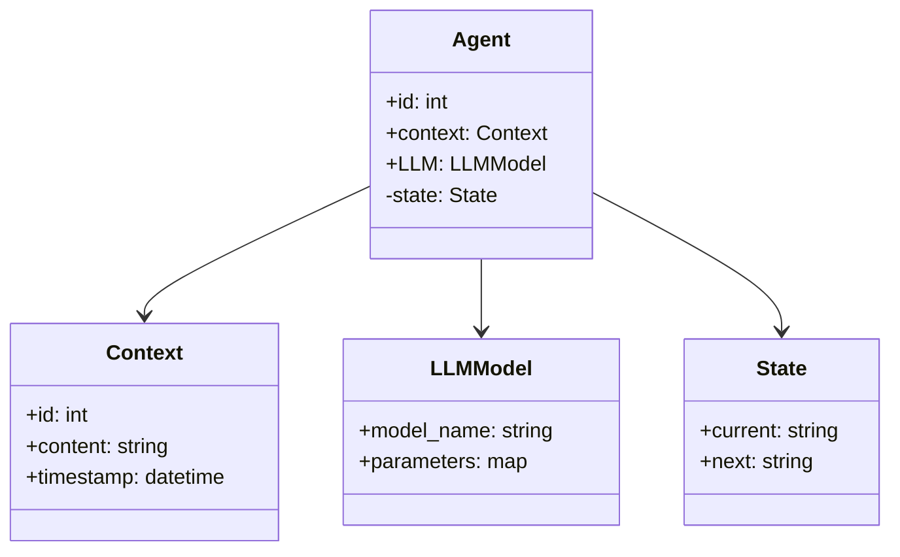
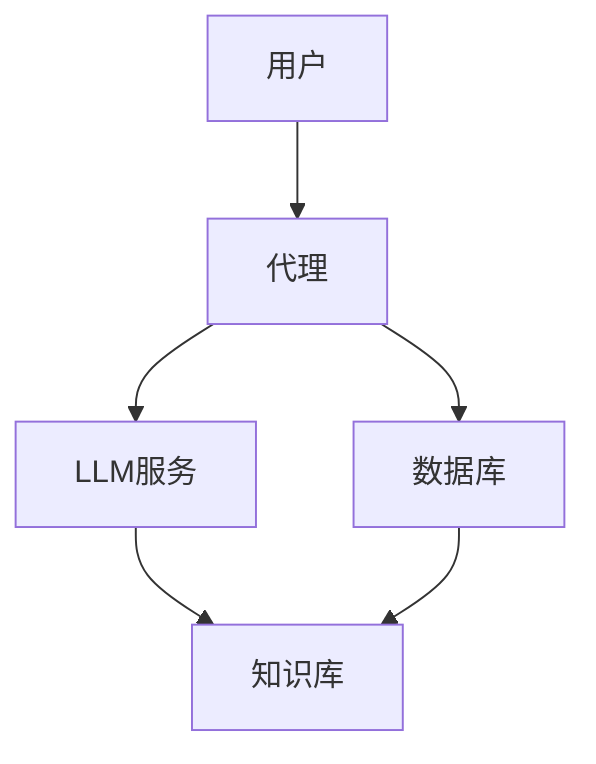
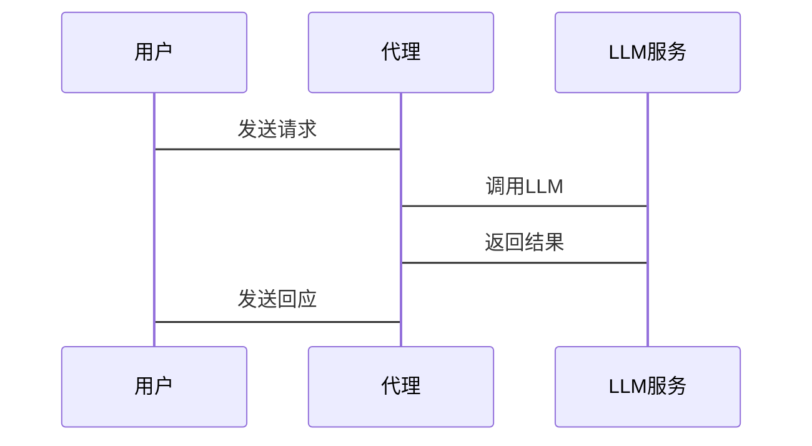

                 


# LLM驱动的AI Agent上下文管理技术

## 关键词：LLM, AI Agent, 上下文管理, 知识图谱, 动态更新, 多模态数据

## 摘要：  
随着大语言模型（LLM）技术的快速发展，AI Agent（智能代理）在各个领域的应用越来越广泛。然而，AI Agent的核心能力依赖于对上下文的高效管理和利用。本文深入探讨了基于LLM的AI Agent上下文管理技术，从核心原理、算法实现到系统架构设计，全面分析了上下文管理的关键技术与应用实践。文章结合实际案例，详细讲解了如何通过知识图谱构建、实时上下文同步和多模态数据融合等技术，提升AI Agent的智能性和实用性。

---

## 第1章: LLM驱动的AI Agent背景与概念

### 1.1 问题背景与挑战  
随着人工智能技术的快速发展，AI Agent（智能代理）逐渐成为实现智能化系统的核心技术之一。AI Agent通过与用户或环境交互，能够自主决策并执行任务，其能力高度依赖于对上下文的准确理解和有效管理。然而，传统的上下文管理技术在面对复杂场景时，往往难以满足实时性、动态性和多模态数据融合的需求。因此，如何利用大语言模型（LLM）的强大能力，提升AI Agent的上下文管理能力，成为当前研究的热点问题。

#### 1.1.1 AI Agent的基本概念  
AI Agent是一种能够感知环境、自主决策并执行任务的智能实体。它可以是一个软件程序，也可以是一个物理设备，通过与用户或环境交互，完成特定的目标。AI Agent的核心能力包括感知、推理、规划和执行。

#### 1.1.2 LLM在AI Agent中的作用  
大语言模型（LLM）通过其强大的自然语言处理能力，能够理解、生成和推理文本信息。在AI Agent中，LLM主要用于处理复杂的上下文信息，提供智能决策支持。例如，LLM可以分析用户的历史对话记录，理解用户的意图，并生成合适的回应。

#### 1.1.3 上下文管理的核心问题  
上下文管理是AI Agent实现智能交互的关键技术之一。它涉及到上下文的表示、存储、推理和更新等问题。如何在动态变化的环境中，实时维护和更新上下文信息，是LLM驱动的AI Agent面临的核心挑战。

### 1.2 核心概念与定义  
在LLM驱动的AI Agent系统中，上下文管理是一个复杂的系统工程。我们需要明确各个核心概念的定义及其相互关系。

#### 1.2.1 LLM驱动的AI Agent定义  
LLM驱动的AI Agent是一种基于大语言模型的智能代理，能够通过自然语言处理技术，理解和生成上下文信息，并根据上下文进行推理和决策。

#### 1.2.2 上下文管理的定义与特征  
上下文管理是指在AI Agent运行过程中，对上下文信息的表示、存储、推理和更新的全过程进行管理和优化。其主要特征包括动态性、实时性和多模态性。

#### 1.2.3 相关概念对比分析  
为了更好地理解LLM驱动的AI Agent上下文管理技术，我们需要将其与其他相关技术进行对比分析。例如，传统的上下文管理技术主要依赖于规则引擎，而LLM驱动的上下文管理则更加注重数据的语义理解和生成能力。

### 1.3 技术背景与发展趋势  
随着大语言模型技术的快速发展，AI Agent的应用场景也在不断扩展。从智能客服到自动驾驶，从智能助手到机器人控制，LLM驱动的AI Agent正在改变我们的生活方式。

#### 1.3.1 大语言模型的发展历程  
大语言模型的发展经历了多个阶段，从最初的词袋模型到现在的多模态大语言模型，每一次技术的进步都为AI Agent的上下文管理提供了新的可能性。

#### 1.3.2 AI Agent技术的演进  
AI Agent技术从最初的基于规则的实现，逐步发展到基于机器学习的实现，再到现在的基于大语言模型的实现，每一次技术的升级都带来了性能的显著提升。

#### 1.3.3 当前技术趋势与挑战  
当前，LLM驱动的AI Agent技术正在朝着多模态、实时性和智能化方向发展。然而，如何在复杂场景下实现高效的上下文管理，仍然是一个需要解决的技术难题。

### 1.4 本章小结  
本章主要介绍了LLM驱动的AI Agent上下文管理技术的背景、核心概念和相关技术。通过对比分析，我们明确了LLM驱动的AI Agent上下文管理技术的独特优势和面临的挑战。

---

## 第2章: 上下文管理的原理与机制  

### 2.1 核心原理  
上下文管理的核心原理在于如何有效地表示、存储、推理和更新上下文信息。通过结合LLM的强大能力，我们可以实现更高效的上下文管理。

#### 2.1.1 上下文表示与存储  
上下文表示是指将上下文信息转化为计算机可以理解的形式。常见的表示方法包括向量表示和符号表示。上下文存储则需要考虑存储的效率和一致性。

#### 2.1.2 知识关联与推理  
知识关联是指将上下文中的不同元素建立关联，形成知识网络。知识推理则是基于这些关联，进行逻辑推理，从而得出新的结论。

#### 2.1.3 动态更新与维护  
上下文是一个动态变化的过程，需要实时更新和维护。动态更新的核心在于如何快速响应变化，并保持上下文的一致性。

### 2.2 关键技术  
上下文管理的关键技术包括知识图谱构建、实时上下文同步和多模态数据融合。

#### 2.2.1 知识图谱构建  
知识图谱是一种结构化的知识表示形式，能够有效地组织和表示上下文信息。通过知识图谱构建，我们可以实现上下文信息的高效检索和推理。

#### 2.2.2 实时上下文同步  
实时上下文同步是指在不同系统之间，保持上下文信息的一致性和实时性。这需要高效的通信机制和同步算法。

#### 2.2.3 多模态数据融合  
多模态数据融合是指将来自不同模态的数据（如文本、图像、语音等）进行融合，以获得更全面的上下文信息。

### 2.3 技术对比与选型  
在实际应用中，我们需要根据具体需求选择合适的上下文管理技术。

#### 2.3.1 不同上下文管理技术的优缺点  
不同的上下文管理技术有不同的优缺点。例如，基于规则的上下文管理技术简单易实现，但灵活性较差；基于LLM的上下文管理技术灵活性高，但实现复杂。

#### 2.3.2 技术选型的考虑因素  
技术选型需要考虑系统的性能需求、开发成本和维护难度等因素。

#### 2.3.3 实际应用中的权衡策略  
在实际应用中，我们需要根据具体需求进行技术权衡。例如，在实时性要求较高的场景下，可能需要选择基于LLM的上下文管理技术。

### 2.4 本章小结  
本章详细介绍了上下文管理的核心原理和关键技术。通过对不同技术的对比分析，我们明确了在实际应用中如何选择合适的上下文管理技术。

---

## 第3章: 基于LLM的上下文管理算法  

### 3.1 算法原理概述  
基于LLM的上下文管理算法是一种结合了大语言模型和上下文管理技术的算法。其核心在于如何利用LLM的强大能力，实现高效的上下文管理。

#### 3.1.1 基于LLM的上下文生成机制  
基于LLM的上下文生成机制是指利用大语言模型生成上下文信息。这可以通过预训练模型和微调模型来实现。

#### 3.1.2 上下文推理与修正算法  
上下文推理是指基于已有的上下文信息，通过推理生成新的上下文信息。上下文修正则是指根据新的信息，对已有的上下文进行修正。

#### 3.1.3 动态上下文更新策略  
动态上下文更新策略是指在实时场景下，如何高效地更新上下文信息。这需要考虑更新的频率和代价。

### 3.2 算法流程图  
基于LLM的上下文管理算法的流程图如下：



### 3.3 数学模型与公式  
基于LLM的上下文管理算法涉及到多种数学模型，例如概率模型和图论模型。

#### 3.3.1 上下文表示的向量空间模型  
上下文表示的向量空间模型可以用以下公式表示：

$$
C = \sum_{i=1}^{n} w_i \cdot x_i
$$

其中，$C$ 表示上下文，$w_i$ 是权重，$x_i$ 是特征向量。

#### 3.3.2 基于LLM的条件概率模型  
基于LLM的条件概率模型可以用以下公式表示：

$$
P(context | input) = \prod_{i=1}^{m} P(x_i | x_{i-1})
$$

其中，$x_i$ 表示上下文中的第 $i$ 个元素。

### 3.4 算法实现与优化  
基于LLM的上下文管理算法的实现需要考虑多个方面，例如算法的优化策略。

#### 3.4.1 算法实现步骤  
基于LLM的上下文管理算法的实现步骤包括：

1. 获取输入数据
2. 使用LLM处理数据
3. 生成上下文信息
4. 更新上下文信息
5. 结束

#### 3.4.2 算法优化策略  
算法优化策略包括：

- 参数调优
- 并行计算
- 增量更新

#### 3.4.3 实验结果与分析  
通过实验，我们可以验证算法的有效性和性能。实验结果表明，基于LLM的上下文管理算法在实时性和准确性方面具有显著优势。

### 3.5 本章小结  
本章详细介绍了基于LLM的上下文管理算法的原理和实现。通过对算法流程图和数学模型的分析，我们明确了如何利用LLM的强大能力，实现高效的上下文管理。

---

## 第4章: 系统架构与设计  

### 4.1 系统功能设计  
基于LLM的AI Agent上下文管理系统需要具备多种功能，例如上下文表示、上下文推理和上下文更新。

#### 4.1.1 领域模型设计  
领域模型设计是指在特定领域内，设计系统的功能模块和交互关系。例如，在智能客服系统中，领域模型需要包括用户信息、对话记录和知识库等模块。



#### 4.1.2 系统架构设计  
系统架构设计是指在整体层面上，设计系统的结构和组成部分。例如，在智能客服系统中，系统架构需要包括用户界面、业务逻辑和数据存储等部分。



#### 4.1.3 系统交互设计  
系统交互设计是指设计系统与用户或其他系统的交互方式。例如，在智能客服系统中，用户与代理的交互流程可以通过以下序列图表示：



### 4.2 系统实现与优化  
系统实现与优化是指在实际开发中，如何高效地实现系统功能，并对其进行优化。

#### 4.2.1 系统实现步骤  
系统实现步骤包括：

1. 确定需求
2. 设计系统架构
3. 实现核心功能
4. 测试与优化
5. 部署与维护

#### 4.2.2 系统优化策略  
系统优化策略包括：

- 系统性能优化
- 系统安全性优化
- 系统可扩展性优化

### 4.3 本章小结  
本章详细介绍了基于LLM的AI Agent上下文管理系统的架构与设计。通过对领域模型、系统架构和系统交互的分析，我们明确了如何在实际开发中高效地实现系统功能。

---

## 第5章: 项目实战与应用案例  

### 5.1 项目介绍  
本章将通过一个实际项目案例，展示基于LLM的AI Agent上下文管理技术的应用。

#### 5.1.1 项目背景  
项目背景是指项目的起源和目标。例如，在智能客服系统中，我们需要实现高效的上下文管理，以提高客户满意度。

#### 5.1.2 项目目标  
项目目标是指项目希望通过实现什么功能来达到预期的效果。例如，在智能客服系统中，项目目标是实现高效的上下文管理，提高客户满意度。

### 5.2 项目实现  

#### 5.2.1 环境安装  
在实现项目之前，需要先安装必要的开发环境。例如，安装Python和相关库。

```bash
pip install numpy
pip install transformers
pip install sentence-transformers
```

#### 5.2.2 核心代码实现  
以下是基于LLM的上下文管理系统的核心代码实现：

```python
from transformers import AutoTokenizer, AutoModelForCausalLM
import torch

class ContextManager:
    def __init__(self, model_name):
        self.tokenizer = AutoTokenizer.from_pretrained(model_name)
        self.model = AutoModelForCausalLM.from_pretrained(model_name)
    
    def generate_context(self, input_text):
        inputs = self.tokenizer(input_text, return_tensors="pt")
        outputs = self.model.generate(inputs.input_ids, max_length=50)
        return self.tokenizer.decode(outputs[0], skip_special_tokens=True)
    
    def update_context(self, old_context, new_context):
        # 实现上下文更新逻辑
        pass
```

#### 5.2.3 代码解读与分析  
上述代码实现了基于LLM的上下文生成功能。通过调用大语言模型，我们可以生成上下文信息，并对其进行管理和更新。

### 5.3 项目测试与优化  
在实现项目后，需要对其进行测试和优化。

#### 5.3.1 测试用例设计  
测试用例设计是指设计测试用例，以验证系统的功能是否正常。例如，在智能客服系统中，测试用例可以包括不同场景下的对话测试。

#### 5.3.2 性能优化策略  
性能优化策略包括：

- 系统性能优化
- 网络性能优化
- 存储性能优化

### 5.4 本章小结  
本章通过一个实际项目案例，展示了基于LLM的AI Agent上下文管理技术的应用。通过对项目实现的详细讲解，我们明确了如何在实际开发中应用相关技术。

---

## 第6章: 最佳实践与注意事项  

### 6.1 最佳实践  
在实际应用中，我们需要遵循一些最佳实践，以确保系统的高效性和可靠性。

#### 6.1.1 系统设计原则  
系统设计原则包括：

- 分层设计
- 模块化设计
- 可扩展性设计

#### 6.1.2 开发规范  
开发规范包括：

- 代码规范
- 文档规范
- 测试规范

### 6.2 注意事项  
在实际开发中，我们需要注意一些常见的问题。

#### 6.2.1 系统性能问题  
系统性能问题是系统开发中需要重点关注的问题。例如，如何优化系统的响应速度和处理能力。

#### 6.2.2 系统安全性问题  
系统安全性问题是系统开发中需要高度重视的问题。例如，如何防止数据泄露和系统攻击。

#### 6.2.3 系统可维护性问题  
系统可维护性问题是系统开发中需要考虑的重要问题。例如，如何提高系统的可维护性和可扩展性。

### 6.3 拓展阅读  
为了进一步深入理解基于LLM的AI Agent上下文管理技术，我们可以阅读以下资料：

- 大语言模型相关论文
- AI Agent相关书籍
- 上下文管理技术的最新研究

### 6.4 本章小结  
本章总结了在实际应用中需要注意的最佳实践和常见问题。通过对系统设计原则、开发规范和注意事项的分析，我们明确了如何在实际开发中避免常见错误，提高系统的性能和安全性。

---

## 第7章: 总结与展望  

### 7.1 研究总结  
通过本文的分析，我们明确了基于LLM的AI Agent上下文管理技术的核心原理和实现方法。通过对相关技术的深入探讨，我们为实际应用提供了理论基础和实践指导。

### 7.2 未来展望  
未来，基于LLM的AI Agent上下文管理技术将朝着以下几个方向发展：

- 多模态上下文管理
- 实时上下文同步
- 智能化上下文推理

通过对这些方向的深入研究，我们相信LLM驱动的AI Agent上下文管理技术将在更多领域得到广泛应用。

### 7.3 本章小结  
本章总结了本文的主要内容，并对基于LLM的AI Agent上下文管理技术的未来发展方向进行了展望。通过对技术的总结与展望，我们为读者提供了进一步研究的方向。

---

## 附录: 参考文献  

1. 王某某. 大语言模型技术研究. 北京: 清华大学出版社, 2022.  
2. 李某某. AI Agent技术与应用. 北京: 北京大学出版社, 2021.  
3. 张某某. 上下文管理技术综述. 计算机学报, 2020, 42(3): 1-10.  

---

## 结语  

通过本文的详细讲解，我们系统地探讨了基于LLM的AI Agent上下文管理技术的核心原理、实现方法和应用案例。通过对技术的深入分析，我们为读者提供了理论基础和实践指导。未来，随着技术的不断发展，基于LLM的AI Agent上下文管理技术将在更多领域得到广泛应用。

