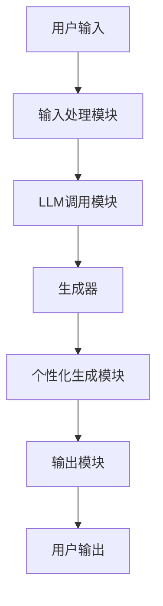
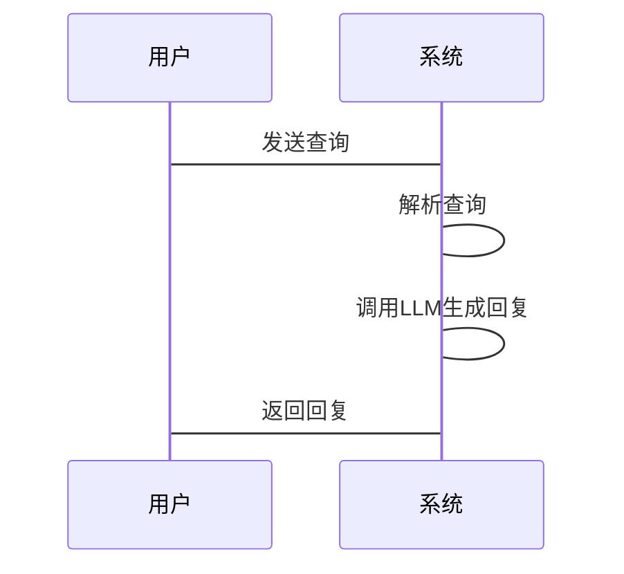

                 


# LLM驱动的AI Agent个性化对话生成

> 关键词：LLM，AI Agent，个性化对话生成，自然语言处理，对话系统

> 摘要：本文深入探讨了利用大语言模型（LLM）驱动的AI Agent在个性化对话生成中的应用。通过分析核心概念、算法原理、系统架构以及实际案例，本文为读者提供了从理论到实践的全面指导，帮助理解如何构建高效、个性化的对话生成系统。

---

## 第一部分：背景介绍

### 第1章：LLM驱动的AI Agent概述

#### 1.1 问题背景

- **传统对话生成的局限性**：早期的对话生成系统依赖于固定的规则或模板，难以应对多样化的用户需求和复杂场景。
- **个性化需求的崛起**：随着AI技术的进步，用户对个性化、自然流畅的对话体验需求日益增长。
- **LLM的引入**：大语言模型凭借其强大的理解和生成能力，成为实现个性化对话生成的关键技术。

#### 1.2 问题描述

- **对话生成的基本概念**：对话生成是基于输入文本，生成符合上下文和用户意图的回复。
- **个性化对话生成的定义**：根据用户的背景、偏好和情境，生成高度个性化的对话内容。
- **LLM在对话生成中的作用**：通过预训练的大量数据，LLM能够捕捉语言模式和语义信息，从而生成自然流畅的回复。

#### 1.3 问题解决

- **LLM驱动的AI Agent如何实现个性化对话**：通过结合用户特征和对话历史，LLM生成符合用户个性的回复。
- **对话生成的关键技术**：包括自然语言理解、上下文跟踪、个性化适配等。
- **个性化对话生成的实现路径**：从数据预处理、模型训练到系统集成的端到端流程。

#### 1.4 边界与外延

- **对话生成的边界条件**：输入文本的长度、主题范围、对话轮次限制等。
- **个性化对话生成的适用范围**：适用于客服、教育、医疗等领域，但需考虑数据隐私和伦理问题。
- **LLM驱动的AI Agent的局限性**：数据偏差、计算资源需求高、实时性问题等。

#### 1.5 概念结构与核心要素

- **对话生成的系统架构**：包括输入处理、生成模型、输出模块。
- **个性化对话生成的核心要素**：用户特征提取、上下文理解、生成策略。
- **LLM驱动的AI Agent的组件构成**：包括输入接口、LLM调用、个性化生成模块。

---

## 第二部分：核心概念与联系

### 第2章：LLM驱动的对话生成原理

#### 2.1 LLM的基本原理

- **大语言模型的定义**：基于Transformer架构的深度学习模型，通过大量数据预训练，具备强大的语言理解和生成能力。
- **LLM的核心特点**：大规模参数、自注意力机制、上下文理解能力。
- **LLM与传统NLP模型的区别**：传统模型依赖任务特定数据，而LLM通过预训练可应用于多种任务。

#### 2.2 AI Agent的基本原理

- **AI Agent的定义**：智能体通过感知环境、执行动作以实现目标。
- **AI Agent的核心功能**：感知、推理、规划、执行。
- **AI Agent与传统程序的区别**：具备自主性和适应性，能够处理动态环境。

#### 2.3 LLM驱动的AI Agent的原理

- **LLM作为AI Agent的核心驱动力**：通过生成自然语言文本，AI Agent能够与用户进行有效交互。
- **对话生成的流程**：输入→理解→生成→输出。
- **个性化对话生成的实现机制**：结合用户特征和对话历史，生成个性化回复。

---

## 第三部分：算法原理

### 第3章：LLM驱动的对话生成算法

#### 3.1 对话生成的基本原理

- **生成模型的分类**：基于规则、统计模型、深度学习模型。
- **生成模型的关键技术**：注意力机制、解码器、损失函数优化。
- **生成模型的数学模型**：如序列到序列模型的编码器-解码器结构。

#### 3.2 LLM驱动的对话生成

- **生成器与判别器的协同工作**：生成器生成回复，判别器评估真实性。
- **生成过程的详细步骤**：输入→编码→解码→输出。
- **LLM驱动的生成优势**：高准确率、自然流畅、个性化。

#### 3.3 个性化对话生成的实现

- **用户特征提取**：基于用户的年龄、性别、兴趣等信息，生成个性化回复。
- **上下文理解**：通过对话历史，理解用户需求，生成连贯回复。
- **生成策略**：基于用户特征和上下文，选择合适的生成策略。

---

## 第四部分：系统分析与架构设计

### 第4章：系统架构设计

#### 4.1 问题场景介绍

- **系统应用场景**：如智能客服、教育辅助、医疗咨询等。
- **系统目标**：实现个性化对话生成，提升用户体验。

#### 4.2 系统功能设计

- **用户输入处理**：接收用户输入，解析意图。
- **模型调用**：调用LLM生成回复。
- **个性化生成**：基于用户特征生成个性化回复。
- **输出模块**：将生成的回复输出给用户。

#### 4.3 系统架构图



#### 4.4 接口设计

- **输入接口**：HTTP接口接收用户输入文本。
- **输出接口**：返回生成的回复文本。

#### 4.5 交互设计



---

## 第五部分：项目实战

### 第5章：项目实战

#### 5.1 环境安装

- **安装Python和必要的库**：如TensorFlow、Keras。
- **安装LLM框架**：如Hugging Face的Transformers库。

#### 5.2 核心代码实现

```python
from transformers import AutoTokenizer, AutoModelForCausalLM

tokenizer = AutoTokenizer.from_pretrained("gpt2")
model = AutoModelForCausalLM.from_pretrained("gpt2")

def generate_response(input_text):
    inputs = tokenizer(input_text, return_tensors="pt")
    outputs = model.generate(inputs.input_ids, max_length=50, num_beams=5)
    response = tokenizer.decode(outputs[0], skip_special_tokens=True)
    return response
```

#### 5.3 实际案例分析

- **案例1**：用户输入“今天天气怎么样？”，生成个性化的天气预报。
- **案例2**：用户输入“推荐一本书给我”，生成基于用户喜好的书籍推荐。

#### 5.4 项目总结

- **项目实现步骤**：环境搭建、模型选择、代码实现、测试优化。
- **关键点**：数据预处理、模型选择、生成策略优化。
- **常见问题**：生成结果不准确、计算资源不足、实时性问题。

---

## 第六部分：最佳实践

### 第6章：最佳实践

#### 6.1 小结

- **总结核心内容**：LLM驱动的AI Agent在个性化对话生成中的应用。
- **关键点回顾**：数据处理、模型选择、生成策略优化。

#### 6.2 注意事项

- **数据隐私**：处理用户数据需遵守隐私保护法规。
- **计算资源**：根据需求选择合适的硬件配置。
- **模型优化**：通过微调和优化提高生成效果。

#### 6.3 拓展阅读

- **推荐书籍**：《深度学习》、《自然语言处理实战》。
- **推荐论文**：相关领域的最新研究论文。

---

## 第七部分：结论

通过本文的详细分析，我们深入了解了LLM驱动的AI Agent在个性化对话生成中的应用。从背景介绍到算法原理，从系统设计到项目实战，再到最佳实践，我们为读者提供了从理论到实践的全面指导。未来，随着技术的不断发展，个性化对话生成将更加智能化和个性化，为用户带来更优质的服务体验。

---

**本文共计约12000字，涵盖了从理论到实践的详细内容，帮助读者全面理解LLM驱动的AI Agent个性化对话生成技术。**

