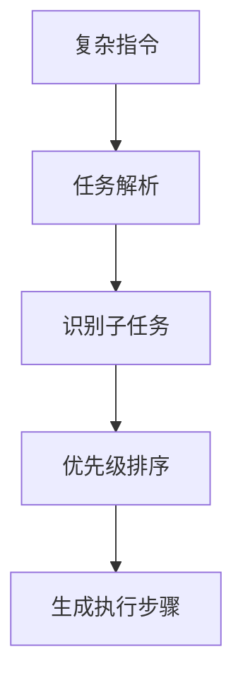
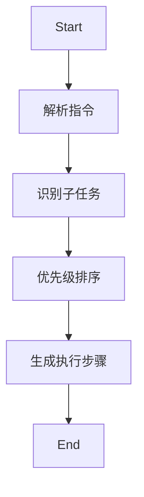
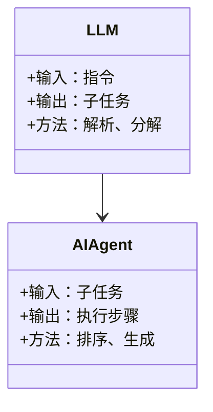
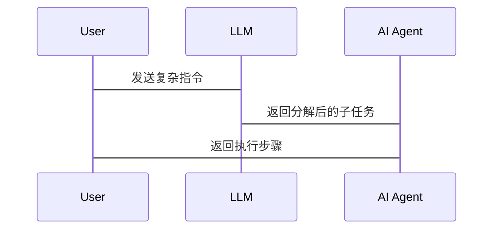

                 


# LLM驱动的AI Agent任务分解：处理复杂指令

> 关键词：LLM, AI Agent, 任务分解, 复杂指令处理, 自然语言处理

> 摘要：本文探讨如何利用大语言模型（LLM）驱动AI Agent，通过任务分解的方法处理复杂指令。文章从背景介绍、核心概念、算法原理、系统架构到项目实战，全面解析LLM在AI Agent中的应用，并提供实际案例和最佳实践。

---

## 第一部分：背景与概述

### 第1章：LLM驱动的AI Agent概述

#### 1.1 什么是LLM
- **定义**：大语言模型（LLM）是基于大量数据训练的深度学习模型，擅长理解和生成自然语言文本。
- **特点**：高准确率、多语言支持、可扩展性。
- **作用**：作为知识库和决策者，LLM为AI Agent提供理解和执行任务的能力。

#### 1.2 什么是AI Agent
- **定义**：AI Agent是智能体，能够感知环境、执行任务、与用户交互。
- **类型**：基于任务分解的AI Agent，基于规则的AI Agent，基于学习的AI Agent。
- **任务执行机制**：通过感知环境、分析任务、执行步骤完成目标。

#### 1.3 问题背景与挑战
- **复杂指令处理难点**：指令多样性、歧义性、多步骤性。
- **传统方法的局限性**：规则复杂，难以扩展，适应性差。
- **任务分解的重要性**：简化任务、提高效率、增强适应性。

---

## 第二部分：核心概念与原理

### 第2章：LLM与AI Agent的关系

#### 2.1 LLM如何驱动AI Agent
- **知识库与决策**：LLM作为知识库，帮助AI Agent理解指令。
- **自然语言处理**：LLM通过NLP技术解析指令，生成执行步骤。

#### 2.2 AI Agent的任务分解原理
- **分解步骤**：解析指令、识别子任务、优先级排序。
- **方法对比**：基于规则的分解与基于LLM的分解对比。

#### 2.3 核心概念对比表

| 概念         | LLM                         | AI Agent                      |
|--------------|------------------------------|-------------------------------|
| **定义**     | 大语言模型，处理文本任务     | 智能体，执行任务               |
| **功能**     | 理解、生成语言               | 感知、执行、交互               |
| **应用**     | 自然语言处理、文本生成       | 任务执行、自动化操作           |
| **依赖**     | 大量数据、计算资源           | LLM、环境感知、执行模块         |

#### 2.4 任务分解的步骤
- **步骤分解图**



---

## 第三部分：算法原理

### 第3章：任务分解算法

#### 3.1 算法概述
- **基于LLM的任务分解算法**：利用LLM生成子任务，优化执行顺序。
- **流程图**



#### 3.2 数学模型
- **损失函数**

$$\text{Loss} = \sum_{i=1}^{n} \text{CE}(y_i, \hat{y_i})$$

- **优化目标**

$$\text{Minimize} \quad \sum_{i=1}^{n} \text{CE}(y_i, \hat{y_i})$$

#### 3.3 详细解释
- **解析指令**：通过LLM解析用户的复杂指令，识别任务类型。
- **生成子任务**：LLM将复杂指令分解为多个子任务，每个子任务对应一个具体操作。
- **优先级排序**：基于任务的重要性、依赖关系排序。
- **生成步骤**：根据排序结果生成执行步骤。

---

## 第四部分：系统分析与架构设计

### 第4章：系统架构设计

#### 4.1 项目背景
- **目标**：设计一个基于LLM的AI Agent系统，处理复杂指令。
- **用户需求**：用户希望系统能够分解指令，生成执行步骤。

#### 4.2 系统功能设计



#### 4.3 接口设计



---

## 第五部分：项目实战

### 第5章：环境安装与核心代码

#### 5.1 环境安装
- **Python 3.9+**
- **安装依赖**：`pip install torch transformers`

#### 5.2 核心代码实现

```python
import torch
from transformers import LlamaTokenizer, LlamaForCausalCompletion

# 初始化模型和分词器
tokenizer = LlamaTokenizer.from_pretrained("meta/llama2")
model = LlamaForCausalCompletion.from_pretrained("meta/llama2")

def decompose_task(instruction):
    # 输入处理
    inputs = tokenizer(instruction, return_tensors="pt")
    # 模型推理
    outputs = model.generate(**inputs)
    # 解析结果
    result = tokenizer.decode(outputs[0], skip_special_tokens=True)
    return result
```

#### 5.3 代码解读
- **初始化模型**：加载预训练的LLM模型和分词器。
- **分解任务**：将复杂指令输入模型，输出分解后的子任务。

---

## 第六部分：最佳实践与总结

### 第6章：总结与展望

#### 6.1 小结
- **LLM驱动AI Agent**：任务分解是关键，帮助处理复杂指令。
- **系统设计**：模块化设计，便于扩展和维护。

#### 6.2 注意事项
- **数据安全**：处理用户指令时需注意隐私。
- **模型调优**：根据任务需求调整模型参数。

#### 6.3 未来展望
- **多模态扩展**：结合视觉、语音等模态信息。
- **在线学习**：模型持续学习，适应新任务。

---

## 结束语

通过本文的详细讲解，读者可以全面了解如何利用LLM驱动AI Agent，分解复杂指令。从理论到实践，文章提供了丰富的技术细节和代码示例，帮助读者在实际项目中应用这些方法。希望本文能为AI领域的开发者和研究者提供有价值的参考。

--- 

**版权声明**：本文为原创内容，未经授权不得转载。

