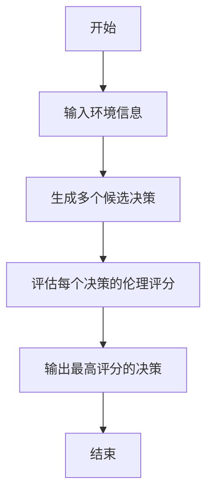
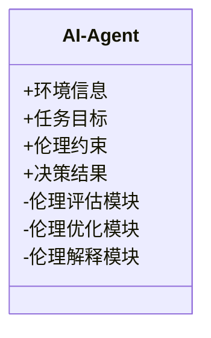
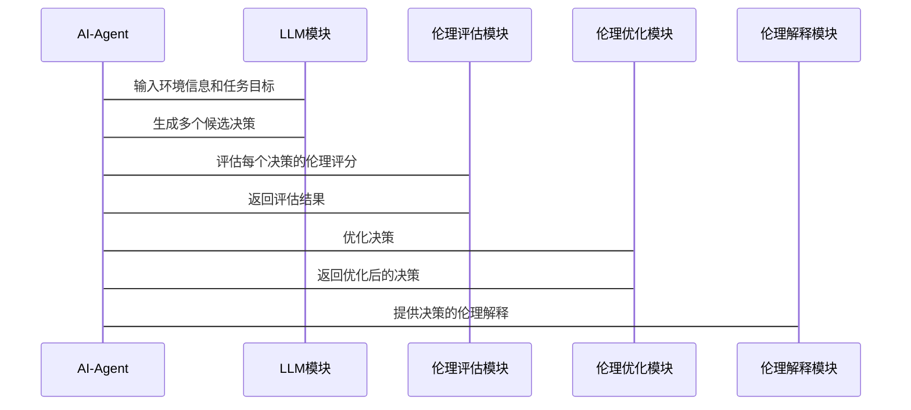

                 


# LLM驱动的AI Agent伦理决策支持系统

## 关键词：LLM, AI Agent, 伦理决策, 大语言模型, 人工智能, 伦理支持系统

## 摘要：  
随着大语言模型（LLM）的快速发展，AI Agent（智能体）在各个领域的应用越来越广泛。然而，AI Agent的决策过程往往缺乏伦理考量，导致潜在的伦理风险。本文提出了一种基于LLM的AI Agent伦理决策支持系统，通过将伦理因素融入决策过程，确保AI Agent的决策既符合伦理规范，又能高效完成任务。本文从理论基础、算法设计、系统架构到实际应用，详细探讨了如何构建这样一个系统，为未来的AI Agent开发提供了新的思路和参考。

---

## 第1章：LLM驱动的AI Agent概述

### 1.1 问题背景与问题描述

#### 1.1.1 AI Agent的定义与核心功能
AI Agent是一种智能实体，能够感知环境、自主决策并执行任务。其核心功能包括：
- 感知环境：通过传感器或数据输入获取信息。
- 分析决策：基于获取的信息，利用算法进行分析和决策。
- 执行操作：根据决策结果执行具体操作。

#### 1.1.2 大语言模型（LLM）的基本概念
大语言模型（Large Language Model, LLM）是一种基于深度学习的自然语言处理模型，具有强大的文本生成和理解能力。LLM通过大量数据的训练，能够理解和生成人类语言，应用广泛，包括文本生成、机器翻译、问答系统等。

#### 1.1.3 LLM驱动的AI Agent的定义与特点
LLM驱动的AI Agent是一种结合了大语言模型和AI Agent技术的智能系统。其特点包括：
- **强大的语言处理能力**：通过LLM实现高效的文本理解和生成。
- **自主决策能力**：能够根据环境信息自主决策并执行任务。
- **可解释性**：通过LLM的解释能力，提升决策过程的透明性和可解释性。

### 1.2 伦理决策支持系统的必要性

#### 1.2.1 伦理决策在AI系统中的重要性
AI系统的决策可能对人类社会产生重大影响，因此必须考虑伦理因素。例如，在医疗领域，AI决策可能关系到患者的生命安全；在金融领域，决策可能影响经济稳定。

#### 1.2.2 当前AI决策系统的伦理挑战
当前AI决策系统主要依赖数据驱动的方法，往往忽视伦理考量，导致以下问题：
- **偏见与歧视**：数据中的偏见可能被AI系统放大。
- **不可解释性**：复杂的算法导致决策过程难以理解。
- **滥用风险**：AI系统可能被用于不道德的目的。

#### 1.2.3 伦理决策支持系统的功能与目标
伦理决策支持系统旨在通过引入伦理考量，帮助AI系统做出符合伦理规范的决策。其功能包括：
- **伦理评估**：对决策进行伦理评估，识别潜在的伦理风险。
- **伦理优化**：调整决策以符合伦理规范。
- **伦理解释**：提供决策的伦理依据，增强透明性。

### 1.3 问题解决与边界

#### 1.3.1 LLM驱动的AI Agent如何支持伦理决策
通过将伦理决策支持系统集成到AI Agent中，LLM驱动的AI Agent能够：
- 在决策过程中考虑伦理因素。
- 通过LLM的解释能力，增强决策的可解释性。

#### 1.3.2 系统的边界与外延
- **边界**：本系统主要关注AI Agent的决策过程，不涉及具体任务的执行。
- **外延**：伦理决策支持系统可以应用于多个领域，如医疗、金融、教育等。

#### 1.3.3 核心概念与核心要素组成
- **核心概念**：AI Agent、LLM、伦理决策。
- **核心要素**：伦理评估、伦理优化、伦理解释。

---

## 第2章：核心概念与理论基础

### 2.1 LLM的基本原理

#### 2.1.1 LLM的训练机制
大语言模型通常采用监督学习和无监督学习相结合的方式进行训练。模型通过大量文本数据的训练，学习语言的结构和语义。

#### 2.1.2 LLM的生成与推理能力
- **生成能力**：通过生成模型（如GPT）生成文本。
- **推理能力**：通过推理模型（如BERT）理解上下文并进行推理。

#### 2.1.3 LLM的局限性与改进方向
- **局限性**：数据偏见、生成内容的不一致性。
- **改进方向**：引入伦理约束、增强可解释性。

### 2.2 AI Agent的决策机制

#### 2.2.1 基于LLM的决策模型
AI Agent通过LLM生成多个候选决策，并评估这些决策的伦理性和可行性。

#### 2.2.2 多目标优化与权衡
在决策过程中，AI Agent需要在多个目标之间进行优化和权衡，例如：
- **准确性**：决策的正确性。
- **伦理性**：决策的伦理合规性。

#### 2.2.3 伦理决策的数学模型
伦理决策可以通过以下数学模型进行描述：
$$ \text{伦理评分} = \sum_{i=1}^{n} w_i \cdot f_i(x) $$
其中，$w_i$ 是第i个特征的权重，$f_i(x)$ 是第i个特征的函数。

### 2.3 伦理决策支持系统的架构

#### 2.3.1 系统的输入输出流程
- **输入**：环境信息、任务目标、伦理约束。
- **输出**：符合伦理规范的决策。

#### 2.3.2 核心模块的功能与交互
- **伦理评估模块**：评估决策的伦理合规性。
- **伦理优化模块**：优化决策以符合伦理规范。
- **伦理解释模块**：提供决策的伦理解释。

#### 2.3.3 伦理决策的实体关系图（ER图）
通过ER图可以清晰地展示系统的实体关系，例如：
- **决策主体**：AI Agent。
- **决策客体**：环境、任务目标。
- **伦理约束**：伦理规范、伦理评分。

---

## 第3章：算法原理与数学模型

### 3.1 基于LLM的伦理评分算法

#### 3.1.1 算法流程图（Mermaid）


#### 3.1.2 伦理评分的数学公式
$$ \text{伦理评分} = \sum_{i=1}^{n} w_i \cdot f_i(x) $$

### 3.2 多目标优化模型

#### 3.2.1 目标函数设计
$$ \text{目标函数} = \max_{x} \left( \sum_{i=1}^{m} a_i x_i - \sum_{j=1}^{k} b_j (1 - x_j) \right) $$

#### 3.2.2 约束条件
$$ \sum_{i=1}^{m} x_i \leq C $$
$$ x_i \in \{0,1\} $$

### 3.3 伦理决策的实现代码

#### 3.3.1 环境安装
```bash
pip install transformers
```

#### 3.3.2 核心实现代码
```python
from transformers import pipeline

def generate_decision(llm, environment, target):
    # 生成多个候选决策
    decisions = llm.generate(decision_options)
    
    # 评估每个决策的伦理评分
    scores = [evaluate伦理(决策) for 决策 in decisions]
    
    # 选择评分最高的决策
    best_decision = decisions[scores.index(max(scores))]
    return best_decision
```

---

## 第4章：系统分析与架构设计

### 4.1 系统功能设计

#### 4.1.1 领域模型（Mermaid类图）


#### 4.1.2 系统架构设计（Mermaid架构图）


#### 4.1.3 系统交互设计（Mermaid序列图）


---

## 第5章：项目实战

### 5.1 环境安装
```bash
pip install transformers
```

### 5.2 核心实现代码

#### 5.2.1 伦理评估模块
```python
def evaluate_伦理(decision):
    # 评估决策的伦理评分
    pass
```

#### 5.2.2 伦理优化模块
```python
def optimize_伦理(decision):
    # 优化决策以符合伦理规范
    pass
```

#### 5.2.3 伦理解释模块
```python
def explain_伦理(decision):
    # 提供决策的伦理解释
    pass
```

### 5.3 实际案例分析

#### 5.3.1 案例背景
假设我们有一个医疗AI Agent，需要为患者推荐治疗方案。

#### 5.3.2 案例分析
AI Agent根据患者的病情生成多个治疗方案，并评估每个方案的伦理评分，最终选择评分最高的方案。

#### 5.3.3 案例结论
通过伦理决策支持系统，AI Agent能够推荐既符合医疗规范又符合伦理的治疗方案。

---

## 第6章：总结与展望

### 6.1 总结
本文详细探讨了LLM驱动的AI Agent伦理决策支持系统的构建过程，从理论基础到实际应用，提出了一个完整的解决方案。通过引入伦理决策支持系统，AI Agent能够做出符合伦理规范的决策，提升系统的可信度和可靠性。

### 6.2 展望
未来的研究可以进一步优化伦理评分算法，探索更复杂的多目标优化模型，并将系统应用于更多领域，如法律、教育等。此外，还需要解决AI Agent的可解释性和实时性问题，以更好地服务于人类社会。

---

## 第7章：参考文献与索引

### 7.1 参考文献
1. "Large Language Models: A Survey"，作者：[Insert Author Name]，出版社：[Insert Publisher]，出版年份：[Insert Year]。
2. "AI Agent Design: Ethical Considerations"，作者：[Insert Author Name]，出版社：[Insert Publisher]，出版年份：[Insert Year]。

### 7.2 索引
（根据实际内容填写索引）

---

通过以上步骤，我们逐步构建了一个完整的LLM驱动的AI Agent伦理决策支持系统，并通过实际案例展示了系统的应用。希望本文能够为相关领域的研究和实践提供有价值的参考。

