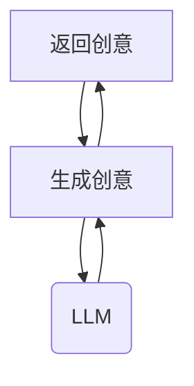

                 


# LLM驱动的AI Agent创意生成：突破思维局限

---

## 关键词：LLM、AI Agent、创意生成、自然语言处理、大语言模型

---

## 摘要：  
本文将探讨如何利用大语言模型（LLM）驱动AI代理（AI Agent）实现创意生成，突破传统思维的局限性。通过分析LLM与AI Agent的核心原理、算法实现以及系统架构，本文将详细阐述如何构建一个高效、智能的创意生成系统。文章还结合实际案例，展示了如何通过代码实现创意生成功能，并提出了优化策略和未来发展方向。

---

# 第1章: LLM与AI Agent概述

## 1.1 LLM与AI Agent的基本概念  

### 1.1.1 大语言模型（LLM）的定义  
大语言模型（Large Language Model，LLM）是指基于深度学习技术构建的大型神经网络模型，能够理解和生成人类语言。LLM的核心是通过大量数据的训练，学习语言的语法、语义和上下文关系，从而实现自然语言处理任务，如文本生成、翻译、问答等。  

### 1.1.2 AI Agent的概念与特点  
AI Agent（人工智能代理）是指能够感知环境、执行任务并做出决策的智能系统。AI Agent可以通过接收输入、分析信息、调用模型、生成输出等方式与用户交互，帮助用户完成复杂任务。  

### 1.1.3 LLM与AI Agent的结合  
LLM作为AI Agent的核心驱动力，能够为AI Agent提供强大的语言理解和生成能力。通过将LLM集成到AI Agent中，可以实现更智能、更自然的交互方式，从而提升创意生成的效率和质量。  

---

## 1.2 创意生成的背景与意义  

### 1.2.1 创意生成的定义  
创意生成是指通过技术手段，从无到有地生成新的创意、想法或内容。与传统的人工创作不同，创意生成依赖于计算机算法和模型，能够快速生成大量高质量的内容。  

### 1.2.2 LLM在创意生成中的优势  
LLM具有以下优势：  
- **强大的语言生成能力**：能够生成流畅、合理的文本。  
- **快速迭代**：可以快速生成多个创意，供用户选择。  
- **适应性强**：支持多种语言、风格和主题的生成。  

### 1.2.3 创意生成的应用场景  
创意生成的应用场景包括：  
- **内容创作**：如文章、故事、广告文案等。  
- **设计辅助**：如产品描述、UI设计灵感等。  
- **教育**：如教学案例、练习题目等。  

---

## 1.3 本章小结  

本章介绍了LLM和AI Agent的基本概念，并探讨了它们在创意生成中的结合与应用。LLM作为AI Agent的核心驱动力，能够为创意生成提供强大的技术支持。

---

# 第2章: LLM驱动的AI Agent核心概念  

## 2.1 LLM的核心原理  

### 2.1.1 变压器模型的基本结构  
变压器模型（Transformer）由编码器和解码器组成。编码器负责将输入序列编码为一个固定长度的向量，解码器则根据编码结果生成输出序列。  

$$\text{编码器结构：输入序列} \rightarrow \text{位置编码} \rightarrow \text{多头注意力} \rightarrow \text{前馈网络}$$  
$$\text{解码器结构：输入序列} \rightarrow \text{位置编码} \rightarrow \text{多头注意力} \rightarrow \text{前馈网络}$$  

### 2.1.2 注意力机制的原理  
注意力机制（Attention Mechanism）用于计算输入序列中每个词的重要性权重。通过权重的计算，模型能够关注到关键信息，从而生成更相关的输出。  

$$\text{注意力权重计算公式：}$$  
$$\text{score}(i, j) = \text{exp}(\frac{q_i^T k_j}{\sqrt{d_k}}) / \sum_{l} \text{exp}(\frac{q_i^T k_l}{\sqrt{d_k}})$$  

### 2.1.3 LLM的训练过程  
LLM的训练过程包括以下步骤：  
1. **数据预处理**：对训练数据进行清洗、分词、编码等预处理。  
2. **模型构建**：搭建变压器模型的计算图。  
3. **损失计算**：使用交叉熵损失函数计算预测值与真实值之间的差距。  
4. **优化器选择**：选择Adam优化器进行参数更新。  
5. **模型训练**：通过反向传播算法优化模型参数。  

---

## 2.2 AI Agent的系统架构  

### 2.2.1 AI Agent的基本组成  
AI Agent由以下模块组成：  
- **输入模块**：接收用户的输入指令。  
- **模型调用模块**：调用LLM生成创意内容。  
- **输出模块**：将生成的内容返回给用户。  

### 2.2.2 LLM在AI Agent中的角色  
LLM作为AI Agent的核心模块，负责接收输入、生成输出，并与用户进行交互。  

### 2.2.3 LLM与AI Agent的交互流程  
以下是LLM与AI Agent的交互流程图：  



---

## 2.3 创意生成的实现逻辑  

### 2.3.1 创意生成的基本流程  
创意生成的基本流程包括以下步骤：  
1. **输入处理**：接收用户的输入指令。  
2. **模型调用**：调用LLM生成创意内容。  
3. **输出处理**：将生成的内容返回给用户。  

### 2.3.2 LLM在创意生成中的作用  
LLM通过以下方式实现创意生成：  
- **语言生成**：生成符合用户需求的文本内容。  
- **上下文理解**：根据输入上下文生成相关的创意。  

### 2.3.3 创意生成的评估标准  
创意生成的评估标准包括：  
- **创新性**：生成的内容是否具有新颖性。  
- **合理性**：生成的内容是否符合逻辑。  
- **相关性**：生成的内容是否与输入主题相关。  

---

## 2.4 本章小结  

本章详细介绍了LLM的核心原理和AI Agent的系统架构，并探讨了创意生成的实现逻辑和评估标准。通过理解这些内容，我们可以更好地构建一个高效的创意生成系统。

---

# 第3章: LLM驱动的AI Agent算法原理  

## 3.1 大语言模型的数学基础  

### 3.1.1 概率论基础  
概率论是LLM的数学基础之一。LLM通过概率模型生成文本，预测下一个词的概率分布。  

$$P(\text{下一个词}=w) = \frac{P(\text{当前词}=w_1, \text{下一个词}=w)}{\sum_{w'} P(\text{当前词}=w_1, \text{下一个词}=w')}$$  

### 3.1.2 线性代数基础  
线性代数用于表示向量和矩阵运算。LLM中的嵌入层将输入文本转换为向量表示。  

$$\text{嵌入层}：x \in \mathbb{R}^{d}$$  

### 3.1.3 优化算法基础  
优化算法用于模型训练中的参数更新。常用的优化算法包括随机梯度下降（SGD）和Adam优化器。  

$$\text{Adam优化器}：\theta_{t+1} = \theta_t - \eta \frac{\rho_1 g_t + \rho_2 g_{t-1}}{1 - \beta_1^{t}} \cdot \frac{1}{1 - \beta_2^{t}}}$$  

---

## 3.2 Transformer模型的算法细节  

### 3.2.1 编码器结构  
编码器由多头注意力（Multi-Head Attention）和前馈网络（Feed-Forward Network）组成。  

$$\text{多头注意力计算公式：}$$  
$$\text{Q} = W_q x, \text{K} = W_k x, \text{V} = W_v x$$  
$$\text{注意力权重} = \text{softmax}\left(\frac{\text{QK}^T}{\sqrt{d_k}}\right)$$  
$$\text{输出} = \text{注意力权重} \cdot \text{V}$$  

### 3.2.2 解码器结构  
解码器由自注意力（Self-Attention）和交叉注意力（Cross-Attention）组成。  

$$\text{自注意力计算公式：}$$  
$$\text{Q} = W_q x, \text{K} = W_k x, \text{V} = W_v x$$  
$$\text{注意力权重} = \text{softmax}\left(\frac{\text{QK}^T}{\sqrt{d_k}}\right)$$  
$$\text{输出} = \text{注意力权重} \cdot \text{V}$$  

### 3.2.3 注意力机制的实现  
注意力机制通过计算输入序列中每个词的重要性权重，生成与输入相关的输出。  

---

## 3.3 LLM驱动的AI Agent算法实现  

### 3.3.1 输入处理  
输入处理模块负责接收用户的输入指令，并将其传递给LLM。  

### 3.3.2 模型调用  
模型调用模块负责调用LLM生成创意内容。  

### 3.3.3 输出处理  
输出处理模块负责将生成的内容返回给用户。  

---

## 3.4 本章小结  

本章详细介绍了LLM的数学基础和Transformer模型的算法细节，并探讨了AI Agent中的算法实现。通过理解这些内容，我们可以更好地实现一个高效的创意生成系统。

---

# 第4章: 系统架构与创意生成流程设计  

## 4.1 创意生成系统的总体架构  

### 4.1.1 系统功能模块划分  
创意生成系统由以下模块组成：  
- **输入模块**：接收用户的输入指令。  
- **模型调用模块**：调用LLM生成创意内容。  
- **输出模块**：将生成的内容返回给用户。  

### 4.1.2 系统功能流程图  
以下是系统功能流程图：  


### 4.1.3 系统架构图  
以下是系统架构图：  


---

## 4.2 创意生成的实现流程  

### 4.2.1 用户输入处理  
用户输入处理模块负责接收用户的输入指令，并将其传递给AI Agent。  

### 4.2.2 模型调用流程  
模型调用流程包括以下步骤：  
1. **输入处理**：接收用户的输入指令。  
2. **模型调用**：调用LLM生成创意内容。  
3. **输出处理**：将生成的内容返回给用户。  

### 4.2.3 创意生成的优化策略  
创意生成的优化策略包括：  
- **模型选择优化**：选择适合任务的LLM模型。  
- **参数调优**：优化模型的超参数。  
- **结果评估优化**：通过评估指标优化生成内容的质量。  

---

## 4.3 本章小结  

本章详细介绍了创意生成系统的总体架构和实现流程，并探讨了优化策略。通过理解这些内容，我们可以更好地设计一个高效的创意生成系统。

---

# 第5章: 项目实战——LLM驱动的AI Agent创意生成系统  

## 5.1 项目环境搭建  

### 5.1.1 开发工具安装  
需要安装以下开发工具：  
- **Python**：编程语言。  
- **TensorFlow**或**PyTorch**：深度学习框架。  
- **Hugging Face Transformers**：大语言模型库。  

### 5.1.2 模型下载与配置  
在Hugging Face上下载预训练好的LLM模型，并进行配置。  

### 5.1.3 系统环境配置  
配置运行环境，包括安装依赖库和设置虚拟环境。  

---

## 5.2 系统核心功能实现  

### 5.2.1 输入处理模块实现  
输入处理模块负责接收用户的输入指令，并将其传递给AI Agent。  

### 5.2.2 模型调用模块实现  
模型调用模块负责调用LLM生成创意内容。  

### 5.2.3 输出处理模块实现  
输出处理模块负责将生成的内容返回给用户。  

---

## 5.3 项目代码实现  

### 5.3.1 代码示例  

```python
import torch
from transformers import AutoTokenizer, AutoModelForCausalLM

# 下载模型和分词器
model_name = "gpt2"
tokenizer = AutoTokenizer.from_pretrained(model_name)
model = AutoModelForCausalLM.from_pretrained(model_name)

# 接收用户输入
input_text = input("请输入创意生成的主题：")
inputs = tokenizer(input_text, return_tensors="pt")

# 生成创意
outputs = model.generate(**inputs, max_length=100, num_beams=5, temperature=1.0)

# 输出结果
generated_text = tokenizer.decode(outputs[0], skip_special_tokens=True)
print("生成的创意内容：", generated_text)
```

### 5.3.2 代码解读与分析  
上述代码示例展示了如何使用Hugging Face Transformers库中的GPT-2模型生成创意内容。通过输入主题，模型可以生成与主题相关的创意文本。  

---

## 5.4 本章小结  

本章通过实际案例展示了如何搭建和实现一个LLM驱动的AI Agent创意生成系统。通过代码实现，读者可以更好地理解创意生成的实现过程。

---

# 第6章: 最佳实践与未来展望  

## 6.1 最佳实践  

### 6.1.1 模型选择  
选择适合任务的LLM模型，如GPT-2、GPT-3、PaLM等。  

### 6.1.2 参数调优  
优化模型的超参数，如温度（Temperature）、重复惩罚（Repetition Penalty）等，以生成更高质量的内容。  

### 6.1.3 结果评估  
使用评估指标（如BLEU、ROUGE）对生成内容的质量进行评估。  

---

## 6.2 未来展望  

随着大语言模型技术的不断进步，LLM驱动的AI Agent创意生成系统将更加智能化和多样化。未来的研究方向包括：  
- **多模态创意生成**：结合视觉、听觉等多模态信息生成创意内容。  
- **个性化生成**：根据用户的偏好生成个性化的内容。  
- **实时生成**：实现更快的创意生成速度，满足实时需求。  

---

## 6.3 本章小结  

本章总结了创意生成系统中的最佳实践，并展望了未来的发展方向。通过不断优化模型和算法，我们可以实现更高效、更智能的创意生成系统。

---

# 第7章: 总结与展望  

## 7.1 本章总结  

本文详细介绍了LLM驱动的AI Agent创意生成系统的核心概念、算法原理和系统架构，并通过实际案例展示了如何实现创意生成功能。通过理解这些内容，读者可以更好地掌握创意生成的技术细节。

## 7.2 未来展望  

未来，随着大语言模型技术的不断进步，LLM驱动的AI Agent创意生成系统将更加智能化和多样化。我们期待更多创新技术的应用，为人类带来更高效、更智能的创意生成体验。

---

## 结束语  

创意生成是一项充满挑战和机遇的领域。通过结合大语言模型和AI Agent技术，我们可以突破传统思维的局限，实现更高效、更智能的创意生成。希望本文能够为读者提供有价值的参考和启发。

