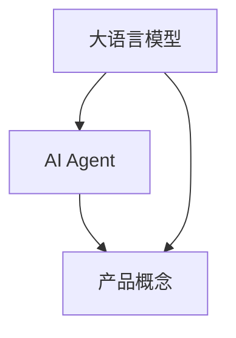

                 

# LLM驱动的AI Agent创新产品概念生成器

> 关键词：LLM、AI Agent、创新产品概念生成、自然语言处理、人工智能

> 摘要：本文将探讨如何利用大语言模型（LLM）驱动AI Agent，生成创新的产品概念。通过系统地分析LLM与AI Agent的核心原理、算法机制以及系统架构，结合实际项目实战，最终构建一个完整的创新产品概念生成系统。

---

## 第一部分: 引言

### 第1章: 问题背景与目标

#### 1.1 问题背景
- **1.1.1 当前AI技术的发展现状**  
  随着AI技术的飞速发展，大语言模型（LLM）如GPT-4、PaLM等在自然语言处理领域展现出强大的能力，能够生成高质量的文本内容、辅助决策、甚至帮助创新产品设计。然而，如何将这些能力转化为实际的产品创新，仍是一个重要的挑战。

- **1.1.2 LLM驱动的AI Agent的创新潜力**  
  AI Agent（智能体）是一种能够自主感知环境、做出决策并执行任务的智能系统。结合LLM的强大生成能力，AI Agent可以更加智能化地辅助用户完成复杂任务，尤其是在产品创新领域，LLM驱动的AI Agent能够生成独特的、符合市场需求的产品概念。

- **1.1.3 创新产品概念生成的重要性**  
  在当今快速变化的市场环境中，企业需要不断推出创新产品以保持竞争力。然而，传统的创新方法效率低下，且难以满足快速迭代的需求。通过LLM驱动的AI Agent生成创新产品概念，可以显著提高创新效率，降低开发成本。

#### 1.2 问题描述
- **1.2.1 LLM驱动的AI Agent的核心问题**  
  当前，虽然LLM和AI Agent技术已经取得了一定的进展，但如何将两者结合起来，高效地生成创新产品概念，仍是一个未被充分解决的问题。

- **1.2.2 产品概念生成的挑战**  
  创新产品概念生成需要结合市场分析、用户需求、技术可行性等多方面的信息。传统的生成方法难以同时满足这些复杂的要求，而基于LLM的AI Agent可以通过多模态输入和生成能力，更好地解决这一问题。

- **1.2.3 现有解决方案的局限性**  
  现有的创新产品生成工具多基于简单的规则或模板，缺乏智能化和个性化的能力。而基于LLM的AI Agent可以结合实时数据和动态反馈，生成更加精准和创新的产品概念。

#### 1.3 问题解决思路
- **1.3.1 利用LLM生成创新概念的思路**  
  利用LLM的强大生成能力，结合AI Agent的自主决策能力，构建一个能够根据输入需求生成创新产品概念的系统。

- **1.3.2 构建AI Agent的系统架构**  
  设计一个基于LLM的AI Agent系统架构，包括输入解析、生成策略、结果优化等模块。

- **1.3.3 从概念生成到产品落地的流程**  
  从创新概念生成到产品落地的完整流程，包括需求分析、概念生成、可行性评估、产品设计等阶段。

#### 1.4 本章小结
- 本章介绍了问题背景，分析了当前创新产品概念生成的挑战，并提出了基于LLM驱动的AI Agent的解决方案。

---

## 第二部分: 核心概念与联系

### 第2章: LLM与AI Agent的核心原理

#### 2.1 LLM的基本原理
- **2.1.1 大语言模型的定义与特点**  
  LLM是一种基于深度学习的自然语言处理模型，具有强大的文本生成、理解和推理能力。

- **2.1.2 常见LLM模型的对比分析**  
  对比分析GPT-3、GPT-4、PaLM等主流LLM模型的特点和性能。

- **2.1.3 LLM的训练与推理机制**  
  详细讲解LLM的训练过程，包括数据预处理、模型参数初始化、优化算法等。

#### 2.2 AI Agent的基本原理
- **2.2.1 AI Agent的定义与分类**  
  AI Agent是一种能够感知环境、自主决策并执行任务的智能系统，可以分为简单反射型、基于模型的反应型、目标驱动型和效用驱动型。

- **2.2.2 基于LLM的AI Agent的优势**  
  基于LLM的AI Agent具有强大的自然语言处理能力，能够理解和生成人类语言，从而更好地与用户交互。

- **2.2.3 AI Agent的交互与决策机制**  
  详细讲解AI Agent的交互流程，包括输入解析、生成策略、结果输出等。

#### 2.3 LLM与AI Agent的关系
- **2.3.1 LLM作为AI Agent的核心驱动力**  
  LLM为AI Agent提供了强大的生成能力和理解能力，使其能够更好地完成复杂的任务。

- **2.3.2 LLM与AI Agent的协同工作模式**  
  LLM作为AI Agent的核心模块，与其他模块协同工作，共同完成创新产品概念生成的任务。

- **2.3.3 LLM驱动的AI Agent的创新应用**  
  通过案例分析，展示基于LLM的AI Agent在创新产品概念生成中的实际应用。

#### 2.4 核心概念对比表
- 下表对比了LLM与传统NLP模型、AI Agent与传统自动化的关键区别：

| **对比维度** | **LLM** | **传统NLP模型** |
|--------------|---------|----------------|
| **生成能力** | 强大    | 较弱            |
| **推理能力** | 强大    | 较弱            |
| **训练数据** | 大规模  | 有限            |

#### 2.5 ER实体关系图

#### 2.6 本章小结
- 本章详细介绍了LLM和AI Agent的核心原理，分析了它们之间的关系，并展示了它们在创新产品概念生成中的协同作用。

---

## 第三部分: 算法原理讲解

### 第3章: LLM驱动的AI Agent算法原理

#### 3.1 模型训练过程
- **3.1.1 数据预处理**  
  数据预处理包括清洗、分词、标注等步骤，确保输入数据的质量。

- **3.1.2 模型参数初始化**  
  初始化模型参数，通常使用随机初始化或预训练的参数。

- **3.1.3 模型训练与优化**  
  通过反向传播算法优化模型参数，最小化损失函数。

#### 3.2 推理

---

请根据以上目录大纲开始撰写完整文章内容。

