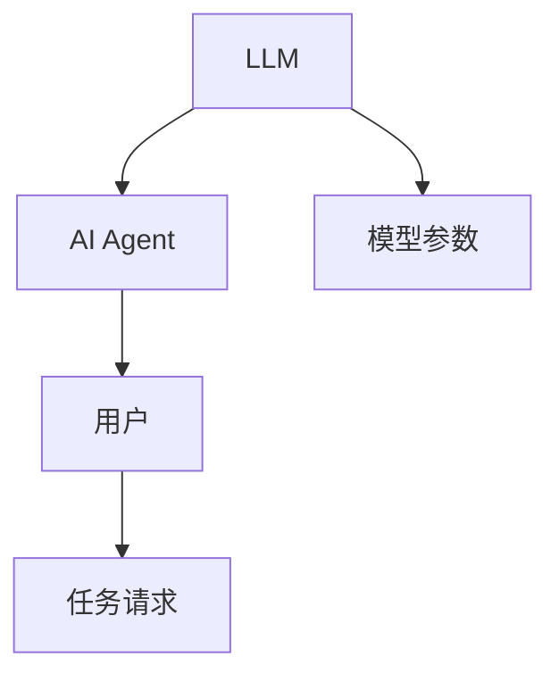
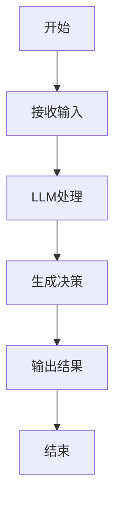
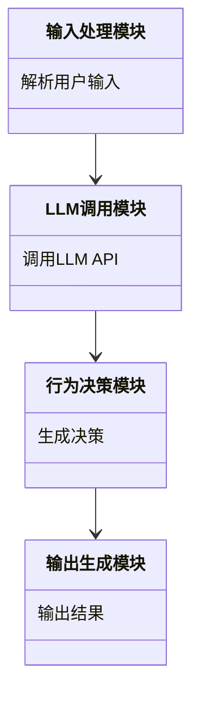
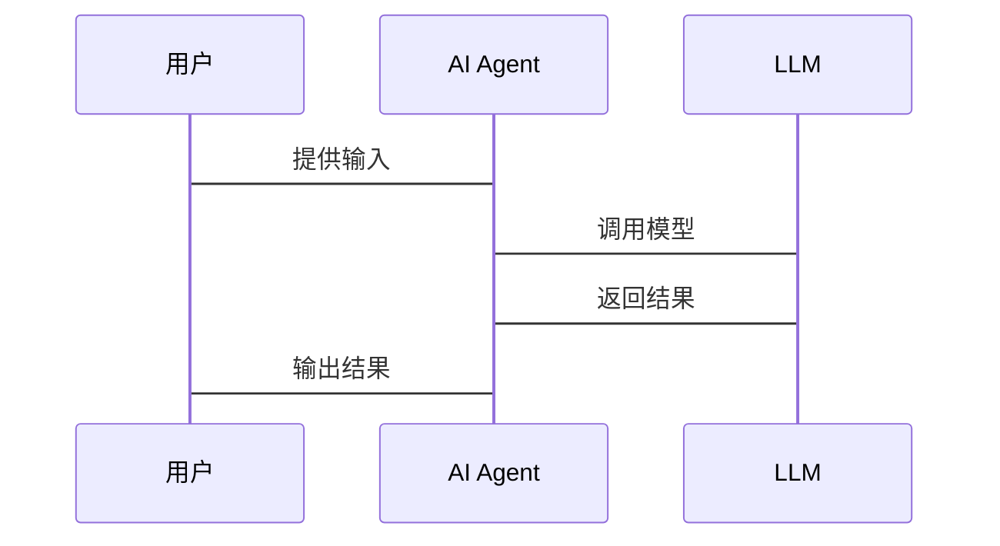

                 


# LLM驱动的AI Agent创新产品设计

> 关键词：LLM、AI Agent、人工智能、自然语言处理、系统架构设计、创新产品

> 摘要：本文将详细探讨如何利用大语言模型（LLM）驱动AI Agent的创新设计。从背景介绍、核心概念到系统架构设计，再到项目实战，我们将全面解析LLM在AI Agent中的应用，以及如何通过系统化的方法设计出高效、智能的AI Agent产品。

---

## 目录

1. [背景介绍](#背景介绍)
   - 1.1 [问题背景](#问题背景)
   - 1.2 [问题描述](#问题描述)
   - 1.3 [问题解决](#问题解决)
   - 1.4 [边界与外延](#边界与外延)
   - 1.5 [核心概念与组成](#核心概念与组成)

2. [核心概念与联系](#核心概念与联系)
   - 2.1 [核心概念](#核心概念)
   - 2.2 [概念属性对比](#概念属性对比)
   - 2.3 [实体关系图](#实体关系图)

3. [算法原理讲解](#算法原理讲解)
   - 3.1 [算法原理](#算法原理)
   - 3.2 [数学模型](#数学模型)
   - 3.3 [流程图](#流程图)

4. [系统分析与架构设计](#系统分析与架构设计)
   - 4.1 [问题场景](#问题场景)
   - 4.2 [系统功能设计](#系统功能设计)
   - 4.3 [系统架构设计](#系统架构设计)
   - 4.4 [系统接口设计](#系统接口设计)
   - 4.5 [系统交互](#系统交互)

5. [项目实战](#项目实战)
   - 5.1 [环境安装](#环境安装)
   - 5.2 [核心实现](#核心实现)
   - 5.3 [案例分析](#案例分析)

6. [总结与展望](#总结与展望)
   - 6.1 [小结](#小结)
   - 6.2 [注意事项](#注意事项)
   - 6.3 [拓展阅读](#拓展阅读)

---

## 背景介绍

### 问题背景

随着人工智能技术的快速发展，大语言模型（LLM）和AI Agent的概念逐渐走向深度融合。LLM作为一种强大的自然语言处理工具，能够理解和生成人类语言，而AI Agent则是一种智能体，能够自主决策并执行任务。二者的结合为创新产品的设计提供了新的可能性。

### 问题描述

在当前的技术背景下，如何将LLM与AI Agent有效地结合，设计出高效、智能的AI产品，是一个亟待解决的问题。传统的AI Agent往往依赖于固定的规则和有限的知识库，而结合LLM后，AI Agent能够具备更强的学习和适应能力，从而更好地应对复杂多变的任务场景。

### 问题解决

通过将LLM集成到AI Agent中，我们可以赋予其更强的语言理解和生成能力，使其能够更自然地与用户交互，并根据实时反馈动态调整行为策略。

### 边界与外延

LLM驱动的AI Agent主要关注于语言交互和智能决策，其边界包括自然语言处理、机器学习、系统架构设计等领域。外延则涵盖智能助手、智能客服、智能推荐系统等应用场景。

### 核心概念与组成

- **核心概念**：LLM、AI Agent、自然语言处理、智能决策、系统架构。
- **组成**：输入处理模块、LLM调用模块、行为决策模块、输出生成模块。

---

## 核心概念与联系

### 核心概念

- **LLM**：大语言模型，用于理解和生成人类语言。
- **AI Agent**：智能体，能够自主决策并执行任务。

### 概念属性对比

| 概念 | 属性 | 描述 |
|------|------|------|
| LLM | 输入 | 文本输入 |
| LLM | 输出 | 文本输出 |
| AI Agent | 输入 | 用户请求 |
| AI Agent | 输出 | 行为决策 |

### 实体关系图



---

## 算法原理讲解

### 算法原理

LLM驱动的AI Agent通过以下步骤实现智能交互：

1. 接收用户输入。
2. 使用LLM进行自然语言理解。
3. 基于理解结果生成决策。
4. 输出结果。

### 数学模型

LLM的训练目标是最小化预测错误：

$$ \min_{\theta} \sum_{i=1}^n \text{loss}(x_i, y_i; \theta) $$

其中，$x_i$ 是输入，$y_i$ 是标签，$\theta$ 是模型参数。

### 流程图



---

## 系统分析与架构设计

### 问题场景

设计一个基于LLM的智能助手，能够理解用户需求并执行相应任务。

### 系统功能设计

- **输入处理模块**：接收用户输入并解析。
- **LLM调用模块**：调用大语言模型进行理解和生成。
- **行为决策模块**：基于LLM输出生成决策。
- **输出生成模块**：将决策结果输出给用户。

### 系统架构设计



### 系统接口设计

- **输入接口**：HTTP POST请求，包含用户输入。
- **输出接口**：HTTP响应，包含生成结果。

### 系统交互



---

## 项目实战

### 环境安装

- Python 3.8+
- LLM框架（如Hugging Face）
- 必要的库（如requests、json）

### 核心实现

```python
import requests
import json

class AI-Agent:
    def __init__(self, api_key):
        self.api_key = api_key

    def process_input(self, input_str):
        # 解析输入
        pass

    def call_llm(self, input_str):
        # 调用LLM API
        headers = {
            'Content-Type': 'application/json',
            'Authorization': f'Bearer {self.api_key}'
        }
        payload = {
            'input': input_str
        }
        response = requests.post('llm_api', headers=headers, json=payload)
        return response.json()

    def make_decision(self, output):
        # 生成决策
        pass

    def generate_output(self, decision):
        # 输出结果
        pass

    def run(self):
        input_str = input("请输入你的需求：")
        output = self.call_llm(input_str)
        decision = self.make_decision(output)
        self.generate_output(decision)

if __name__ == "__main__":
    agent = AI-Agent("your_api_key")
    agent.run()
```

### 案例分析

通过上述代码，我们可以实现一个简单的AI Agent，能够接收用户输入，调用LLM进行处理，并生成相应的输出。这只是一个基础实现，实际应用中可能需要更多的功能和优化。

---

## 总结与展望

### 小结

本文详细探讨了LLM驱动的AI Agent创新设计，从背景介绍、核心概念到系统架构设计，再到项目实战，全面解析了这一技术的实现与应用。

### 注意事项

在实际应用中，需要注意数据安全、模型调优以及用户体验优化等问题。

### 拓展阅读

建议读者进一步阅读相关文献，深入了解LLM和AI Agent的最新研究成果和技术进展。

---

通过本文的学习，读者可以掌握LLM驱动的AI Agent的核心原理和设计方法，为后续的创新产品设计奠定基础。

