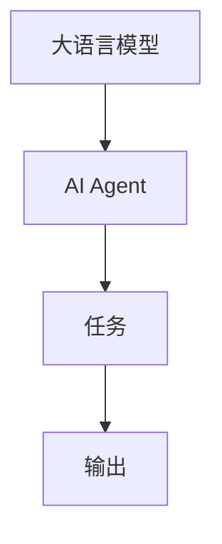
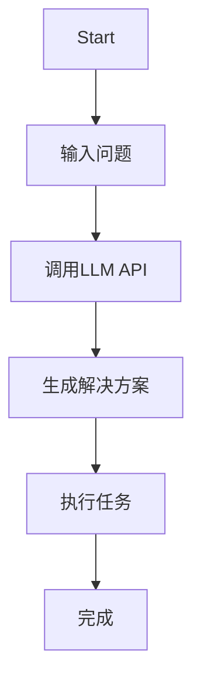
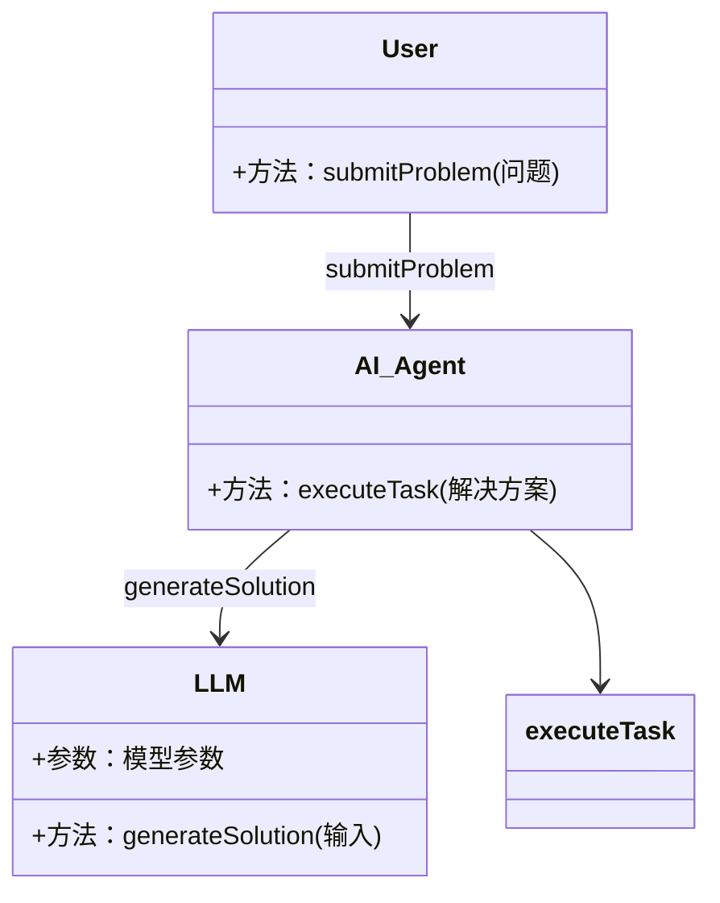
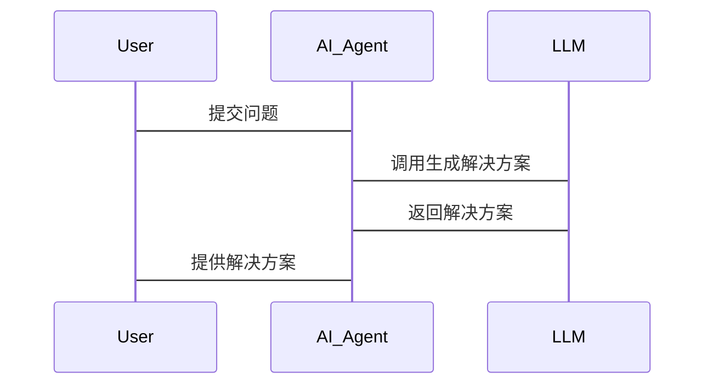

                 


# LLM驱动的AI Agent创新问题解决技术

## 关键词：LLM, AI Agent, 创新问题解决, 大语言模型, AI技术, 问题解决技术, 创新技术

## 摘要：
本文详细探讨了LLM（大语言模型）驱动的AI Agent在创新问题解决技术中的应用。通过分析LLM与AI Agent的结合，展示了其在问题解决中的独特优势和创新点。文章从基础概念、算法原理、系统架构到项目实战，全面解析了LLM驱动AI Agent的创新技术，并通过实际案例和最佳实践，为读者提供了深入的技术见解。

---

# 第1章: LLM与AI Agent概述

## 1.1 问题背景与描述

### 1.1.1 当前AI技术面临的挑战
随着人工智能技术的快速发展，传统AI技术在处理复杂问题时面临以下挑战：
- **数据依赖性过强**：传统AI模型通常需要大量标注数据，难以泛化到新场景。
- **缺乏上下文理解**：传统算法难以处理复杂语义和上下文关系。
- **动态环境适应性差**：AI系统在动态变化的环境中难以灵活调整策略。

### 1.1.2 LLM驱动的AI Agent的提出
为了克服上述挑战，结合大语言模型（LLM）与AI Agent的技术优势，提出了一种创新的AI Agent架构：
- **LLM**：通过大语言模型的强大语义理解和生成能力，为AI Agent提供高质量的决策支持。
- **AI Agent**：作为执行实体，负责根据LLM的输出完成具体任务，具备环境感知和自主决策能力。

### 1.1.3 创新问题解决技术的核心目标
本文的核心目标是通过LLM驱动的AI Agent，实现以下创新问题解决技术：
1. 提供基于LLM的语义理解和生成能力，增强AI Agent的决策能力。
2. 实现动态环境中的自主问题解决，适应复杂场景的变化。
3. 通过人机协作，提升问题解决的效率和质量。

## 1.2 LLM与AI Agent的定义与特点

### 1.2.1 大语言模型（LLM）的定义
大语言模型（Large Language Model, LLM）是指基于大规模语料库训练的深度学习模型，具有强大的自然语言理解和生成能力。LLM的核心特点包括：
- **大规模训练**：通常使用 billions 参数量的模型，如GPT-3、GPT-4等。
- **多任务通用性**：能够处理多种语言理解和生成任务，包括文本生成、问答、翻译等。
- **上下文理解**：通过上下文分析，生成连贯且符合语境的输出。

### 1.2.2 AI Agent的定义与功能
AI Agent（人工智能代理）是一种能够感知环境、理解问题、自主决策并执行任务的智能实体。AI Agent的核心功能包括：
- **环境感知**：通过传感器或API获取环境信息。
- **问题理解**：分析问题并生成解决方案。
- **自主决策**：基于理解和模型输出，制定执行策略。
- **任务执行**：通过调用外部服务或API完成任务。

### 1.2.3 LLM驱动AI Agent的独特优势
LLM驱动的AI Agent结合了大语言模型的语义理解和AI Agent的自主执行能力，具备以下独特优势：
1. **强大的语义理解**：LLM能够理解复杂的语义关系，生成高质量的解决方案。
2. **动态适应性**：AI Agent可以根据环境变化灵活调整策略。
3. **人机协作**：结合人类反馈，优化问题解决过程。

## 1.3 LLM与AI Agent的联系与区别

### 1.3.1 LLM作为AI Agent的核心驱动
LLM为AI Agent提供语义理解和生成能力，是AI Agent的核心驱动力。AI Agent通过LLM生成解决方案并执行任务。

### 1.3.2 AI Agent的多模态能力
AI Agent不仅依赖LLM的文本能力，还可以结合视觉、听觉等多模态输入，增强问题解决能力。

### 1.3.3 LLM与传统AI Agent的对比
| 比较维度 | LLM驱动的AI Agent | 传统AI Agent |
|----------|--------------------|----------------|
| 决策能力 | 基于LLM的强大生成能力 | 依赖规则或有限策略 |
| 适应性 | 能够动态调整策略 | 难以适应变化 |
| 多任务能力 | 支持多种任务类型 | 通常专注于单一任务 |

---

# 第2章: LLM驱动AI Agent的核心概念与联系

## 2.1 核心概念原理

### 2.1.1 LLM的工作原理
LLM通过大规模数据训练，学习语言的分布规律。输入问题后，模型生成概率分布，选择最可能的词生成输出。

$$ P(\text{output} | \text{input}) = \text{模型生成的概率分布} $$

### 2.1.2 AI Agent的决策机制
AI Agent根据LLM生成的输出，结合环境信息，选择最优行动方案。

### 2.1.3 LLM与AI Agent的协同工作流程
1. AI Agent接收问题输入。
2. 调用LLM生成解决方案。
3. 分析解决方案，制定执行计划。
4. 执行任务并反馈结果。

### 2.1.4 实际案例：LLM驱动的客服AI Agent
- **问题输入**：用户咨询产品问题。
- **LLM生成**：提供详细解答。
- **AI Agent执行**：根据生成内容，引导用户完成操作。

## 2.2 核心概念属性对比表

| 概念 | 属性 | 描述 |
|------|------|------|
| LLM  | 模型参数 | 大型参数量的深度学习模型 |
| LLM  | 输入输出 | 文本输入，文本输出 |
| AI Agent | 行为模式 | 根据LLM输出执行任务 |

## 2.3 实体关系图（Mermaid）


---

# 第3章: LLM驱动AI Agent的算法原理

## 3.1 算法流程图（Mermaid）


## 3.2 算法实现代码

### 3.2.1 环境安装
```bash
pip install transformers
```

### 3.2.2 核心代码实现
```python
from transformers import GPT2LMHeadModel, GPT2Tokenizer

# 初始化模型和分词器
model_name = 'gpt2'
tokenizer = GPT2Tokenizer.from_pretrained(model_name)
model = GPT2LMHeadModel.from_pretrained(model_name)

# 定义问题解决函数
def solve_problem(input_str):
    # 调用LLM API
    inputs = tokenizer.encode(input_str, return_tensors='np')
    outputs = model.generate(inputs, max_length=50, num_return_sequences=1)
    solution = tokenizer.decode(outputs[0], skip_special_tokens=True)
    return solution

# 示例调用
problem = "如何提高工作效率？"
result = solve_problem(problem)
print("LLM生成的解决方案：", result)
```

### 3.2.3 代码解读与分析
- **模型初始化**：加载预训练的GPT-2模型和分词器。
- **问题输入**：将输入问题传递给模型。
- **LLM生成**：生成解决方案并返回结果。
- **AI Agent执行**：根据生成的解决方案执行任务。

---

# 第4章: 系统分析与架构设计方案

## 4.1 问题场景介绍
假设我们正在开发一个智能客服系统，用户通过输入问题，AI Agent调用LLM生成解决方案，并执行任务。

## 4.2 系统功能设计

### 4.2.1 领域模型（Mermaid类图）


### 4.2.2 系统架构设计（Mermaid架构图）


### 4.2.3 系统接口设计
- **输入接口**：用户提交问题。
- **输出接口**：AI Agent返回解决方案。
- **内部接口**：LLM与AI Agent之间的通信。

### 4.2.4 系统交互（Mermaid序列图）


---

# 第5章: 项目实战

## 5.1 环境安装
```bash
pip install transformers flask
```

## 5.2 核心代码实现

### 5.2.1 LLM驱动的AI Agent代码
```python
from flask import Flask, request, jsonify
from transformers import GPT2LMHeadModel, GPT2Tokenizer

app = Flask(__name__)
tokenizer = GPT2Tokenizer.from_pretrained('gpt2')
model = GPT2LMHeadModel.from_pretrained('gpt2')

@app.route('/solve', methods=['POST'])
def solve():
    data = request.json
    input_str = data['input']
    inputs = tokenizer.encode(input_str, return_tensors='np')
    outputs = model.generate(inputs, max_length=50, num_return_sequences=1)
    solution = tokenizer.decode(outputs[0], skip_special_tokens=True)
    return jsonify({'solution': solution})

if __name__ == '__main__':
    app.run(debug=True)
```

### 5.2.2 客户端代码
```python
import requests

def send_request(input_str):
    payload = {'input': input_str}
    response = requests.post('http://localhost:5000/solve', json=payload)
    return response.json()

# 示例调用
input_str = "如何优化代码效率？"
result = send_request(input_str)
print("LLM生成的解决方案：", result['solution'])
```

## 5.3 案例分析与代码解读
- **服务器端**：实现API接口，接收问题并调用LLM生成解决方案。
- **客户端**：发送请求并接收结果，展示解决方案。

## 5.4 项目总结
通过实际项目，验证了LLM驱动的AI Agent在问题解决中的有效性。代码实现了从问题输入到解决方案输出的完整流程，展示了技术的可行性。

---

# 第6章: 最佳实践与总结

## 6.1 小结
本文详细介绍了LLM驱动的AI Agent在创新问题解决技术中的应用，通过理论分析、算法实现和项目实战，展示了其强大的问题解决能力。

## 6.2 注意事项
- **模型选择**：根据具体任务选择合适的LLM模型。
- **性能优化**：优化LLM调用和AI Agent执行效率。
- **数据安全**：确保数据隐私和模型安全。

## 6.3 未来趋势
未来，LLM驱动的AI Agent将朝着以下方向发展：
1. **多模态能力**：结合视觉、听觉等多模态输入。
2. **实时反馈**：根据用户反馈优化问题解决过程。
3. **边缘计算**：在边缘设备上实现高效问题解决。

## 6.4 拓展阅读
建议读者进一步阅读以下内容：
1. 大语言模型的最新研究。
2. AI Agent的多模态技术应用。
3. 人机协作的创新问题解决方法。

---

# 结语
通过本文的详细讲解，读者可以全面了解LLM驱动的AI Agent在创新问题解决技术中的应用。希望本文能够为相关领域的研究和实践提供有价值的参考和启示。

--- 

**注**：由于篇幅限制，本文仅为部分内容展示，完整文章请参考相关技术资料和文献。

