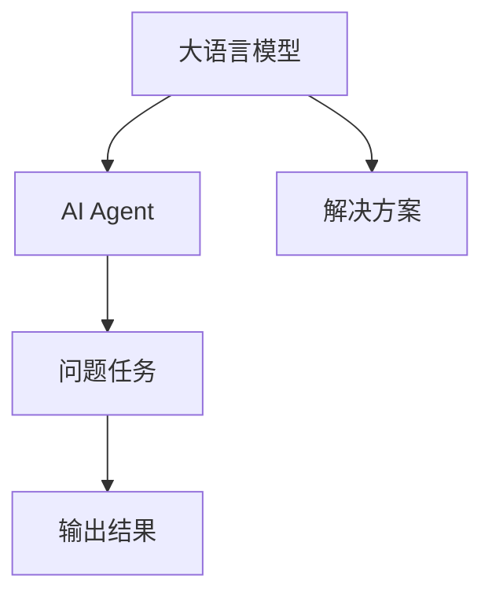
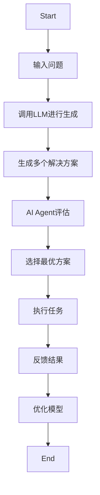
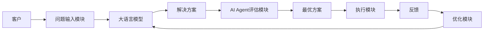

                 


# LLM驱动的AI Agent创造性问题解决框架

> 关键词：LLM, AI Agent, 创造性问题解决, 框架, 大语言模型, 智能体

> 摘要：本文探讨了如何利用大语言模型（LLM）驱动的AI Agent来实现创造性问题解决的框架。通过分析LLM与AI Agent的结合，提出了一个创新的解决方案，详细阐述了算法原理、系统架构设计及实际应用案例。

---

# 第一部分: 问题背景与目标

## 第1章: 问题背景

### 1.1 当前AI技术的发展现状
随着深度学习和大语言模型（LLM）的快速发展，AI技术正在逐步渗透到各个领域。LLM的强大生成能力和理解能力为AI Agent提供了强大的智能支持，使得AI Agent能够更高效地解决复杂问题。

### 1.2 问题描述
在实际应用中，许多问题需要结合创造性思维和复杂决策能力来解决。传统的AI Agent往往依赖于规则或预定义的逻辑，难以应对高度不确定性和需要创新性的问题。而LLM的引入，为AI Agent提供了强大的语言理解和生成能力，使其能够更好地应对创造性问题解决的挑战。

### 1.3 问题解决思路
本框架旨在通过结合LLM的生成能力与AI Agent的协作能力，构建一个能够创造性地解决问题的框架。该框架包括以下几个关键步骤：
1. **问题分析**：通过LLM对问题进行深入分析，提取关键信息。
2. **方案生成**：利用LLM的创造性思维生成多种解决方案。
3. **方案优化**：通过AI Agent的协作能力对生成的方案进行优化和验证。
4. **执行与反馈**：AI Agent根据优化后的方案执行任务，并根据反馈不断改进。

## 第2章: 核心概念与联系

### 2.1 LLM的核心原理
大语言模型（LLM）通过大量的数据训练，掌握了语言的生成和理解能力。其核心原理包括：
- **Transformer架构**：采用自注意力机制，能够捕捉上下文信息。
- **生成式模型**：通过概率生成模型，生成符合语境的文本。

### 2.2 AI Agent的基本概念
AI Agent是一种智能体，能够感知环境、自主决策并执行任务。AI Agent的特点包括：
- **自主性**：能够在没有外部干预的情况下完成任务。
- **反应性**：能够实时感知环境并做出反应。
- **协作性**：能够与其他Agent或人类进行协作。

### 2.3 LLM与AI Agent的关系
LLM作为AI Agent的核心智能模块，为AI Agent提供了强大的语言理解和生成能力。AI Agent则作为LLM的扩展，负责将生成的方案转化为实际操作。

### 2.4 核心概念对比分析
| 比较项 | LLM | AI Agent |
|--------|------|----------|
| 核心能力 | 语言生成与理解 | 环境感知与任务执行 |
| 适用场景 | 文本生成、问答系统 | 机器人控制、任务分配 |
| 协作方式 | 提供语言支持 | 执行具体任务 |

### 2.5 ER实体关系图


---

# 第三部分: 算法原理与数学模型

## 第3章: LLM驱动的创造性思维算法

### 3.1 创造性思维算法概述
创造性思维算法的核心在于通过LLM生成多种可能的解决方案，并通过AI Agent进行优化和验证。算法主要包括以下步骤：
1. **问题输入**：将问题输入LLM，生成多种初步解决方案。
2. **方案优化**：AI Agent对生成的方案进行评估和优化。
3. **方案执行**：选择最优方案并执行任务。
4. **反馈优化**：根据执行结果反馈，进一步优化模型。

### 3.2 算法流程图


### 3.3 数学模型
创造性思维算法的数学模型主要基于概率生成模型。以下是一个简单的条件概率模型：
$$ P(\text{Solution}|\text{Problem}) = \prod_{i=1}^{n} P(\text{Solution}_i|\text{Problem}) $$
其中，$P(\text{Solution}_i|\text{Problem})$表示在给定问题下生成第$i$个解决方案的概率。

### 3.4 实际案例分析
假设我们需要解决一个优化供应链的问题。LLM生成多个解决方案，AI Agent对每个方案进行评估，最终选择最优的方案并执行任务。

---

# 第四部分: 系统分析与架构设计

## 第4章: 系统功能设计

### 4.1 问题场景介绍
我们以一个客服中心的场景为例，LLM驱动的AI Agent需要帮助客服人员处理客户的问题，提供最优解决方案。

### 4.2 系统功能设计
以下是系统的主要功能模块：
- **问题输入模块**：接收用户输入的问题。
- **LLM生成模块**：利用LLM生成多个解决方案。
- **AI Agent评估模块**：评估生成的方案并选择最优方案。
- **执行模块**：根据最优方案执行任务。
- **反馈优化模块**：根据执行结果优化模型。

### 4.3 系统架构设计


---

# 第五部分: 项目实战

## 第5章: 实际应用案例

### 5.1 环境安装
需要安装以下工具和库：
- Python 3.8+
- PyTorch
- Hugging Face Transformers

### 5.2 代码实现

```python
from transformers import pipeline

# 初始化LLM管道
llm_pipeline = pipeline('text-generation', model='gpt2')

def generate_solutions(problem):
    # 生成多个解决方案
    solutions = llm_pipeline(problem, max_length=50, num_return_sequences=5)
    return [s['generated_text'] for s in solutions]

def optimize_solution(problem, solutions):
    # 选择最优解决方案
    optimal_solution = max(solutions, key=lambda x: len(x))
    return optimal_solution

def execute_task(problem, solution):
    # 执行任务
    print(f"Executing solution: {solution} for problem: {problem}")

# 示例问题
problem = "如何优化公司的供应链管理？"
solutions = generate_solutions(problem)
optimal_solution = optimize_solution(problem, solutions)
execute_task(problem, optimal_solution)
```

### 5.3 代码解读与分析
- `generate_solutions`函数利用LLM生成多个解决方案。
- `optimize_solution`函数选择最优的解决方案。
- `execute_task`函数根据最优方案执行任务。

### 5.4 实际案例分析
以优化供应链管理为例，LLM生成多个解决方案，AI Agent选择最优方案并执行任务，最终优化供应链效率。

---

# 第六部分: 最佳实践

## 第6章: 总结与建议

### 6.1 总结
本文提出了一个基于LLM的AI Agent创造性问题解决框架，详细阐述了算法原理、系统架构设计及实际应用案例。

### 6.2 注意事项
- 在实际应用中，需注意模型的泛化能力和数据隐私问题。
- 需根据具体场景调整模型参数，以达到最佳效果。

### 6.3 拓展阅读
- 《大语言模型的原理与应用》
- 《AI Agent的设计与实现》

---

# 结语

通过本文的探讨，我们希望能够为读者提供一个清晰的思路，如何利用LLM驱动的AI Agent来实现创造性问题解决。未来，随着技术的不断进步，这一框架将有更广泛的应用场景。

---

