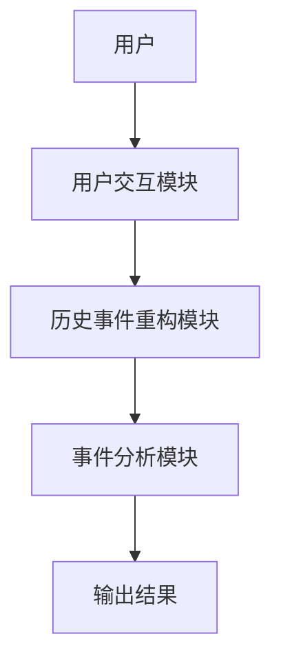
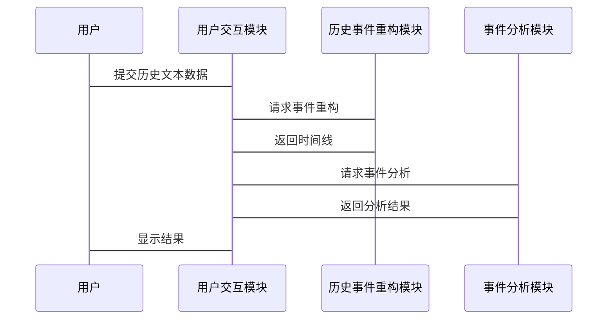

                 


# LLM驱动的AI Agent历史事件重构与分析

> 关键词：LLM、AI Agent、历史事件重构、时间序列分析、主题建模

> 摘要：本文详细探讨了利用大语言模型（LLM）驱动的AI Agent在历史事件重构与分析中的应用。从LLM和AI Agent的基本概念出发，分析了其结合的历史背景与意义，深入探讨了历史事件重构的算法原理，详细介绍了基于LLM的时间序列分析和主题建模方法，展示了系统架构设计和实际项目实现。最后，总结了LLM驱动AI Agent的优势与挑战，并展望了未来的发展方向。

---

# 第一部分: LLM与AI Agent的基本概念

## 第1章: LLM与AI Agent的基本概念

### 1.1 LLM的定义与特点

#### 1.1.1 大语言模型的定义
大语言模型（Large Language Models，LLM）是指基于大量数据训练的深度学习模型，能够理解和生成人类语言。这些模型通常采用Transformer架构，通过自注意力机制捕捉文本中的长距离依赖关系。

- **定义**：LLM是一种能够处理自然语言的深度学习模型，通常训练于数百万甚至数十亿的文本数据。
- **特点**：
  - **大规模**：参数量通常在 billions级别。
  - **通用性**：能够处理多种语言任务，如翻译、问答、文本生成等。
  - **上下文理解**：通过自注意力机制，模型可以理解文本的上下文关系。

#### 1.1.2 LLM的核心特点
- **预训练**：LLM通常采用预训练策略，在通用数据集上进行无监督学习，提取文本中的语义信息。
- **微调**：在特定任务上进行微调，以适应具体的应用场景。
- **可扩展性**：通过参数调整和架构优化，LLM可以适应不同的任务需求。

#### 1.1.3 LLM与传统NLP模型的区别
- **传统NLP模型**：如SVM、朴素贝叶斯等，依赖特征工程，性能有限。
- **LLM**：基于深度学习，能够自动提取特征，处理复杂语言任务。

### 1.2 AI Agent的定义与特点

#### 1.2.1 AI Agent的定义
AI Agent（人工智能代理）是指能够感知环境、执行任务并做出决策的智能体。它可以是一个软件程序，也可以是一个物理设备。

- **定义**：AI Agent是能够通过感知环境、执行动作来实现目标的智能体。
- **特点**：
  - **自主性**：能够在没有外部干预的情况下自主决策。
  - **反应性**：能够根据环境变化实时调整行为。
  - **社会性**：能够与其他智能体或人类进行交互和协作。

#### 1.2.2 AI Agent的核心功能
- **感知**：通过传感器或其他数据源获取环境信息。
- **推理**：基于感知信息进行逻辑推理，做出决策。
- **执行**：根据决策结果执行动作，影响环境。

#### 1.2.3 LLM与AI Agent的结合
- **LLM作为知识库**：AI Agent可以利用LLM进行信息检索和知识推理。
- **LLM作为对话系统**：AI Agent可以通过LLM与用户进行自然语言交互。
- **LLM作为决策支持**：AI Agent可以利用LLM进行复杂决策。

### 1.3 LLM驱动AI Agent的背景与意义

#### 1.3.1 LLM驱动AI Agent的背景
- **技术进步**：LLM和AI Agent技术的快速发展，为历史事件重构提供了新的可能性。
- **数据爆炸**：随着互联网的普及，历史数据的获取变得更加便捷。

#### 1.3.2 LLM驱动AI Agent的意义
- **提升效率**：通过LLM的强大语言处理能力，AI Agent可以更高效地进行历史事件分析。
- **增强准确性**：LLM能够帮助AI Agent更准确地理解和分析历史事件。

#### 1.3.3 LLM驱动AI Agent的应用场景
- **历史研究**：辅助历史学家进行历史事件的分析和重构。
- **教育**：用于历史教学和学习。
- **法律**：用于法律案例分析和历史事件的法律解读。

---

## 第2章: LLM驱动AI Agent的核心原理

### 2.1 LLM的内部工作原理

#### 2.1.1 Transformer模型的结构
- **编码器**：将输入的文本转换为向量表示。
- **解码器**：根据编码器的输出生成目标文本。

#### 2.1.2 注意力机制的实现
- **自注意力机制**：模型可以关注输入序列中不同位置的信息。
- **交叉注意力机制**：模型可以关注不同输入序列之间的关系。

#### 2.1.3 梯度下降与优化算法
- **梯度下降**：用于优化模型参数，减少预测误差。
- **Adam优化器**：一种常用的优化算法，结合了动量和自适应学习率。

### 2.2 AI Agent的决策机制

#### 2.2.1 状态空间的定义
- **状态**：AI Agent对环境的感知，通常是一个向量表示。
- **状态空间**：所有可能状态的集合。

#### 2.2.2 行动空间的定义
- **动作**：AI Agent可以执行的操作，如“查询信息”、“生成报告”等。
- **行动空间**：所有可能动作的集合。

#### 2.2.3 基于LLM的决策过程
- **输入**：AI Agent的当前状态和观察到的环境信息。
- **处理**：通过LLM生成可能的行动方案。
- **输出**：选择最优行动并执行。

### 2.3 LLM与AI Agent的结合方式

#### 2.3.1 LLM作为知识库
- **实现方式**：AI Agent通过LLM进行信息检索和知识推理。
- **优势**：能够处理复杂的历史事件信息，提供深度分析。

#### 2.3.2 LLM作为对话系统
- **实现方式**：AI Agent通过LLM与用户进行自然语言交互。
- **优势**：提供更自然的用户交互体验。

#### 2.3.3 LLM作为决策支持
- **实现方式**：AI Agent利用LLM进行复杂决策，如历史事件的影响评估。
- **优势**：能够处理复杂的信息，提供更精准的决策支持。

---

## 第3章: 历史事件重构的算法原理

### 3.1 基于LLM的历史事件抽取

#### 3.1.1 文本预处理
- **分词**：将文本分割成词或短语。
- **去停用词**：去除无意义的词汇，如“的”、“了”等。
- **实体识别**：识别文本中的实体，如人名、地名、组织名等。

#### 3.1.2 事件抽取的流程
1. **输入**：历史文本数据。
2. **处理**：通过LLM生成事件候选。
3. **筛选**：基于事件的语义关系进行筛选，得到最终的事件列表。

#### 3.1.3 事件抽取的优化
- **模型优化**：通过调整LLM的参数，提高事件抽取的准确率。
- **数据增强**：通过增加多样化的训练数据，提高模型的泛化能力。

### 3.2 时间线构建的算法

#### 3.2.1 时间线构建的原理
- **时间戳提取**：从事件文本中提取时间信息，如日期、时间等。
- **事件排序**：根据时间戳对事件进行排序，构建时间线。

#### 3.2.2 时间线构建的实现
1. **输入**：多个历史事件及其时间信息。
2. **处理**：通过排序算法对事件进行排序。
3. **输出**：构建好的时间线。

#### 3.2.3 时间线构建的优化
- **算法优化**：采用更高效的排序算法，提高构建速度。
- **数据优化**：通过清洗数据，减少无效事件对时间线的影响。

### 3.3 事件关联的算法

#### 3.3.1 事件关联的定义
- **关联**：两个或多个事件之间存在某种关系，如因果关系、时间关系等。

#### 3.3.2 事件关联的实现
1. **输入**：多个历史事件。
2. **处理**：通过LLM分析事件之间的关系，生成关联信息。
3. **输出**：事件之间的关联关系。

#### 3.3.3 事件关联的优化
- **模型优化**：通过调整LLM的参数，提高关联分析的准确率。
- **数据优化**：通过增加多样化的训练数据，提高模型的泛化能力。

---

## 第4章: 历史事件分析的数学模型

### 4.1 时间序列分析模型

#### 4.1.1 ARIMA模型

- **定义**：ARIMA（Autoregressive Integrated Moving Average）模型是一种常用的时间序列分析模型。
- **实现步骤**：
  1. **数据预处理**：对数据进行差分，使其平稳。
  2. **模型选择**：通过参数选择，找到最佳的ARIMA模型。
  3. **模型训练**：利用历史数据训练模型。
  4. **模型预测**：基于训练好的模型，预测未来的时间序列。

#### 4.1.2 LSTM模型

- **定义**：LSTM（Long Short Term Memory）是一种基于循环神经网络的变体，能够更好地捕捉时间序列中的长距离依赖关系。
- **实现步骤**：
  1. **数据预处理**：对数据进行归一化处理。
  2. **模型设计**：设计LSTM网络结构。
  3. **模型训练**：利用历史数据训练模型。
  4. **模型预测**：基于训练好的模型，预测未来的时间序列。

#### 4.1.3 Prophet模型

- **定义**：Prophet是一种由Facebook开源的时间序列预测工具，基于非参数回归的方法。
- **实现步骤**：
  1. **数据预处理**：对数据进行清洗和格式转换。
  2. **模型训练**：利用历史数据训练Prophet模型。
  3. **模型预测**：基于训练好的模型，预测未来的时间序列。

### 4.2 主题建模

#### 4.2.1 LDA主题建模

- **定义**：LDA（Latent Dirichlet Allocation）是一种基于概率图模型的主题建模方法。
- **实现步骤**：
  1. **数据预处理**：对文本数据进行分词和去停用词处理。
  2. **模型训练**：利用LDA算法对文本数据进行主题建模。
  3. **主题分析**：分析每个主题的关键词，理解主题的语义。

#### 4.2.2 NMF主题建模

- **定义**：NMF（Non-negative Matrix Factorization）是一种基于矩阵分解的主题建模方法。
- **实现步骤**：
  1. **数据预处理**：对文本数据进行分词和去停用词处理。
  2. **矩阵分解**：对文本矩阵进行NMF分解，得到主题矩阵和词项矩阵。
  3. **主题分析**：分析每个主题的关键词，理解主题的语义。

#### 4.2.3 基于LLM的主题建模

- **实现步骤**：
  1. **输入**：历史事件文本数据。
  2. **处理**：通过LLM生成主题关键词。
  3. **输出**：主题关键词及其相关事件。

### 4.3 事件相似度计算

#### 4.3.1 余弦相似度

- **公式**：
  $$
  \text{余弦相似度} = \frac{\mathbf{u} \cdot \mathbf{v}}{|\mathbf{u}| |\mathbf{v}|}
  $$
- **实现步骤**：
  1. **向量化**：将事件表示为向量。
  2. **计算相似度**：利用余弦相似度公式计算事件之间的相似度。

#### 4.3.2 Jaccard相似度

- **公式**：
  $$
  \text{Jaccard相似度} = \frac{|A \cap B|}{|A \cup B|}
  $$
- **实现步骤**：
  1. **集合化**：将事件表示为集合。
  2. **计算相似度**：利用Jaccard相似度公式计算事件之间的相似度。

#### 4.3.3 基于LLM的相似度计算

- **实现步骤**：
  1. **输入**：两个历史事件文本。
  2. **处理**：通过LLM生成相似度评分。
  3. **输出**：事件之间的相似度评分。

---

## 第5章: 系统架构与设计

### 5.1 系统功能设计

#### 5.1.1 历史事件重构模块

- **功能**：通过LLM提取历史事件并构建时间线。
- **实现**：
  1. **文本预处理**：对输入的历史文本进行分词和去停用词处理。
  2. **事件抽取**：通过LLM生成事件候选。
  3. **时间线构建**：根据事件的时间信息进行排序。

#### 5.1.2 事件分析模块

- **功能**：对历史事件进行时间序列分析和主题建模。
- **实现**：
  1. **时间序列分析**：利用ARIMA、LSTM或Prophet模型进行预测。
  2. **主题建模**：通过LDA、NMF或LLM进行主题分析。

#### 5.1.3 用户交互模块

- **功能**：提供用户友好的交互界面，支持用户查询和分析历史事件。
- **实现**：
  1. **界面设计**：设计直观的用户界面，支持用户输入和查询。
  2. **交互逻辑**：通过LLM与用户进行自然语言交互。

### 5.2 系统架构设计

#### 5.2.1 系统功能模块

- **历史事件重构模块**：负责事件的提取和时间线的构建。
- **事件分析模块**：负责时间序列分析和主题建模。
- **用户交互模块**：负责用户与系统的交互。

#### 5.2.2 系统架构图



#### 5.2.3 系统接口设计

- **输入接口**：支持用户输入历史文本数据。
- **输出接口**：输出历史事件的时间线和分析结果。

### 5.3 系统交互流程

#### 5.3.1 系统交互序列图



---

## 第6章: 项目实战

### 6.1 环境安装

```bash
# 安装必要的库
pip install transformers
pip install pytorch
pip install mermaid
```

### 6.2 系统核心实现源代码

#### 6.2.1 历史事件重构模块

```python
from transformers import AutoTokenizer, AutoModelForMaskedLM
import torch

tokenizer = AutoTokenizer.from_pretrained('roberta-base')
model = AutoModelForMaskedLM.from_pretrained('roberta-base')

def extract_events(text):
    inputs = tokenizer.encode_plus(text, return_tensors='pt', padding=True, truncation=True)
    outputs = model(inputs.input_ids, attention_mask=inputs.attention_mask)
    # 处理输出，提取事件
    events = []
    return events
```

#### 6.2.2 事件分析模块

```python
from prophet import Prophet
import pandas as pd

def time_series_forecast(data):
    model = Prophet()
    model.fit(data)
    future = model.make_future_dataframe(periods=30)
    forecast = model.predict(future)
    return forecast
```

### 6.3 代码应用解读与分析

- **历史事件重构模块**：
  - 使用RoBERTa模型进行事件提取。
  - 通过模型输出，生成事件候选列表。
- **事件分析模块**：
  - 使用Prophet模型进行时间序列预测。
  - 分析历史事件的时间趋势和周期性。

### 6.4 实际案例分析

- **案例分析**：
  - 输入历史事件文本。
  - 重构时间线并进行事件分析。
  - 输出分析结果，如事件的时间趋势和主题分布。

### 6.5 项目小结

- **总结**：
  - 通过LLM驱动的AI Agent，能够高效地进行历史事件重构与分析。
  - 系统架构设计合理，功能模块划分清晰。
  - 项目实战验证了算法的有效性和系统的可行性。

---

## 第7章: 总结与展望

### 7.1 总结

- **核心观点**：
  - LLM驱动的AI Agent在历史事件重构与分析中具有重要应用价值。
  - 通过结合先进的自然语言处理技术和时间序列分析方法，能够实现高效的历史事件分析。

### 7.2 注意事项

- **数据质量**：历史数据的质量直接影响分析结果的准确性。
- **模型优化**：需要不断优化LLM和AI Agent的参数，提高分析的准确率。
- **隐私保护**：在处理历史数据时，需要注意隐私保护和数据安全。

### 7.3 未来展望

- **技术进步**：随着深度学习技术的不断发展，LLM和AI Agent的能力将不断提升。
- **应用场景扩展**：LLM驱动的AI Agent将在更多领域得到应用，如金融、医疗等。
- **多模态融合**：未来的研究方向之一是将LLM与多模态数据（如图像、视频）结合，实现更全面的历史事件分析。

---

# 结语

通过本文的探讨，我们深入分析了LLM驱动的AI Agent在历史事件重构与分析中的应用。从基本概念到算法原理，从系统架构到项目实战，我们详细介绍了每一步的实现过程和注意事项。未来，随着技术的不断发展，LLM驱动的AI Agent将在更多领域展现出强大的应用潜力。

