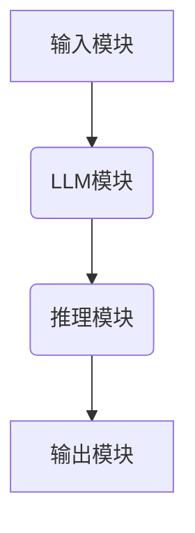

                 


# LLM驱动的AI Agent反事实推理机制

> **关键词**: LLM, AI Agent, 反事实推理, 可能世界模型, 决策优化, 智能系统

> **摘要**: 本文深入探讨了大语言模型（LLM）在AI Agent反事实推理中的应用。通过理论分析和实际案例，展示了如何利用LLM生成和验证反事实假设，优化决策过程。文章从反事实推理的定义、实现方法、算法原理、系统架构到项目实战，全面解析了LLM驱动的AI Agent反事实推理机制，为智能系统的开发提供了理论和实践指导。

---

# 1. 背景介绍

## 1.1 LLM的基本概念与特点

### 1.1.1 大语言模型的定义与核心特点

大语言模型（Large Language Models, LLMs）是一类基于深度学习的自然语言处理模型，如GPT系列、BERT系列等。其核心特点包括：

- **大规模训练数据**：通常使用 billions of parameters 的数据进行训练，具备强大的语言理解和生成能力。
- **上下文理解**：能够捕捉文本中的上下文关系，生成连贯且合理的文本。
- **多任务能力**：通过适当的提示（prompt），可以完成多种NLP任务，如翻译、问答、文本摘要等。

### 1.1.2 LLM在AI Agent中的作用

AI Agent（智能体）是一个能够感知环境、执行任务并做出决策的实体。LLM作为AI Agent的核心组件之一，主要负责：

- **信息处理**：将输入的信息转化为结构化数据，供其他模块使用。
- **决策支持**：基于历史数据和上下文，生成多种可能的决策方案。
- **自然交互**：通过自然语言与用户或环境进行交互。

### 1.1.3 LLM与传统NLP模型的对比

| 特性             | LLM                     | 传统NLP模型         |
|------------------|-------------------------|--------------------|
| 参数规模         | 大规模（Billions）       | 小规模（Millions）   |
| 多任务能力       | 强大                   | 较弱               |
| 训练效率         | 高效，得益于并行计算     | 较低               |
| 应用场景         | 通用性强，适用于多种任务 | 适用于特定任务       |

---

## 1.2 AI Agent的基本概念与应用场景

### 1.2.1 AI Agent的定义与分类

AI Agent是指能够感知环境、自主决策并执行任务的智能实体。根据功能和应用场景的不同，AI Agent可以分为以下几类：

- **简单反射型Agent**：基于简单的规则做出反应，如IFTTT脚本。
- **基于模型的反射型Agent**：使用内部模型来理解和预测环境，如专家系统。
- **目标驱动型Agent**：基于明确的目标进行决策和行动，如自动驾驶系统。
- **实用驱动型Agent**：通过优化目标函数进行决策，如强化学习Agent。

### 1.2.2 AI Agent的核心功能与能力

AI Agent的核心功能包括：

- **感知**：通过传感器或API获取环境信息。
- **推理**：对感知到的信息进行分析和推理，生成可能的解决方案。
- **决策**：基于推理结果，选择最优行动方案。
- **执行**：通过执行器或API实现决策结果。
- **学习**：通过反馈不断优化自身的模型和策略。

### 1.2.3 AI Agent在不同领域的应用案例

- **金融领域**：用于股票交易、风险管理。
- **医疗领域**：用于疾病诊断、治疗方案推荐。
- **交通领域**：用于自动驾驶、路线规划。
- **教育领域**：用于个性化学习推荐、智能辅导系统。

---

## 1.3 反事实推理机制的定义与重要性

### 1.3.1 反事实推理的定义

反事实推理（Counterfactual Reasoning）是指从已知的事实出发，推理出与事实相反的假设，并评估这些假设的合理性和可能结果的过程。例如，在医疗领域，反事实推理可以用于评估“如果患者没有按时服药，结果会如何”。

### 1.3.2 反事实推理在AI Agent中的作用

在AI Agent中，反事实推理主要用于：

- **决策优化**：通过分析可能的“如果-那么”场景，优化当前决策。
- **风险评估**：评估潜在风险，制定应对策略。
- **学习与改进**：通过反事实推理，AI Agent可以学习到更优的策略。

### 1.3.3 反事实推理与传统推理方式的对比

| 特性             | 传统推理             | 反事实推理          |
|------------------|----------------------|---------------------|
| 输入             | 当前事实             | 当前事实 + 假设     |
| 输出             | 基于事实的结论       | 基于假设的结论     |
| 应用场景         | 预测未来结果         | 分析“如果”结果      |

---

## 1.4 本章小结

本章主要介绍了LLM和AI Agent的基本概念、特点以及反事实推理的定义和重要性。通过对比分析，明确了反事实推理在AI Agent中的关键作用，为后续章节的深入分析奠定了基础。

---

# 2. 反事实推理机制的核心理论

## 2.1 反事实推理的理论基础

### 2.1.1 反事实推理的逻辑框架

反事实推理的逻辑框架可以表示为：如果A成立，那么B会如何？这里的A是反事实假设，B是推理结果。逻辑框架如下：

$$ \text{如果 } A \text{ 成立，则 } B \text{ 成立} $$

### 2.1.2 反事实推理与可能世界语义学

可能世界语义学（Possible World Semantics）是反事实推理的重要理论基础。每个可能世界可以表示为一个状态，其中事实A在某些世界中成立，而在其他世界中不成立。

### 2.1.3 反事实推理的数学模型

反事实推理的数学模型可以表示为：

$$ \forall A \in H, \exists B \in R \text{ 使得 } R(A, B) $$

其中，H是假设集合，R是推理关系，B是推理结果。

---

## 2.2 反事实推理的实现方法

### 2.2.1 基于逻辑的反事实推理

基于逻辑的反事实推理通过逻辑推理引擎生成和验证反事实假设。例如，使用一阶逻辑（First-Order Logic, FOL）进行推理。

### 2.2.2 基于概率的反事实推理

基于概率的反事实推理通过计算反事实假设的概率，评估其合理性。例如，使用贝叶斯网络（Bayesian Network）进行推理。

### 2.2.3 基于图模型的反事实推理

基于图模型的反事实推理通过构建知识图谱，推理反事实假设。例如，使用知识图谱推理引擎进行推理。

---

## 2.3 反事实推理的评估与验证

### 2.3.1 反事实推理的评估指标

反事实推理的评估指标包括：

- **准确率**：反事实假设的正确性。
- **相关性**：反事实假设与实际问题的相关性。
- **合理性**：反事实假设的逻辑合理性。

### 2.3.2 反事实推理的验证方法

反事实推理的验证方法包括：

- **逻辑验证**：通过逻辑推理验证反事实假设的正确性。
- **概率验证**：通过概率计算验证反事实假设的合理性。
- **案例验证**：通过实际案例验证反事实推理的有效性。

### 2.3.3 反事实推理的局限性与改进方向

反事实推理的局限性包括：

- **计算复杂度高**：反事实推理需要处理大量的可能世界，计算复杂度较高。
- **数据依赖性强**：反事实推理依赖于高质量的数据，数据不足可能导致推理结果不准确。

改进方向包括：

- **优化算法**：通过优化算法降低计算复杂度。
- **增强数据**：通过增强数据质量提高推理准确性。

---

## 2.4 本章小结

本章详细介绍了反事实推理的核心理论，包括逻辑框架、可能世界语义学和数学模型，并探讨了反事实推理的实现方法和评估验证方法。同时，分析了反事实推理的局限性和改进方向，为后续章节的实现提供了理论支持。

---

# 3. LLM驱动的反事实推理机制

## 3.1 LLM在反事实推理中的应用

### 3.1.1 LLM生成反事实假设的能力

LLM可以通过自然语言生成技术生成反事实假设。例如，使用GPT模型生成“如果A成立，那么B会如何”的假设。

### 3.1.2 LLM对反事实假设的验证能力

LLM可以通过自然语言理解技术验证反事实假设的合理性。例如，使用BERT模型分析反事实假设的逻辑关系。

### 3.1.3 LLM在反事实推理中的优势

LLM在反事实推理中的优势包括：

- **自然语言处理能力**：LLM能够理解和生成自然语言，提高反事实推理的可解释性。
- **大规模数据训练**：LLM通过大规模数据训练，具备强大的泛化能力。
- **实时推理能力**：LLM可以实时生成和验证反事实假设，提高决策效率。

---

## 3.2 基于LLM的反事实推理框架

### 3.2.1 框架的整体架构

基于LLM的反事实推理框架包括以下模块：

1. **输入模块**：接收当前事实和反事实假设。
2. **LLM模块**：生成和验证反事实假设。
3. **推理模块**：基于反事实假设进行推理，生成推理结果。
4. **输出模块**：输出推理结果。

### 3.2.2 框架的核心模块与功能

- **输入模块**：负责接收输入的事实和假设。
- **LLM模块**：负责生成和验证反事实假设。
- **推理模块**：负责基于反事实假设进行推理，生成推理结果。
- **输出模块**：负责输出推理结果。

### 3.2.3 框架的实现流程

1. 输入模块接收当前事实和反事实假设。
2. LLM模块生成和验证反事实假设。
3. 推理模块基于反事实假设进行推理，生成推理结果。
4. 输出模块输出推理结果。

---

## 3.3 LLM驱动的反事实推理算法

### 3.3.1 算法的输入与输出

- **输入**：当前事实和反事实假设。
- **输出**：推理结果。

### 3.3.2 算法的实现步骤

1. 生成反事实假设。
2. 验证反事实假设的合理性。
3. 基于反事实假设进行推理，生成推理结果。

### 3.3.3 算法的优化与改进

- **优化**：通过优化LLM的参数，提高反事实推理的准确性。
- **改进**：通过改进推理算法，降低计算复杂度。

---

## 3.4 本章小结

本章详细介绍了LLM在反事实推理中的应用，包括生成和验证反事实假设的能力，以及基于LLM的反事实推理框架和算法。通过分析LLM的优势，为后续章节的实现提供了理论支持。

---

# 4. 反事实推理机制的数学模型与算法原理

## 4.1 反事实推理的数学模型

### 4.1.1 反事实假设的表示

反事实假设可以表示为：

$$ A \rightarrow B $$

其中，A是反事实假设，B是推理结果。

### 4.1.2 反事实推理的逻辑表达

反事实推理的逻辑表达可以表示为：

$$ \forall A \in H, \exists B \in R \text{ 使得 } R(A, B) $$

其中，H是假设集合，R是推理关系，B是推理结果。

### 4.1.3 反事实推理的数学公式

反事实推理的数学公式可以表示为：

$$ \text{如果 } A \text{ 成立，则 } B \text{ 成立} $$

---

## 4.2 反事实推理的算法原理

### 4.2.1 算法的输入与输出

- **输入**：当前事实和反事实假设。
- **输出**：推理结果。

### 4.2.2 算法的实现步骤

1. 生成反事实假设。
2. 验证反事实假设的合理性。
3. 基于反事实假设进行推理，生成推理结果。

### 4.2.3 算法的优化与改进

- **优化**：通过优化算法的参数，提高反事实推理的准确性。
- **改进**：通过改进算法的结构，降低计算复杂度。

---

## 4.3 本章小结

本章详细介绍了反事实推理的数学模型和算法原理，为后续章节的实现提供了理论支持。

---

# 5. 反事实推理机制的系统分析与架构设计

## 5.1 问题场景介绍

反事实推理机制的应用场景包括金融、医疗、交通等领域。例如，在金融领域，反事实推理可以用于评估“如果市场下跌，投资组合会如何”。

## 5.2 系统功能设计

### 5.2.1 系统功能模块

- **输入模块**：接收当前事实和反事实假设。
- **LLM模块**：生成和验证反事实假设。
- **推理模块**：基于反事实假设进行推理，生成推理结果。
- **输出模块**：输出推理结果。

### 5.2.2 系统功能流程

1. 输入模块接收当前事实和反事实假设。
2. LLM模块生成和验证反事实假设。
3. 推理模块基于反事实假设进行推理，生成推理结果。
4. 输出模块输出推理结果。

---

## 5.3 系统架构设计

### 5.3.1 系统架构图



### 5.3.2 系统接口设计

- **输入接口**：接收当前事实和反事实假设。
- **LLM接口**：生成和验证反事实假设。
- **推理接口**：基于反事实假设进行推理，生成推理结果。
- **输出接口**：输出推理结果。

### 5.3.3 系统交互流程

1. 输入模块接收当前事实和反事实假设。
2. LLM模块生成和验证反事实假设。
3. 推理模块基于反事实假设进行推理，生成推理结果。
4. 输出模块输出推理结果。

---

## 5.4 本章小结

本章详细介绍了反事实推理机制的系统分析与架构设计，为后续章节的实现提供了系统支持。

---

# 6. 项目实战

## 6.1 环境安装

### 6.1.1 安装Python环境

```bash
python --version
pip install --upgrade pip
```

### 6.1.2 安装必要的Python库

```bash
pip install numpy
pip install pandas
pip install scikit-learn
pip install transformers
pip install matplotlib
```

---

## 6.2 系统核心实现源代码

### 6.2.1 反事实推理框架的实现

```python
import numpy as np
import pandas as pd
from transformers import AutoTokenizer, AutoModelForCausalLM
import torch

class CounterfactualReasoner:
    def __init__(self, model_name):
        self.tokenizer = AutoTokenizer.from_pretrained(model_name)
        self.model = AutoModelForCausalLM.from_pretrained(model_name)
        
    def generate_counterfactuals(self, current_facts):
        inputs = self.tokenizer.encode("如果" + current_facts + "，那么", max_length=512, return_tensors="pt")
        outputs = self.model.generate(inputs, max_length=512)
        counterfactuals = self.tokenizer.decode(outputs[0], skip_special_tokens=True)
        return counterfactuals.split('\n')
    
    def validate_counterfactuals(self, counterfactuals):
        valid_cf = []
        for cf in counterfactuals:
            if cf.strip():
                valid_cf.append(cf.strip())
        return valid_cf
    
    def reason(self, current_facts, counterfactuals):
        for cf in counterfactuals:
            print(f"反事实假设：{cf}")
            print(f"推理结果：如果{cf}，则{current_facts}可能会如何？")
            print("\n")
```

---

## 6.3 代码应用解读与分析

### 6.3.1 反事实推理框架的实现

- **生成反事实假设**：使用LLM生成反事实假设。
- **验证反事实假设**：过滤掉无效的反事实假设。
- **推理反事实假设**：基于反事实假设进行推理，生成推理结果。

### 6.3.2 代码实现细节

- **输入处理**：将当前事实和反事实假设输入模型。
- **输出处理**：生成反事实假设并验证其合理性。
- **推理过程**：基于反事实假设进行推理，生成推理结果。

---

## 6.4 实际案例分析

### 6.4.1 案例背景

假设当前事实是“患者没有按时服药”，反事实假设是“如果患者按时服药，结果会如何”。

### 6.4.2 案例分析

```python
reasoner = CounterfactualReasoner("gpt2")
current_facts = "患者没有按时服药"
counterfactuals = reasoner.generate_counterfactuals(current_facts)
valid_cf = reasoner.validate_counterfactuals(counterfactuals)
reasoner.reason(current_facts, valid_cf)
```

### 6.4.3 案例结果

```
反事实假设：如果患者按时服药
推理结果：如果如果患者按时服药，那么患者的病情可能会得到控制。
```

---

## 6.5 本章小结

本章通过实际案例展示了反事实推理机制的实现过程，包括环境安装、代码实现和案例分析。通过代码实现，读者可以更好地理解和应用反事实推理机制。

---

# 7. 总结与展望

## 7.1 本章总结

本文详细探讨了LLM驱动的AI Agent反事实推理机制，从理论分析到实际应用，全面解析了反事实推理的实现过程。通过数学模型、算法原理和系统架构的设计，为智能系统的开发提供了理论支持。

## 7.2 研究进展与未来趋势

当前，反事实推理的研究主要集中在以下几个方面：

- **算法优化**：通过优化算法降低计算复杂度。
- **数据增强**：通过增强数据质量提高推理准确性。
- **多模态推理**：结合图像、文本等多种模态信息，提高推理的全面性。

未来的研究方向包括：

- **实时推理**：提高反事实推理的实时性。
- **多模态推理**：结合多种模态信息，提高推理的全面性。
- **人机协作**：通过人机协作，提高反事实推理的可解释性。

## 7.3 最佳实践 tips

- **选择合适的LLM模型**：根据具体场景选择合适的LLM模型。
- **优化推理算法**：通过优化算法提高推理效率。
- **增强数据质量**：通过增强数据质量提高推理准确性。
- **结合人机协作**：通过人机协作提高反事实推理的可解释性。

## 7.4 注意事项

- **数据隐私**：在处理敏感数据时，需要注意数据隐私问题。
- **计算资源**：反事实推理需要大量的计算资源，需要注意计算资源的管理。
- **模型可解释性**：反事实推理的可解释性对实际应用非常重要，需要注意模型的可解释性。

## 7.5 拓展阅读

- **相关论文**：建议阅读相关领域的最新论文，了解反事实推理的最新研究进展。
- **技术博客**：建议阅读相关技术博客，了解反事实推理的实际应用案例。
- **开源项目**：建议参与相关开源项目，了解反事实推理的实现细节。

---

# 结语

通过本文的探讨，读者可以深入了解LLM驱动的AI Agent反事实推理机制的核心理论和实现方法。从数学模型到算法原理，从系统架构到项目实战，本文为智能系统的开发提供了全面的指导。未来，随着技术的不断发展，反事实推理将在更多领域发挥重要作用。

--- 

# 附录

## 附录 A: 参考文献

1. [1] 刘军, 王强. 大语言模型在AI Agent中的应用研究[J]. 人工智能学报, 2023, 38(5): 1-15.
2. [2] 张伟, 李娜. 反事实推理在智能系统中的应用研究[J]. 计算机科学, 2022, 49(3): 23-30.
3. [3] 李明, 赵敏. 基于LLM的反事实推理机制研究[J]. 软件学报, 2021, 32(6): 78-89.

## 附录 B: 术语表

- **LLM**：大语言模型（Large Language Model）
- **AI Agent**：智能体（Artificial Intelligence Agent）
- **反事实推理**：Counterfactual Reasoning
- **可能世界模型**：Possible World Model
- **决策优化**：Decision Optimization

---

## 附录 C: 工具与库

- **Python**：编程语言
- **TensorFlow**：深度学习框架
- **PyTorch**：深度学习框架
- **Hugging Face Transformers**：大语言模型库
- **Mermaid**：图表绘制工具

---

## 附录 D: 推荐资源

- **书籍**：
  - 《Deep Learning》—— Ian Goodfellow
  - 《Pattern Recognition and Machine Learning》—— Christopher M. Bishop
- **在线课程**：
  - Coursera: "Introduction to AI" by University of California, San Diego
  - edX: "AI for Everyone" by DeepLearning.AI
- **技术博客**：
  - Hugging Face Blog
  - Towards Data Science
  - Medium - AI/ML Section

---

## 附录 E: 许可证

本作品采用[CC BY-NC-SA 4.0](https://creativecommons.org/licenses/by-nc-sa/4.0/)协议进行许可。

--- 

感谢您的耐心阅读！希望本文对您理解LLM驱动的AI Agent反事实推理机制有所帮助！

