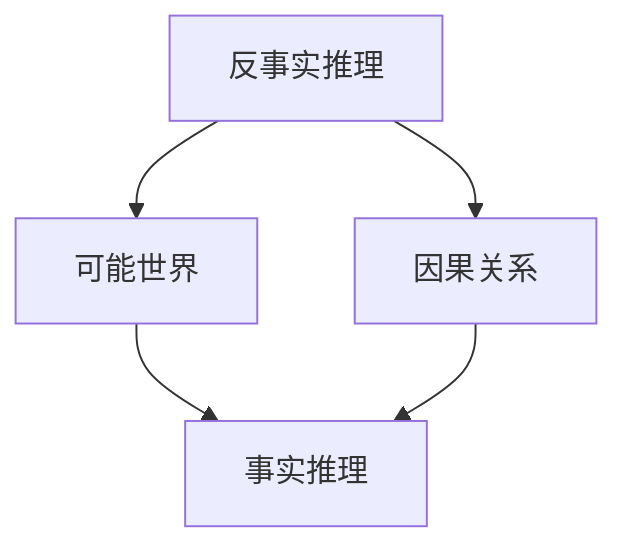

                 

# LLM驱动的AI Agent反事实推理能力

> 关键词：LLM，AI Agent，反事实推理，可能世界模型，因果推理，逻辑推理

> 摘要：本文探讨了LLM驱动的AI Agent在反事实推理能力上的实现与应用。通过分析反事实推理的核心概念、算法原理、系统架构及项目实战，揭示其在智能决策支持系统中的重要性与潜力。文章结合理论与实践，详细阐述了反事实推理的数学模型、逻辑框架以及系统设计，并通过具体案例展示了其在实际场景中的应用价值。

---

## 第一部分：背景介绍

### 第1章：反事实推理的定义与背景

#### 1.1 反事实推理的核心概念
反事实推理是一种基于假设的推理方式，旨在探索“如果情况发生改变，结果会如何”的可能性。它不同于事实推理，后者关注现实情况下的结果。反事实推理在AI Agent中具有重要意义，因为它能够帮助智能体预测和评估不同决策的潜在影响，从而做出更优的选择。

#### 1.2 反事实推理的背景与问题背景
随着AI技术的快速发展，AI Agent在各个领域的应用日益广泛。然而，AI Agent的决策能力往往依赖于实时数据和历史经验，缺乏对“假设”情况的探索。反事实推理弥补了这一不足，通过模拟不同假设情景，为AI Agent提供了更全面的决策支持。

#### 1.3 反事实推理的核心要素与组成
反事实推理的核心要素包括假设条件、可能世界模型和因果关系。通过这些要素的结合，AI Agent能够评估不同假设情景下的结果，从而优化其决策能力。

---

## 第二部分：核心概念与联系

### 第2章：反事实推理的核心原理

#### 2.1 反事实推理的逻辑框架
反事实推理的逻辑框架基于可能世界模型。通过定义不同的可能世界，AI Agent能够评估每个假设情景下的结果。

#### 2.2 反事实推理与事实推理的对比
事实推理关注现实情况下的结果，而反事实推理则关注假设情景下的结果。通过对比，可以看出两者的差异与联系。

#### 2.3 反事实推理的ER实体关系图

---

## 第三部分：算法原理讲解

### 第3章：反事实推理的算法实现

#### 3.1 反事实推理的算法框架
反事实推理的算法框架基于可能世界模型和因果推理方法。通过定义不同的可能世界，AI Agent能够评估每个假设情景下的结果。

#### 3.2 反事实推理的数学模型
反事实推理的数学模型可以通过公式表示。例如，可能世界模型的公式如下：

$$ P(\neg E | \text{假设条件}) $$

其中，$E$表示事件，$\neg E$表示非事件。

---

## 第四部分：系统分析与架构设计

### 第4章：反事实推理系统的架构设计

#### 4.1 问题场景介绍
AI Agent需要在复杂的环境中做出决策，反事实推理能力能够帮助其评估不同假设情景下的结果。

#### 4.2 系统功能设计
系统功能设计包括假设条件输入、可能世界生成和结果评估三个部分。

#### 4.3 系统架构设计
系统架构设计采用分层结构，包括输入层、处理层和输出层。

#### 4.4 系统接口设计
系统接口设计包括输入接口和输出接口，确保系统的可扩展性和可维护性。

---

## 第五部分：项目实战

### 第5章：反事实推理的实现与应用

#### 5.1 环境安装与配置
安装必要的依赖库，如Python的scikit-learn和numpy。

#### 5.2 核心功能实现
实现反事实推理的核心算法，包括可能世界生成和结果评估。

#### 5.3 案例分析
通过具体案例展示反事实推理在实际场景中的应用。

---

## 第六部分：最佳实践与总结

### 第6章：反事实推理的总结与展望

#### 6.1 最佳实践 tips
在实际应用中，需要注意反事实推理的假设条件和可能世界的合理性。

#### 6.2 小结
反事实推理为AI Agent提供了强大的决策支持能力，能够帮助其在复杂环境中做出更优的选择。

#### 6.3 注意事项
在实际应用中，需要考虑反事实推理的计算复杂度和假设条件的合理性。

#### 6.4 拓展阅读
建议进一步阅读相关文献，深入理解反事实推理的理论与实践。

---

通过以上目录结构，我们可以看到，反事实推理在LLM驱动的AI Agent中的实现与应用是一个复杂但重要的课题。通过理论与实践的结合，我们可以更好地理解其在智能决策支持系统中的价值。

