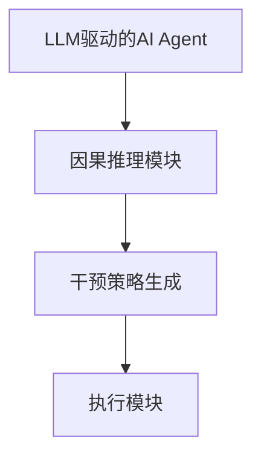
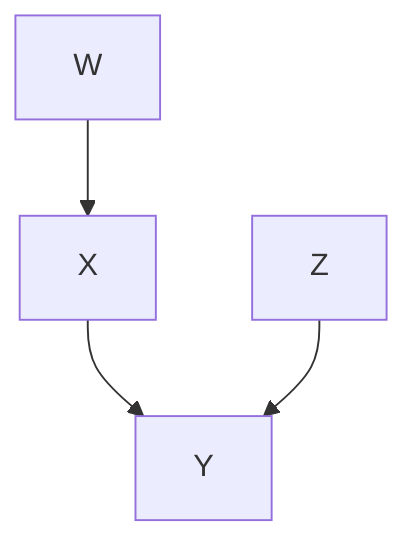
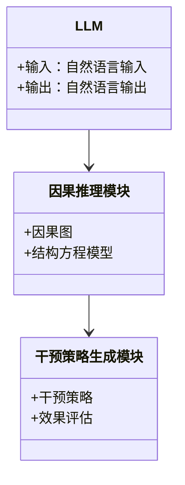

                 


# LLM驱动的AI Agent因果推理与干预

> 关键词：LLM, AI Agent, 因果推理, 干预机制, 结构方程模型

> 摘要：本文探讨了LLM驱动的AI Agent在因果推理与干预中的应用。通过分析因果推理的基本原理、干预机制的设计方法以及LLM在其中的作用，提出了基于因果图和结构方程模型的解决方案，并通过实际案例展示了系统的实现与优化。

---

## 第1章: 背景介绍与核心概念

### 1.1 问题背景与问题描述

#### 1.1.1 LLM驱动的AI Agent发展现状
近年来，大语言模型（LLM）在自然语言处理领域取得了显著进展，如GPT-3、GPT-4等模型的成功应用，使得AI Agent具备了强大的自然语言理解和生成能力。然而，AI Agent在实际应用中面临着复杂决策问题，例如如何在动态环境中进行因果推理并实施有效干预，这成为当前研究的热点和难点。

#### 1.1.2 因果推理与干预的必要性
在实际应用中，AI Agent需要不仅仅依赖相关性分析，而是需要理解变量之间的因果关系，以便在干预时能够准确预测结果。例如，在医疗领域，AI Agent需要通过因果推理确定某种药物对患者的具体影响，而不是仅仅观察相关性。

#### 1.1.3 当前技术的局限性与挑战
现有技术主要依赖相关性分析，难以准确建模因果关系。此外，干预机制的设计缺乏系统性和可解释性，导致在实际应用中效果不稳定。

### 1.2 问题解决与边界定义

#### 1.2.1 LLM在因果推理中的目标
通过LLM的强大生成能力和推理能力，构建能够理解因果关系的AI Agent，使其能够在复杂环境中进行有效的干预。

#### 1.2.2 干预机制的核心作用
干预机制是AI Agent实现目标的关键部分，它通过调整变量之间的因果关系，实现预期的结果。

#### 1.2.3 技术边界与外延范围
本文主要探讨LLM驱动的AI Agent在因果推理与干预中的技术实现，不涉及具体的业务逻辑和应用领域。

### 1.3 核心概念结构与组成要素

#### 1.3.1 LLM在因果推理中的角色
LLM作为AI Agent的核心模块，负责理解因果关系、生成干预策略。

#### 1.3.2 AI Agent的系统架构
AI Agent由感知模块、推理模块、决策模块和执行模块组成，其中推理模块负责因果推理。

#### 1.3.3 因果推理与干预的关系图解
使用Mermaid图展示因果推理与干预的关系：


---

## 第2章: 核心概念与原理

### 2.1 因果推理的基本原理

#### 2.1.1 潜在结果框架（Potential Outcome Framework）
潜在结果框架通过分析每个个体在不同干预下的结果，构建因果关系模型。公式如下：
$$ Y_i = \theta_i \cdot D_i + \epsilon_i $$
其中，$Y_i$为结果，$D_i$为干预变量，$\theta_i$为系数，$\epsilon_i$为误差项。

#### 2.1.2 结构方程模型（Structural Equation Models）
结构方程模型通过构建方程组，描述变量之间的因果关系。例如：
$$ Y = \beta X + \gamma Z + \epsilon $$
其中，$Y$为结果变量，$X$为自变量，$Z$为控制变量，$\beta$和$\gamma$为系数，$\epsilon$为误差。

#### 2.1.3 因果图（Causal Graph）
因果图通过有向图展示变量之间的因果关系，例如：


### 2.2 干预机制的实现原理

#### 2.2.1 干预策略的设计方法
干预策略的设计基于因果推理结果，例如通过反事实推理生成最优策略。

#### 2.2.2 干预效果的评估指标
常用指标包括平均处理效应（ATE）、平均倾向得分权重效应（ATT）等。

#### 2.2.3 干预与反馈的闭环机制
通过实时反馈调整干预策略，形成闭环。

### 2.3 LLM在因果推理中的应用

#### 2.3.1 LLM驱动因果推理的优势
LLM的强大生成能力和上下文理解能力使其成为因果推理的理想工具。

#### 2.3.2 LLM在干预策略中的作用
LLM可以生成多种干预策略，并通过模拟评估其效果。

#### 2.3.3 LLM与因果推理的结合案例
例如，在金融领域，LLM驱动的AI Agent可以通过因果推理分析市场变化，生成相应的投资策略。

---

## 第3章: 算法原理与数学模型

### 3.1 潜在结果框架的数学表达

#### 3.1.1 潜在结果公式
$$ Y_i = \theta_i \cdot D_i + \epsilon_i $$

#### 3.1.2 平均处理效应（ATE）计算公式
$$ ATE = \frac{1}{N}\sum_{i=1}^{N}(Y_i^{1} - Y_i^{0}) $$

### 3.2 结构方程模型的实现

#### 3.2.1 结构方程模型的构建步骤
1. 构建因果图。
2. 估计参数。
3. 验证模型。

#### 3.2.2 参数估计方法
使用极大似然估计（MLE）或矩估计法。

### 3.3 干预效果的评估算法

#### 3.3.1 因果森林算法（Causal Forest）
因果森林算法通过随机森林方法估计因果效应：
$$ \text{Causal Forest} = \text{Random Forest} + \text{因果推断} $$

#### 3.3.2 随机森林因果推断
通过随机森林模型进行因果推断，代码示例如下：
```python
import sklearn.ensemble as ensemble

model = ensemble.RandomForestRegressor()
model.fit(X, Y)
```

---

## 第4章: 系统分析与架构设计

### 4.1 问题场景与项目介绍

#### 4.1.1 问题场景描述
以医疗领域为例，AI Agent需要根据患者数据进行因果推理，制定个性化治疗方案。

#### 4.1.2 项目目标与范围
构建基于LLM的AI Agent，实现因果推理与干预。

### 4.2 系统功能设计

#### 4.2.1 领域模型设计（Mermaid 类图）


---

## 第5章: 项目实战与案例分析

### 5.1 环境安装与代码实现

#### 5.1.1 环境安装
安装必要的Python库：
```bash
pip install scikit-learn mermaid4jupyter jupyter
```

#### 5.1.2 核心代码实现
因果推理代码示例：
```python
from sklearn.ensemble import RandomForestRegressor
from causalgraphicalmodels import CausalGraphicalModel

def causal_inference(X, Y):
    model = RandomForestRegressor()
    model.fit(X, Y)
    return model
```

### 5.2 案例分析与解读

#### 5.2.1 案例分析
在金融领域，AI Agent通过因果推理分析市场变量，生成投资策略。

#### 5.2.2 代码应用解读
展示因果推理代码的运行结果，并分析其对干预策略的影响。

---

## 第6章: 最佳实践与总结

### 6.1 小结
本文详细介绍了LLM驱动的AI Agent在因果推理与干预中的应用，提出了基于因果图和结构方程模型的解决方案。

### 6.2 注意事项
在实际应用中，需注意数据质量和模型解释性。

### 6.3 拓展阅读
推荐阅读相关领域的最新论文和书籍。

---

通过以上内容，我们系统地探讨了LLM驱动的AI Agent因果推理与干预的技术细节和实现方案，为相关领域的研究和实践提供了有价值的参考。

