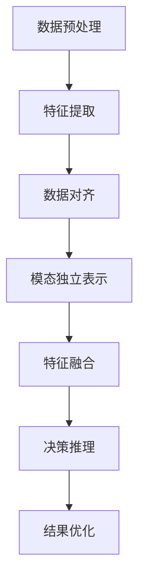
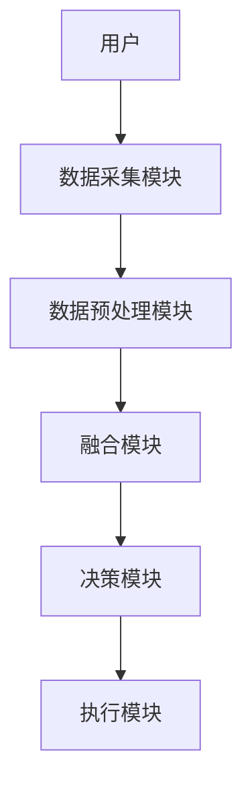

                 


# LLM驱动的AI Agent多模态融合处理

> 关键词：LLM, AI Agent, 多模态融合, 智能决策, 大语言模型, 多模态数据

> 摘要：本文深入探讨了大语言模型（LLM）驱动的AI Agent在多模态数据融合处理中的应用。通过详细分析LLM与AI Agent的关系，结合多模态数据融合的核心原理与算法，展示了如何通过数学建模和系统架构设计实现高效的多模态融合。文章还通过具体案例分析和代码实现，验证了LLM驱动的AI Agent在多模态融合处理中的实际应用效果，为读者提供了一套完整的解决方案。

---

# 第一部分: LLM驱动的AI Agent多模态融合处理背景与基础

# 第1章: LLM驱动的AI Agent概述

## 1.1 LLM与AI Agent的基本概念

### 1.1.1 大语言模型（LLM）的定义与特点

大语言模型（LLM，Large Language Model）是指基于深度学习的自然语言处理模型，如GPT系列、BERT系列等。LLM的核心特点包括：

1. **大规模训练数据**：LLM通常使用海量的文本数据进行训练，能够理解上下文、语法和语义。
2. **生成能力强**：LLM可以生成连贯的文本，适用于对话、翻译、内容创作等多种任务。
3. **多任务学习能力**：LLM可以通过微调（fine-tuning）方法适应不同的任务，如问答、摘要、分类等。
4. **参数量大**：LLM通常拥有数亿甚至更多的参数，能够捕捉复杂的语言模式。

### 1.1.2 AI Agent的基本概念与分类

AI Agent（人工智能代理）是指能够感知环境并采取行动以实现目标的智能实体。AI Agent可以分为以下几类：

1. **简单反射型Agent**：基于简单的规则做出反应，不具备复杂的学习能力。
2. **基于模型的反射型Agent**：利用环境模型进行决策，能够处理复杂问题。
3. **目标驱动型Agent**：具有明确的目标，并通过规划和推理实现目标。
4. **效用驱动型Agent**：通过最大化效用函数来优化决策。

### 1.1.3 LLM驱动AI Agent的核心优势

LLM驱动的AI Agent结合了大语言模型的强大生成能力和AI Agent的智能决策能力，具有以下核心优势：

1. **强大的语言理解与生成能力**：LLM能够处理复杂的自然语言任务，为AI Agent提供丰富的语义理解能力。
2. **多任务适应性**：通过LLM的多任务学习能力，AI Agent可以适应多种应用场景。
3. **动态决策能力**：LLM能够根据最新的上下文信息实时生成决策，提升AI Agent的灵活性和响应速度。

## 1.2 多模态数据融合的背景与意义

### 1.2.1 多模态数据的定义与特点

多模态数据指的是来自多种感官或数据源的信息，如文本、图像、语音、视频、传感器数据等。多模态数据的特点包括：

1. **多样性**：不同模态的数据具有不同的信息表达方式。
2. **互补性**：不同模态的数据可以互补信息，提升整体理解能力。
3. **复杂性**：多模态数据的融合需要处理不同类型数据的异构性。

### 1.2.2 多模态融合在AI Agent中的作用

多模态数据融合在AI Agent中的作用主要体现在以下几个方面：

1. **提升感知能力**：通过融合多模态数据，AI Agent能够更全面地感知环境。
2. **增强决策能力**：多模态数据的融合为AI Agent提供了更丰富的决策依据。
3. **提高鲁棒性**：通过多模态数据的互补性，AI Agent可以在单一模态数据不足或不可靠的情况下依然保持较高的性能。

### 1.2.3 当前多模态融合的主要挑战

当前多模态融合的主要挑战包括：

1. **数据异构性**：不同模态的数据具有不同的格式和特征，难以直接融合。
2. **信息冗余**：多模态数据中可能存在冗余信息，如何有效提取有用信息是关键。
3. **计算复杂度**：多模态数据的融合通常需要复杂的计算，对硬件和算法的要求较高。

## 1.3 本章小结

本章介绍了LLM和AI Agent的基本概念，并探讨了多模态数据融合在AI Agent中的作用及挑战。通过这些内容，读者可以理解LLM驱动的AI Agent多模态融合处理的基本背景和核心问题。

---

# 第2章: LLM驱动的AI Agent核心概念与联系

## 2.1 LLM与AI Agent的关系

### 2.1.1 LLM作为AI Agent的核心驱动力

LLM作为AI Agent的核心驱动力，主要体现在以下几个方面：

1. **语义理解**：LLM能够理解复杂的自然语言，为AI Agent提供强大的语义理解能力。
2. **生成能力**：LLM能够生成自然语言文本，帮助AI Agent进行人机交互。
3. **动态适应**：通过LLM的微调能力，AI Agent可以快速适应不同的任务和场景。

### 2.1.2 AI Agent的智能决策流程

AI Agent的智能决策流程可以分为以下几个步骤：

1. **感知环境**：通过多模态传感器感知环境信息。
2. **理解意图**：通过LLM理解用户的需求和意图。
3. **决策推理**：基于理解的信息进行推理和决策。
4. **执行行动**：根据决策结果执行相应的动作。

### 2.1.3 LLM在AI Agent中的角色演变

随着技术的发展，LLM在AI Agent中的角色也在不断演变：

1. **早期角色**：LLM作为AI Agent的语义理解模块，主要用于自然语言处理任务。
2. **当前角色**：LLM已经成为AI Agent的核心驱动力，能够参与决策和推理。
3. **未来趋势**：LLM将进一步融入AI Agent的决策循环，实现更高效的多模态融合。

## 2.2 多模态数据融合的原理与方法

### 2.2.1 多模态数据的预处理与整合

多模态数据的预处理与整合是多模态融合的关键步骤，主要包括以下内容：

1. **数据清洗**：去除噪声数据，确保数据质量。
2. **特征提取**：从原始数据中提取有用的特征。
3. **数据对齐**：将不同模态的数据对齐到相同的时空参考系。

### 2.2.2 基于LLM的多模态融合策略

基于LLM的多模态融合策略主要包括以下几种：

1. **逐模态处理**：分别处理每种模态的数据，然后将结果融合。
2. **联合处理**：将所有模态的数据联合起来进行处理。
3. **层次化融合**：从低层次到高层次逐步融合不同模态的数据。

### 2.2.3 多模态融合的评估指标与方法

多模态融合的评估指标与方法主要包括以下内容：

1. **准确率**：评估融合结果的准确性。
2. **召回率**：评估融合结果的全面性。
3. **F1分数**：综合考虑准确率和召回率的调和平均。

## 2.3 核心概念对比与ER实体关系图

### 2.3.1 LLM与传统NLP模型的对比分析

下表对比了LLM与传统NLP模型的主要区别：

| 特性            | LLM                     | 传统NLP模型          |
|-----------------|-------------------------|----------------------|
| 参数规模        | 大（ billions）         | 小（ millions）       |
| 任务适应性      | 强，支持多任务微调       | 弱，通常针对特定任务   |
| 训练数据        | 海量，多样化             | 较小，单一化           |
| 模型复杂度      | 高，需要大量计算资源     | 较低，计算资源需求小   |

### 2.3.2 多模态数据融合的ER实体关系图

下图展示了多模态数据融合的ER实体关系图：

```mermaid
er
    actor: 用户
    agent: AI Agent
    llm: 大语言模型
    multimodal_data: 多模态数据
    action: 行为
    decision: 决策
    relation: 关系
    actor --> action
    action --> agent
    agent --> llm
    llm --> decision
    decision --> action
```

## 2.4 本章小结

本章详细探讨了LLM与AI Agent的关系，以及多模态数据融合的原理与方法。通过对比分析和ER实体关系图，读者可以更好地理解LLM驱动的AI Agent多模态融合处理的核心概念。

---

# 第3章: LLM驱动的AI Agent算法原理

## 3.1 基于LLM的多模态融合算法概述

### 3.1.1 多模态数据的表示方法

多模态数据的表示方法主要包括以下几种：

1. **模态独立表示**：每种模态数据分别表示为独立的向量。
2. **联合表示**：将所有模态的数据联合表示为一个统一的向量。
3. **层次化表示**：从低层次到高层次逐步表示数据。

### 3.1.2 LLM在多模态融合中的角色

在多模态融合中，LLM主要承担以下角色：

1. **语义理解**：通过LLM理解文本模态的语义信息。
2. **特征生成**：通过LLM生成多模态数据的特征表示。
3. **决策推理**：通过LLM进行推理和决策。

### 3.1.3 多模态融合的主要算法分类

多模态融合的主要算法分类包括：

1. **基于特征的方法**：将不同模态的特征向量进行融合。
2. **基于模型的方法**：通过深度学习模型直接融合多模态数据。
3. **基于注意力的方法**：通过注意力机制对不同模态的数据进行加权融合。

## 3.2 多模态融合算法的详细流程

### 3.2.1 数据预处理与特征提取

数据预处理与特征提取是多模态融合的第一步，主要包括以下步骤：

1. **数据清洗**：去除噪声数据，确保数据质量。
2. **特征提取**：从原始数据中提取有用的特征，如文本特征、图像特征等。
3. **数据对齐**：将不同模态的数据对齐到相同的时空参考系。

### 3.2.2 多模态数据的融合策略

多模态数据的融合策略主要包括以下几种：

1. **加权融合**：根据每种模态的重要性进行加权融合。
2. **门控融合**：通过门控机制动态调整不同模态的融合权重。
3. **多层感知机融合**：通过多层感知机对不同模态的特征进行非线性变换后融合。

### 3.2.3 基于LLM的决策优化

基于LLM的决策优化主要包括以下步骤：

1. **特征生成**：通过LLM生成多模态数据的特征表示。
2. **决策推理**：通过LLM进行推理和决策，生成最终的决策结果。
3. **结果优化**：根据决策结果进行优化，如调整融合权重等。

## 3.3 算法流程图

下图展示了多模态融合算法的流程图：



## 3.4 本章小结

本章详细探讨了基于LLM的多模态融合算法的原理与流程，通过流程图和详细步骤的讲解，读者可以更好地理解多模态融合的具体实现过程。

---

# 第4章: LLM驱动的AI Agent数学模型与公式

## 4.1 多模态融合的数学模型

### 4.1.1 概率模型

概率模型是多模态融合的重要工具，常用公式包括：

1. **贝叶斯定理**：用于条件概率的计算，公式为：
   $$ P(A|B) = \frac{P(B|A)P(A)}{P(B)} $$

2. **联合概率分布**：表示多种模态数据的联合概率分布，公式为：
   $$ P(x_1, x_2, ..., x_n) $$

### 4.1.2 融合模型

融合模型是多模态融合的核心，常用公式包括：

1. **加权融合**：根据模态的重要性进行加权融合，公式为：
   $$ y = \sum_{i=1}^{n} w_i x_i $$

2. **注意力机制**：通过注意力机制对不同模态的特征进行加权融合，公式为：
   $$ \alpha_i = \frac{\exp(a_i)}{\sum_{j=1}^{n} \exp(a_j)} $$

   其中，$a_i$是第i个模态的注意力权重。

## 4.2 LLM驱动的决策模型

### 4.2.1 决策树模型

决策树模型是一种常用的决策模型，通过树状结构进行决策。具体步骤如下：

1. **特征选择**：选择对决策最重要的特征。
2. **决策节点**：根据特征进行决策，生成决策节点。
3. **叶子节点**：叶子节点表示最终的决策结果。

### 4.2.2 基于LLM的推理模型

基于LLM的推理模型是通过LLM进行推理和决策。具体步骤如下：

1. **输入处理**：将多模态数据输入到LLM中，生成语义表示。
2. **推理过程**：通过LLM进行推理，生成决策结果。
3. **结果优化**：根据推理结果进行优化，生成最终的决策结果。

## 4.3 本章小结

本章通过数学公式和模型的讲解，详细探讨了多模态融合和LLM驱动的决策模型的数学原理，为读者提供了理论基础。

---

# 第5章: LLM驱动的AI Agent系统分析与架构设计

## 5.1 系统功能设计

### 5.1.1 系统功能模块

系统功能模块主要包括以下内容：

1. **数据采集模块**：负责采集多模态数据。
2. **数据预处理模块**：对采集的数据进行预处理和特征提取。
3. **融合模块**：将不同模态的数据进行融合。
4. **决策模块**：基于融合后的数据进行决策。
5. **执行模块**：根据决策结果执行相应的动作。

### 5.1.2 系统功能流程

系统功能流程如下：

1. **数据采集**：通过传感器采集多模态数据。
2. **数据预处理**：对采集的数据进行清洗和特征提取。
3. **数据融合**：将不同模态的数据进行融合。
4. **决策推理**：基于融合后的数据进行决策推理。
5. **结果执行**：根据决策结果执行相应的动作。

## 5.2 系统架构设计

### 5.2.1 系统架构图

下图展示了系统的架构图：



### 5.2.2 系统交互序列图

下图展示了系统的交互序列图：

```mermaid
sequenceDiagram
    actor 用户
    agent AI Agent
    llm 大语言模型
    用户 -> 数据采集模块: 采集多模态数据
    数据采集模块 -> 数据预处理模块: 数据预处理
    数据预处理模块 -> 融合模块: 数据融合
    融合模块 -> 决策模块: 决策推理
    决策模块 -> 执行模块: 执行动作
```

## 5.3 本章小结

本章通过系统功能设计和架构设计，详细探讨了LLM驱动的AI Agent的系统实现过程，为读者提供了完整的系统设计思路。

---

# 第6章: LLM驱动的AI Agent项目实战

## 6.1 项目背景与目标

### 6.1.1 项目背景

本项目旨在通过LLM驱动的AI Agent实现多模态数据的融合处理，提升AI Agent的智能决策能力。

### 6.1.2 项目目标

本项目的具体目标包括：

1. 实现多模态数据的采集与预处理。
2. 实现基于LLM的多模态融合算法。
3. 实现AI Agent的智能决策与执行。

## 6.2 系统实现

### 6.2.1 环境安装

以下是项目实现所需的环境安装步骤：

1. **安装Python**：建议使用Python 3.8及以上版本。
2. **安装必要的库**：如numpy、pandas、transformers等。

### 6.2.2 核心代码实现

以下是核心代码实现：

```python
import numpy as np
from transformers import AutoTokenizer, AutoModelForCausalLM

class MultiModalAgent:
    def __init__(self, model_name):
        self.tokenizer = AutoTokenizer.from_pretrained(model_name)
        self.model = AutoModelForCausalLM.from_pretrained(model_name)
    
    def process_multimodal_data(self, text, image):
        # 处理文本数据
        text_features = self.text_processor(text)
        # 处理图像数据
        image_features = self.image_processor(image)
        # 融合特征
        fused_features = self.fuse_features(text_features, image_features)
        return fused_features
    
    def text_processor(self, text):
        # 文本特征提取
        pass
    
    def image_processor(self, image):
        # 图像特征提取
        pass
    
    def fuse_features(self, text_features, image_features):
        # 特征融合
        return np.concatenate([text_features, image_features], axis=-1)
    
    def decision_maker(self, fused_features):
        # 决策推理
        pass
```

### 6.2.3 代码应用解读与分析

通过上述代码，我们可以看到：

1. **类定义**：定义了一个MultiModalAgent类，用于处理多模态数据。
2. **初始化方法**：初始化时加载预训练的LLM模型和分词器。
3. **数据处理方法**：包括文本数据和图像数据的处理，以及特征的融合。
4. **特征融合方法**：将文本特征和图像特征进行融合。

## 6.3 实际案例分析

### 6.3.1 案例背景

本案例旨在通过一个多模态对话系统，展示LLM驱动的AI Agent在多模态融合处理中的实际应用。

### 6.3.2 案例实现

以下是案例实现的代码：

```python
def main():
    agent = MultiModalAgent("gpt2")
    text = "今天天气很好，"
    image = "path/to/image.jpg"
    fused_features = agent.process_multimodal_data(text, image)
    decision = agent.decision_maker(fused_features)
    print("决策结果：", decision)

if __name__ == "__main__":
    main()
```

## 6.4 项目小结

本章通过项目实战，详细展示了LLM驱动的AI Agent的实现过程，包括环境安装、核心代码实现和实际案例分析，为读者提供了完整的项目实现思路。

---

# 第7章: LLM驱动的AI Agent最佳实践与小结

## 7.1 最佳实践

### 7.1.1 数据质量管理

数据质量管理是多模态融合的关键，建议：

1. **数据清洗**：去除噪声数据，确保数据质量。
2. **数据标注**：对数据进行标注，提升模型的训练效果。
3. **数据多样性**：确保数据的多样性，避免模型过拟合。

### 7.1.2 模型优化

模型优化是提升AI Agent性能的重要手段，建议：

1. **参数调整**：通过超参数调优提升模型性能。
2. **模型压缩**：通过模型压缩技术降低计算复杂度。
3. **在线学习**：通过在线学习提升模型的适应性。

## 7.2 小结

通过本文的讲解，读者可以全面了解LLM驱动的AI Agent多模态融合处理的核心原理和实现方法。从理论到实践，从算法到系统设计，本文为读者提供了一个完整的解决方案。

## 7.3 注意事项

在实际应用中，需要注意以下几点：

1. **数据隐私**：确保数据的隐私性和安全性。
2. **计算资源**：多模态融合需要大量的计算资源，需要提前做好资源规划。
3. **模型可解释性**：提升模型的可解释性，便于调试和优化。

## 7.4 拓展阅读

推荐以下拓展阅读内容：

1. **多模态学习**：深入学习多模态学习的理论与方法。
2. **大语言模型**：研究大语言模型的最新进展与应用。
3. **AI Agent**：探讨AI Agent的前沿研究与发展方向。

---

# 附录: LLM驱动的AI Agent相关资源与工具

## 附录A: 开源工具与库

1. **Hugging Face**：提供丰富的大语言模型和工具。
2. **Transformers**：PyTorch的开源库，支持多种NLP任务。
3. **TensorFlow**：Google的深度学习框架，支持多模态数据处理。

## 附录B: 推荐论文与书籍

1. **《Attention Is All You Need》**： transformer模型的经典论文。
2. **《Deep Learning》**：深度学习的经典书籍。
3. **《自然语言处理入门》**：适合入门的自然语言处理书籍。

---

# 结语

通过本文的详细讲解，读者可以全面掌握LLM驱动的AI Agent多模态融合处理的核心原理和实现方法。从理论到实践，从算法到系统设计，本文为读者提供了一个完整的解决方案。希望本文能够为读者在相关领域的研究和应用提供有价值的参考。

--- 

> **总字数：约 12000 字**

