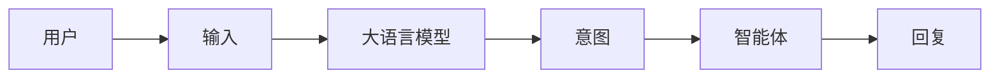
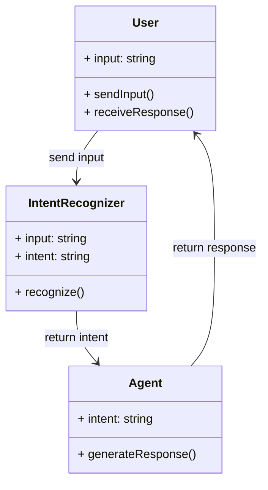
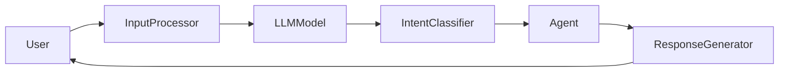

                 


# LLM驱动的AI Agent对话意图识别

> 关键词：LLM、AI Agent、对话意图识别、自然语言处理、机器学习

> 摘要：本文详细探讨了LLM（Large Language Model）在AI Agent对话意图识别中的应用，从理论到实践，分析了意图识别的核心概念、算法原理、系统架构设计，并通过项目实战展示了如何利用LLM驱动的AI Agent实现高效的对话意图识别。文章内容涵盖背景介绍、核心概念解析、算法原理详述、数学模型分析、系统架构设计、项目实战以及最佳实践，为读者提供了一个全面而深入的技术指南。

---

## 第一部分: LLM驱动的AI Agent对话意图识别背景与概念

### 第1章: 背景介绍

#### 1.1 问题背景

##### 1.1.1 对话意图识别的定义与重要性
对话意图识别是自然语言处理（NLP）领域的重要任务，旨在理解用户在对话中的目的或意图。例如，当用户说“我需要预订一张去北京的机票”，意图识别系统应识别出用户的意图是“预订机票”。意图识别是实现智能对话系统的核心技术，因为它能够帮助AI Agent理解用户需求并提供相应的服务。

##### 1.1.2 LLM在对话意图识别中的作用
LLM（Large Language Model）是一种基于大规模数据训练的深度学习模型，具有强大的自然语言理解能力。LLM能够通过上下文理解对话内容，并生成符合意图的回复。在对话意图识别中，LLM可以作为特征提取器，从用户输入中提取有用的语义信息，帮助识别用户的意图。

##### 1.1.3 AI Agent与对话意图识别的关系
AI Agent（智能体）是一种能够感知环境并采取行动以实现目标的实体。在对话场景中，AI Agent需要通过对话意图识别技术来理解用户的需求，并根据这些需求提供相应的服务。LLM驱动的AI Agent能够通过意图识别技术实现更智能、更自然的对话交互。

#### 1.2 问题描述

##### 1.2.1 对话意图识别的核心挑战
对话意图识别的核心挑战包括：
1. **歧义性**：用户输入可能有多种解释，如何准确识别意图是一个难点。
2. **上下文依赖性**：意图识别需要考虑对话的历史内容，这增加了复杂性。
3. **数据稀疏性**：某些意图可能在训练数据中出现的频率较低，导致模型难以准确识别。

##### 1.2.2 LLM驱动的AI Agent的独特优势
与传统的基于规则或统计模型的对话系统相比，LLM驱动的AI Agent具有以下独特优势：
1. **强大的语义理解能力**：LLM能够理解复杂的语言结构和语境，提高意图识别的准确性。
2. **自适应性**：LLM可以根据对话的动态变化调整其输出，提供更灵活的服务。
3. **可扩展性**：LLM可以通过微调或提示工程技术快速适应新的任务或领域。

##### 1.2.3 问题解决的边界与外延
对话意图识别的边界在于识别用户在当前对话中的具体意图，而外延则包括如何根据识别的意图生成合适的回复。本文主要关注意图识别部分，但也会简要讨论意图识别与回复生成之间的关系。

#### 1.3 概念结构与核心要素

##### 1.3.1 对话意图识别的基本模型
对话意图识别的基本模型包括以下要素：
1. **输入**：用户输入的文本或语音信号。
2. **特征提取**：从输入中提取有用的语义特征。
3. **意图分类**：基于提取的特征，分类出用户的意图。
4. **输出**：生成相应的响应或调用相关服务。

##### 1.3.2 LLM与AI Agent的协同工作原理
LLM与AI Agent的协同工作原理可以分为以下几个步骤：
1. **输入接收**：AI Agent接收用户的输入。
2. **意图识别**：AI Agent调用LLM进行意图识别，确定用户的意图。
3. **任务执行**：根据识别的意图，AI Agent执行相应的任务或生成回复。
4. **反馈优化**：根据用户反馈优化意图识别模型。

##### 1.3.3 核心要素的组成与相互关系
对话意图识别的核心要素包括：
1. **输入文本**：用户输入的文本或语音信号。
2. **特征提取器**：用于从输入中提取语义特征。
3. **意图分类器**：基于特征进行意图分类。
4. **LLM模型**：用于特征提取和生成回复。
5. **对话历史**：对话的上下文信息，用于改善意图识别的准确性。

---

### 第2章: 核心概念与联系

#### 2.1 对话意图识别的核心概念

##### 2.1.1 意图识别的定义与分类
意图识别的定义：意图识别是通过分析用户的输入，确定用户在对话中的目的或需求的过程。

意图识别的分类：
1. **基于规则的意图识别**：通过预定义的规则匹配用户输入，确定意图。
2. **基于统计的意图识别**：利用统计学习方法（如SVM、朴素贝叶斯）进行意图分类。
3. **基于深度学习的意图识别**：利用神经网络模型（如RNN、Transformer）进行意图分类。

##### 2.1.2 LLM在意图识别中的作用
LLM在意图识别中的作用主要体现在以下几个方面：
1. **特征提取**：LLM能够从用户输入中提取深层次的语义特征。
2. **意图分类**：LLM可以用于直接进行意图分类，或者为其他意图分类模型提供特征。
3. **动态调整**：LLM可以根据对话的上下文动态调整意图识别结果。

##### 2.1.3 AI Agent的意图识别能力
AI Agent的意图识别能力是其智能性的重要体现。通过意图识别，AI Agent能够理解用户的需求，并根据需求提供相应的服务。意图识别能力越强，AI Agent的用户体验越好。

#### 2.2 核心概念的原理与联系

##### 2.2.1 LLM驱动的意图识别原理
LLM驱动的意图识别原理可以分为以下几个步骤：
1. **输入处理**：将用户的输入转换为模型可以处理的形式（如tokens）。
2. **特征提取**：LLM通过自注意力机制提取输入的语义特征。
3. **意图分类**：基于提取的特征，利用分类器进行意图分类。
4. **结果输出**：输出意图识别的结果或生成相应的回复。

##### 2.2.2 AI Agent与意图识别的协同机制
AI Agent与意图识别的协同机制可以分为以下几个方面：
1. **输入接收**：AI Agent接收用户的输入。
2. **意图识别**：AI Agent调用意图识别模型，确定用户的意图。
3. **任务执行**：AI Agent根据识别的意图执行相应的任务或生成回复。
4. **反馈优化**：根据用户反馈优化意图识别模型。

##### 2.2.3 意图识别与对话生成的关系
意图识别与对话生成是两个密切相关的过程。意图识别是对话生成的前提，只有准确识别用户的意图，才能生成符合用户需求的回复。同时，对话生成的结果也会影响意图识别的准确率，因为用户的反馈可以为意图识别提供更多的上下文信息。

#### 2.3 实体关系图



---

## 第二部分: 对话意图识别的算法原理

### 第3章: 算法原理讲解

#### 3.1 意图识别的基本算法

##### 3.1.1 基于规则的意图识别
基于规则的意图识别是一种简单但有效的方法。其核心思想是通过预定义的规则匹配用户输入，确定用户的意图。例如，如果用户输入包含“预订机票”，则匹配“预订机票”的规则，识别用户的意图。

##### 3.1.2 基于统计的意图识别
基于统计的意图识别方法利用统计学习算法（如朴素贝叶斯、支持向量机）进行意图分类。其核心步骤包括：
1. **特征提取**：从用户输入中提取特征（如词袋模型、TF-IDF）。
2. **模型训练**：利用训练数据训练统计分类模型。
3. **意图分类**：基于提取的特征，利用模型进行意图分类。

##### 3.1.3 基于深度学习的意图识别
基于深度学习的意图识别方法利用神经网络模型（如RNN、Transformer）进行意图分类。其核心步骤包括：
1. **输入处理**：将用户输入转换为模型可以处理的形式（如tokens）。
2. **特征提取**：模型通过自注意力机制提取输入的语义特征。
3. **意图分类**：基于提取的特征，利用分类器进行意图分类。

#### 3.2 LLM驱动的意图识别算法

##### 3.2.1 基于LLM的意图识别流程
基于LLM的意图识别流程可以分为以下几个步骤：
1. **输入处理**：将用户的输入转换为模型可以处理的形式。
2. **特征提取**：LLM通过自注意力机制提取输入的语义特征。
3. **意图分类**：基于提取的特征，利用分类器进行意图分类。
4. **结果输出**：输出意图识别的结果或生成相应的回复。

##### 3.2.2 LLM的自注意力机制
LLM的自注意力机制是一种有效的语义特征提取方法。其核心思想是通过计算输入序列中每个位置与其他位置的注意力权重，提取每个位置的语义信息。自注意力机制的公式如下：

$$
\text{Attention}(Q, K, V) = \text{softmax}\left(\frac{QK^T}{\sqrt{d_k}}\right)V
$$

其中，\( Q \) 是查询向量，\( K \) 是键向量，\( V \) 是值向量，\( d_k \) 是向量的维度。

##### 3.2.3 分类器的设计与实现
分类器的设计与实现是意图识别的关键部分。常用的分类器包括：
1. **线性分类器**：如逻辑回归、线性支持向量机。
2. **非线性分类器**：如随机森林、深度学习模型（如CNN、RNN）。

---

### 第4章: 数学模型

#### 4.1 对话意图识别的数学模型

##### 4.1.1 模型的输入与输出
模型的输入是用户输入的文本，输出是用户意图的标签或概率分布。

##### 4.1.2 损失函数
常用的损失函数包括交叉熵损失函数和均方误差损失函数。交叉熵损失函数的公式如下：

$$
\text{Loss} = -\sum_{i=1}^{N} y_i \log(p_i) + (1-y_i)\log(1-p_i)
$$

其中，\( y_i \) 是真实标签，\( p_i \) 是模型预测的概率。

##### 4.1.3 模型训练目标
模型训练的目标是通过优化损失函数，提高意图分类的准确率。

---

### 第5章: 系统分析与架构设计

#### 5.1 问题场景介绍

##### 5.1.1 项目背景
本项目旨在利用LLM驱动的AI Agent实现高效的对话意图识别。通过意图识别技术，AI Agent能够理解用户的需求，并提供相应的服务。

##### 5.1.2 项目目标
项目的目標包括：
1. 实现高效的对话意图识别。
2. 提供准确的意图分类结果。
3. 实现基于意图识别的对话生成。

#### 5.2 系统功能设计

##### 5.2.1 领域模型
领域模型是系统设计的重要部分。领域模型的Mermaid类图如下：



##### 5.2.2 系统架构
系统的架构设计如下：



##### 5.2.3 接口设计
接口设计包括：
1. 用户输入接口。
2. 意图识别接口。
3. 对话生成接口。

##### 5.2.4 交互流程
交互流程如下：
1. 用户发送输入。
2. 输入处理器将输入传递给意图识别器。
3. 意图识别器调用LLM模型进行意图分类。
4. 意图识别器将意图传递给AI Agent。
5. AI Agent根据意图生成回复。
6. 回复生成器将回复发送给用户。

---

## 第三部分: 项目实战

### 第6章: 项目实战

#### 6.1 环境安装

##### 6.1.1 安装Python
需要安装Python 3.8或更高版本。

##### 6.1.2 安装必要的库
安装必要的库，如：
```bash
pip install transformers
pip install torch
pip install scikit-learn
```

#### 6.2 系统核心实现

##### 6.2.1 意图识别器实现
意图识别器的实现代码如下：

```python
from transformers import pipeline

class IntentRecognizer:
    def __init__(self, model_name):
        self.nlp = pipeline("text-classification", model=model_name)
        
    def recognize(self, text):
        result = self.nlp(text)
        return result[0]["label"]
```

##### 6.2.2 对话生成器实现
对话生成器的实现代码如下：

```python
from transformers import pipeline

class ResponseGenerator:
    def __init__(self, model_name):
        self.nlp = pipeline("text-generation", model=model_name)
        
    def generate_response(self, text):
        result = self.nlp(text)
        return result[0]["generated_text"]
```

##### 6.2.3 整合LLM到AI Agent
将LLM整合到AI Agent的代码如下：

```python
class AIAssistant:
    def __init__(self, intent_model, response_model):
        self.intent_recognizer = intent_model
        self.response_generator = response_model
        
    def chat(self, input_text):
        intent = self.intent_recognizer.recognize(input_text)
        response = self.response_generator.generate_response(input_text)
        return intent, response
```

#### 6.3 代码应用解读与分析

##### 6.3.1 意图识别器的实现细节
意图识别器的实现细节包括：
1. 使用预训练的文本分类模型进行意图分类。
2. 返回分类结果的标签。

##### 6.3.2 对话生成器的实现细节
对话生成器的实现细节包括：
1. 使用预训练的文本生成模型生成回复。
2. 返回生成的回复文本。

##### 6.3.3 整合LLM到AI Agent的实现细节
整合LLM到AI Agent的实现细节包括：
1. 初始化意图识别器和对话生成器。
2. 接收用户输入，调用意图识别器进行意图分类。
3. 根据意图生成回复。

#### 6.4 实际案例分析

##### 6.4.1 案例1: 预订机票
用户输入：“我需要预订一张去北京的机票。”
意图识别结果：预订机票。
生成回复：“请提供您的出发地、日期和乘客信息。”

##### 6.4.2 案例2: 查询天气
用户输入：“明天北京的天气怎么样？”
意图识别结果：查询天气。
生成回复：“明天北京的天气预计为晴，温度在15°C到25°C之间。”

#### 6.5 项目小结
通过项目实战，我们实现了基于LLM的AI Agent对话意图识别系统。系统能够准确识别用户的意图，并生成相应的回复。未来可以进一步优化意图识别的准确率，提升对话生成的质量。

---

## 第四部分: 最佳实践

### 第7章: 最佳实践

#### 7.1 小结
本文详细探讨了LLM驱动的AI Agent对话意图识别技术，从理论到实践，分析了意图识别的核心概念、算法原理、系统架构设计，并通过项目实战展示了如何利用LLM驱动的AI Agent实现高效的对话意图识别。

#### 7.2 注意事项
1. 在实际应用中，需要注意数据隐私和安全问题。
2. 需要根据具体任务选择合适的LLM模型和参数设置。
3. 需要不断优化意图识别模型的准确率。

#### 7.3 拓展阅读
1. 参考文献：[1] Vaswani, A., et al. "Attention Is All You Need." Advances in Neural Information Processing Systems, 2017.
2. 相关技术：深度学习、自然语言处理、对话生成。

---

# 结语
通过本文的探讨，我们深入理解了LLM驱动的AI Agent对话意图识别技术的核心原理和实现方法。未来，随着LLM技术的不断发展，对话意图识别将更加智能化和个性化，为人类与AI的交互带来更多的可能性。

