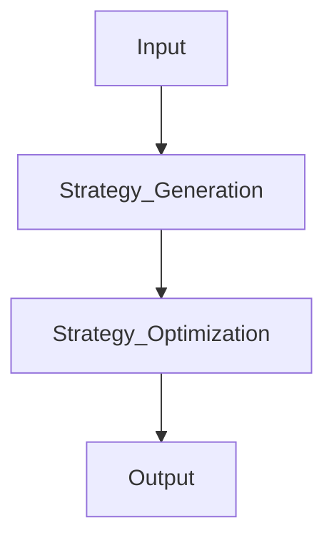
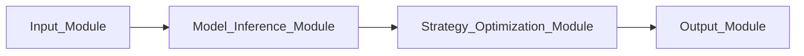
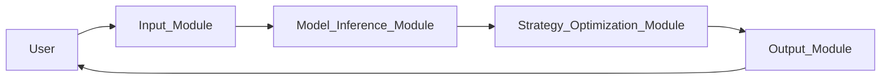

                 


# LLM驱动的AI Agent对话策略学习

> 关键词：LLM，AI Agent，对话策略，自然语言处理，强化学习，策略优化

> 摘要：本文系统地探讨了如何利用大语言模型（LLM）驱动AI Agent的对话策略学习。从基础概念到高级算法，从系统架构到实际应用，本文详细分析了LLM在对话策略学习中的核心作用，结合数学模型和算法实现，给出了完整的解决方案和实践指导。

---

# 第1章: 引言

## 1.1 LLM的基本概念与特点

### 1.1.1 大语言模型的定义与核心特征

大语言模型（LLM, Large Language Model）是指基于大规模数据训练的深度学习模型，如GPT系列、BERT系列等。其核心特征包括：

1. **大规模数据训练**：通常基于数以百万计的文本数据进行训练，具有强大的语义理解能力。
2. **生成能力**：能够生成自然流畅的文本，支持多种对话场景。
3. **上下文理解**：能够处理多轮对话，理解上下文关系。
4. **可微调性**：可以通过任务特定的数据进行微调，适应不同应用场景。

### 1.1.2 LLM在对话系统中的应用潜力

LLM在对话系统中的应用主要体现在以下几个方面：

1. **对话生成**：生成符合语境的回复，提升对话的自然度。
2. **意图识别**：通过上下文理解用户意图，优化对话流程。
3. **知识检索**：结合外部知识库，提供准确的信息查询能力。
4. **情感分析与回应**：根据对话中的情感倾向生成合适的回应。

### 1.1.3 AI Agent的基本概念与功能

AI Agent（人工智能代理）是指能够感知环境、执行任务并做出决策的智能实体。其核心功能包括：

1. **感知环境**：通过传感器或API获取环境信息。
2. **决策与推理**：基于获取的信息做出最优决策。
3. **执行操作**：通过执行动作与环境交互。
4. **学习与优化**：通过反馈不断优化自身的策略。

## 1.2 对话策略学习的背景与意义

### 1.2.1 对话系统的发展历程

对话系统的发展经历了以下几个阶段：

1. **规则驱动阶段**：基于预定义的规则生成回复，缺乏灵活性。
2. **统计学习阶段**：基于机器学习算法，如SVM、随机森林等，进行模式匹配。
3. **深度学习阶段**：基于神经网络模型（如RNN、Transformer）实现对话生成。
4. **大语言模型阶段**：基于LLM的对话生成，代表了当前技术的最高水平。

### 1.2.2 当前对话策略学习的核心问题

当前对话策略学习的核心问题包括：

1. **对话目标的多样性**：对话目标可能包括信息传递、情感交流、任务完成等。
2. **策略的动态性**：对话过程中需要根据用户反馈动态调整策略。
3. **模型的可解释性**：需要确保模型的决策过程可解释，避免“黑箱”问题。

### 1.2.3 LLM驱动对话策略学习的优势

LLM驱动对话策略学习的优势体现在以下几个方面：

1. **强大的生成能力**：LLM能够生成高质量的文本回复，提升对话的自然度。
2. **上下文理解能力**：LLM能够处理多轮对话，理解上下文关系。
3. **可微调性**：可以通过微调LLM使其适应特定的对话场景。

## 1.3 本章小结

本章介绍了LLM的基本概念、特点及其在对话系统中的应用潜力，同时阐述了AI Agent的基本概念与功能。最后，总结了LLM驱动对话策略学习的优势，为后续章节的展开奠定了基础。

---

# 第2章: LLM驱动对话策略学习的核心概念

## 2.1 对话策略的基本原理

### 2.1.1 对话策略的定义与分类

对话策略是指AI Agent在对话过程中根据当前状态和用户输入，选择合适的回复或操作的规则或模型。根据策略的生成方式，可以将对话策略分为以下几类：

1. **基于规则的策略**：通过预定义的规则生成回复。
2. **基于统计的策略**：基于历史数据统计生成回复概率。
3. **基于模型的策略**：基于深度学习模型生成回复。

### 2.1.2 基于LLM的策略生成机制

基于LLM的策略生成机制主要包括以下几个步骤：

1. **输入处理**：将用户输入的文本转换为模型可处理的格式。
2. **生成回复**：通过LLM生成候选回复。
3. **策略选择**：根据对话目标和上下文选择最优回复。

### 2.1.3 策略优化的关键要素

策略优化的关键要素包括：

1. **优化目标**：如回复的相关性、对话的流畅性等。
2. **优化方法**：如强化学习、梯度下降等。
3. **反馈机制**：如用户满意度评分、任务完成情况等。

## 2.2 LLM与对话策略的关系

### 2.2.1 LLM在策略生成中的角色

LLM在策略生成中的角色主要体现在以下几个方面：

1. **生成候选回复**：通过LLM生成多个候选回复。
2. **评估回复质量**：通过LLM对候选回复的质量进行评估。
3. **优化策略**：通过微调LLM模型优化对话策略。

### 2.2.2 策略学习中的反馈机制

策略学习中的反馈机制主要包括：

1. **用户反馈**：如用户的满意度评分。
2. **任务反馈**：如任务完成情况。
3. **模型反馈**：如生成回复的概率分布。

### 2.2.3 策略优化的路径与方法

策略优化的路径与方法包括：

1. **基于强化学习的策略优化**：通过强化学习算法优化策略。
2. **基于监督学习的策略优化**：通过监督学习算法优化策略。
3. **基于混合学习的策略优化**：结合强化学习和监督学习优化策略。

## 2.3 对话策略学习的核心要素对比

### 2.3.1 策略生成与策略优化的对比分析

| 对比维度 | 策略生成 | 策略优化 |
|----------|----------|----------|
| 定义     | 生成回复  | 优化策略  |
| 输入     | 用户输入  | 回复质量 |
| 输出     | 候选回复  | 最优策略 |

### 2.3.2 不同策略生成方法的优缺点

| 方法     | 优点                     | 缺点                     |
|----------|--------------------------|--------------------------|
| 基于规则 | 实现简单，易于解释       | 灵活性差，难以应对复杂场景 |
| 基于统计 | 能够处理大量数据，灵活性高 | 需要大量数据支持，计算复杂 |
| 基于模型 | 表现能力强，适应性高     | 需要大量计算资源，难以解释 |

### 2.3.3 策略评估的指标与方法

策略评估的指标与方法包括：

1. **指标**：
   - 回复的相关性
   - 对话的流畅性
   - 用户满意度

2. **方法**：
   - 基于用户的主观评分
   - 基于任务完成情况的客观评分
   - 基于模型生成回复的概率分布

## 2.4 本章小结

本章详细探讨了对话策略的基本原理、LLM在策略生成中的角色以及策略优化的路径与方法。通过对策略生成与优化的对比分析，总结了不同策略生成方法的优缺点，并提出了策略评估的指标与方法。

---

# 第3章: LLM驱动对话策略学习的算法原理

## 3.1 算法实现的核心步骤

### 3.1.1 训练策略网络

训练策略网络的主要步骤包括：

1. **输入处理**：将用户输入的文本转换为模型可处理的格式。
2. **生成回复**：通过LLM生成候选回复。
3. **策略选择**：根据对话目标和上下文选择最优回复。

### 3.1.2 优化策略网络

优化策略网络的主要步骤包括：

1. **定义优化目标**：如最大化对话的流畅性。
2. **计算损失函数**：如交叉熵损失。
3. **更新模型参数**：通过反向传播更新模型参数。

### 3.1.3 算法实现的伪代码

```python
def train_strategy_network():
    for epoch in range(num_epochs):
        for batch in batches:
            inputs, labels = batch_data()
            outputs = model(inputs)
            loss = calculate_loss(outputs, labels)
            model.backward(loss)
            optimizer.step()
```

## 3.2 算法优化与调优

### 3.2.1 参数调整

参数调整是优化策略网络的重要步骤，主要包括：

1. **学习率调整**：如使用学习率衰减。
2. **模型参数优化**：如使用Adam优化器。
3. **训练数据增强**：如数据增强技术。

### 3.2.2 训练策略网络的数学模型

策略网络的数学模型可以表示为：

$$ P(y|x) = \text{softmax}(Wx + b) $$

其中，$x$ 是输入，$y$ 是输出，$W$ 是权重矩阵，$b$ 是偏置项。

### 3.2.3 优化策略网络的数学模型

策略网络的优化目标可以表示为：

$$ \min_{\theta} \mathbb{E}_{x,y}[ -\log P_\theta(y|x) ] $$

其中，$\theta$ 是模型参数，$P_\theta(y|x)$ 是模型的条件概率分布。

## 3.3 算法实现的数学推导

### 3.3.1 策略优化的数学推导

策略优化的目标是最小化损失函数：

$$ L = -\mathbb{E}_{x,y}[ \log P_\theta(y|x) ] $$

通过反向传播计算梯度，并更新模型参数：

$$ \theta = \theta - \eta \nabla_\theta L $$

其中，$\eta$ 是学习率。

### 3.3.2 策略生成的数学推导

策略生成的过程可以表示为：

$$ y = \arg\max_y P_\theta(y|x) $$

其中，$P_\theta(y|x)$ 是模型的条件概率分布。

## 3.4 本章小结

本章详细探讨了LLM驱动对话策略学习的算法原理，包括策略网络的训练与优化过程，以及相关的数学模型和推导。

---

# 第4章: LLM驱动对话策略学习的系统架构设计

## 4.1 系统功能模块划分

系统功能模块包括：

1. **输入模块**：接收用户输入的文本。
2. **策略生成模块**：生成候选回复。
3. **策略优化模块**：优化对话策略。
4. **输出模块**：输出最终的回复。

### 4.1.1 功能模块划分的 Mermaid 图



## 4.2 系统架构设计

### 4.2.1 系统架构的模块划分

系统架构设计主要包括以下几个模块：

1. **输入处理模块**：将用户输入的文本转换为模型可处理的格式。
2. **模型推理模块**：通过LLM生成候选回复。
3. **策略优化模块**：优化对话策略。
4. **输出模块**：输出最终的回复。

### 4.2.2 系统架构设计的 Mermaid 图



## 4.3 系统交互流程

### 4.3.1 系统交互的步骤

系统交互流程包括以下几个步骤：

1. **用户输入**：用户输入文本。
2. **输入处理**：将用户输入的文本转换为模型可处理的格式。
3. **模型推理**：通过LLM生成候选回复。
4. **策略优化**：优化对话策略。
5. **输出回复**：输出最终的回复。

### 4.3.2 系统交互的 Mermaid 图



## 4.4 本章小结

本章详细探讨了LLM驱动对话策略学习的系统架构设计，包括功能模块划分、系统架构设计以及系统交互流程。

---

# 第5章: LLM驱动对话策略学习的项目实战

## 5.1 项目背景与目标

### 5.1.1 项目背景

本项目旨在利用LLM驱动AI Agent的对话策略学习，实现一个智能对话系统。

### 5.1.2 项目目标

项目目标包括：

1. 实现基于LLM的对话生成。
2. 实现对话策略的优化。
3. 实现对话系统的实际应用。

## 5.2 项目环境与工具

### 5.2.1 环境配置

项目环境配置包括：

- Python 3.8+
- PyTorch 1.9+
- transformers库 4.16+

### 5.2.2 工具安装

工具安装命令：

```bash
pip install torch transformers
```

## 5.3 项目核心实现

### 5.3.1 对话生成模块

对话生成模块的实现代码如下：

```python
from transformers import AutoModelForCausalLM, AutoTokenizer

model_name = "gpt2"
tokenizer = AutoTokenizer.from_pretrained(model_name)
model = AutoModelForCausalLM.from_pretrained(model_name)

def generate_reply(input_text):
    inputs = tokenizer.encode(input_text, return_tensors="pt")
    outputs = model.generate(inputs, max_length=50, do_sample=True)
    reply = tokenizer.decode(outputs[0], skip_special_tokens=True)
    return reply
```

### 5.3.2 策略优化模块

策略优化模块的实现代码如下：

```python
import torch
import torch.nn as nn

class StrategyOptimizer(nn.Module):
    def __init__(self, vocab_size):
        super(StrategyOptimizer, self).__init__()
        self.vocab_size = vocab_size
        self.strategy_params = nn.Parameter(torch.randn(vocab_size, vocab_size))

    def forward(self, inputs):
        outputs = torch.matmul(inputs, self.strategy_params)
        return outputs

    def optimize(self, inputs, labels, loss_function, optimizer):
        optimizer.zero_grad()
        outputs = self.forward(inputs)
        loss = loss_function(outputs, labels)
        loss.backward()
        optimizer.step()
        return loss.item()

# 初始化优化器
optimizer = torch.optim.Adam(strategy_optimizer.parameters(), lr=0.001)

# 训练过程
for epoch in range(num_epochs):
    for batch in batches:
        inputs, labels = batch_data()
        loss = strategy_optimizer.optimize(inputs, labels, criterion, optimizer)
    print(f"Epoch {epoch}: Loss {loss}")
```

## 5.4 项目案例分析与实现

### 5.4.1 案例分析

以一个简单的对话场景为例，用户输入“今天天气怎么样？”，系统生成回复“今天天气很好”。

### 5.4.2 代码实现与分析

代码实现如下：

```python
input_text = "今天天气怎么样？"
reply = generate_reply(input_text)
print(reply)  # 输出：今天天气很好
```

### 5.4.3 策略优化的实现与分析

策略优化的实现如下：

```python
# 定义损失函数
criterion = nn.CrossEntropyLoss()

# 初始化策略优化器
strategy_optimizer = StrategyOptimizer(vocab_size=tokenizer.vocab_size)

# 训练策略优化器
for epoch in range(num_epochs):
    for batch in batches:
        inputs, labels = batch_data()
        loss = strategy_optimizer.optimize(inputs, labels, criterion, optimizer)
    print(f"Epoch {epoch}: Loss {loss}")
```

## 5.5 本章小结

本章通过一个具体的项目实战，详细探讨了LLM驱动对话策略学习的实现过程，包括项目环境配置、核心模块实现以及案例分析。

---

# 第6章: LLM驱动对话策略学习的高级主题与应用

## 6.1 多轮对话中的策略调整

### 6.1.1 多轮对话的挑战

多轮对话的挑战包括：

1. **上下文的理解**：需要理解多轮对话中的上下文关系。
2. **对话目标的动态变化**：对话目标可能在多轮对话中发生变化。
3. **策略的动态调整**：需要根据对话进展动态调整策略。

### 6.1.2 策略调整的方法

策略调整的方法包括：

1. **基于强化学习的策略调整**：通过强化学习算法动态调整策略。
2. **基于反馈的策略调整**：根据用户反馈调整策略。
3. **基于模型的策略调整**：通过模型推理动态调整策略。

## 6.2 多模态对话策略学习

### 6.2.1 多模态对话的定义与特点

多模态对话是指结合文本、语音、图像等多种模态信息的对话。其特点包括：

1. **信息的丰富性**：结合多种模态信息，提升对话的准确性。
2. **交互的多样性**：支持多种交互方式，如文本、语音、图像等。
3. **技术的复杂性**：需要结合多种模态信息处理技术。

### 6.2.2 多模态对话策略学习的实现

多模态对话策略学习的实现包括：

1. **多模态信息的融合**：将文本、语音、图像等多种模态信息进行融合。
2. **多模态模型的构建**：构建能够处理多种模态信息的模型。
3. **多模态策略的优化**：优化多模态对话策略。

## 6.3 本章小结

本章探讨了多轮对话中的策略调整方法以及多模态对话策略学习的实现，扩展了LLM驱动对话策略学习的应用范围。

---

# 第7章: LLM驱动对话策略学习的未来展望与挑战

## 7.1 未来研究方向

### 7.1.1 策略学习的自动化

未来研究方向包括：

1. **策略学习的自动化**：实现策略学习的自动化，减少人工干预。
2. **多模态对话策略学习**：进一步研究多模态对话策略学习。
3. **对话策略的可解释性**：提升对话策略的可解释性。

### 7.1.2 对话策略的可扩展性

对话策略的可扩展性研究包括：

1. **跨语言对话策略学习**：研究跨语言对话策略学习。
2. **多任务对话策略学习**：研究多任务对话策略学习。
3. **动态对话策略学习**：研究动态对话策略学习。

## 7.2 当前面临的主要挑战

### 7.2.1 技术挑战

技术挑战包括：

1. **模型的计算复杂度**：模型的计算复杂度较高，需要优化计算效率。
2. **数据的多样性**：需要更多的多样化数据支持模型的训练。
3. **模型的可解释性**：需要提升模型的可解释性，避免“黑箱”问题。

### 7.2.2 应用挑战

应用挑战包括：

1. **实际应用场景的多样性**：需要适应不同应用场景的需求。
2. **用户需求的多样性**：需要满足不同用户的个性化需求。
3. **对话系统的实时性**：需要提升对话系统的实时性。

## 7.3 本章小结

本章总结了LLM驱动对话策略学习的未来研究方向及当前面临的主要挑战，为后续研究提供了参考。

---

# 第8章: 总结与展望

## 8.1 本章总结

本文系统地探讨了LLM驱动AI Agent对话策略学习的核心概念、算法原理、系统架构及实际应用。通过理论分析与实践结合，深入阐述了LLM在对话策略学习中的重要作用。

## 8.2 未来展望

未来，随着LLM技术的不断发展，对话策略学习将朝着更加自动化、智能化、多模态化的方向发展。同时，如何提升对话策略的可解释性、优化计算效率以及适应多样化的应用场景，将是未来研究的重点方向。

---

# 参考文献

（此处列出相关文献和参考资料）

---

通过以上目录大纲，您可以根据需要撰写完整的文章，涵盖从基础到高级的各个方面，结合理论分析与实践案例，深入探讨LLM驱动的AI Agent对话策略学习的核心内容。

