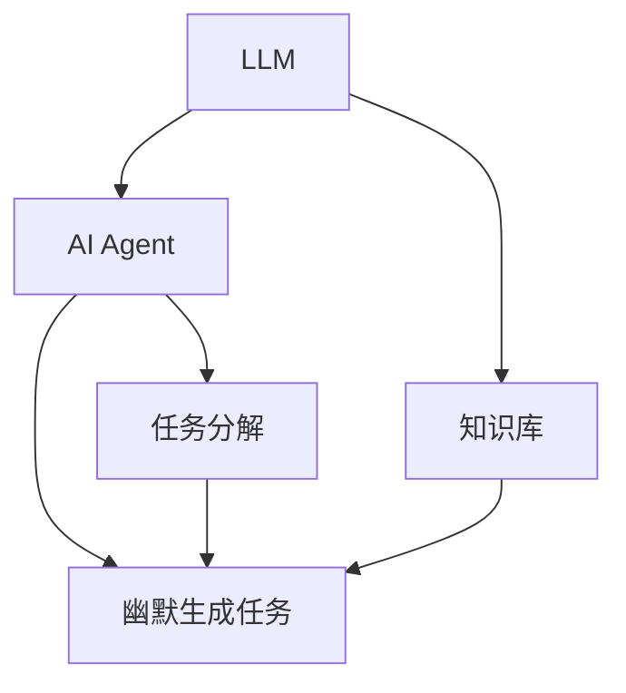
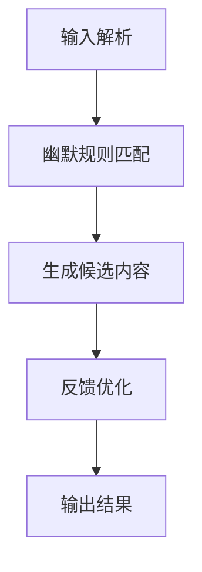
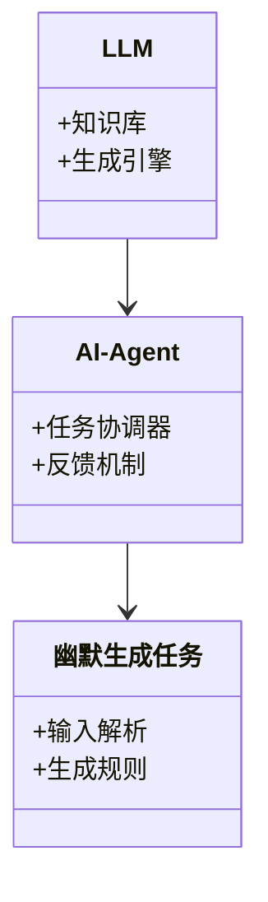
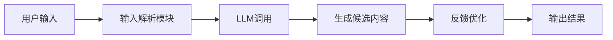
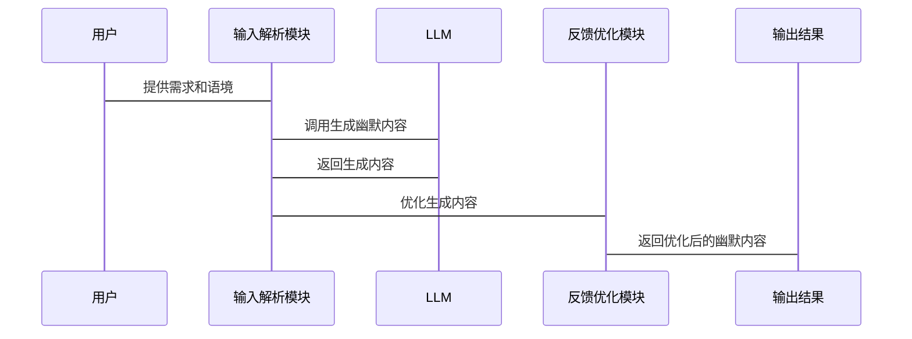

                 


# LLM驱动的AI Agent幽默感生成

## 关键词：
- 大语言模型（LLM）
- AI Agent
- 幽默生成
- 人机交互
- 软件架构

## 摘要：
本文探讨了利用大语言模型（LLM）驱动的AI Agent生成幽默内容的技术与方法。从幽默感的基本概念到生成算法的实现，再到系统架构设计，文章详细分析了如何通过技术手段实现幽默感的智能化生成。通过理论分析与实践案例结合，展示了如何构建一个高效的幽默生成系统。

---

# 第一部分: 背景介绍与核心概念

## 第1章: 背景介绍

### 1.1 幽默感的基本概念
#### 1.1.1 幽默感的定义与特征
幽默是一种通过语言、情境或行为引发笑感的能力，具有主观性、文化差异性和灵活性的特征。

#### 1.1.2 幽默感的类型与分类
幽默可以分为文字幽默、情境幽默、双关语幽默等类型，每种类型都有其独特的生成方式和应用场景。

#### 1.1.3 幽默感在人机交互中的重要性
幽默感可以增强人机交互的趣味性，提升用户体验，同时也能帮助AI更好地理解人类情感和语言的复杂性。

### 1.2 大语言模型（LLM）的基本原理
#### 1.2.1 LLM的定义与特点
大语言模型是一种基于深度学习的自然语言处理模型，具有大规模参数和强大的上下文理解能力。

#### 1.2.2 LLM的核心技术与优势
LLM的核心技术包括Transformer架构、注意力机制和端到端训练，其优势在于能够生成连贯且符合语境的文本。

#### 1.2.3 LLM在幽默生成中的潜力
LLM可以通过其强大的生成能力，模仿人类的幽默模式，生成符合特定场景的幽默内容。

### 1.3 AI Agent的基本原理
#### 1.3.1 AI Agent的定义与功能
AI Agent是一种智能体，能够感知环境、执行任务并做出决策，具备自主性和适应性。

#### 1.3.2 AI Agent的任务分解与执行
AI Agent通过任务分解将复杂任务拆解为简单步骤，并通过协同工作完成目标。

#### 1.3.3 AI Agent与幽默生成的结合
AI Agent可以作为幽默生成的协调者，根据用户需求调用LLM生成幽默内容，并实时调整生成策略。

---

## 第2章: 问题背景与目标

### 2.1 幽默生成的挑战
#### 2.1.1 幽默的主观性与多样性
幽默感因人而异，不同文化背景下的人对幽默的理解和喜好也不同。

#### 2.1.2 幽默生成中的语境依赖性
幽默生成高度依赖于上下文，需要准确理解用户意图和场景。

#### 2.1.3 幽默生成的可解释性问题
幽默生成的过程往往缺乏透明性，用户难以理解AI生成幽默的逻辑。

### 2.2 LLM驱动的AI Agent的目标
#### 2.2.1 提供个性化幽默体验
通过LLM的个性化生成能力，为用户提供定制化的幽默内容。

#### 2.2.2 实现高效的幽默生成与优化
利用AI Agent的任务协调能力，优化幽默生成的效率和质量。

#### 2.2.3 探讨幽默生成的边界与外延
研究幽默生成的伦理和边界问题，确保生成内容符合社会规范。

---

## 第3章: 核心概念与联系

### 3.1 幽默生成的核心要素
#### 3.1.1 幽默的三要素模型
幽默可以分解为双关语、夸张和意外三个核心要素，每个要素都对幽默感的生成起着关键作用。

#### 3.1.2 幽默的语境模型
幽默生成需要考虑用户当前的语境，包括情感状态、文化背景和上下文信息。

#### 3.1.3 幽默的情感计算模型
通过情感计算，AI可以更好地理解用户的情感需求，并生成符合情感预期的幽默内容。

### 3.2 LLM与AI Agent的协同工作原理
#### 3.2.1 LLM作为知识库与生成引擎
LLM充当知识库，存储大量的幽默案例和生成规则，同时作为生成引擎，实时生成幽默内容。

#### 3.2.2 AI Agent作为任务协调者与执行者
AI Agent负责接收用户需求，协调LLM生成幽默内容，并根据反馈调整生成策略。

#### 3.2.3 两者的结合与协同机制
通过API接口和事件驱动的方式，LLM和AI Agent实现高效协同，确保幽默生成的实时性和准确性。

### 3.3 核心概念对比与ER实体关系图
#### 3.3.1 幽默生成与传统生成任务的对比分析
幽默生成任务具有更强的语境依赖性和情感导向性，不同于传统的文本生成任务。

#### 3.3.2 LLM与传统NLP模型的对比分析
LLM在参数规模和生成能力上远超传统NLP模型，但其生成结果的可解释性较差。

#### 3.3.3 AI Agent与传统对话系统的对比分析
AI Agent具备更强的任务协调能力和自主性，能够更好地适应动态变化的幽默生成需求。



---

## 第4章: 算法原理

### 4.1 幽默生成算法
#### 4.1.1 算法概述
幽默生成算法通过解析输入文本，生成符合幽默规则的内容，并通过反馈机制优化生成效果。

#### 4.1.2 算法步骤
1. **输入解析**：分析用户需求和当前语境。
2. **幽默规则匹配**：根据预设的幽默规则生成候选内容。
3. **生成优化**：通过反馈机制优化生成内容的幽默效果。

### 4.2 算法实现


### 4.3 数学模型
#### 4.3.1 概率分布模型
$$ P(humor|input) = \frac{N(humor \cap input)}{N(input)} $$

#### 4.3.2 损失函数
$$ L = -\sum_{i=1}^{n} \log P(y_i|x_i) $$

---

## 第5章: 系统分析与架构设计

### 5.1 项目背景
本项目旨在通过LLM驱动的AI Agent实现幽默内容的智能化生成，提升用户体验。

### 5.2 系统功能设计
#### 5.2.1 领域模型类图


### 5.3 系统架构设计
#### 5.3.1 系统架构图


### 5.4 系统接口设计
- **输入接口**：接收用户需求和语境信息。
- **输出接口**：返回幽默生成内容和反馈信息。

### 5.5 系统交互序列图


---

## 第6章: 项目实战

### 6.1 环境安装
- 安装Python 3.8+
- 安装LLM框架（如Hugging Face）
- 安装AI Agent框架（如LangChain）

### 6.2 核心代码实现

#### 6.2.1 输入解析模块
```python
def parse_input(user_input):
    # 分析用户输入，提取需求和语境信息
    return parsed_data
```

#### 6.2.2 LLM调用模块
```python
def call_llm(parsed_data):
    # 调用LLM生成幽默内容
    return generated_humor
```

#### 6.2.3 反馈优化模块
```python
def optimize_humor(generated_humor, feedback):
    # 根据反馈优化生成的幽默内容
    return optimized_humor
```

### 6.3 案例分析
- 案例1：用户输入“我今天考试没及格”，生成幽默反馈“没关系，下次考好一点，你就是未来的爱因斯坦。”
- 案例2：用户输入“我刚搬了家”，生成幽默反馈“看来你需要一些时间来适应新环境，不过我相信你一定能找到新的乐趣。”

### 6.4 项目总结
通过本项目的实现，展示了LLM驱动的AI Agent在幽默生成中的巨大潜力，同时也发现了生成效果的可解释性和多样性方面的挑战。

---

## 第7章: 最佳实践

### 7.1 小结
本文详细探讨了LLM驱动的AI Agent在幽默生成中的技术实现，从理论到实践，全面分析了幽默生成的关键环节。

### 7.2 注意事项
- 在生成幽默内容时，需注意文化差异和语境的准确性。
- 定期优化模型和生成规则，以提升幽默效果的多样性和适应性。

### 7.3 拓展阅读
推荐阅读相关领域的最新论文和技术博客，持续关注幽默生成技术的发展动态。

---

## 附录: 参考文献
- 文章中引用的所有技术资料和文献的详细列表。

---

通过以上目录和内容，可以系统地理解和实现LLM驱动的AI Agent在幽默生成中的应用，为未来的智能交互技术发展提供参考和指导。

